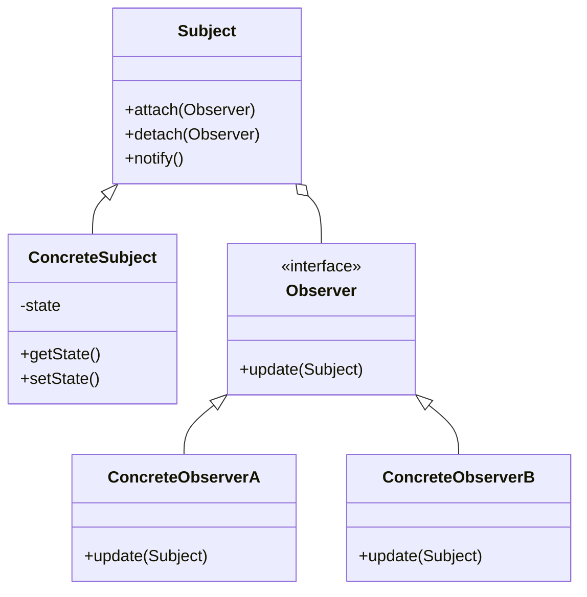
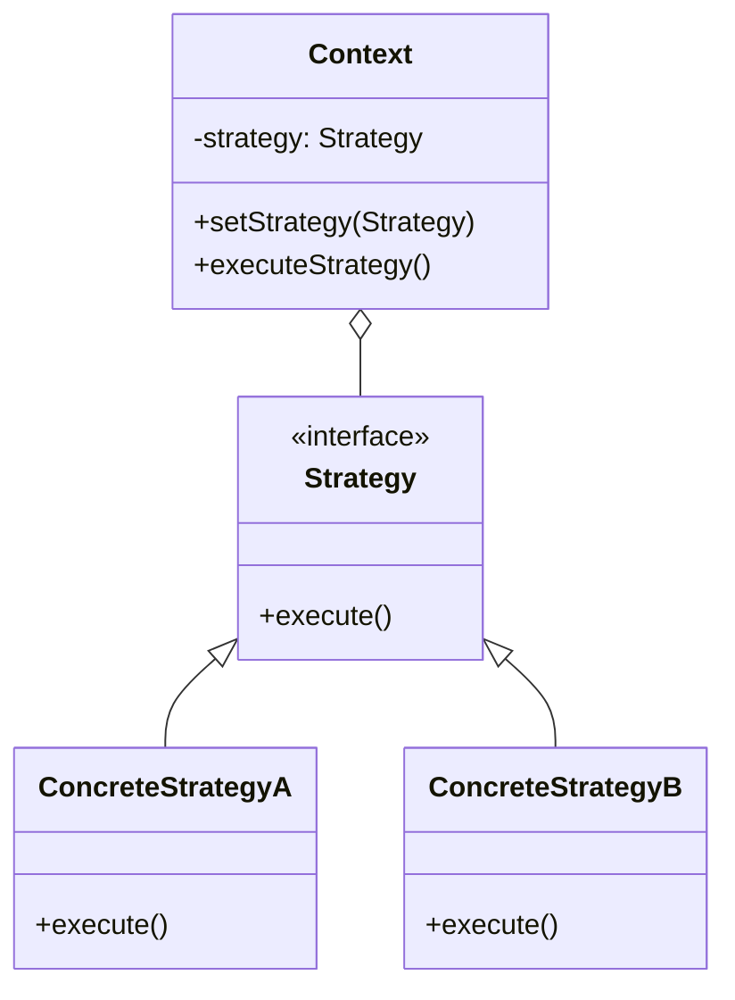
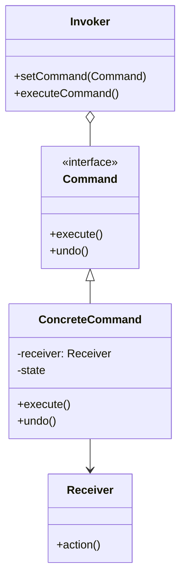
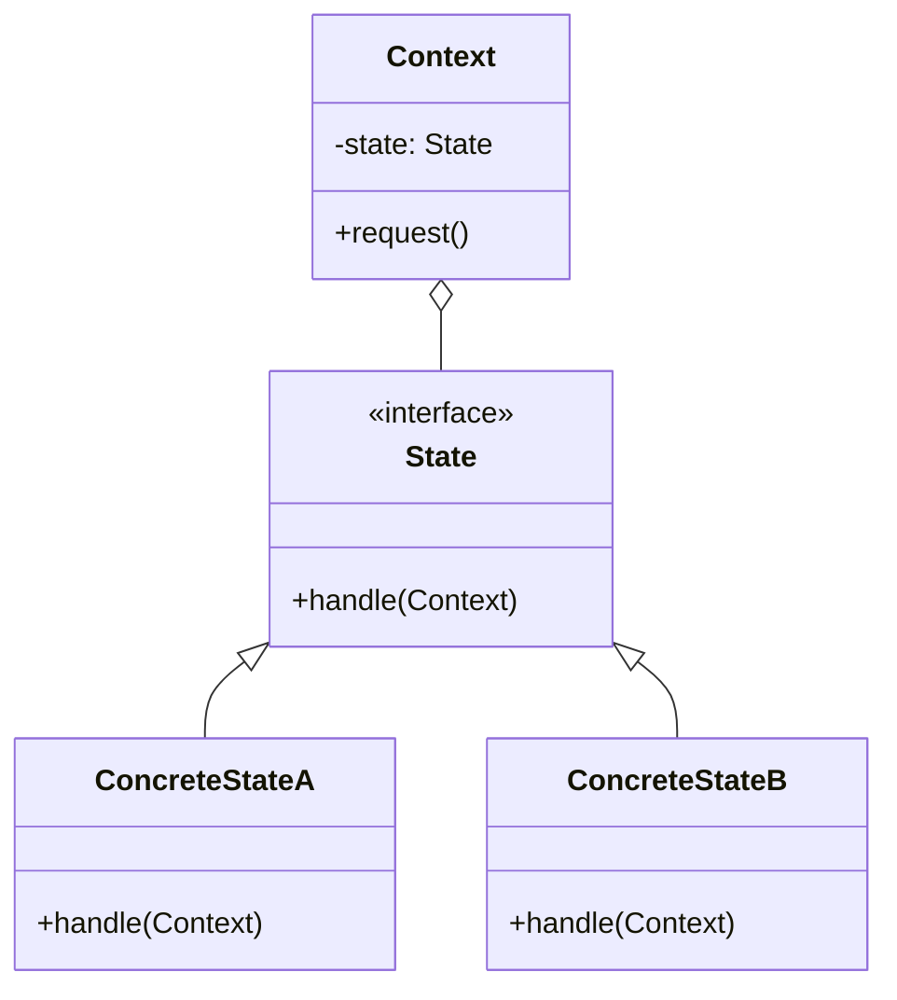
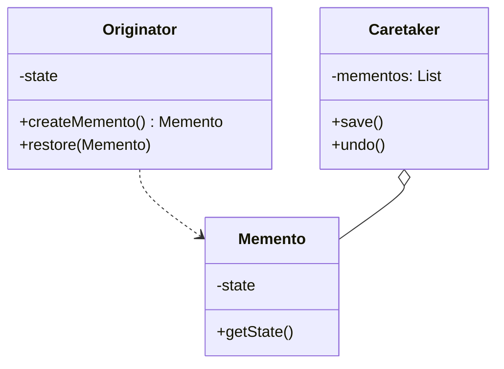
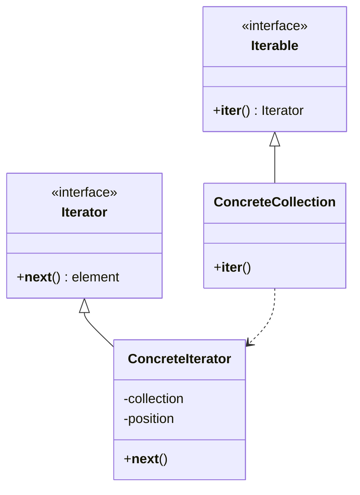
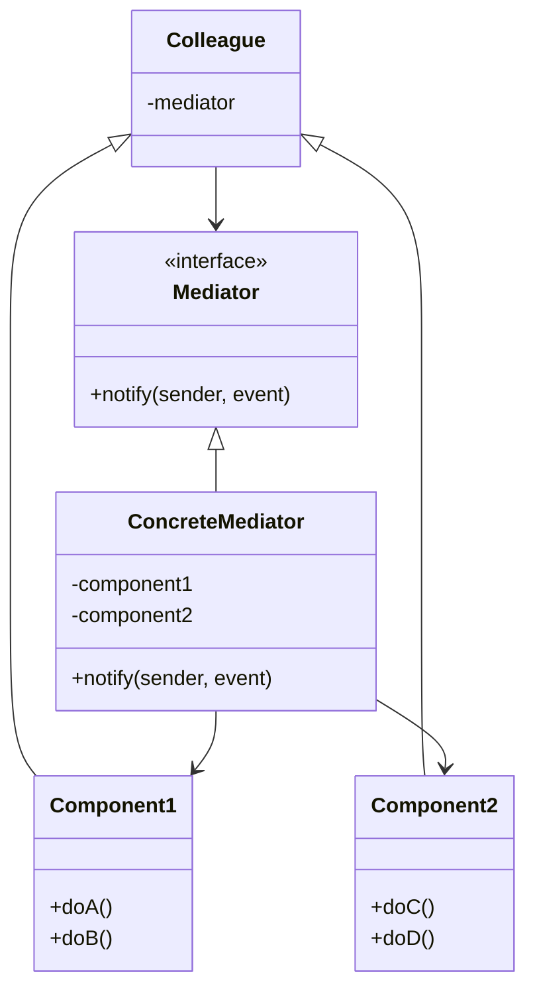
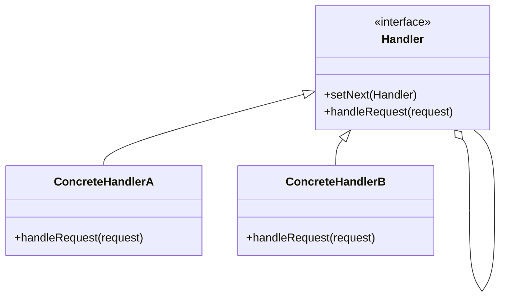
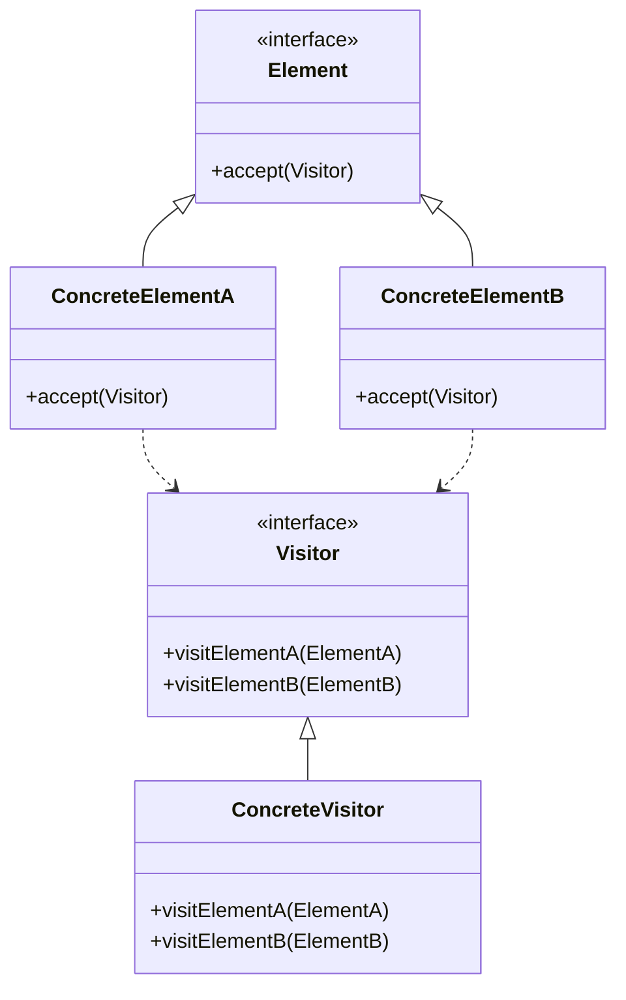
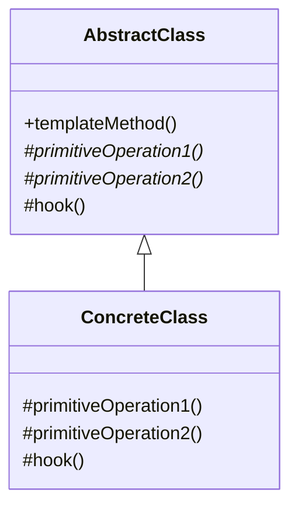

# Behavioral Design Patterns (Python)

## How would you implement the Observer pattern in Python to build a scalable event system? <Badge type="warning" text="medium" />

::: details View Answer
The **Observer** pattern defines a one-to-many dependency between objects so that when one object changes state, all its dependents are notified and updated automatically. It's widely used in event-driven systems, pub-sub architectures, and UI data binding.

### Explanation
In Python, we can implement the Observer pattern using standard lists or sets to keep track of observers. The Subject maintains a list of Observers and provides methods to attach, detach, and notify them.

### Mermaid Diagram


### Realistic Python Example
```python
from abc import ABC, abstractmethod
from typing import List

class Observer(ABC):
    @abstractmethod
    def update(self, temperature: float, humidity: float, pressure: float) -> None:
        pass

class Subject(ABC):
    @abstractmethod
    def attach(self, observer: Observer) -> None:
        pass

    @abstractmethod
    def detach(self, observer: Observer) -> None:
        pass

    @abstractmethod
    def notify(self) -> None:
        pass

class WeatherData(Subject):
    def __init__(self):
        self._observers: List[Observer] = []
        self._temperature = 0.0
        self._humidity = 0.0
        self._pressure = 0.0

    def attach(self, observer: Observer) -> None:
        if observer not in self._observers:
            self._observers.append(observer)

    def detach(self, observer: Observer) -> None:
        self._observers.remove(observer)

    def notify(self) -> None:
        for observer in self._observers:
            observer.update(self._temperature, self._humidity, self._pressure)

    def set_measurements(self, temperature: float, humidity: float, pressure: float) -> None:
        self._temperature = temperature
        self._humidity = humidity
        self._pressure = pressure
        self.notify()

class CurrentConditionsDisplay(Observer):
    def update(self, temperature: float, humidity: float, pressure: float) -> None:
        print(f"Current conditions: {temperature}F degrees and {humidity}% humidity")

# Usage
weather_data = WeatherData()
current_display = CurrentConditionsDisplay()

weather_data.attach(current_display)
weather_data.set_measurements(80.0, 65.0, 30.4)
```
:::

## Explain the Strategy pattern and how it allows for dynamic algorithm swapping at runtime. <Badge type="info" text="easy" />

::: details View Answer
The **Strategy** pattern defines a family of algorithms, encapsulates each one, and makes them interchangeable. Strategy lets the algorithm vary independently from clients that use it.

### Explanation
Instead of implementing a single algorithm directly or using complex conditional statements, the code receives run-time instructions as to which algorithm to use. In Python, strategies can often be implemented simply as functions instead of classes due to first-class functions, but the class-based approach is still valid for complex stateful strategies.

### Mermaid Diagram


### Realistic Python Example
```python
from abc import ABC, abstractmethod
from typing import List

class DiscountStrategy(ABC):
    @abstractmethod
    def calculate_discount(self, amount: float) -> float:
        pass

class NoDiscount(DiscountStrategy):
    def calculate_discount(self, amount: float) -> float:
        return 0.0

class PercentageDiscount(DiscountStrategy):
    def __init__(self, percentage: float):
        self.percentage = percentage

    def calculate_discount(self, amount: float) -> float:
        return amount * (self.percentage / 100)

class FixedDiscount(DiscountStrategy):
    def __init__(self, discount: float):
        self.discount = discount

    def calculate_discount(self, amount: float) -> float:
        return min(amount, self.discount)

class ShoppingCart:
    def __init__(self, discount_strategy: DiscountStrategy):
        self.items: List[float] = []
        self.discount_strategy = discount_strategy

    def add_item(self, price: float) -> None:
        self.items.append(price)

    def checkout(self) -> float:
        total = sum(self.items)
        discount = self.discount_strategy.calculate_discount(total)
        return total - discount

# Usage
cart1 = ShoppingCart(PercentageDiscount(10))
cart1.add_item(100.0)
cart1.add_item(50.0)
print(f"Total after 10% discount: {cart1.checkout()}") # 135.0

cart2 = ShoppingCart(FixedDiscount(20))
cart2.add_item(100.0)
print(f"Total after $20 discount: {cart2.checkout()}") # 80.0
```
:::

## What is the Command pattern, and how can it be used to implement undo/redo functionality? <Badge type="warning" text="medium" />

::: details View Answer
The **Command** pattern encapsulates a request as an object, thereby letting you parameterize clients with different requests, queue or log requests, and support undoable operations.

### Explanation
A Command object contains all the information necessary to execute an action at a later time. This includes the method to call, the object that owns the method, and the parameters. To support undo, the command object stores the state before the execution.

### Mermaid Diagram


### Realistic Python Example
```python
from abc import ABC, abstractmethod

# Receiver
class TextEditor:
    def __init__(self):
        self.content = ""

    def append(self, text: str) -> None:
        self.content += text

    def remove(self, length: int) -> None:
        self.content = self.content[:-length]

# Command Interface
class Command(ABC):
    @abstractmethod
    def execute(self) -> None:
        pass

    @abstractmethod
    def undo(self) -> None:
        pass

# Concrete Command
class AppendTextCommand(Command):
    def __init__(self, editor: TextEditor, text: str):
        self.editor = editor
        self.text = text

    def execute(self) -> None:
        self.editor.append(self.text)

    def undo(self) -> None:
        self.editor.remove(len(self.text))

# Invoker
class CommandHistory:
    def __init__(self):
        self.history = []

    def execute_command(self, command: Command) -> None:
        command.execute()
        self.history.append(command)

    def undo(self) -> None:
        if self.history:
            command = self.history.pop()
            command.undo()

# Usage
editor = TextEditor()
history = CommandHistory()

cmd1 = AppendTextCommand(editor, "Hello ")
history.execute_command(cmd1)

cmd2 = AppendTextCommand(editor, "World!")
history.execute_command(cmd2)
print(f"Content: '{editor.content}'") # Hello World!

history.undo()
print(f"After Undo: '{editor.content}'") # Hello 
```
:::

## Explain the State pattern and how it differs from a finite state machine implemented with standard if/else logic. <Badge type="warning" text="medium" />

::: details View Answer
The **State** pattern allows an object to alter its behavior when its internal state changes. The object will appear to change its class.

### Explanation
Instead of managing complex state transitions and behaviors with large conditional blocks (if/elif/else), the State pattern delegates state-specific behavior to separate State classes. The Context object maintains a reference to a State subclass that represents the current state. This makes adding new states easier and adheres to the Open/Closed Principle.

### Mermaid Diagram


### Realistic Python Example
```python
from abc import ABC, abstractmethod

class VendingMachineState(ABC):
    @abstractmethod
    def insert_coin(self, machine: 'VendingMachine') -> None:
        pass

    @abstractmethod
    def dispense_item(self, machine: 'VendingMachine') -> None:
        pass

class NoCoinState(VendingMachineState):
    def insert_coin(self, machine: 'VendingMachine') -> None:
        print("Coin inserted.")
        machine.set_state(machine.has_coin_state)

    def dispense_item(self, machine: 'VendingMachine') -> None:
        print("Please insert a coin first.")

class HasCoinState(VendingMachineState):
    def insert_coin(self, machine: 'VendingMachine') -> None:
        print("Coin already inserted.")

    def dispense_item(self, machine: 'VendingMachine') -> None:
        if machine.inventory > 0:
            print("Item dispensed.")
            machine.inventory -= 1
            machine.set_state(machine.no_coin_state)
        else:
            print("Out of stock. Returning coin.")
            machine.set_state(machine.no_coin_state)

class VendingMachine:
    def __init__(self, inventory_count: int):
        self.no_coin_state = NoCoinState()
        self.has_coin_state = HasCoinState()
        self.inventory = inventory_count
        self.current_state = self.no_coin_state

    def set_state(self, state: VendingMachineState) -> None:
        self.current_state = state

    def insert_coin(self) -> None:
        self.current_state.insert_coin(self)

    def dispense_item(self) -> None:
        self.current_state.dispense_item(self)

# Usage
machine = VendingMachine(2)
machine.dispense_item() # Please insert a coin first.
machine.insert_coin()   # Coin inserted.
machine.dispense_item() # Item dispensed.
```
:::

## How would you implement the Memento pattern to capture and restore an object's internal state without violating encapsulation? <Badge type="danger" text="hard" />

::: details View Answer
The **Memento** pattern captures and externalizes an object's internal state so that the object can be restored to this state later, without violating encapsulation.

### Explanation
The pattern consists of three roles:
1. **Originator**: The object whose state needs to be saved.
2. **Memento**: A value object acting as a snapshot of the Originator's state. It should be immutable and opaque to the Caretaker.
3. **Caretaker**: Manages the mementos and decides when to save or restore state, but never inspects the memento's contents.

### Mermaid Diagram


### Realistic Python Example
```python
import copy
from typing import List

# Memento
class EditorMemento:
    def __init__(self, content: str, cursor_position: int):
        self._content = content
        self._cursor_position = cursor_position

    @property
    def content(self) -> str:
        return self._content

    @property
    def cursor_position(self) -> int:
        return self._cursor_position

# Originator
class DocumentEditor:
    def __init__(self):
        self.content = ""
        self.cursor_position = 0

    def type_words(self, words: str) -> None:
        self.content += words
        self.cursor_position += len(words)

    def create_memento(self) -> EditorMemento:
        # Save a snapshot
        return EditorMemento(self.content, self.cursor_position)

    def restore(self, memento: EditorMemento) -> None:
        self.content = memento.content
        self.cursor_position = memento.cursor_position

# Caretaker
class History:
    def __init__(self, editor: DocumentEditor):
        self.editor = editor
        self._mementos: List[EditorMemento] = []

    def backup(self) -> None:
        self._mementos.append(self.editor.create_memento())

    def undo(self) -> None:
        if not self._mementos:
            return
        memento = self._mementos.pop()
        self.editor.restore(memento)

# Usage
editor = DocumentEditor()
history = History(editor)

editor.type_words("Hello, ")
history.backup() # Save state: "Hello, "

editor.type_words("World!")
print(editor.content) # Hello, World!

history.undo()
print(editor.content) # Hello, 
```
:::

## Describe the Iterator pattern and how Python implements it natively. <Badge type="info" text="easy" />

::: details View Answer
The **Iterator** pattern provides a way to access the elements of an aggregate object sequentially without exposing its underlying representation.

### Explanation
In Python, the Iterator pattern is built into the language. Any object that implements the `__iter__()` method, which returns an iterator, is an Iterable. The iterator itself must implement the `__next__()` method, raising `StopIteration` when there are no more elements. Python's `for` loops handle this automatically. Generators (functions yielding values) provide an even easier way to create iterators.

### Mermaid Diagram


### Realistic Python Example
```python
# Custom Collection using built-in Iterator protocol
class BinaryTreeSequence:
    def __init__(self, data: list):
        # Using a list to simulate a tree for simplicity
        self.data = data

    def __iter__(self):
        return DepthFirstIterator(self)

class DepthFirstIterator:
    def __init__(self, tree: BinaryTreeSequence):
        self.tree = tree
        self._index = 0

    def __iter__(self):
        return self

    def __next__(self):
        if self._index < len(self.tree.data):
            value = self.tree.data[self._index]
            self._index += 1
            return value
        raise StopIteration

# Usage
tree = BinaryTreeSequence(["Root", "Left", "Right", "Left.Left"])
for node in tree:
    print(node)

# Pythonic way using Generators
def depth_first_generator(tree_data):
    for node in tree_data:
        yield node

for node in depth_first_generator(["Root", "Left", "Right"]):
    print(node)
```
:::

## What problem does the Mediator pattern solve, and how does it prevent tight coupling between components? <Badge type="warning" text="medium" />

::: details View Answer
The **Mediator** pattern defines an object that encapsulates how a set of objects interact. It promotes loose coupling by keeping objects from referring to each other explicitly, allowing you to vary their interaction independently.

### Explanation
When building complex GUIs or microservice choreographies, components often need to communicate. If every component references every other component, you get a "spaghetti" dependency graph. A Mediator acts as a centralized communications hub. Components (Colleagues) only know about the Mediator.

### Mermaid Diagram


### Realistic Python Example
```python
from abc import ABC, abstractmethod

class Mediator(ABC):
    @abstractmethod
    def notify(self, sender: object, event: str) -> None:
        pass

class Component:
    def __init__(self, mediator: Mediator = None):
        self._mediator = mediator

    @property
    def mediator(self) -> Mediator:
        return self._mediator

    @mediator.setter
    def mediator(self, mediator: Mediator) -> None:
        self._mediator = mediator

class UserInput(Component):
    def key_press(self) -> None:
        print("UserInput: Key pressed.")
        self.mediator.notify(self, "keypress")

class SearchResultList(Component):
    def update_results(self) -> None:
        print("SearchResultList: Fetching and updating results.")

class SearchDialogMediator(Mediator):
    def __init__(self, user_input: UserInput, result_list: SearchResultList):
        self.user_input = user_input
        self.user_input.mediator = self
        self.result_list = result_list
        self.result_list.mediator = self

    def notify(self, sender: object, event: str) -> None:
        if event == "keypress":
            print("Mediator reacts to keypress and triggers result update.")
            self.result_list.update_results()

# Usage
input_field = UserInput()
results = SearchResultList()
mediator = SearchDialogMediator(input_field, results)

input_field.key_press()
# Output:
# UserInput: Key pressed.
# Mediator reacts to keypress and triggers result update.
# SearchResultList: Fetching and updating results.
```
:::

## Explain the Chain of Responsibility pattern. How is it useful for handling a request through a pipeline of handlers? <Badge type="warning" text="medium" />

::: details View Answer
The **Chain of Responsibility** pattern avoids coupling the sender of a request to its receiver by giving more than one object a chance to handle the request. It chains the receiving objects and passes the request along the chain until an object handles it.

### Explanation
This pattern is heavily used in web frameworks for middleware (e.g., authentication, logging, error handling). Each handler decides whether to process the request or pass it to the next handler in the chain.

### Mermaid Diagram


### Realistic Python Example
```python
from abc import ABC, abstractmethod
from typing import Optional

class Handler(ABC):
    def __init__(self):
        self._next_handler: Optional[Handler] = None

    def set_next(self, handler: 'Handler') -> 'Handler':
        self._next_handler = handler
        return handler

    @abstractmethod
    def handle(self, request: str) -> Optional[str]:
        if self._next_handler:
            return self._next_handler.handle(request)
        return None

class AuthHandler(Handler):
    def handle(self, request: str) -> Optional[str]:
        if "auth" not in request:
            return "AuthHandler: Rejected! Not authenticated."
        print("AuthHandler: Passed.")
        return super().handle(request)

class DataValidationHandler(Handler):
    def handle(self, request: str) -> Optional[str]:
        if "invalid" in request:
            return "DataValidationHandler: Rejected! Invalid data."
        print("DataValidationHandler: Passed.")
        return super().handle(request)

class CacheHandler(Handler):
    def handle(self, request: str) -> Optional[str]:
        if "cached" in request:
            return "CacheHandler: Returned cached response."
        print("CacheHandler: Passed to origin.")
        return super().handle(request)

# Usage
auth = AuthHandler()
validator = DataValidationHandler()
cache = CacheHandler()

# Build the chain
auth.set_next(validator).set_next(cache)

print("--- Request 1: Valid ---")
result = auth.handle("auth_valid_cached")
print(f"Result: {result}")

print("\n--- Request 2: Invalid Data ---")
result = auth.handle("auth_invalid_data")
print(f"Result: {result}")
```
:::

## What is the Visitor pattern, and when should you use it to add operations to an object structure? <Badge type="danger" text="hard" />

::: details View Answer
The **Visitor** pattern allows you to define a new operation without changing the classes of the elements on which it operates.

### Explanation
When you have a complex object structure (like a syntax tree or a composite structure) composed of different classes, and you want to perform operations on these objects that depend on their concrete classes, adding these operations to the classes themselves violates the Single Responsibility Principle. The Visitor pattern extracts the logic into a separate visitor object. Elements must "accept" the visitor.

### Mermaid Diagram


### Realistic Python Example
```python
from abc import ABC, abstractmethod
from typing import List

# Visitor Interface
class DocumentVisitor(ABC):
    @abstractmethod
    def visit_paragraph(self, paragraph: 'Paragraph') -> None:
        pass

    @abstractmethod
    def visit_image(self, image: 'Image') -> None:
        pass

# Element Interface
class DocumentElement(ABC):
    @abstractmethod
    def accept(self, visitor: DocumentVisitor) -> None:
        pass

# Concrete Elements
class Paragraph(DocumentElement):
    def __init__(self, text: str):
        self.text = text

    def accept(self, visitor: DocumentVisitor) -> None:
        visitor.visit_paragraph(self)

class Image(DocumentElement):
    def __init__(self, src: str):
        self.src = src

    def accept(self, visitor: DocumentVisitor) -> None:
        visitor.visit_image(self)

# Concrete Visitors
class HTMLExportVisitor(DocumentVisitor):
    def visit_paragraph(self, paragraph: Paragraph) -> None:
        print(f"<p>{paragraph.text}</p>")

    def visit_image(self, image: Image) -> None:
        print(f"")

class MarkdownExportVisitor(DocumentVisitor):
    def visit_paragraph(self, paragraph: Paragraph) -> None:
        print(f"{paragraph.text}\n")

    def visit_image(self, image: Image) -> None:
        print(f"")

# Usage
elements: List[DocumentElement] = [
    Paragraph("This is an introductory paragraph."),
    Image("image.png")
]

print("--- HTML Export ---")
html_visitor = HTMLExportVisitor()
for el in elements:
    el.accept(html_visitor)

print("\n--- Markdown Export ---")
md_visitor = MarkdownExportVisitor()
for el in elements:
    el.accept(md_visitor)
```
:::

## Describe the Template Method pattern and how it enforces algorithm structure while allowing subclass customization. <Badge type="info" text="easy" />

::: details View Answer
The **Template Method** pattern defines the skeleton of an algorithm in an operation, deferring some steps to subclasses. Template Method lets subclasses redefine certain steps of an algorithm without changing the algorithm's structure.

### Explanation
You place a template method in a base class that calls other methods (primitive operations or hooks) in a specific order. The base class implements default behaviors or leaves them abstract. Subclasses override the abstract methods to provide concrete behavior, while the overarching algorithm structure remains strictly defined by the base class.

### Mermaid Diagram


### Realistic Python Example
```python
from abc import ABC, abstractmethod

class DataMiner(ABC):
    # The Template Method
    def mine(self, path: str) -> None:
        file = self.open_file(path)
        raw_data = self.extract_data(file)
        data = self.parse_data(raw_data)
        analysis = self.analyze_data(data)
        self.send_report(analysis)
        self.close_file(file)

    def open_file(self, path: str) -> str:
        print(f"Opening file: {path}")
        return f"FileHandle({path})"

    def close_file(self, file: str) -> None:
        print(f"Closing file: {file}")

    def analyze_data(self, data: str) -> str:
        print("Analyzing data...")
        return f"AnalysisResult({data})"

    def send_report(self, analysis: str) -> None:
        print(f"Sending report: {analysis}")

    # Abstract methods to be implemented by subclasses
    @abstractmethod
    def extract_data(self, file: str) -> str:
        pass

    @abstractmethod
    def parse_data(self, raw_data: str) -> str:
        pass

class PDFDataMiner(DataMiner):
    def extract_data(self, file: str) -> str:
        print("Extracting data from PDF...")
        return "PDFRawData"

    def parse_data(self, raw_data: str) -> str:
        print("Parsing PDF data...")
        return "ParsedPDFData"

class CSVDataMiner(DataMiner):
    def extract_data(self, file: str) -> str:
        print("Extracting data from CSV...")
        return "CSVRawData"

    def parse_data(self, raw_data: str) -> str:
        print("Parsing CSV data...")
        return "ParsedCSVData"

# Usage
print("--- Mining PDF ---")
pdf_miner = PDFDataMiner()
pdf_miner.mine("report.pdf")

print("\n--- Mining CSV ---")
csv_miner = CSVDataMiner()
csv_miner.mine("data.csv")
```
:::
