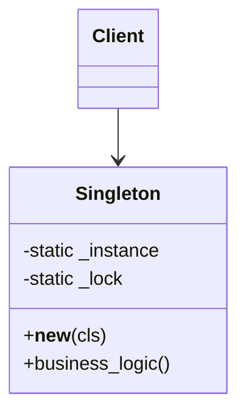
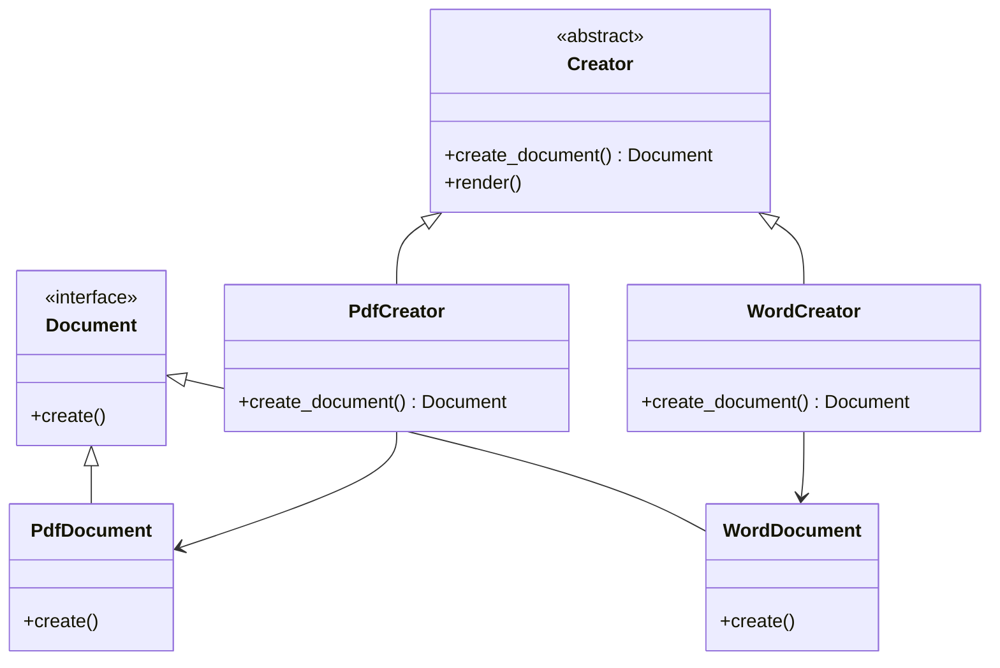
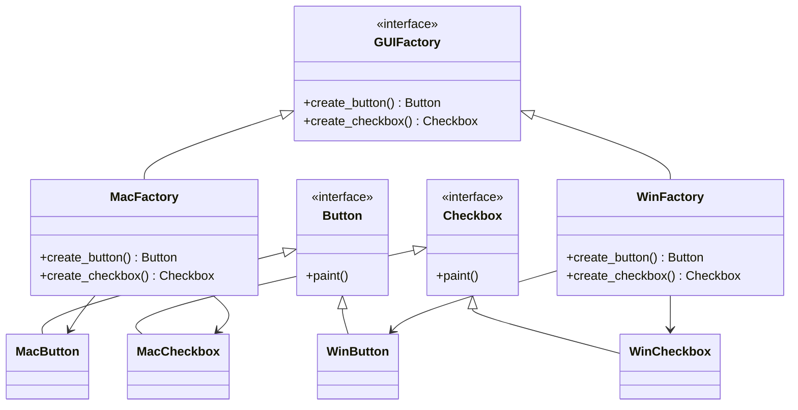
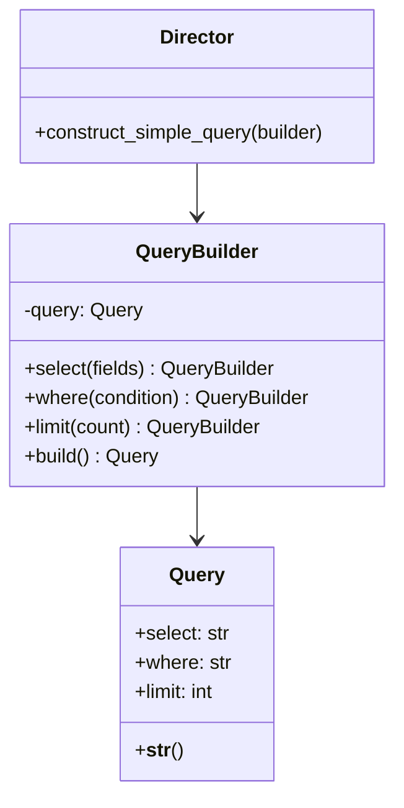
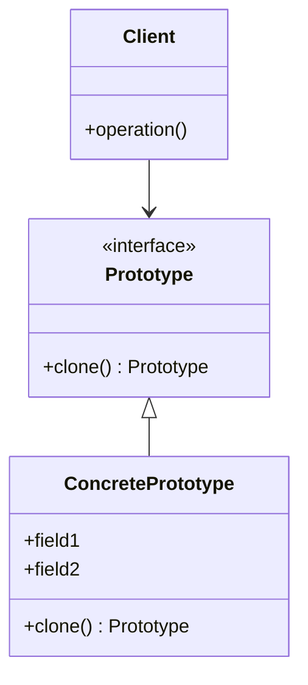

# Creational Design Patterns (Python)

## How would you implement a thread-safe Singleton in Python, and what are the potential pitfalls? <Badge type="danger" text="hard" />

::: details View Answer
**Explanation:**
The Singleton pattern restricts the instantiation of a class to one "single" instance. This is useful when exactly one object is needed to coordinate actions across the system. In Python, thread safety is crucial when implementing a Singleton in a multi-threaded environment to prevent multiple threads from creating multiple instances simultaneously. This is typically achieved using a thread lock.

**Potential Pitfalls:**
- They introduce global state, making testing difficult.
- They hide dependencies (classes reference the Singleton directly instead of having it injected).
- Violate the Single Responsibility Principle as they control their own creation and lifecycle.

**Mermaid Diagram:**


**Python Implementation:**
```python
import threading

class DatabaseConnection:
    _instance = None
    _lock = threading.Lock()

    def __new__(cls, *args, **kwargs):
        # Double-checked locking for thread safety
        if not cls._instance:
            with cls._lock:
                if not cls._instance:
                    cls._instance = super(DatabaseConnection, cls).__new__(cls)
                    # Initialize connection properties here
                    cls._instance.connection_string = "db://localhost:5432"
        return cls._instance

    def query(self, sql):
        return f"Executing {sql} on {self.connection_string}"

# Usage
db1 = DatabaseConnection()
db2 = DatabaseConnection()

print(db1 is db2)  # Output: True
```
:::

## What is the Factory Method pattern, and how does it promote loose coupling in Python? <Badge type="warning" text="medium" />

::: details View Answer
**Explanation:**
The Factory Method pattern defines an interface for creating an object, but lets subclasses alter the type of objects that will be created. It promotes loose coupling by eliminating the need to bind application-specific classes into the code. The code only interacts with the resultant interface or base class, meaning it will work with any classes that implement that interface.

**Mermaid Diagram:**


**Python Implementation:**
```python
from abc import ABC, abstractmethod

# Product Interface
class Logger(ABC):
    @abstractmethod
    def log(self, message: str):
        pass

# Concrete Products
class FileLogger(Logger):
    def log(self, message: str):
        print(f"Writing '{message}' to a file.")

class ConsoleLogger(Logger):
    def log(self, message: str):
        print(f"Printing '{message}' to console.")

# Creator Base Class
class LoggerFactory(ABC):
    @abstractmethod
    def create_logger(self) -> Logger:
        pass

    def do_logging(self, message: str):
        logger = self.create_logger()
        logger.log(message)

# Concrete Creators
class FileLoggerFactory(LoggerFactory):
    def create_logger(self) -> Logger:
        return FileLogger()

class ConsoleLoggerFactory(LoggerFactory):
    def create_logger(self) -> Logger:
        return ConsoleLogger()

# Usage
def app_logic(factory: LoggerFactory):
    factory.do_logging("Application started")

app_logic(ConsoleLoggerFactory()) # Output: Printing 'Application started' to console.
```
:::

## Explain the Abstract Factory pattern in Python. How does it differ from Factory Method? <Badge type="danger" text="hard" />

::: details View Answer
**Explanation:**
The Abstract Factory pattern provides an interface for creating families of related or dependent objects without specifying their concrete classes. 
While the Factory Method creates *one* specific product, the Abstract Factory is responsible for creating a *family* of related products. You can think of Abstract Factory as a factory of factories.

**Mermaid Diagram:**


**Python Implementation:**
```python
from abc import ABC, abstractmethod

# Abstract Products
class Button(ABC):
    @abstractmethod
    def render(self): pass

class Checkbox(ABC):
    @abstractmethod
    def render(self): pass

# Concrete Products (Mac family)
class MacButton(Button):
    def render(self): return "Render Mac Button"

class MacCheckbox(Checkbox):
    def render(self): return "Render Mac Checkbox"

# Concrete Products (Windows family)
class WinButton(Button):
    def render(self): return "Render Windows Button"

class WinCheckbox(Checkbox):
    def render(self): return "Render Windows Checkbox"

# Abstract Factory
class GUIFactory(ABC):
    @abstractmethod
    def create_button(self) -> Button: pass

    @abstractmethod
    def create_checkbox(self) -> Checkbox: pass

# Concrete Factories
class MacFactory(GUIFactory):
    def create_button(self) -> Button: return MacButton()
    def create_checkbox(self) -> Checkbox: return MacCheckbox()

class WinFactory(GUIFactory):
    def create_button(self) -> Button: return WinButton()
    def create_checkbox(self) -> Checkbox: return WinCheckbox()

# Usage
def render_ui(factory: GUIFactory):
    btn = factory.create_button()
    chk = factory.create_checkbox()
    print(btn.render())
    print(chk.render())

render_ui(MacFactory()) 
# Render Mac Button
# Render Mac Checkbox
```
:::

## Describe the Builder pattern. How can you implement a fluent interface using it? <Badge type="warning" text="medium" />

::: details View Answer
**Explanation:**
The Builder pattern separates the construction of a complex object from its representation, allowing the same construction process to create different representations. It is extremely useful when an object requires numerous initialization parameters or when the construction process involves multiple steps.
A fluent interface can be achieved by making builder methods return `self`, allowing for method chaining.

**Mermaid Diagram:**


**Python Implementation:**
```python
class SQLQuery:
    def __init__(self):
        self.table = ""
        self.select_fields = "*"
        self.where_clause = ""
        self.limit_count = None

    def __str__(self):
        query = f"SELECT {self.select_fields} FROM {self.table}"
        if self.where_clause:
            query += f" WHERE {self.where_clause}"
        if self.limit_count:
            query += f" LIMIT {self.limit_count}"
        return query

class SQLQueryBuilder:
    def __init__(self):
        self.query = SQLQuery()

    def select(self, fields: str) -> 'SQLQueryBuilder':
        self.query.select_fields = fields
        return self

    def _from(self, table: str) -> 'SQLQueryBuilder': # 'from' is a keyword
        self.query.table = table
        return self

    def where(self, condition: str) -> 'SQLQueryBuilder':
        self.query.where_clause = condition
        return self

    def limit(self, count: int) -> 'SQLQueryBuilder':
        self.query.limit_count = count
        return self

    def build(self) -> SQLQuery:
        return self.query

# Usage with fluent interface (method chaining)
query_builder = SQLQueryBuilder()
final_query = (query_builder
               .select("id, name, email")
               ._from("users")
               .where("age > 18")
               .limit(10)
               .build())

print(final_query) 
# Output: SELECT id, name, email FROM users WHERE age > 18 LIMIT 10
```
:::

## What is the Prototype pattern, and how can the `copy` module in Python be utilized to implement it? <Badge type="info" text="easy" />

::: details View Answer
**Explanation:**
The Prototype pattern is used to create new objects by cloning an existing object, known as the prototype. This is highly beneficial when the cost of creating a new instance from scratch (e.g., via database queries or heavy computations) is more expensive than copying an existing one.
In Python, this is elegantly handled using the built-in `copy` module, specifically `copy.copy()` for shallow copies and `copy.deepcopy()` for deep copies.

**Mermaid Diagram:**


**Python Implementation:**
```python
import copy

class NPC:
    def __init__(self, name: str, role: str, inventory: list):
        self.name = name
        self.role = role
        self.inventory = inventory # Mutable attribute

    def clone(self) -> 'NPC':
        # deepcopy ensures mutable objects like lists are completely duplicated,
        # preventing shared state between clones.
        return copy.deepcopy(self)

    def __str__(self):
        return f"{self.name} the {self.role} with items: {self.inventory}"

# Usage
# Creating the prototype (expensive operation simulated)
prototype_guard = NPC("Guard", "Security", ["Sword", "Shield", "Rations"])

# Cloning the prototype
guard1 = prototype_guard.clone()
guard1.name = "Guard Bob"

guard2 = prototype_guard.clone()
guard2.name = "Guard Alice"
guard2.inventory.append("Crossbow")

print(prototype_guard) # Guard the Security with items: ['Sword', 'Shield', 'Rations']
print(guard1)          # Guard Bob the Security with items: ['Sword', 'Shield', 'Rations']
print(guard2)          # Guard Alice the Security with items: ['Sword', 'Shield', 'Rations', 'Crossbow']
```
:::
