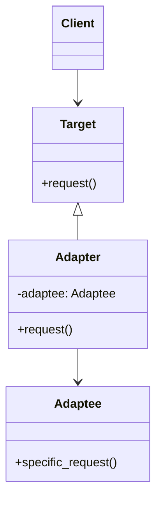
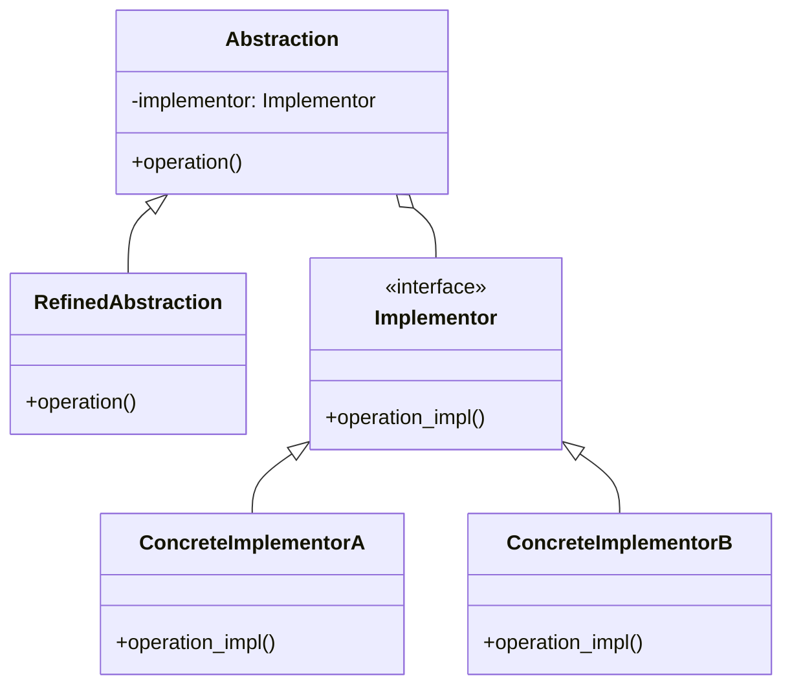
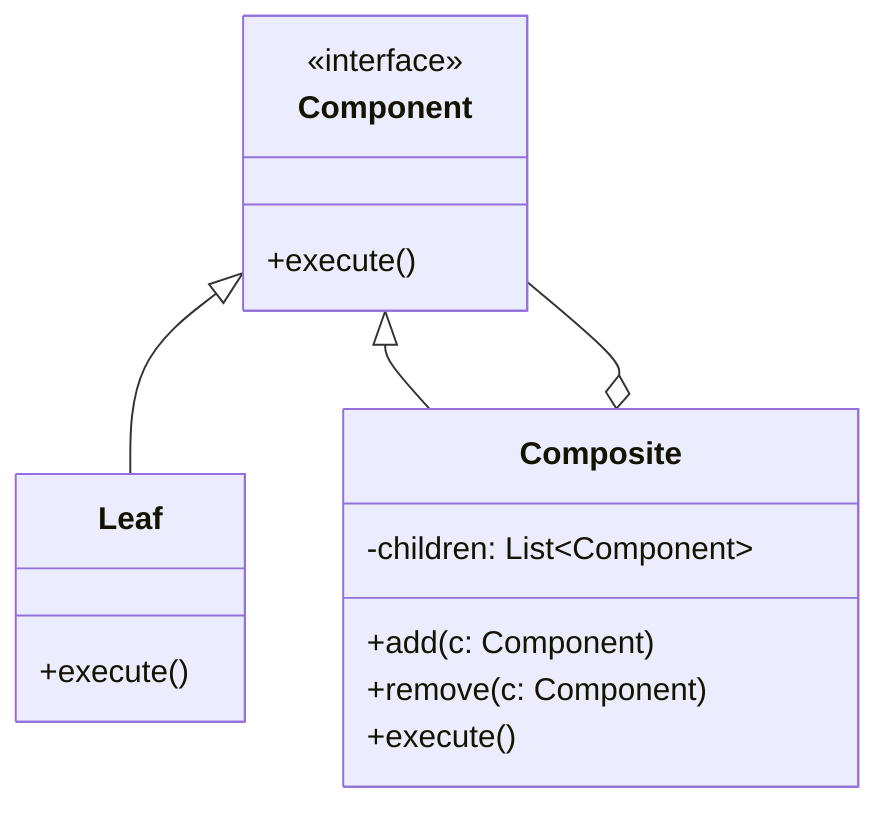
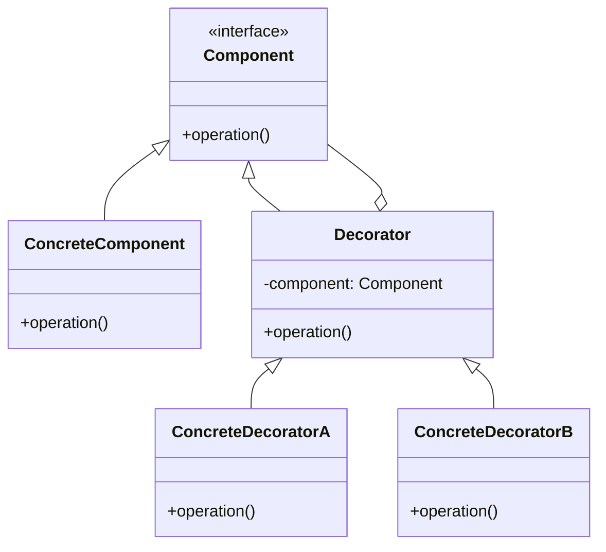
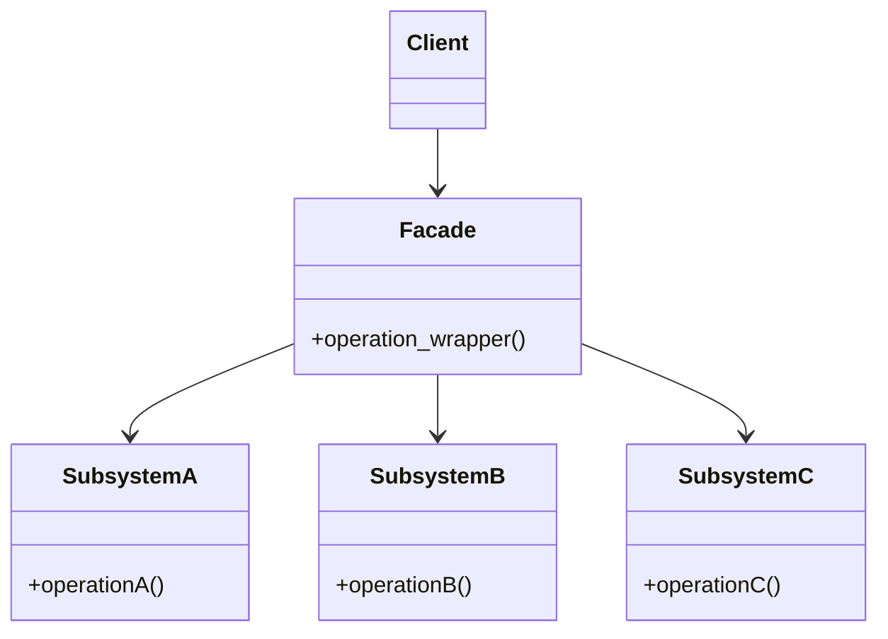
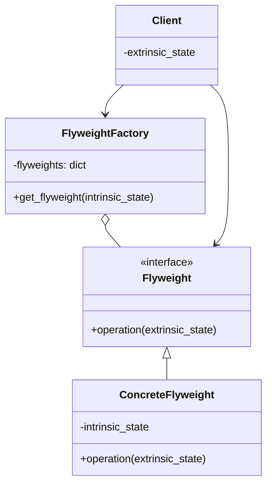
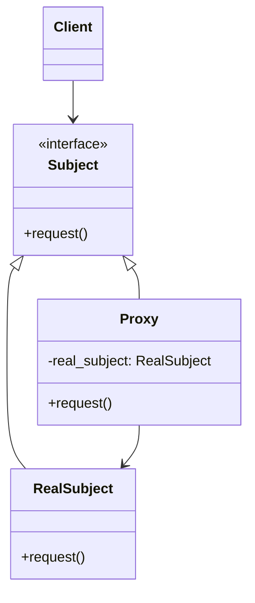

# Structural Design Patterns (Python)

## How does the Adapter pattern facilitate integration of incompatible interfaces in Python? Provide an example. <Badge type="warning" text="medium" />

::: details View Answer
**Explanation:**
The Adapter pattern acts as a bridge between two incompatible interfaces. It allows classes to work together that couldn't otherwise because of incompatible interfaces. In Python, this is often implemented using either object composition (Object Adapter) or multiple inheritance (Class Adapter). The Object Adapter is more common and flexible.

**Mermaid Diagram:**


**Python Code Example:**
```python
class JSONLogger:
    """The Target interface expected by the client."""
    def log_json(self, message: dict):
        pass

class Application:
    def __init__(self, logger: JSONLogger):
        self.logger = logger
        
    def do_work(self):
        self.logger.log_json({"event": "work_started", "status": "ok"})

class ThirdPartyXMLLogger:
    """The Adaptee with an incompatible interface."""
    def log_xml(self, xml_string: str):
        print(f"Logging XML: {xml_string}")

class XMLLoggerAdapter(JSONLogger):
    """The Adapter making Adaptee compatible with Target."""
    def __init__(self, xml_logger: ThirdPartyXMLLogger):
        self.xml_logger = xml_logger
        
    def log_json(self, message: dict):
        # Convert JSON/dict to XML (simplified for example)
        xml_str = f"<log><event>{message.get('event')}</event><status>{message.get('status')}</status></log>"
        self.xml_logger.log_xml(xml_str)

# Usage
xml_logger = ThirdPartyXMLLogger()
adapter = XMLLoggerAdapter(xml_logger)
app = Application(adapter)
app.do_work()
```
:::

## What problem does the Bridge pattern solve, and how does it separate abstraction from implementation? <Badge type="danger" text="hard" />

::: details View Answer
**Explanation:**
The Bridge pattern decouples an abstraction from its implementation so that the two can vary independently. Instead of creating a massive inheritance hierarchy (e.g., `WindowsButton`, `MacButton`, `WindowsCheckbox`, `MacCheckbox`), you separate them into two distinct hierarchies: Abstraction (UI controls) and Implementation (OS rendering). The abstraction holds a reference to the implementation.

**Mermaid Diagram:**


**Python Code Example:**
```python
from abc import ABC, abstractmethod

# Implementor Hierarchy
class RenderingAPI(ABC):
    @abstractmethod
    def render_circle(self, radius):
        pass

class OpenGLAPI(RenderingAPI):
    def render_circle(self, radius):
        print(f"OpenGL rendering circle of radius {radius}")

class VulkanAPI(RenderingAPI):
    def render_circle(self, radius):
        print(f"Vulkan rendering circle of radius {radius}")

# Abstraction Hierarchy
class Shape(ABC):
    def __init__(self, rendering_api: RenderingAPI):
        self.rendering_api = rendering_api

    @abstractmethod
    def draw(self):
        pass

class Circle(Shape):
    def __init__(self, radius, rendering_api: RenderingAPI):
        super().__init__(rendering_api)
        self.radius = radius

    def draw(self):
        # Delegates the work to the implementor
        self.rendering_api.render_circle(self.radius)

# Usage
opengl = OpenGLAPI()
vulkan = VulkanAPI()

circle1 = Circle(5, opengl)
circle1.draw()  # OpenGL rendering circle of radius 5

circle2 = Circle(10, vulkan)
circle2.draw()  # Vulkan rendering circle of radius 10
```
:::

## How can you treat individual objects and compositions of objects uniformly using the Composite pattern? <Badge type="warning" text="medium" />

::: details View Answer
**Explanation:**
The Composite pattern lets you compose objects into tree structures to represent part-whole hierarchies. It allows clients to treat individual objects and compositions of objects uniformly. This is particularly useful for things like UI components, file systems, or nested graphics, where a parent node and a leaf node share a common interface.

**Mermaid Diagram:**


**Python Code Example:**
```python
from abc import ABC, abstractmethod

class FileSystemComponent(ABC):
    @abstractmethod
    def get_size(self) -> int:
        pass
        
    @abstractmethod
    def print_structure(self, indent: str = ""):
        pass

class File(FileSystemComponent):
    """Leaf node."""
    def __init__(self, name: str, size: int):
        self.name = name
        self.size = size

    def get_size(self) -> int:
        return self.size
        
    def print_structure(self, indent: str = ""):
        print(f"{indent}- {self.name} ({self.size} bytes)")

class Directory(FileSystemComponent):
    """Composite node."""
    def __init__(self, name: str):
        self.name = name
        self.children = []

    def add(self, component: FileSystemComponent):
        self.children.append(component)

    def get_size(self) -> int:
        return sum(child.get_size() for child in self.children)
        
    def print_structure(self, indent: str = ""):
        print(f"{indent}+ {self.name}/")
        for child in self.children:
            child.print_structure(indent + "  ")

# Usage
root = Directory("root")
etc = Directory("etc")
home = Directory("home")

etc.add(File("config.json", 1024))
home.add(File("profile.png", 2048))
home.add(File("notes.txt", 512))

root.add(etc)
root.add(home)

root.print_structure()
print(f"Total size: {root.get_size()} bytes")
```
:::

## Explain the Decorator pattern. How does it provide a flexible alternative to subclassing for extending functionality? <Badge type="warning" text="medium" />

::: details View Answer
**Explanation:**
The Decorator pattern allows behavior to be added to individual objects, dynamically, without affecting the behavior of other objects from the same class. It provides a flexible alternative to subclassing for extending functionality by wrapping the original object in a decorator class that implements the same interface. In Python, this structural pattern is different from Python's `@decorator` syntax (which decorates functions/methods, though they share conceptual similarities).

**Mermaid Diagram:**


**Python Code Example:**
```python
from abc import ABC, abstractmethod

class Coffee(ABC):
    @abstractmethod
    def get_cost(self) -> float:
        pass

    @abstractmethod
    def get_description(self) -> str:
        pass

class SimpleCoffee(Coffee):
    """Concrete Component"""
    def get_cost(self) -> float:
        return 2.0

    def get_description(self) -> str:
        return "Simple Coffee"

class CoffeeDecorator(Coffee):
    """Base Decorator"""
    def __init__(self, coffee: Coffee):
        self._coffee = coffee

    def get_cost(self) -> float:
        return self._coffee.get_cost()

    def get_description(self) -> str:
        return self._coffee.get_description()

class MilkDecorator(CoffeeDecorator):
    """Concrete Decorator"""
    def get_cost(self) -> float:
        return self._coffee.get_cost() + 0.5

    def get_description(self) -> str:
        return self._coffee.get_description() + ", Milk"

class VanillaDecorator(CoffeeDecorator):
    """Concrete Decorator"""
    def get_cost(self) -> float:
        return self._coffee.get_cost() + 0.75

    def get_description(self) -> str:
        return self._coffee.get_description() + ", Vanilla"

# Usage
coffee = SimpleCoffee()
coffee = MilkDecorator(coffee)
coffee = VanillaDecorator(coffee)

print(f"{coffee.get_description()} costs ${coffee.get_cost()}")
# Output: Simple Coffee, Milk, Vanilla costs $3.25
```
:::

## What is the primary purpose of the Facade pattern? How does it simplify interactions with complex subsystems? <Badge type="tip" text="easy" />

::: details View Answer
**Explanation:**
The Facade pattern provides a simplified, higher-level interface to a complex subsystem of classes, libraries, or frameworks. It doesn't hide the subsystem from advanced users who need it, but it provides a convenient default view that satisfies most use cases, reducing coupling between the client and the subsystem.

**Mermaid Diagram:**


**Python Code Example:**
```python
# Subsystem classes
class CPU:
    def freeze(self): print("CPU freezing...")
    def jump(self, position): print(f"CPU jumping to {position}...")
    def execute(self): print("CPU executing...")

class Memory:
    def load(self, position, data): 
        print(f"Memory loading data '{data}' to position {position}...")

class HardDrive:
    def read(self, lba, size): 
        return f"boot_sector_data_from_lba_{lba}"

# Facade
class ComputerFacade:
    def __init__(self):
        self.cpu = CPU()
        self.memory = Memory()
        self.hard_drive = HardDrive()

    def start(self):
        print("Computer starting up...")
        self.cpu.freeze()
        boot_data = self.hard_drive.read(0, 1024)
        self.memory.load(0, boot_data)
        self.cpu.jump(0)
        self.cpu.execute()
        print("Computer started successfully.")

# Usage
computer = ComputerFacade()
computer.start()
```
:::

## How does the Flyweight pattern conserve memory, and what is the difference between intrinsic and extrinsic state? <Badge type="danger" text="hard" />

::: details View Answer
**Explanation:**
The Flyweight pattern minimizes memory usage by sharing as much data as possible with other similar objects. It's used when you need to create a massive number of objects. It achieves this by separating object state into two parts:
1.  **Intrinsic State:** Data that is invariant, context-independent, and can be shared (e.g., the texture and color of a tree type).
2.  **Extrinsic State:** Data that varies depending on the context and cannot be shared (e.g., the X, Y coordinates of a specific tree). The client passes the extrinsic state to the flyweight methods when needed.

**Mermaid Diagram:**


**Python Code Example:**
```python
class TreeType:
    """Flyweight containing intrinsic state."""
    def __init__(self, name: str, color: str, texture: str):
        self.name = name
        self.color = color
        self.texture = texture
        
    def draw(self, x: int, y: int):
        print(f"Drawing {self.name} tree ({self.color}) at ({x}, {y})")

class TreeFactory:
    """Flyweight Factory to manage shared TreeType objects."""
    _tree_types = {}

    @classmethod
    def get_tree_type(cls, name: str, color: str, texture: str) -> TreeType:
        key = (name, color, texture)
        if key not in cls._tree_types:
            print(f"Creating new TreeType: {name}")
            cls._tree_types[key] = TreeType(name, color, texture)
        return cls._tree_types[key]

class Tree:
    """Context object containing extrinsic state."""
    def __init__(self, x: int, y: int, tree_type: TreeType):
        self.x = x
        self.y = y
        self.tree_type = tree_type

    def draw(self):
        self.tree_type.draw(self.x, self.y)

# Usage
forest = []
# Create 1000 trees, but only 2 actual TreeType objects are stored in memory
for i in range(500):
    type1 = TreeFactory.get_tree_type("Oak", "Green", "Rough")
    forest.append(Tree(x=i, y=i, tree_type=type1))
    
    type2 = TreeFactory.get_tree_type("Pine", "Dark Green", "Smooth")
    forest.append(Tree(x=i, y=100-i, tree_type=type2))

forest[0].draw()
forest[1].draw()
```
:::

## In what scenarios would you use the Proxy pattern? Explain with a Virtual or Protection proxy example. <Badge type="warning" text="medium" />

::: details View Answer
**Explanation:**
The Proxy pattern provides a surrogate or placeholder for another object to control access to it. It implements the same interface as the real object.
Common types of proxies include:
-   **Virtual Proxy:** Delays the creation/initialization of an expensive object until it is actually needed (lazy initialization).
-   **Protection Proxy:** Controls access to the real object based on permissions.
-   **Remote Proxy:** Represents an object located in a different address space (e.g., RPC/network calls).
-   **Caching Proxy:** Caches results from the real object to improve performance.

**Mermaid Diagram:**


**Python Code Example (Virtual Proxy):**
```python
from abc import ABC, abstractmethod
import time

class Image(ABC):
    @abstractmethod
    def display(self):
        pass

class RealImage(Image):
    def __init__(self, filename: str):
        self.filename = filename
        self._load_from_disk()

    def _load_from_disk(self):
        print(f"Loading {self.filename} from disk (this takes time)...")
        time.sleep(1) # Simulate expensive operation

    def display(self):
        print(f"Displaying {self.filename}")

class ProxyImage(Image):
    def __init__(self, filename: str):
        self.filename = filename
        self._real_image = None # Real object is not created yet

    def display(self):
        if self._real_image is None:
            # Lazy initialization
            self._real_image = RealImage(self.filename)
        self._real_image.display()

# Usage
# Image is NOT loaded here
image1 = ProxyImage("high_res_photo1.jpg")
image2 = ProxyImage("high_res_photo2.jpg")

print("App loaded. Images not yet initialized.")

# Image IS loaded here on first use
print("User scrolls to Image 1...")
image1.display()

# Subsequent calls don't load from disk again
print("User views Image 1 again...")
image1.display()
```
:::
