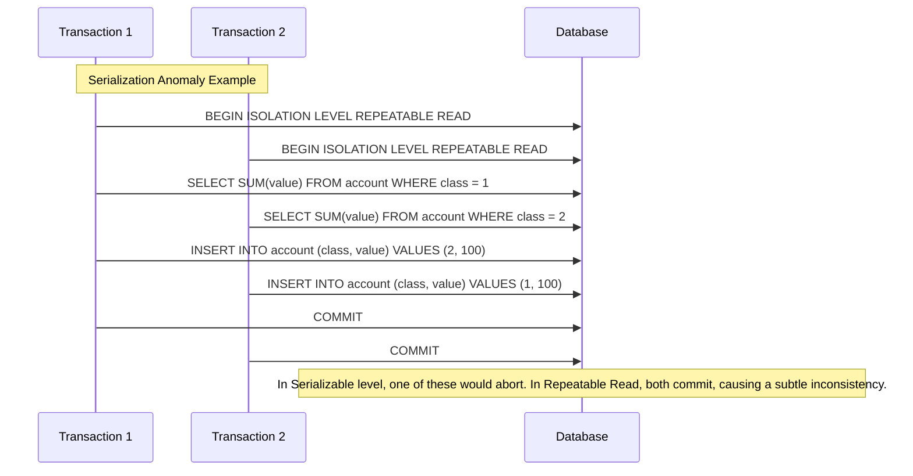
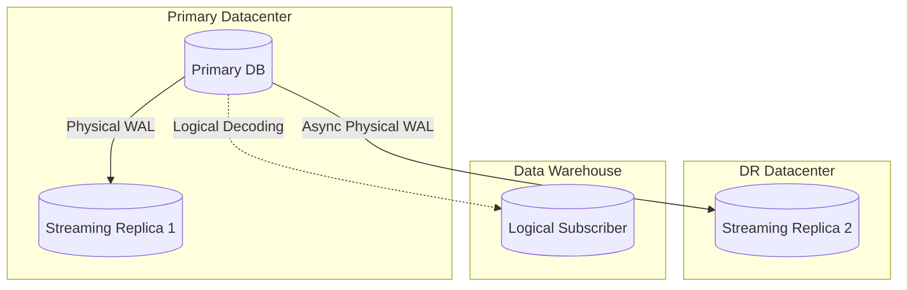

# Advanced PostgreSQL & Database Internals

## 1. Explain Multi-Version Concurrency Control (MVCC) in PostgreSQL. How does it handle updates, and what is the role of `xmin` and `xmax`? <Badge type="danger" text="hard" />

::: details View Answer
**MVCC (Multi-Version Concurrency Control)** is PostgreSQL's mechanism for handling concurrent access to data without forcing readers to block writers, or writers to block readers. Instead of locking rows for reading, Postgres maintains multiple versions of a row.

When an `UPDATE` occurs, PostgreSQL does not modify the existing row in place. Instead, it:
1. Marks the old row as expired (to be cleaned up later by Vacuum).
2. Inserts a completely new version of the row.

Every row has hidden system columns:
- **`xmin`**: The transaction ID (TXID) of the transaction that inserted the row.
- **`xmax`**: The transaction ID of the transaction that deleted or updated the row (0 if not deleted/updated).

When a transaction reads data, it uses its own TXID and the database's transaction snapshot to determine which version of a row is visible to it. A row is visible if its `xmin` is valid and committed before the snapshot was taken, and its `xmax` is either 0, uncommitted, or committed after the snapshot was taken.
:::

## 2. What are the standard transaction isolation levels? How does PostgreSQL implement them, and how does Repeatable Read differ from the SQL standard? <Badge type="danger" text="hard" />

::: details View Answer
The SQL standard defines four isolation levels:
1. **Read Uncommitted**: Can see uncommitted changes from other transactions (Dirty Reads).
2. **Read Committed**: Can only see committed changes. Default in PostgreSQL.
3. **Repeatable Read**: Same as Read Committed, plus consecutive reads within the same transaction yield the same results (prevents Non-Repeatable Reads).
4. **Serializable**: Strictest level; transactions execute as if they were serial.

**PostgreSQL Implementation Quirks:**
- In Postgres, **Read Uncommitted behaves exactly like Read Committed**. Dirty reads are strictly impossible due to MVCC.
- The SQL standard states that **Repeatable Read** allows *Phantom Reads* (new rows matching a query appearing in subsequent executions). However, **PostgreSQL's Repeatable Read also prevents Phantom Reads**.
- Postgres's **Serializable** level uses Serializable Snapshot Isolation (SSI) to track read/write dependencies and abort transactions that could cause serialization anomalies.


:::

## 3. Explain the different types of row-level locks in PostgreSQL. When would you use them in a Python application using `asyncpg`? <Badge type="warning" text="medium" />

::: details View Answer
Row-level locks prevent concurrent modifications to the same rows. The main types are:
- `FOR UPDATE`: Locks the rows for updating or deleting. Other transactions trying to update, delete, or lock the row (`FOR UPDATE`, `FOR NO KEY UPDATE`, `FOR SHARE`, `FOR KEY SHARE`) will block.
- `FOR NO KEY UPDATE`: Weaker than `FOR UPDATE`. Used when you update non-key columns. Allows concurrent `FOR KEY SHARE` locks.
- `FOR SHARE`: Locks the row to prevent it from being updated or deleted, but allows other transactions to also acquire `FOR SHARE` locks.
- `FOR KEY SHARE`: The weakest lock, usually acquired automatically when checking foreign key constraints.

**Use Case:** Preventing race conditions in a financial transfer.

```python
import asyncpg
import asyncio

async def transfer_funds(pool, from_id, to_id, amount):
    async with pool.acquire() as conn:
        async with conn.transaction():
            # FOR UPDATE prevents other transactions from modifying or locking these rows
            # ORDER BY id prevents deadlocks when multiple concurrent transfers happen
            query = """
                SELECT id, balance FROM accounts 
                WHERE id IN ($1, $2) 
                ORDER BY id FOR UPDATE
            """
            rows = await conn.fetch(query, from_id, to_id)
            
            # Application logic to check balances
            # ...
            
            await conn.execute("UPDATE accounts SET balance = balance - $1 WHERE id = $2", amount, from_id)
            await conn.execute("UPDATE accounts SET balance = balance + $1 WHERE id = $2", amount, to_id)
```
:::

## 4. How does PostgreSQL handle deadlocks? Write a Python snippet demonstrating how to catch and handle a deadlock exception. <Badge type="warning" text="medium" />

::: details View Answer
A deadlock occurs when two concurrent transactions wait for locks held by each other, creating an infinite cycle. PostgreSQL runs a background deadlock detector. If a transaction waits for a lock longer than `deadlock_timeout` (default 1s), Postgres checks the dependency graph. If a cycle is found, it aborts one of the transactions, rolling it back and raising a `deadlock_detected` error (SQLSTATE `40P01`).

**Handling Deadlocks in Python (psycopg2):**

```python
import psycopg2
from psycopg2 import errors
import time

def execute_with_retry(conn, query, max_retries=3):
    for attempt in range(max_retries):
        try:
            with conn.cursor() as cur:
                cur.execute(query)
            conn.commit()
            return
        except errors.DeadlockDetected as e:
            conn.rollback()
            print(f"Deadlock detected on attempt {attempt+1}. Retrying...")
            time.sleep((2 ** attempt)) # Exponential backoff
        except Exception as e:
            conn.rollback()
            raise e
    raise Exception("Max retries reached due to deadlocks")
```
:::

## 5. Discuss the structural differences and use cases of B-Tree, GIN, and GiST indexes in PostgreSQL. <Badge type="danger" text="hard" />

::: details View Answer
- **B-Tree**: The default index. Best for scalar data types and operations involving equality (`=`) and range comparisons (`<`, `<=`, `>`, `>=`). It maintains a balanced tree, allowing fast lookups in logarithmic time.
- **GiST (Generalized Search Tree)**: Used primarily for geometric types, range types, and full-text search. It doesn't use strict less-than/greater-than logic but rather concepts of intersection, containment, and proximity. Excellent for PostGIS queries (e.g., finding points within a polygon).
- **GIN (Generalized Inverted Index)**: Designed for composite values where elements need to be searched individually, such as arrays, `jsonb`, and full-text search documents (`tsvector`). A GIN index contains an entry for every individual element within the composite value. It is much faster than GiST for read-heavy full-text search but significantly slower to update.
:::

## 6. How does BRIN (Block Range Index) work, and in what scenarios does it dramatically outperform B-Tree? <Badge type="warning" text="medium" />

::: details View Answer
**BRIN (Block Range Index)** does not store individual row pointers like a B-Tree. Instead, it divides the table into contiguous ranges of physical disk blocks (e.g., every 128 pages). For each range, it stores summary information, typically the minimum and maximum values of the indexed column.

When a query searches for a value, BRIN checks the summaries. If the value falls outside the min/max of a block range, Postgres skips those blocks entirely.

**When it outperforms B-Tree:**
- The table is massive (terabytes).
- The column data naturally correlates with physical insertion order (e.g., `created_at` timestamps or sequential IDs).
- A B-Tree index would be too large to fit in RAM, leading to massive I/O.
- BRIN indexes are drastically smaller (often 99% smaller) than B-Trees and extremely cheap to create and maintain.
:::

## 7. Walk through reading an `EXPLAIN ANALYZE` output. What are the differences between an Index Scan, an Index Only Scan, and a Bitmap Heap Scan? <Badge type="danger" text="hard" />

::: details View Answer
`EXPLAIN ANALYZE` actually executes the query and provides real execution times alongside the planner's estimates. 

- **Index Scan**: The database traverses the index to find matching row pointers, then visits the actual table (the heap) to retrieve the row data and check MVCC visibility.
- **Index Only Scan**: The database traverses the index, and *all the requested columns are present in the index itself*. If the Visibility Map indicates that the page containing the row is completely visible to all transactions, Postgres skips visiting the heap entirely. This is highly performant.
- **Bitmap Heap Scan**: Typically used when a query matches a large number of rows via an index. Postgres first does a **Bitmap Index Scan**, creating an in-memory bitmap of block locations that contain matching rows. Then, the **Bitmap Heap Scan** fetches the actual table blocks sequentially (or ordered by physical location), which minimizes random disk I/O compared to a standard Index Scan.
:::

## 8. What is the purpose of Vacuuming and Autovacuum in PostgreSQL? What happens if Autovacuum is turned off or falls behind? <Badge type="danger" text="hard" />

::: details View Answer
Because PostgreSQL uses MVCC, updating or deleting rows leaves behind "dead tuples." 
**Vacuuming** scans the database to:
1. Mark space occupied by dead tuples as reusable for future inserts/updates (preventing table bloat).
2. Update the Visibility Map.
3. Freeze very old transaction IDs to prevent TXID Wraparound.
4. Update planner statistics (handled by `ANALYZE`).

**Autovacuum** is a background daemon that automatically invokes `VACUUM` and `ANALYZE` as tables accumulate dead tuples.

**If Autovacuum falls behind or is turned off:**
- **Table Bloat**: Tables and indexes grow indefinitely, wasting disk space.
- **Performance Degradation**: Queries must scan over thousands of dead tuples, massively increasing I/O and CPU usage.
- **TXID Wraparound Outage**: Eventually, the database will shut down completely to prevent catastrophic data corruption due to Transaction ID wraparound.
:::

## 9. Describe Transaction ID (TXID) Wraparound. How does PostgreSQL prevent it, and what are the symptoms? <Badge type="danger" text="hard" />

::: details View Answer
PostgreSQL uses a 32-bit integer for Transaction IDs (`xmin`/`xmax`), allowing for about 4.2 billion transactions. To compare ages, Postgres uses modulo-2^32 arithmetic: half the IDs are in the "past", half are in the "future".
If the TXID counter wraps around past 4.2 billion, old transactions would suddenly appear to be in the "future" and become invisible (data loss).

**Prevention:**
PostgreSQL uses a concept called **Freezing**. The Vacuum process replaces very old `xmin` values with a special `FrozenTransactionId` (value 2), which is hardcoded to always be in the "past" for all comparisons. Autovacuum automatically triggers "anti-wraparound" vacuums when tables get too old.

**Symptoms of impending doom:**
- Warnings in the server log: `WARNING: database "mydb" must be vacuumed within XXX transactions`.
- If ignored, Postgres forcibly shuts down with: `ERROR: database is not accepting commands to avoid wraparound data loss in database "mydb"`. Recovery requires starting in single-user mode and running a manual `VACUUM`.
:::

## 10. Explain PostgreSQL Table Partitioning. What are the performance benefits and limitations compared to a single large table? <Badge type="warning" text="medium" />

::: details View Answer
Table partitioning splits one logically large table into smaller physical pieces (partitions). Postgres supports Declarative Partitioning by Range, List, and Hash.

**Benefits:**
- **Query Performance (Partition Pruning)**: If queries filter on the partition key, the query planner can exclude entire partitions from the scan, acting like a coarse-grained index.
- **Bulk Deletes**: Dropping a partition (`DROP TABLE`) is instantaneous and reclaims space immediately to the OS, whereas `DELETE` requires massive I/O, creates dead tuples, and requires vacuuming.
- **Index Maintenance**: Indexes are smaller and rebuilt per partition, making maintenance easier.

**Limitations:**
- Foreign keys referencing a partitioned table were historically problematic (though supported from PG 12+).
- Unique constraints must include all the partitioning columns.
- Cross-partition `UPDATE`s (where the partition key changes, causing the row to migrate to another partition) are more expensive.
:::

## 11. How does Write-Ahead Logging (WAL) ensure durability and consistency? Describe a scenario where WAL is used for crash recovery. <Badge type="danger" text="hard" />

::: details View Answer
WAL ensures that data changes are durably recorded to disk *before* the data pages themselves are flushed to the main table files (the heap). 

When a transaction commits, the changes are written sequentially to the WAL and flushed to disk (`fsync`). Only then is the commit acknowledged to the client. The actual data pages are modified in shared memory (RAM) and are written to the database files lazily later by the `checkpointer` or `bgwriter` processes.

**Crash Recovery Scenario:**
The server loses power. Memory is wiped. Upon reboot:
1. Postgres reads the `pg_control` file and finds the system did not shut down cleanly.
2. It identifies the last successful checkpoint.
3. It replays every WAL record sequentially from the checkpoint forward, reapplying changes to the data pages.
4. This brings the database to the exact consistent state of the last committed transaction before the crash.
:::

## 12. What are the differences between Physical (Streaming) Replication and Logical Replication in PostgreSQL? <Badge type="danger" text="hard" />

::: details View Answer
- **Physical (Streaming) Replication**: Copies exact disk blocks via WAL records. The replica is an identical byte-for-byte copy of the primary. It replicates everything (all databases, schemas, users). The replica is read-only.
- **Logical Replication**: Decodes WAL records into logical data changes (INSERT, UPDATE, DELETE) via a pub/sub model. You can replicate specific tables, even across different PostgreSQL versions or different operating systems. The subscriber database is fully writable.


:::

## 13. How does PostgreSQL store large row values? Explain the TOAST mechanism. <Badge type="warning" text="medium" />

::: details View Answer
PostgreSQL pages are typically 8KB, and tuples cannot span across multiple pages. To accommodate large field values (like large text strings or JSON payloads), PostgreSQL uses **TOAST** (The Oversized-Attribute Storage Technique).

When a row exceeds the threshold (usually ~2KB):
1. **Compression**: Postgres first attempts to compress the large field.
2. **Out-of-line storage**: If compression isn't enough, the data is split into chunks and stored in a separate, hidden TOAST table associated with the main table.
3. A pointer (OID) is left in the main table row.

This makes queries selecting only small columns extremely fast, as the database doesn't have to load massive amounts of out-of-line data unless those specific columns are explicitly `SELECT`ed.
:::

## 14. Explain the difference between connection pooling at the application level vs database level (e.g., PgBouncer). Why is PgBouncer necessary? <Badge type="warning" text="medium" />

::: details View Answer
- **Application Level (e.g., SQLAlchemy/asyncpg pool)**: Maintains a pool of connections within a single application instance. Helpful, but if you scale your app horizontally to 50 pods, each with a pool size of 20, you suddenly have 1,000 connections hitting the database.
- **Database Level (e.g., PgBouncer, Pgpool-II)**: Sits in front of the database. Applications connect to PgBouncer, and PgBouncer multiplexes thousands of lightweight client connections onto a small number of real database connections.

**Why it's necessary:**
PostgreSQL forks a new heavy OS process for every connection. Having >500-1000 active connections consumes vast amounts of RAM and severely degrades CPU due to context switching and lock contention. PgBouncer using `transaction` pooling mode allows 10,000 app connections to efficiently share 100 real Postgres processes.
:::

## 15. How do Materialized Views differ from standard Views? What is the impact of `REFRESH MATERIALIZED VIEW CONCURRENTLY`? <Badge type="warning" text="medium" />

::: details View Answer
- **Standard View**: A saved query. Every time you query the view, the underlying SQL is executed dynamically.
- **Materialized View**: Computes the query result and actually stores the data physically on disk, acting like a table. Queries against it are fast, but the data becomes stale as underlying tables change.

**Refreshing:**
When you run `REFRESH MATERIALIZED VIEW my_view;`, Postgres locks the view, recalculates the data, and blocks all `SELECT` queries against it until finished.
Using `REFRESH MATERIALIZED VIEW CONCURRENTLY` calculates the new state in the background and applies the diff without blocking concurrent reads. **Caveat**: It requires the materialized view to have at least one `UNIQUE` index.
:::

## 16. Describe best practices for querying and indexing `jsonb` columns. When would you use `jsonb_path_ops`? <Badge type="warning" text="medium" />

::: details View Answer
`jsonb` stores JSON in a parsed, binary format, making it heavily optimized for querying compared to standard text `json`.

**Indexing:**
You should almost always use a GIN index for `jsonb`.
```sql
CREATE INDEX idx_data ON mytable USING GIN (data);
```
This default GIN index supports operators like `?` (key existence), `?|`, `?&`, and `@>` (containment).

**`jsonb_path_ops`:**
If your queries only rely on the containment operator `@>` (e.g., `WHERE data @> '{"user": {"id": 123}}'`), you can create the index using the `jsonb_path_ops` operator class:
```sql
CREATE INDEX idx_data_path ON mytable USING GIN (data jsonb_path_ops);
```
**Advantage**: It is significantly smaller and faster to search than the default GIN index, but it *only* supports the `@>` operator, stripping support for `?` (key existence checks).
:::

## 17. Explain Common Table Expressions (CTEs). Prior to PG 12, CTEs were an optimization fence. What does this mean? <Badge type="warning" text="medium" />

::: details View Answer
CTEs allow you to write auxiliary statements (`WITH` clauses) for use in a larger query, improving readability.

**Optimization Fence:**
Prior to PostgreSQL 12, the query planner evaluated CTEs completely independently. It would materialize the CTE into memory (or temp disk), and *then* run the outer query. The planner could not push down `WHERE` clauses from the outer query into the CTE.
*Example*: `WITH users AS (SELECT * FROM user_table) SELECT * FROM users WHERE id = 1;` 
In PG 11, this would fetch *all* users, materialize them, and then filter `id=1`. 

**In PG 12+**, CTEs are inlined by default if they are referenced only once and have no side effects, allowing the planner to push the `id=1` filter down into the underlying scan natively. You can force the old behavior using `WITH ... AS MATERIALIZED`.
:::

## 18. What are Foreign Data Wrappers (FDW)? Describe a usecase where `postgres_fdw` would be beneficial. <Badge type="tip" text="easy" />

::: details View Answer
**Foreign Data Wrappers (FDW)** allow PostgreSQL to connect to external data sources and query them as if they were local tables using standard SQL.

**Use Case in Microservices:**
Suppose Service A (Users) has a database, and Service B (Orders) has a database. Service B needs to generate a report linking Orders to User details.
Instead of doing complex application-level joins or ETL pipelines, Service B's database can use `postgres_fdw` to map the `users` table from Service A into its own schema. A simple SQL join `SELECT * FROM orders o JOIN remote_users u ON o.user_id = u.id` can now be run. The planner is smart enough to push down limits and where clauses across the network to Service A.
:::

## 19. How do Window Functions work under the hood, and how can they impact query performance compared to `GROUP BY`? <Badge type="warning" text="medium" />

::: details View Answer
Window functions perform calculations across a set of table rows that are related to the current row, but unlike `GROUP BY`, they do not cause rows to become collapsed into a single output row.

**Under the hood:**
PostgreSQL must first sort the data according to the `PARTITION BY` and `ORDER BY` clauses of the window function. If an appropriate B-Tree index isn't available to provide the sorting natively, Postgres will perform an explicit `Sort` node in memory (or temp files on disk if `work_mem` is exceeded).

**Performance Impact:**
Because window functions preserve all rows and often require massive sorting operations, they are generally heavier than `GROUP BY` aggregations. Performance drops sharply if the sorting spills to disk. Proper indexing on the partition/order columns or increasing `work_mem` is critical for optimizing window functions.
:::

## 20. What is `pg_stat_statements`, and how do you use it to identify slow queries in production? <Badge type="tip" text="easy" />

::: details View Answer
`pg_stat_statements` is a core extension that records execution statistics of all SQL statements executed by the server. It aggregates identical queries (parameterizing out hardcoded values) to show true overall impact.

**Usage:**
First, enable it in `postgresql.conf` under `shared_preload_libraries`.
Then, run `CREATE EXTENSION pg_stat_statements;`.

To find the queries consuming the most total time (the best targets for optimization):
```sql
SELECT query, calls, total_exec_time, mean_exec_time, rows
FROM pg_stat_statements
ORDER BY total_exec_time DESC
LIMIT 10;
```
This highlights queries that might execute very fast individually (low `mean_exec_time`) but are called millions of times (`calls`), as well as queries that are just fundamentally slow.
:::
