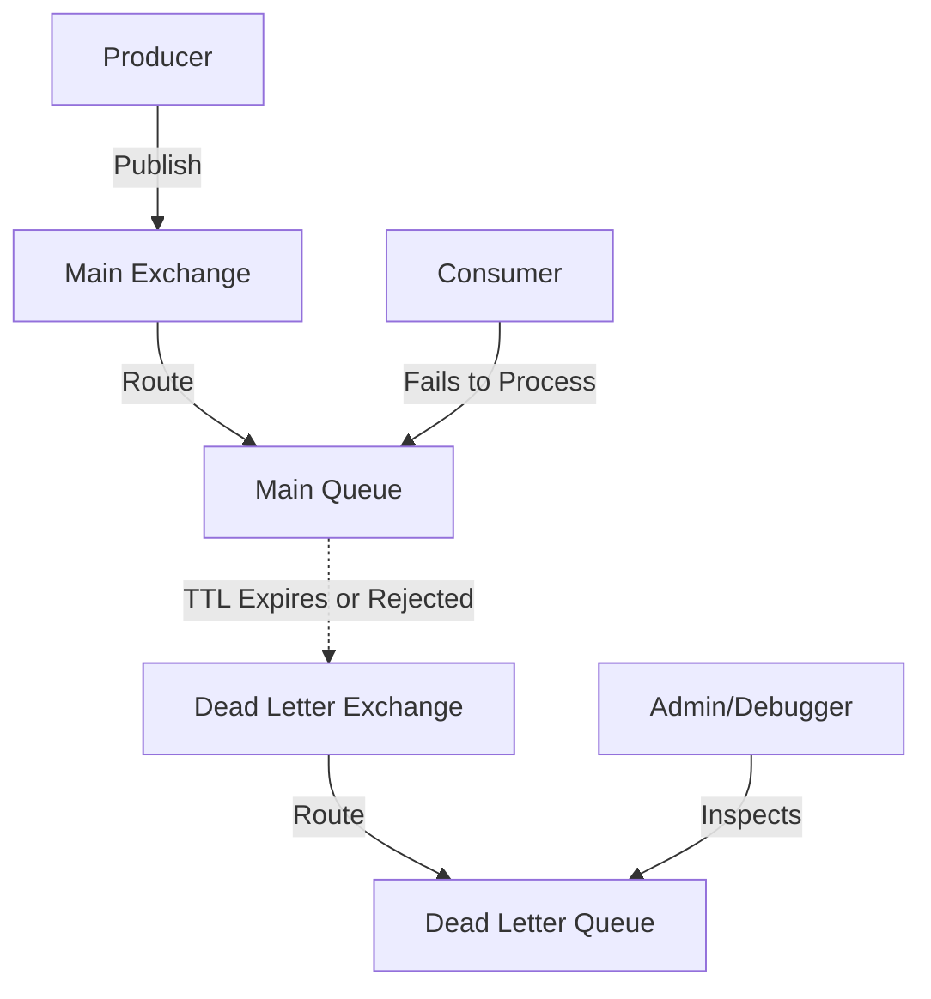
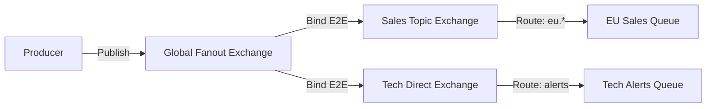

# RabbitMQ

## What is RabbitMQ and how does it differ from Apache Kafka? <Badge type="tip" text="easy" />

::: details View Answer
**RabbitMQ** is an open-source message broker that implements the Advanced Message Queuing Protocol (AMQP). It acts as a middleman that receives, stores, and routes messages between applications. It is traditionally used for point-to-point communication, request/reply patterns, and pub/sub messaging.

**Differences from Kafka:**
- **Architecture**: RabbitMQ is a smart broker / dumb consumer model (broker pushes messages, tracks acknowledgments). Kafka is a dumb broker / smart consumer model (consumers pull messages, manage their own offsets).
- **Storage**: RabbitMQ stores messages in RAM (or disk for persistence) until they are consumed and acknowledged, then they are deleted. Kafka persists messages to disk for a configured retention period, allowing replay.
- **Routing**: RabbitMQ offers complex routing capabilities out-of-the-box via Exchanges (Direct, Topic, Fanout, Headers). Kafka routes simply by Topic.
- **Use Case**: RabbitMQ excels in complex routing, task queues, and real-time point-to-point communication. Kafka is designed for high-throughput event streaming, log aggregation, and stream processing.
:::

## Explain the core components of RabbitMQ: Producer, Exchange, Queue, and Consumer. <Badge type="tip" text="easy" />

::: details View Answer
The core AMQP components in RabbitMQ are:
1. **Producer**: An application that sends (publishes) messages to a RabbitMQ broker. Producers do not send messages directly to queues; they send them to an exchange.
2. **Exchange**: The routing engine in RabbitMQ. It receives messages from producers and pushes them to zero, one, or more queues based on routing rules (bindings and routing keys).
3. **Queue**: A buffer that stores messages. Messages reside in a queue until they are processed by a consumer.
4. **Consumer**: An application that connects to RabbitMQ and subscribes to a queue to receive and process messages.
:::

## What is a Direct Exchange in RabbitMQ? How does routing work? <Badge type="tip" text="easy" />

::: details View Answer
A **Direct Exchange** routes messages to queues based on an exact match between the message's routing key and the queue's binding key. It is ideal for unicast routing of messages.

**How it works:**
- A queue binds to the exchange with a specific binding key (e.g., `error_logs`).
- A producer publishes a message to the exchange with a routing key (e.g., `error_logs`).
- The exchange routes the message only to the queue where the binding key perfectly matches the routing key.

**Python Example (`pika`):**
```python
import pika

connection = pika.BlockingConnection(pika.ConnectionParameters('localhost'))
channel = connection.channel()

# Declare a direct exchange
channel.exchange_declare(exchange='direct_logs', exchange_type='direct')

# Publish a message with routing key 'error'
channel.basic_publish(
    exchange='direct_logs',
    routing_key='error',
    body='An error occurred!'
)
print(" [x] Sent 'error' message")
connection.close()
```
:::

## What is a Fanout Exchange? Describe a use case. <Badge type="warning" text="medium" />

::: details View Answer
A **Fanout Exchange** routes messages to all queues that are bound to it, completely ignoring the routing key. It essentially broadcasts the message.

**Use Case:**
Fanout exchanges are perfect for the Publish/Subscribe pattern where multiple independent systems need to react to the same event.
For example, in an e-commerce system, when a "Purchase Completed" event occurs, a fanout exchange can broadcast this to:
- The Inventory service (to deduct stock).
- The Email service (to send a receipt).
- The Analytics service (to update metrics).
All these services bind their respective queues to the same fanout exchange.
:::

## How does a Topic Exchange route messages? Explain routing keys and wildcards. <Badge type="warning" text="medium" />

::: details View Answer
A **Topic Exchange** routes messages to one or many queues based on matching between a message's routing key and the pattern specified in the queue binding.

**Routing Keys and Wildcards:**
The routing key must be a list of words delimited by dots (e.g., `stock.usd.nyse` or `sys.logs.error`).
Binding keys can contain two special wildcard characters:
- `*` (star) matches exactly one word.
- `#` (hash) matches zero or more words.

**Examples:**
- Binding key `*.logs.*` matches `sys.logs.info` and `auth.logs.error`, but not `sys.logs`.
- Binding key `sys.logs.#` matches `sys.logs`, `sys.logs.error`, and `sys.logs.error.critical`.

If a queue is bound with `#`, it receives all messages (like a fanout exchange). If no wildcards are used, it behaves like a direct exchange.
:::

## Explain the purpose of a Headers Exchange. <Badge type="warning" text="medium" />

::: details View Answer
A **Headers Exchange** routes messages based on multiple attributes expressed as message headers, rather than a routing key. It is used when routing rules are complex and cannot be easily expressed via a string-based routing key.

When binding a queue to a headers exchange, you specify a set of key-value pairs. You also provide an `x-match` argument:
- `x-match: all` (default): The message headers must match all the key-value pairs in the binding.
- `x-match: any`: The message headers must match at least one of the key-value pairs in the binding.

This is less commonly used but highly powerful for complex, attribute-based routing scenarios.
:::

## What is AMQP (Advanced Message Queuing Protocol)? Why is it important in RabbitMQ? <Badge type="warning" text="medium" />

::: details View Answer
**AMQP** is an open standard application layer protocol for message-oriented middleware. It defines a wire-level protocol, meaning it specifies the binary format of the data sent over the network, allowing different AMQP-compliant clients (written in any language) to interoperate seamlessly with AMQP-compliant brokers like RabbitMQ.

**Why it's important in RabbitMQ:**
RabbitMQ was originally built to implement AMQP 0-9-1. It dictates the core architectural models in RabbitMQ—specifically the Programmable Protocol feature, which means entities like Exchanges, Queues, and Bindings are not pre-configured in the server but are declared dynamically by the applications (clients) via AMQP commands. This makes RabbitMQ highly flexible.
:::

## What is Message Acknowledgment in RabbitMQ? Explain `basic.ack`, `basic.nack`, and `basic.reject`. <Badge type="warning" text="medium" />

::: details View Answer
Message acknowledgment is a mechanism to guarantee that a message was successfully processed by a consumer before RabbitMQ deletes it from the queue. If a consumer dies (connection closed, channel closed) without sending an ack, RabbitMQ will requeue the message.

- `basic.ack` (Positive Acknowledgment): Informs the broker that the message was successfully processed and can be safely deleted.
- `basic.reject` (Negative Acknowledgment): Informs the broker that the consumer failed to process a single message. The consumer can instruct the broker to discard it or requeue it using the `requeue` flag.
- `basic.nack` (Negative Acknowledgment - RabbitMQ Extension): Similar to `basic.reject`, but allows rejecting multiple messages at once using the `multiple` flag.

By default, messages are held in an "Unacked" state until the consumer explicitly acknowledges them (manual ack mode).
:::

## What happens to unacknowledged messages in RabbitMQ? How do you prevent infinite requeuing? <Badge type="danger" text="hard" />

::: details View Answer
When a consumer receives a message in manual acknowledgment mode, the message remains in the queue but is marked as `Unacked`.
- If the consumer successfully processes it and sends an `ack`, the message is deleted.
- If the consumer sends a `nack` or `reject` with `requeue=True`, the message is placed back at the head of the queue.
- If the consumer's connection drops without sending an ack/nack, RabbitMQ automatically requeues the message for another consumer.

**Infinite Requeuing Issue:**
If a message causes the consumer to crash or throw an unhandled exception every time it's processed, and the consumer relies on connection dropping to requeue, or explicitly `nack`s with `requeue=True`, it causes an infinite loop (poison message).

**How to prevent it:**
1. **Catch Exceptions**: Wrap processing in a try-catch block.
2. **Discard or Dead-Letter**: On catching a permanent error (e.g., malformed JSON), `nack` or `reject` the message with `requeue=False`.
3. **Use a Dead Letter Exchange (DLX)**: Configure the queue to route rejected (`requeue=False`) messages to a DLX for later inspection.
4. **Retry with Delay/Limit**: Implement custom headers (like `x-retry-count`) to limit the number of requeues before sending to a DLX.
:::

## What is Prefetch Count (`basic.qos`) and why is it crucial for consumer performance? <Badge type="warning" text="medium" />

::: details View Answer
By default, RabbitMQ sends messages to a consumer as fast as possible, pushing all available messages into the consumer's local RAM buffer. This can overwhelm a consumer, consume too much memory, and prevent other idle consumers from receiving work (poor load balancing).

**Prefetch Count (`basic.qos`)** solves this by limiting the number of unacknowledged messages a consumer can have at any given time. Once the limit is reached, RabbitMQ stops sending messages to that consumer until it acknowledges some.

**Why it is crucial:**
- Prevents memory exhaustion on the consumer.
- Ensures fair dispatch (round-robin) across multiple workers. A consumer that processes messages slowly will hold fewer unacked messages, allowing faster consumers to pick up more work.

**Python Example:**
```python
channel.basic_qos(prefetch_count=10) # Process max 10 messages concurrently
channel.basic_consume(queue='task_queue', on_message_callback=callback)
```
:::

## What is a Dead Letter Exchange (DLX)? Describe its typical use cases. <Badge type="danger" text="hard" />

::: details View Answer
A **Dead Letter Exchange (DLX)** is a normal exchange used to route "dead" messages. A message becomes dead and is republished to a DLX if:
1. It is rejected by a consumer (`basic.reject` or `basic.nack` with `requeue=False`).
2. Its Time-To-Live (TTL) expires.
3. The queue length limit is exceeded (it is dropped from the head of the queue).

**Use Cases:**
- **Poison Message Handling**: Isolating messages that constantly crash consumers so they can be inspected manually.
- **Delayed Delivery / Scheduling**: By setting a TTL on a message and sending it to a queue with no consumers, the message will expire and be routed to a DLX, where an actual consumer waits. This simulates a delay queue.

**Mermaid Diagram:**

:::

## How do you configure a queue to route rejected or expired messages to a Dead Letter Exchange? <Badge type="danger" text="hard" />

::: details View Answer
To enable dead-lettering, you must declare the queue with specific `x-arguments` (queue properties). Specifically, you define `x-dead-letter-exchange` and optionally `x-dead-letter-routing-key`.

**Python Example:**
```python
import pika

connection = pika.BlockingConnection(pika.ConnectionParameters('localhost'))
channel = connection.channel()

# 1. Declare the Dead Letter Exchange and Queue
channel.exchange_declare(exchange='my_dlx', exchange_type='direct')
channel.queue_declare(queue='my_dlq')
channel.queue_bind(queue='my_dlq', exchange='my_dlx', routing_key='dead_messages')

# 2. Declare the main queue with DLX arguments
queue_args = {
    'x-dead-letter-exchange': 'my_dlx',
    'x-dead-letter-routing-key': 'dead_messages' # Overrides original routing key
}
channel.queue_declare(queue='main_queue', arguments=queue_args)

connection.close()
```
When a message in `main_queue` is rejected (with `requeue=False`), RabbitMQ automatically publishes it to `my_dlx` with the routing key `dead_messages`.
:::

## Explain the concept of RabbitMQ Clustering. How does it improve scalability? <Badge type="danger" text="hard" />

::: details View Answer
**RabbitMQ Clustering** involves grouping multiple RabbitMQ nodes together to form a single logical broker. 
In a cluster, all runtime state (users, vhosts, exchanges, bindings) is shared and replicated across all nodes. 

However, by default, **queues and their messages are NOT replicated**. A queue resides entirely on the node where it was declared. Other nodes merely know metadata about the queue and will forward messages/requests to the node hosting it.

**How it improves scalability:**
- **Throughput**: Clients can connect to any node in the cluster. Distributing connections across nodes balances the CPU and network load.
- **Capacity**: Different queues can be created on different nodes, allowing the cluster to handle more queues and messages than a single node could hold in memory/disk.

*Note*: Because default queues are not replicated, standard clustering provides scalability but *not* High Availability for message data. If a node goes down, its queues become unavailable.
:::

## What are Quorum Queues in RabbitMQ? How do they differ from Classic Queues with High Availability (HA)? <Badge type="danger" text="hard" />

::: details View Answer
**Quorum Queues** are the modern, recommended approach for achieving High Availability and data safety in RabbitMQ. They use the Raft consensus algorithm to replicate data across a cluster.

**Differences from Classic Mirrored Queues (HA Queues):**
- **Consensus**: Quorum queues use Raft. Operations only succeed if a quorum (majority) of nodes agree. Classic queues used a custom mirror replication protocol that was prone to split-brain issues.
- **Durability**: Quorum queues are always durable and always store messages to disk. Classic queues could be in-memory only.
- **Performance**: Quorum queues handle high throughput better in replicated scenarios, though they require fast disks (SSDs).
- **Deprecation**: Classic Mirrored Queues are officially deprecated in recent RabbitMQ versions in favor of Quorum Queues.
:::

## Explain Publisher Confirms and why they are necessary for reliable message delivery. <Badge type="danger" text="hard" />

::: details View Answer
By default, publishing a message in AMQP is asynchronous. A producer sends a message to a socket and assumes it reached the broker. If the broker crashes or the disk is full before the message is routed and persisted, the message is lost silently.

**Publisher Confirms** (a RabbitMQ extension) solve this solve this problem. When enabled on a channel, the broker will asynchronously send `basic.ack` or `basic.nack` to the producer to confirm whether it has successfully taken responsibility for the message.

- For standard queues, a confirm is sent once the message is enqueued (and persisted to disk if durable).
- For quorum queues, a confirm is sent only after a quorum of nodes has written the message to disk.

Without publisher confirms, "at-least-once" delivery guarantees from producer to broker cannot be achieved.
:::

## What is the purpose of Message TTL (Time-To-Live) and Queue TTL in RabbitMQ? <Badge type="warning" text="medium" />

::: details View Answer
**Message TTL:**
Defines how long a message can reside in a queue before it is considered "dead". It can be set per-message (via message properties) or per-queue (using `x-message-ttl` argument). Once expired, the message is discarded or routed to a Dead Letter Exchange.
- *Use case:* RPC timeouts, transient location data, or implementing delay queues (combined with DLX).

**Queue TTL:**
Defines how long a queue can remain unused (no consumers, no new declarations, no `basic.get` calls) before RabbitMQ automatically deletes it. Configured via the `x-expires` argument.
- *Use case:* Auto-cleanup of temporary reply queues created by clients for RPC requests.
:::

## How does RabbitMQ handle network partitions (split-brain)? Explain `pause_minority` and `autoheal` strategies. <Badge type="danger" text="hard" />

::: details View Answer
In a cluster, a network partition occurs when nodes cannot communicate with each other. This leads to a split-brain scenario where different partitions might elect their own leaders for queues, resulting in data inconsistency.

RabbitMQ provides strategies to handle this (configured via `cluster_partition_handling`):

1. **ignore** (Default): Does nothing. Admins must manually resolve the split-brain.
2. **pause_minority**: RabbitMQ nodes detect if they are in the minority partition (fewer than half the total nodes). Minority nodes pause themselves (closing connections and refusing new ones) until the partition heals. This ensures only the majority partition remains active, preventing data divergence (CAP theorem: choosing Consistency over Availability).
3. **autoheal**: When a partition heals, RabbitMQ automatically restarts nodes in the losing partition (the one with fewer client connections). State from the losing partition is wiped, prioritizing Availability.
:::

## What are bindings in RabbitMQ? Can an exchange be bound to another exchange? <Badge type="warning" text="medium" />

::: details View Answer
**Bindings** are rules that define how an exchange routes messages to a queue. A binding connects a Queue to an Exchange, optionally with a `routing_key` and arguments (for Headers exchanges).

**Exchange-to-Exchange (E2E) Bindings:**
Yes, RabbitMQ supports Exchange-to-Exchange bindings as an extension. An exchange can route messages to another exchange, which then routes them to queues.

**Use Case for E2E:**
Creating hierarchical routing topologies. For instance, a main Fanout exchange broadcasts to several departmental Topic exchanges, which then filter messages further down to specific queues.

**Mermaid Diagram:**

:::

## Discuss Connection vs Channel in RabbitMQ. Why should you multiplex channels over a single connection rather than opening multiple connections? <Badge type="danger" text="hard" />

::: details View Answer
- **Connection**: A physical TCP connection between your application and the RabbitMQ broker. Establishing a TCP connection is expensive (handshake, TLS setup).
- **Channel**: A virtual connection (logical session) established *inside* a TCP connection.

**Why Multiplexing Channels is Crucial:**
RabbitMQ connections consume a significant amount of memory on the server side (each connection spins up an Erlang process). If a multi-threaded application opens a new TCP connection for every thread, it will quickly exhaust broker resources and face high latency.

Instead, the application should open **one long-lived TCP connection** and create a **separate channel for each thread/worker**. Channels multiplex over the single TCP socket, requiring very little overhead. However, channels are not thread-safe; you must not share a single channel across multiple threads.
:::

## Explain how to implement a retry mechanism with exponential backoff using RabbitMQ. <Badge type="warning" text="medium" />

::: details View Answer
RabbitMQ does not have native, built-in support for exponential backoff (though plugins like `rabbitmq-delayed-message-exchange` exist). The standard architectural pattern involves using multiple queues and Dead Letter Exchanges.

**Approach using Message TTL & DLX:**
1. **Main Queue**: Consumer processes messages. If it fails, it rejects the message.
2. **Retry Queue 1 (e.g., 5s TTL)**: The main queue's DLX routes rejected messages here. This queue has NO consumers and a TTL of 5 seconds. Its DLX points back to the Main Queue.
3. **Retry Queue 2 (e.g., 25s TTL)**: If it fails again, application logic tracks the retry count (in headers) and explicitly publishes to a second retry queue with a longer TTL.
4. **Failure Queue**: Once the max retry count is hit, the message is routed to a final permanent Failure Queue for manual review.

Alternatively, use the **Delayed Message Exchange Plugin**, which allows you to publish a message with an `x-delay` header. If a consumer fails, it calculates a new delay (e.g., `current_delay * 2`) and republishes the message to the exchange with the new delay header.
:::
