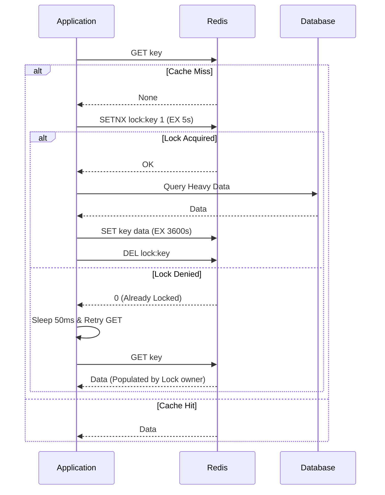
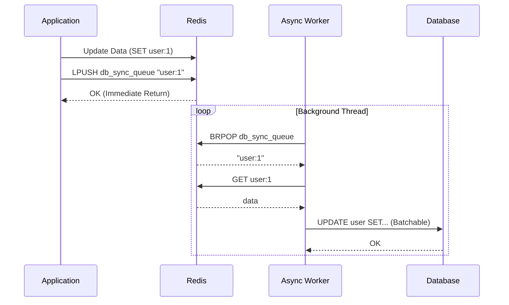

# Redis & Advanced Caching

## 1. Explain the differences between RDB and AOF persistence in Redis. When would you use each, or both together? <Badge type="warning" text="medium" />

::: details View Answer
**RDB (Redis Database):**
- Performs point-in-time snapshots of your dataset at specified intervals.
- **Pros:** Extremely compact single-file representation, perfect for backups and disaster recovery. Restarts are much faster with large datasets compared to AOF. Maximizes performance since the Redis parent process forks a child to handle the snapshotting, avoiding disk I/O in the main thread.
- **Cons:** You may lose minutes of data if Redis crashes between snapshots.

**AOF (Append Only File):**
- Logs every write operation received by the server. These logs can be replayed to reconstruct the dataset.
- **Pros:** Highly durable. You can configure it to `fsync` every second (default), losing at most 1 second of data, or on every query.
- **Cons:** The AOF file is significantly larger than RDB. Redis restarts are slower because it has to replay the entire log.

**When to use both:**
For production systems where data safety is critical, it is standard to enable both. Redis will use AOF for reconstruction on restart because it guarantees the most complete dataset. RDB is used for periodic backups and faster replication synchronization.
:::

## 2. What are the different eviction policies in Redis, and how do you choose the right one for an LRU cache vs. an LFU cache? <Badge type="warning" text="medium" />

::: details View Answer
When Redis reaches its `maxmemory` limit, it must evict keys to make room for new writes based on an eviction policy.

**Key Policies:**
- **`noeviction`:** Returns errors for write operations (default).
- **`allkeys-lru`:** Evicts the least recently used keys out of all keys.
- **`volatile-lru`:** Evicts the least recently used keys among those with an expiration set.
- **`allkeys-lfu` / `volatile-lfu`:** Evicts the least frequently used keys.
- **`allkeys-random` / `volatile-random`:** Evicts keys randomly.
- **`volatile-ttl`:** Evicts keys with the shortest time-to-live (TTL).

**Choosing the right one:**
- **LRU (Least Recently Used) vs LFU (Least Frequently Used):** LRU is great when recent access predicts future access (e.g., chronological news feeds). However, LRU fails to protect long-term popular items if a sudden burst of one-time reads occurs. LFU solves this by tracking the *frequency* of access over time, making it ideal for caching highly-accessed static assets or hot database rows, as temporary bursts won't flush out your truly popular data.
:::

## 3. What is a Cache Stampede (or Dogpile effect)? How do you mitigate it using Redis? <Badge type="danger" text="hard" />

::: details View Answer
A Cache Stampede occurs when a highly accessed, computationally expensive cache key expires. Suddenly, thousands of concurrent requests miss the cache simultaneously and hit the database directly, potentially bringing the entire system down.

**Mitigation Strategies:**
1. **Mutex Locks:** Only allow one process to reconstruct the cache using a lock (`SETNX`). Other processes wait and retry.
2. **Probabilistic Early Expiration (XFetch):** Background processes proactively refresh the cache *before* it expires based on a probability curve.
3. **Write-Behind / Background Refresh:** The cache never expires from the application's perspective; a cron/worker updates it asynchronously.

**Mermaid Flowchart: Mutex Lock Mitigation**


**Python `asyncio` Example:**
```python
import asyncio
import redis.asyncio as redis

async def get_data_safe(redis_client, key, db_fetch_func):
    data = await redis_client.get(key)
    if data: return data.decode('utf-8')

    lock_key = f"lock:{key}"
    # Try to acquire lock
    if await redis_client.set(lock_key, "1", nx=True, ex=5):
        try:
            data = await db_fetch_func()
            await redis_client.set(key, data, ex=3600)
            return data
        finally:
            await redis_client.delete(lock_key)
    else:
        # Wait for the other process to finish computing
        await asyncio.sleep(0.1)
        return await get_data_safe(redis_client, key, db_fetch_func)
```
:::

## 4. Compare Redis Sentinel with Redis Cluster. In what scenarios is one preferred over the other? <Badge type="warning" text="medium" />

::: details View Answer
**Redis Sentinel:**
- **Purpose:** High Availability (HA) for a single-primary setup.
- **Architecture:** Sentinels monitor the primary and replicas. If the primary fails, Sentinels elect a replica to become the new primary and update clients.
- **Data Sharding:** None. All data fits on a single node.
- **Use Case:** When your dataset fits entirely in the memory of a single machine, but you need automatic failover to prevent downtime.

**Redis Cluster:**
- **Purpose:** Horizontal Scaling (Sharding) + High Availability.
- **Architecture:** Data is automatically split across multiple primary nodes using a concept called Hash Slots (16,384 slots). Replicas provide HA. No separate Sentinel processes are needed; cluster nodes communicate via a gossip protocol.
- **Use Case:** When your dataset exceeds the RAM capacity of a single machine or you need to distribute CPU load for exceptionally high throughput.

**Summary:** Sentinel scales *reads* (via replicas) and provides HA. Cluster scales *reads, writes, and memory* by partitioning data.
:::

## 5. How do you implement a distributed lock in Redis? What is the Redlock algorithm and what are its potential pitfalls? <Badge type="danger" text="hard" />

::: details View Answer
A basic distributed lock in Redis is implemented using `SET key value NX PX 10000` (Set if Not eXists, with a TTL). The value must be a unique token (like a UUID) so that a client only deletes the lock if it currently owns it, usually done via a Lua script to ensure atomicity.

**The Redlock Algorithm:**
Created by Redis author Salvatore Sanfilippo, Redlock provides stronger guarantees for distributed systems using multiple independent Redis masters (e.g., 5 nodes).
1. Get current timestamp.
2. Try to acquire the lock sequentially in all N instances using the same key and random value, with a very short timeout.
3. Compute elapsed time. If the client locked the majority of nodes (>= 3) AND elapsed time < lock validity time, the lock is acquired.
4. If failed, unlock on ALL instances.

**Pitfalls & Criticisms (e.g., Martin Kleppmann's critique):**
- **Clock Drift:** Redlock relies heavily on physical wall-clock time being roughly synchronized across nodes. Large NTP jumps or clock drift can invalidate the safety guarantees.
- **Process Pauses:** If a client experiences a long Garbage Collection (GC) pause after acquiring the lock but before acting on the database, the lock might expire, another client acquires it, and when the GC pause ends, the first client incorrectly thinks it still holds the lock.
- **Fencing Tokens:** Redlock does not provide monotonically increasing fencing tokens natively, which are usually required to prevent split-brain writes in backend storage.

**Python Redlock Example:**
```python
from redlock import Redlock # third-party library

dlm = Redlock([
    {"host": "redis-node-1", "port": 6379, "db": 0},
    {"host": "redis-node-2", "port": 6379, "db": 0},
    {"host": "redis-node-3", "port": 6379, "db": 0},
])

my_lock = dlm.lock("critical_resource", 1000) # 1000ms TTL
if my_lock:
    try:
        # Perform critical operation
        pass
    finally:
        dlm.unlock(my_lock)
```
:::

## 6. What are the best practices for optimizing memory usage in Redis for a large-scale dataset? <Badge type="danger" text="hard" />

::: details View Answer
1. **Use Hashes for Object Grouping:** Instead of storing 1,000 separate keys `user:100:name`, `user:100:email`, store one Hash key `user:100` with fields `name` and `email`. Redis optimizes small Hashes using a memory-efficient `listpack` (formerly `ziplist`) encoding.
2. **Avoid Large Keys (Macro-keys):** Very large strings, sets, or lists can block the Redis event loop when deleted or serialized. Split them up.
3. **Use Bitmaps / HyperLogLog:** For analytics (like DAU tracking or unique visitors), these probabilistic/binary structures use fractions of a megabyte to track millions of records.
4. **Active Defragmentation:** Enable `activedefrag yes` in `redis.conf` (available in Redis 4+) to allow Redis to compact memory online, reducing fragmentation overhead caused by continuous allocations and deallocations.
5. **Optimize Key Names:** Using shorter key names (`u:100` instead of `user:account:identifier:100`) saves substantial memory when multiplied by millions of keys.
6. **Set Explicit Expirations:** Ensure ephemeral data has a TTL so memory naturally rotates.
:::

## 7. What is the difference between Redis Pub/Sub and Redis Streams? When should you use Streams over Pub/Sub or a dedicated message broker like Kafka? <Badge type="warning" text="medium" />

::: details View Answer
**Redis Pub/Sub:**
- **Delivery:** "Fire and forget." If a subscriber is not connected when a message is published, the message is permanently lost.
- **Persistence:** None. Messages are not stored in memory or on disk.
- **Use Case:** Real-time chat messaging, fast ephemeral notifications, live leaderboards.

**Redis Streams:**
- **Delivery:** Append-only log. Messages are persisted and have unique IDs. 
- **Consumer Groups:** Allows a group of clients to cooperate consuming a different portion of the same stream of messages (similar to Kafka Consumer Groups), complete with message acknowledgment (`XACK`) and claiming pending messages.
- **Use Case:** Event sourcing, reliable job queues, microservice communication.

**Streams vs Kafka:** Use Redis Streams when you already have Redis in your stack, need extreme low latency, and your event stream fits in memory (or you can comfortably trim it). Use Kafka for massive scale, permanent disk-based retention, and complex stream processing ecosystems.
:::

## 8. Explain Cache Penetration. How can Bloom Filters be used with Redis to prevent it? <Badge type="warning" text="medium" />

::: details View Answer
**Cache Penetration** occurs when a client continuously requests a key that does not exist in the cache *and* does not exist in the database (e.g., a malicious user requesting fake user IDs). Because the data is never found, it is never cached, causing every single request to bypass the cache and pound the database.

**Mitigation using Bloom Filters:**
A Bloom Filter is a highly space-efficient probabilistic data structure that can answer the question: *"Is this element in the set?"* with either *"No"* or *"Maybe"*.
1. Load all valid IDs into a Redis Bloom Filter (using the RedisStack/RedisBloom module).
2. Before querying the cache or DB, check the Bloom Filter.
3. If it says "No", immediately return a 404. The DB is completely protected.
4. If it says "Maybe", proceed to check the cache/DB.

**Python Example:**
```python
import redis
# Assuming Redis is running with the RedisBloom module
r = redis.Redis()

# Add a valid user during creation
r.bf().add("users_bloom", "user:123")

def get_user(user_id):
    # 1. Check Bloom Filter first
    if not r.bf().exists("users_bloom", user_id):
        return None # Prevented cache penetration!
    
    # 2. Check Cache
    # 3. Check DB...
```
*Note: A simpler alternative without modules is to cache the "null" result with a short TTL.*
:::

## 9. Explain Write-Through vs. Write-Behind (Write-Back) caching strategies. <Badge type="tip" text="easy" />

::: details View Answer
**Write-Through:**
The application writes data to the cache and the database synchronously in the same transaction.
- **Pros:** Data is always strictly consistent between cache and DB.
- **Cons:** Higher write latency because the application waits for two network hops.

**Write-Behind (Write-Back):**
The application writes data *only* to the cache and immediately returns success to the user. A background process asynchronously synchronizes the updated cache data to the database.
- **Pros:** Extremely low write latency and high throughput. DB writes can be batched.
- **Cons:** Risk of data loss if the cache node crashes before the background process flushes the data to the DB.

**Mermaid Flowchart: Write-Behind Strategy**

:::

## 10. What is Redis Pipelining? How does it differ from Redis Transactions? <Badge type="tip" text="easy" />

::: details View Answer
**Pipelining** is a networking optimization. Instead of sending a command, waiting for the reply, and then sending the next command, pipelining allows a client to send multiple commands to the server in a single batch without waiting for the individual replies. The server executes them and returns all replies in a single step.
- **Benefit:** Drastically reduces network latency (Round Trip Time).
- **Caveat:** It does *not* guarantee atomicity. Other clients' commands can interleave between your pipelined commands on the server.

**Transactions (`MULTI`/`EXEC`)** guarantee atomicity. Redis queues the commands and executes them sequentially. No other client can execute a command while an `EXEC` block is running.

**Python Example (Pipelining):**
```python
import redis
r = redis.Redis()

# Without pipeline: 10,000 network round trips
# With pipeline: 1 network round trip
pipe = r.pipeline()
for i in range(10000):
    pipe.set(f"key:{i}", i)
pipe.execute() # Sends all at once
```
:::

## 11. Why and how would you use Lua scripting in Redis? Provide an example of a race condition it solves. <Badge type="warning" text="medium" />

::: details View Answer
Redis embeds a Lua interpreter. When you send a Lua script to Redis via the `EVAL` command, Redis executes the entire script atomically. Because Redis is single-threaded for command execution, no other commands or scripts can run while a Lua script is executing.

**Why use it?**
To perform complex "Check-and-Set" (CAS) operations atomically without incurring multiple network round-trips or relying on optimistic locking (`WATCH`).

**Example Race Condition Solved:**
Imagine a rate limiter. You need to `GET` the current count, check if it's `< limit`, and if so, `INCR` it. In a highly concurrent environment, two clients might `GET` simultaneously, see it's under the limit, and both `INCR`, bypassing the limit.

**Lua Script Solution:**
```lua
local current = redis.call("GET", KEYS[1])
if current and tonumber(current) >= tonumber(ARGV[1]) then
    return 0 -- Rate limited
end
redis.call("INCR", KEYS[1])
redis.call("EXPIRE", KEYS[1], ARGV[2])
return 1 -- Allowed
```
Because this script runs atomically on the server, the race condition is mathematically impossible.
:::

## 12. Redis is often described as single-threaded. Is this completely true? How does Redis handle concurrent connections efficiently? <Badge type="warning" text="medium" />

::: details View Answer
Historically (up to Redis 5), Redis was strictly single-threaded for all network I/O and command execution. It handled concurrency efficiently using an **Event Loop with I/O Multiplexing** (e.g., `epoll` on Linux, `kqueue` on macOS). This allowed a single thread to monitor thousands of socket connections without blocking.

**Redis 6 and beyond:**
Redis introduced **Multi-threaded I/O**. Reading from client sockets and writing responses to client sockets (the most CPU-intensive parts of the networking layer) can now be delegated to multiple I/O threads.

However, **Command Execution remains strictly single-threaded**.
The workflow is:
1. I/O threads read and parse incoming commands concurrently.
2. The main thread executes the commands sequentially (preserving atomicity and avoiding the need for internal locks).
3. I/O threads write the responses back to the clients concurrently.

This hybrid approach drastically improves throughput while maintaining the deterministic, lock-free data structures that make Redis famous.
:::

## 13. How do HyperLogLog and Bitmaps work in Redis? Give real-world use cases for both. <Badge type="danger" text="hard" />

::: details View Answer
**HyperLogLog (HLL):**
- **How it works:** It uses a randomized probabilistic algorithm to estimate the cardinality (number of unique elements) of a set.
- **Key Feature:** Regardless of whether you count a thousand or a billion unique items, a Redis HLL uses a fixed maximum of **12 KB** of memory, with a standard error of ~0.81%.
- **Use Case:** Counting unique daily visitors to a massive website. Instead of storing a massive set of User IDs, you use `PFADD daily_visitors user_123`.

**Bitmaps:**
- **How it works:** Not a distinct data type, but a set of bit-oriented operations defined on the String type. It treats a String as an array of bits (1s and 0s).
- **Key Feature:** Extremely space-efficient for boolean data tied to sequential IDs. 1 million users take up roughly 122 KB.
- **Use Case:** Tracking Daily Active Users (DAU) or user streaks. You can represent day 1 as a key `dau:2023-10-01`, and if User ID 5400 logs in, you run `SETBIT dau:2023-10-01 5400 1`. You can then use `BITOP AND` across multiple days to find users active consecutively.
:::

## 14. What is the "Hot Key" problem in Redis? How can you detect and resolve it in a highly distributed system? <Badge type="danger" text="hard" />

::: details View Answer
**The Problem:**
In a Redis Cluster, data is sharded across multiple nodes. A "Hot Key" is a specific piece of data (e.g., a viral tweet's metadata or a flash-sale inventory count) that receives an overwhelmingly disproportionate amount of read or write traffic. Since a single key lives on a single shard, that specific Redis node's CPU or network becomes a bottleneck, while other nodes sit idle.

**Detection:**
- Redis 4+ provides the `redis-cli --hotkeys` tool (relies on the LFU eviction policy being enabled).
- Monitor node CPU/Network utilization skew.

**Resolutions:**
1. **Local App Caching:** The most effective defense. Applications cache the hot key in their own local memory (e.g., Guava, LRU cache in Python/Go) for a few seconds. This absorbs 99% of the reads before they ever hit Redis.
2. **Key Replication (Read-heavy):** Duplicate the key across the cluster by appending random suffixes (e.g., `item:99:1`, `item:99:2` up to `item:99:N`). Clients randomly pick one suffix to read from, distributing the load across `N` shards.
3. **Data Splitting (Write-heavy):** If it's a hot Hash or List, split its contents logically into smaller keys across different hash slots.
:::

## 15. What is a Cache Avalanche and how can you prevent it? <Badge type="warning" text="medium" />

::: details View Answer
**Cache Avalanche** occurs when a large number of cache keys expire at the exact same time, or if the Redis node itself crashes and restarts empty. This sudden lack of cached data forces all subsequent requests to hit the underlying database concurrently, causing the database to overload and fail.

**Differences from Cache Stampede:** Stampede is many requests for *one* expiring key. Avalanche is many requests for *many* expiring keys simultaneously.

**Mitigation:**
1. **TTL Jitter (Randomization):** Never set the exact same TTL for bulk data. Add a random jitter (e.g., `TTL = 3600 + random(0, 300)`). This smears out the expiration times.
2. **High Availability:** Use Redis Sentinel or Cluster to ensure a single node failure doesn't wipe out the cache.
3. **Graceful Degradation / Circuit Breakers:** If the DB is under heavy load, the application should fast-fail or return stale/default data rather than adding to the DB queue.
:::

## 16. How would you implement a sliding window rate limiter using Redis Sorted Sets? <Badge type="warning" text="medium" />

::: details View Answer
A Sliding Window rate limiter tracks the exact timestamps of requests to ensure a user doesn't exceed `N` requests in the last `M` seconds. A Redis Sorted Set (`ZSET`) is perfect for this, where the **score** is the timestamp.

**Algorithm:**
1. Remove all elements with a score (timestamp) older than `current_time - window_size`.
2. Count the remaining elements in the set.
3. If the count is `< limit`, add the current timestamp to the set and allow the request.
4. Set the TTL on the key to the window size to ensure clean up of inactive users.

**Python Example:**
```python
import time
import redis

r = redis.Redis()

def is_rate_limited(user_id, max_requests, window_seconds):
    now = time.time()
    key = f"rate_limit:{user_id}"
    window_start = now - window_seconds
    
    pipe = r.pipeline()
    # Remove older entries
    pipe.zremrangebyscore(key, 0, window_start)
    # Count current requests in the window
    pipe.zcard(key)
    # Add current request (value must be unique, so use timestamp string)
    pipe.zadd(key, {str(now): now})
    # Set expiry to prevent stale keys laying around
    pipe.expire(key, window_seconds)
    
    # Execute pipeline transactionally
    results = pipe.execute()
    current_requests = results[1] # Result of zcard
    
    return current_requests >= max_requests
```
:::

## 17. How do Redis Transactions (MULTI/EXEC) work? Explain the role of the WATCH command. <Badge type="warning" text="medium" />

::: details View Answer
Redis transactions are initiated with `MULTI` and concluded with `EXEC`. All commands issued in between are queued by the server. When `EXEC` is called, Redis processes the entire queue sequentially and atomically. 

*Important Caveat:* Redis transactions do not support rollbacks. If a command fails (e.g., performing a list operation on a string), the rest of the queue will still execute.

**The `WATCH` command (Optimistic Locking):**
Because Redis doesn't lock data during the `MULTI` queueing phase, another client could alter the data you are about to operate on. `WATCH` solves this by implementing Check-and-Set (CAS).

If you `WATCH key1`, and then enter a `MULTI` block, Redis monitors `key1`. If another client modifies `key1` before you call `EXEC`, your entire transaction will automatically abort (return null). The client application is responsible for catching this abort and retrying the transaction.
:::

## 18. Explain how Redis replication works. What happens during a network partition (Split-Brain) in a Sentinel setup, and how does Redis handle consistency? <Badge type="danger" text="hard" />

::: details View Answer
**Replication:**
Redis uses asynchronous replication. A primary node acknowledges a write to the client, and then asynchronously streams the write command to its replicas. This provides low latency but means there is a tiny window where a primary crash could lose acknowledged writes.

**Split-Brain Scenario:**
In a multi-AZ deployment, a network partition might isolate the current Primary (Node A) and a minority of Sentinels from the Replicas and the majority of Sentinels. 
1. The majority side detects Node A is unreachable and promotes a Replica (Node B) to Primary.
2. The isolated Node A still thinks it's Primary and continues accepting writes from clients trapped in its partition.
3. We now have two Primaries ("Split-Brain").
4. When the network heals, Node A is demoted to a Replica by Sentinel, and its local data is completely flushed and overwritten by Node B. **All writes accepted by Node A during the partition are lost.**

**Mitigation (Consistency vs Availability):**
You can configure `min-replicas-to-write 1` and `min-replicas-max-lag 10` on the primary. If the primary cannot communicate with at least 1 replica within 10 seconds, it will reject all write commands. In a split-brain, the isolated minority Primary will quickly stop accepting writes, heavily reducing data loss at the cost of write availability during the partition.
:::

## 19. How does Redis handle Geospatial data? What are some common commands used for building a location-based service? <Badge type="tip" text="easy" />

::: details View Answer
Redis natively supports Geospatial data. Under the hood, it stores this data inside a Sorted Set (`ZSET`), using a technique called **Geohashing** to encode 2D longitude and latitude coordinates into a 1D 52-bit integer score.

**Common Commands:**
- **`GEOADD key longitude latitude member`:** Adds a location (e.g., `GEOADD drivers -122.41 37.77 "Alice"`).
- **`GEODIST key member1 member2 [unit]`:** Returns the distance between two members.
- **`GEOSEARCH` / `GEORADIUS`:** Finds all members within a certain radius of a point, or inside a bounding box. Very fast for features like "Find drivers within 5km of my location."
:::

## 20. How would you migrate a large dataset to a Redis Cluster without experiencing application downtime? <Badge type="danger" text="hard" />

::: details View Answer
Live migration of databases requires careful orchestration. The standard "Dual Write" approach for zero-downtime migration involves:

1. **Setup:** Deploy the new Redis Cluster. The application is currently pointing strictly to the Old Redis.
2. **Dual Writes:** Update the application layer to write to *both* Old Redis and New Cluster simultaneously. Reads still come *only* from the Old Redis. (Errors on the New Cluster writes should be ignored so as not to affect users).
3. **Backfill / Sync:** Use a tool like **Redis-Shake** or **RIOT (Redis Input/Output Tools)** to sync the historical data from the Old Redis to the New Cluster. Since dual-writes are on, new data is kept fresh.
4. **Validation:** Run a background script to sample keys from both systems to verify data consistency.
5. **Switch Reads:** Update the application configuration to read from the New Cluster. Monitor error rates and latencies closely.
6. **Deprecate Old DB:** Stop writing to the Old Redis. Tear down the old infrastructure.

*Alternative approach:* Use an L4/L7 proxy (like Envoy or Twemproxy) to tee the traffic or handle the migration routing invisibly to the application.
:::
