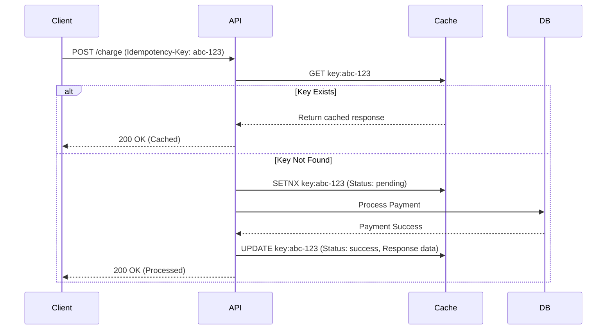
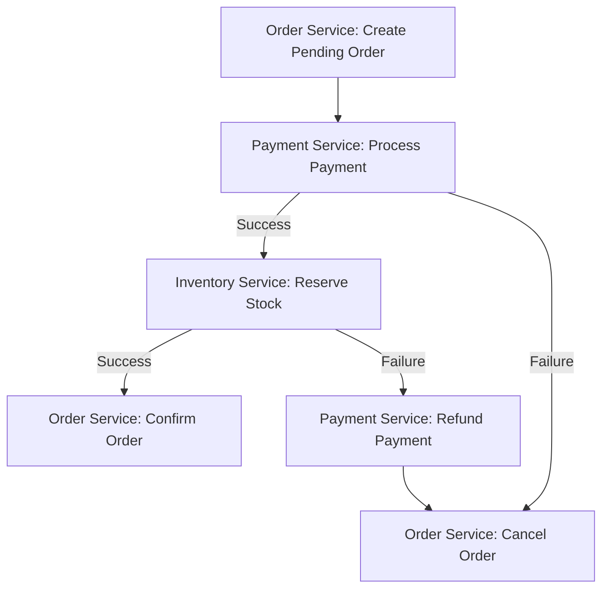

# Senior Backend & Architecture

## 1. What are the key differences between `asyncio`, `threading`, and `multiprocessing` in Python, and when would you use each? <Badge type="warning" text="medium" />

::: details View Answer
In Python, concurrency can be achieved through three primary paradigms, each suited for specific workloads due to the Global Interpreter Lock (GIL).

- **`threading`**: Uses OS-level threads. Suitable for I/O-bound tasks where the program spends time waiting for external events (e.g., network requests, file I/O). The GIL prevents multiple threads from executing Python bytecodes at once, making it ineffective for CPU-bound tasks.
- **`multiprocessing`**: Uses OS-level processes, each with its own Python interpreter and memory space, effectively bypassing the GIL. Suitable for CPU-bound tasks (e.g., heavy mathematical computations, image processing). It carries higher overhead for IPC (Inter-Process Communication) and memory.
- **`asyncio`**: A single-threaded, single-process concurrency model utilizing an event loop and coroutines. It relies on cooperative multitasking. Highly efficient for massively I/O-bound workloads (e.g., handling thousands of simultaneous WebSockets or HTTP connections) with low overhead.

**Example of `asyncio`:**
```python
import asyncio

async def fetch_data(id):
    await asyncio.sleep(1) # Simulating I/O
    return {"id": id, "data": "..."}

async def main():
    tasks = [fetch_data(i) for i in range(10)]
    results = await asyncio.gather(*tasks)
    print(results)

asyncio.run(main())
```
:::

## 2. How does the Global Interpreter Lock (GIL) impact Python's performance, and what are the strategies to overcome its limitations for CPU-bound tasks? <Badge type="danger" text="hard" />

::: details View Answer
The GIL is a mutex that protects access to Python objects, preventing multiple native threads from executing Python bytecodes concurrently. This makes CPython thread-safe but severely limits multi-threading for CPU-bound workloads.

**Strategies to overcome the GIL:**
1. **Multiprocessing**: Use `concurrent.futures.ProcessPoolExecutor` or the `multiprocessing` module to spawn separate processes.
2. **C Extensions**: Write CPU-intensive code in C/C++ or Rust (e.g., using PyO3 or Cython). The GIL can be released in C extensions using macros like `Py_BEGIN_ALLOW_THREADS` before the heavy computation and reacquired afterward.
3. **Alternative Interpreters**: Use PyPy (has a GIL, but JIT improves performance) or Jython/IronPython (no GIL, but lack full C-extension support). Note: PEP 703 aims to make the GIL optional in CPython (nogil).
4. **Data Science Libraries**: Libraries like NumPy and Pandas bypass the GIL for many vector operations because the underlying implementations are in C.
:::

## 3. Describe the process of profiling memory usage and detecting memory leaks in a large-scale Python application. <Badge type="danger" text="hard" />

::: details View Answer
Memory leaks in Python usually happen due to circular references that the garbage collector cannot clean up (especially in older Python versions or with custom `__del__` methods), module-level global variables accumulating data, or unclosed external resources.

**Profiling Process:**
1. **Identify the Leak**: Monitor the process memory using OS tools (`top`, `htop`, `psutil`) or metrics platforms (Prometheus/Grafana) to confirm RSS memory growth over time.
2. **Object Tracing (tracemalloc)**: Use the built-in `tracemalloc` module to take snapshots of memory allocations and compare them to see where memory is increasing.
   ```python
   import tracemalloc
   tracemalloc.start()
   # ... run application code ...
   snapshot1 = tracemalloc.take_snapshot()
   # ... run more code ...
   snapshot2 = tracemalloc.take_snapshot()
   top_stats = snapshot2.compare_to(snapshot1, 'lineno')
   for stat in top_stats[:5]:
       print(stat)
   ```
3. **Heap Analysis (objgraph / guppy3)**: Use `objgraph` to visualize the references keeping objects alive. Look for common culprits like growing global caches (`dict` or `list` in module scope).
4. **C-Level Leaks**: If the leak is in a C extension, use tools like `valgrind` or `jemalloc` profiling.
:::

## 4. Compare REST, gRPC, and GraphQL. In what scenarios would you choose one over the others for an inter-service communication architecture? <Badge type="warning" text="medium" />

::: details View Answer
- **REST**: Uses standard HTTP/1.1 methods, standard status codes, and typically JSON.
  - *Pros*: Universally understood, easy to cache, great for public APIs.
  - *Cons*: Over-fetching/under-fetching, lacks strict typing without OpenAPI schemas, bulky text payloads.
- **gRPC**: Uses HTTP/2 and Protocol Buffers (protobuf).
  - *Pros*: Strongly typed, binary serialization (highly compact and fast), supports bi-directional streaming, excellent for fast inter-service (backend-to-backend) communication.
  - *Cons*: Harder to debug (binary format), requires tooling to generate client/server stubs, browser support is limited (needs gRPC-Web).
- **GraphQL**: Provides a single endpoint for clients to query exactly the data they need.
  - *Pros*: Solves over-fetching/under-fetching, strongly typed schema, excellent for complex client applications (SPA, Mobile).
  - *Cons*: Hard to cache at the HTTP level, complex to implement efficiently (N+1 query problem).

**Selection:**
- Use **gRPC** for internal microservices where performance, strict contracts, and low latency are critical.
- Use **GraphQL** for client-facing aggregators (BFF - Backend For Frontend) where UI needs flexible data shapes.
- Use **REST** for public external APIs and simple CRUD services.
:::

## 5. How do you design an idempotent API in a distributed system, and why is it crucial for payment processing? <Badge type="danger" text="hard" />

::: details View Answer
Idempotency ensures that multiple identical requests yield the same result as a single request, preventing unintended side effects (e.g., charging a customer twice during network retries).

**Design Implementation:**
1. **Idempotency Key**: The client generates a unique ID (UUID) and sends it in an `Idempotency-Key` HTTP header.
2. **Key Storage**: The server checks an atomic, fast storage (like Redis) or a database with a unique constraint.
   - If the key exists and the transaction is complete, return the cached HTTP response.
   - If the key exists and is "in progress," return a `409 Conflict` or delay the response.
   - If the key doesn't exist, acquire a lock, store the key with "in progress" status, process the transaction, and update the status to "completed" with the result payload.


:::

## 6. What is the difference between database sharding and partitioning, and what are the challenges of implementing horizontal sharding? <Badge type="danger" text="hard" />

::: details View Answer
- **Partitioning (Vertical/Horizontal)**: Splitting a large table into smaller logical pieces *within the same database instance*. For example, partitioning by date (one partition per month). It improves query performance but doesn't scale compute or storage beyond a single machine.
- **Sharding**: A form of horizontal partitioning where data is distributed across *multiple independent database instances/nodes*.

**Challenges of Sharding:**
1. **Choosing a Shard Key**: Critical for evenly distributing the load (avoiding "hot shards"). E.g., sharding by tenant_id or user_id.
2. **Cross-Shard Joins**: SQL joins across shards are notoriously difficult and slow. You often have to perform joins at the application layer.
3. **Distributed Transactions**: Maintaining ACID properties across shards requires complex coordination like Two-Phase Commit (2PC), which degrades performance.
4. **Resharding**: When shards fill up, rebalancing data without downtime is extremely complex.
:::

## 7. Explain different distributed caching strategies (Cache-aside, Read-through, Write-through, Write-behind). Which would you use for a read-heavy vs write-heavy system? <Badge type="warning" text="medium" />

::: details View Answer
- **Cache-Aside (Lazy Loading)**: Application code checks the cache. If a miss, it queries the DB, updates the cache, and returns the data. Best for general-purpose, read-heavy workloads.
- **Read-Through**: Application queries the cache. If a miss, the cache provider (not the app code) fetches from the DB, caches it, and returns. Good for read-heavy systems, simplifies app code.
- **Write-Through**: Application writes data to the cache, and the cache synchronously writes to the DB. Guarantees consistency but adds write latency. Good for read-heavy, write-infrequent systems where strict consistency is needed.
- **Write-Behind (Write-Back)**: Application writes to the cache, and the cache asynchronously writes to the DB. Best for write-heavy systems (can batch writes), but carries the risk of data loss if the cache node crashes before flushing to the DB.
:::

## 8. In a Microservices architecture, how do you handle distributed transactions without Two-Phase Commit (2PC)? Explain the Saga pattern. <Badge type="danger" text="hard" />

::: details View Answer
2PC is blocking and scales poorly in microservices. The **Saga pattern** manages distributed transactions through a sequence of local transactions.

If a local transaction fails, the Saga executes **compensating transactions** to undo the changes made by the preceding transactions.

**Types of Sagas:**
1. **Choreography**: Services publish and subscribe to domain events without a central coordinator.
2. **Orchestration**: A central orchestrator service tells the participants what local transactions to execute.


:::

## 9. How would you design a CI/CD pipeline for zero-downtime deployments of a Python backend service? <Badge type="warning" text="medium" />

::: details View Answer
A modern CI/CD pipeline ensuring zero downtime involves thorough testing and strategic deployment patterns (like Blue-Green or Canary).

**Pipeline Steps:**
1. **Continuous Integration (CI)**:
   - Linting (flake8, black) and type checking (mypy).
   - Unit tests and integration tests via `pytest`.
   - Security scanning (bandit, safety).
   - Docker image build and push to container registry.
2. **Continuous Deployment (CD)**:
   - Use Kubernetes or AWS ECS.
   - **Database Migrations**: Must be backward compatible. Add columns first, deploy code using new columns, then drop old columns in a subsequent deployment. Run migrations as a pre-deploy hook.
   - **Rolling Updates or Blue-Green Deployment**: Spin up new pods (Green). Wait for health checks to pass. Shift traffic incrementally or switch the load balancer from Blue to Green. Terminate Blue pods gracefully (draining existing connections).
:::

## 10. How does a blocking call affect an `asyncio` event loop, and how can you mitigate it? <Badge type="danger" text="hard" />

::: details View Answer
The `asyncio` event loop runs in a single thread. If a blocking call (like `time.sleep()`, `requests.get()`, or a heavy CPU computation) is executed, it halts the entire event loop. No other asynchronous tasks can make progress while the blocking call runs.

**Mitigation:**
1. **Use async libraries**: Replace blocking I/O with async equivalents (e.g., `aiohttp` instead of `requests`, `asyncpg` instead of `psycopg2`).
2. **Run in Executor**: Offload blocking I/O or CPU-bound tasks to a thread pool or process pool using `loop.run_in_executor()`.

```python
import asyncio
import time

def blocking_io():
    time.sleep(2) # Blocking call
    return "Result"

async def main():
    loop = asyncio.get_running_loop()
    # Offload to the default ThreadPoolExecutor
    result = await loop.run_in_executor(None, blocking_io)
    print(result)

asyncio.run(main())
```
:::

## 11. What is the Circuit Breaker pattern, and how does it prevent cascading failures in microservices? <Badge type="warning" text="medium" />

::: details View Answer
When a downstream service is struggling (high latency or timeouts), continuously sending it traffic will exhaust upstream resources (threads, connection pools) and potentially kill the upstream service, leading to cascading failures.

The **Circuit Breaker** acts as a proxy:
1. **Closed State**: Normal operation. Requests flow through. If failures cross a threshold, the circuit trips to Open.
2. **Open State**: Requests fail immediately (returning a fallback response or error) without calling the downstream service, giving it time to recover.
3. **Half-Open State**: After a timeout, a limited number of test requests are allowed through. If they succeed, the circuit closes. If they fail, it reopens.
:::

## 12. Explain race conditions in Python multi-threading despite the GIL. How do you prevent them? <Badge type="warning" text="medium" />

::: details View Answer
The GIL ensures only one thread executes Python bytecode at a time, but it can switch between threads between bytecodes. Operations like `a += 1` are not atomic; they translate to multiple bytecodes (load `a`, add `1`, store `a`).

If a context switch happens after loading but before storing, two threads might read the same value, increment it, and store it, resulting in a lost update (race condition).

**Prevention:**
Use thread-synchronization primitives provided by the `threading` module, such as `Lock`.

```python
import threading

counter = 0
lock = threading.Lock()

def increment():
    global counter
    with lock: # Acquires the lock, ensuring atomicity
        counter += 1
```
:::

## 13. How would you design a scalable Rate Limiter for a public API? <Badge type="danger" text="hard" />

::: details View Answer
A rate limiter protects APIs from abuse and enforces usage tiers.

**Algorithms:**
- **Token Bucket**: Tokens are added to a bucket at a fixed rate. Each request consumes a token. Allows bursts.
- **Sliding Window Log / Counter**: Tracks timestamps or counters in a rolling time window. More precise but memory intensive.

**Architecture:**
- **Storage**: Redis is standard due to high speed and atomic operations (e.g., `INCR`, `EXPIRE`).
- **Distributed Context**: Use Redis Cluster if traffic is extremely high. To avoid race conditions in Redis, use Lua scripts to evaluate the rate limit logic atomically.
:::

## 14. What are the best practices for handling long-running asynchronous tasks (e.g., report generation) in a Python web application? <Badge type="warning" text="medium" />

::: details View Answer
Running long tasks within the HTTP request-response cycle blocks worker threads (e.g., in Gunicorn) and causes client timeouts.

**Best Practices:**
1. **Message Broker**: Use tools like Celery or RQ paired with RabbitMQ or Redis.
2. **Workflow**:
   - Client sends POST request.
   - API publishes a message to the broker and returns a `202 Accepted` with a `Task ID`.
   - A background worker consumes the message and processes the task, updating the status in a database/cache.
   - Client polls a `/status/{task_id}` endpoint (or receives a WebSocket/Webhook push) to get the result.
3. **Failure Handling**: Implement retries with exponential backoff and Dead Letter Queues (DLQ) for failed jobs.
:::

## 15. How does Protocol Buffers (Protobuf) serialize data compared to JSON, and why is it faster? <Badge type="danger" text="hard" />

::: details View Answer
**JSON** is text-based. Field names are repeatedly serialized as strings (e.g., `{"user_id": 123}`). It requires parsing text, handling encoding, and allocating dynamic memory.

**Protobuf** is a binary format.
1. **Schema-driven**: It uses a `.proto` file defining message structures.
2. **Tag/Value mapping**: Field names are not sent over the wire. Instead, fields are mapped to numerical tags (defined in the schema).
3. **Varint Encoding**: Integers are compressed using variable-length encoding (small numbers take 1 byte instead of 4 or 8).
4. **Parsing speed**: Parsing binary data is mechanically simpler (reading exact bytes into known typed structs) than lexing and parsing JSON strings.

This makes Protobuf payloads significantly smaller and parsing an order of magnitude faster.
:::

## 16. What is the N+1 query problem in GraphQL, and how does the DataLoader pattern solve it? <Badge type="danger" text="hard" />

::: details View Answer
**The Problem:**
In GraphQL, resolvers execute hierarchically. If querying a list of 10 `Users`, and requesting each user's `Posts`, the execution might look like:
1. `SELECT * FROM users LIMIT 10` (1 query)
2. Iterate through 10 users, calling the `posts` resolver for each: `SELECT * FROM posts WHERE user_id = ?` (10 queries)
Total = 1 + 10 = 11 queries. For large lists, this destroys database performance.

**The Solution: DataLoader:**
A DataLoader acts as an in-memory batching and caching layer per request.
Instead of querying the DB immediately in the `posts` resolver, it *loads* the `user_id` into the DataLoader. The DataLoader waits for the event loop's next tick (using promises/asyncio), batches all collected `user_id`s, and executes a *single* query:
`SELECT * FROM posts WHERE user_id IN (1, 2, ..., 10)`
It then maps the results back to the individual promises. Result: 2 queries instead of 11.
:::

## 17. Compare Uvicorn, Gunicorn, and ASGI vs WSGI. <Badge type="warning" text="medium" />

::: details View Answer
- **WSGI (Web Server Gateway Interface)**: The synchronous standard for Python web apps (Django, Flask). Processes one request at a time per worker thread/process.
- **ASGI (Asynchronous Server Gateway Interface)**: The modern standard supporting async/await (FastAPI, Starlette). Can handle multiple concurrent connections on a single thread (ideal for WebSockets and Long Polling).
- **Gunicorn**: A robust WSGI HTTP server and process manager. It pre-forks worker processes to handle incoming requests.
- **Uvicorn**: A lightning-fast ASGI server built on `uvloop` and `httptools`.

**Production Setup**: Uvicorn alone lacks robust process management (like respawning dead workers). The standard practice is to use **Gunicorn as a process manager with Uvicorn worker classes**:
`gunicorn -k uvicorn.workers.UvicornWorker main:app`
:::

## 18. What is Consistent Hashing, and how does it solve scaling issues in distributed caches like Redis Cluster? <Badge type="danger" text="hard" />

::: details View Answer
If you use standard modulo hashing (`hash(key) % N`) to distribute cache keys across `N` nodes, adding or removing a node changes `N`. This completely alters the modulo result for nearly all keys, causing a massive cache miss and overwhelming the database.

**Consistent Hashing:**
1. Maps both nodes and keys to a conceptual "hash ring" (e.g., an integer space from 0 to $2^{32}-1$).
2. A key is assigned to the first node encountered by moving clockwise around the ring.
3. If a node is added or removed, only the keys mapping to that specific segment of the ring are reassigned. The rest of the keys remain on their existing nodes.
4. **Virtual Nodes**: To ensure even distribution, each physical node is represented by multiple "virtual nodes" scattered across the ring.
:::

## 19. Why is Connection Pooling essential for database performance, especially in highly concurrent `asyncio` applications? <Badge type="danger" text="hard" />

::: details View Answer
Establishing a TCP connection, completing the TLS handshake, and authenticating with a database (like PostgreSQL) is an expensive and slow operation.

**Why pooling is critical:**
1. **Reusability**: A pool maintains open connections. An app borrows a connection, executes a query, and returns it to the pool, skipping the setup overhead.
2. **Resource Limits**: Databases have finite memory and process limits for connections. A pool bounds the maximum number of concurrent connections the app can open.

**In `asyncio`:**
With asynchronous frameworks (like FastAPI), thousands of concurrent requests can be active. If each request opened a DB connection, the database would crash from connection exhaustion. Using an async pool (like `asyncpg` pool or SQLAlchemy's `AsyncEngine` with QueuePool) ensures requests queue up and wait for an available connection rather than overwhelming the database.
:::

## 20. How do you implement robust Dependency Injection (DI) in Python backend applications? <Badge type="warning" text="medium" />

::: details View Answer
Dependency Injection decouples object creation from object usage, making code highly testable and modular.

**Implementation Strategies:**
1. **Constructor Injection (Manual)**: Passing dependencies as arguments to classes/functions.
   ```python
   class UserService:
       def __init__(self, db_repo):
           self.db_repo = db_repo
   ```
2. **Framework Built-ins**: FastAPI has a powerful, natively async DI system via `Depends()`. It handles resolving dependencies, executing them, and caching them per-request.
   ```python
   @app.get("/users/")
   def get_users(db: Session = Depends(get_db)): ...
   ```
3. **External Libraries**: For frameworks like Django or large Python apps, libraries like `Dependency Injector` or `injector` provide inversion of control (IoC) containers. You wire up dependencies in a container, allowing easy swapping of implementations (e.g., injecting a `MockDB` during testing).
:::
