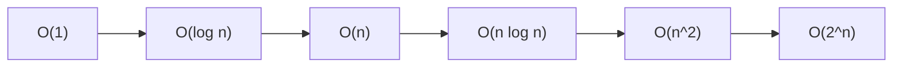
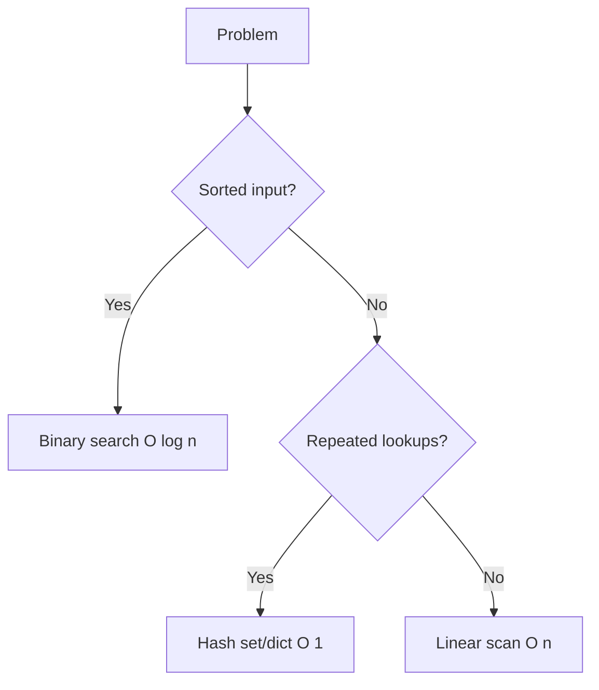
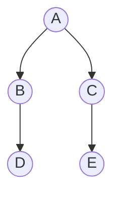

# Algorithms & Complexity

> Learn to reason about Big-O, pick the right data structure, traverse graphs with DFS/BFS, and implement the classics — linked-list reversal, binary search, and an LRU cache.

## Mental model

An algorithm is a recipe; Big-O is the label telling you how the recipe scales when the kitchen gets ten times bigger. You almost never care about raw seconds — you care about *growth*. Doubling the input might add a constant, double the work, or square it. Knowing which lets you predict whether your code survives production data.



Read that left-to-right as "increasingly painful." The art is matching a problem to the cheapest curve a correct solution allows.



## Core concepts

### Big-O notation

Big-O describes how time or space grows with input size `n`, dropping constants and lower-order terms so you can compare algorithms independent of hardware. A loop over `n` items is O(n); a nested loop is O(n²); halving the search space each step is O(log n).

```python
def has_duplicate_slow(items):     # O(n^2): compare every pair
    for i in range(len(items)):
        for j in range(i + 1, len(items)):
            if items[i] == items[j]:
                return True
    return False

def has_duplicate_fast(items):     # O(n): one pass, hash-set membership
    seen = set()
    for x in items:
        if x in seen:              # O(1) average
            return True
        seen.add(x)
    return False

print(has_duplicate_fast([1, 2, 3, 2]))   # => True
```

Both are correct; only the second scales. Trading O(n) extra memory for an O(n²) → O(n) speedup is a classic move.

::: tip
When asked to "make it faster," your first instinct should be: *can a hash set or dict turn an O(n) inner search into O(1)?*
:::

### Searching and sorting complexities

| Algorithm | Time | Notes |
| --- | --- | --- |
| Linear search | O(n) | unsorted data |
| Binary search | O(log n) | requires sorted data |
| Bubble / insertion / selection | O(n²) | teaching sorts |
| Merge sort / heap sort | O(n log n) | stable (merge) |
| Quicksort | O(n log n) avg, O(n²) worst | in-place, fast constants |
| Timsort (Python's) | O(n log n) | adaptive, stable, real-world fast |

Binary search repeatedly discards half the remaining range:

```python
def binary_search(arr, target):       # arr must be sorted
    lo, hi = 0, len(arr) - 1
    while lo <= hi:
        mid = (lo + hi) // 2
        if arr[mid] == target:
            return mid
        if arr[mid] < target:
            lo = mid + 1
        else:
            hi = mid - 1
    return -1

print(binary_search([2, 4, 6, 8, 10], 8))   # => 3
```

### Recursion vs iteration

Recursion mirrors naturally recursive problems (trees, divide-and-conquer) and reads cleanly, but each call consumes a stack frame. Python has **no tail-call optimization** and a recursion limit around 1000, so deep linear recursion overflows. Iteration is usually more memory-efficient and often faster.

```python
def factorial_rec(n):           # elegant, but O(n) stack depth
    return 1 if n <= 1 else n * factorial_rec(n - 1)

def factorial_iter(n):          # O(1) extra space, no stack risk
    result = 1
    for i in range(2, n + 1):
        result *= i
    return result

print(factorial_rec(5), factorial_iter(5))   # => 120 120
```

::: warning
`factorial_rec(2000)` raises `RecursionError`. For deep or linear work, prefer the iterative form (or raise the limit only as a deliberate, last resort).
:::

### Reversing a linked list

A staple interview question. Walk the list once, re-pointing each node's `next` to its predecessor — O(n) time, O(1) space.

```python
class Node:
    def __init__(self, val, nxt=None):
        self.val, self.next = val, nxt

def reverse(head):
    prev = None
    while head:
        head.next, prev, head = prev, head, head.next   # re-point, advance
    return prev   # new head

# Build 1 -> 2 -> 3, then reverse:
head = Node(1, Node(2, Node(3)))
node = reverse(head)
out = []
while node:
    out.append(node.val); node = node.next
print(out)   # => [3, 2, 1]
```

The tuple assignment captures all old values before any rebinding, which is what makes the one-liner safe.

### DFS vs BFS

Both visit every reachable node once — **O(V + E)** for `V` vertices and `E` edges — but in different orders.



- **DFS** (stack / recursion) dives deep before backtracking. Use it for path existence, cycle detection, and topological sort; it uses less memory on wide-but-shallow graphs.
- **BFS** (queue) explores level by level, so it finds the **shortest path in an unweighted graph**.

```python
from collections import deque

graph = {"A": ["B", "C"], "B": ["D"], "C": ["E"], "D": [], "E": []}

def bfs(graph, start):
    seen, q, order = {start}, deque([start]), []
    while q:
        node = q.popleft()         # FIFO -> level order
        order.append(node)
        for nxt in graph[node]:
            if nxt not in seen:
                seen.add(nxt)
                q.append(nxt)
    return order

def dfs(graph, start, seen=None, order=None):
    seen = seen or set(); order = order if order is not None else []
    seen.add(start); order.append(start)
    for nxt in graph[start]:
        if nxt not in seen:
            dfs(graph, nxt, seen, order)
    return order

print(bfs(graph, "A"))   # => ['A', 'B', 'C', 'D', 'E']
print(dfs(graph, "A"))   # => ['A', 'B', 'D', 'C', 'E']
```

The `seen` set is non-negotiable — without it, any cycle loops forever.

### An LRU cache

"Least Recently Used" eviction needs O(1) get *and* put while tracking recency. An `OrderedDict` does both: `move_to_end` marks a key fresh, and `popitem(last=False)` evicts the oldest.

```python
from collections import OrderedDict

class LRUCache:
    def __init__(self, capacity):
        self.cap = capacity
        self.cache = OrderedDict()

    def get(self, key):
        if key not in self.cache:
            return -1
        self.cache.move_to_end(key)        # mark most-recently-used
        return self.cache[key]

    def put(self, key, value):
        if key in self.cache:
            self.cache.move_to_end(key)
        self.cache[key] = value
        if len(self.cache) > self.cap:
            self.cache.popitem(last=False)  # evict least-recently-used

lru = LRUCache(2)
lru.put(1, "a"); lru.put(2, "b")
lru.get(1)              # touch key 1 so 2 becomes oldest
lru.put(3, "c")        # capacity exceeded -> evict key 2
print(lru.get(2))      # => -1  (evicted)
print(lru.get(1))      # => a
```

::: tip
For pure function memoization you don't need to write any of this — `@functools.lru_cache(maxsize=128)` gives you the same eviction policy for free.
:::

## Common pitfalls

- **Forgetting the `visited` set in graph traversal** turns cycles into infinite loops.
- **Deep recursion without a base case (or beyond ~1000 frames)** raises `RecursionError`; convert to iteration.
- **Binary search on unsorted data** silently returns wrong answers — the precondition is sorted input.
- **Confusing average and worst case** — quicksort is O(n log n) on average but O(n²) on adversarial pivots.
- **Counting hidden costs**: `x in a_list` inside a loop is an O(n) operation, making the loop O(n²). Swap to a set.
- **Premature optimization** — measure first; an O(n²) loop over 50 items is fine.

## Best practices

- State the Big-O of your solution out loud before coding; it guides the data-structure choice.
- Reach for `set`/`dict` to collapse repeated O(n) lookups into O(1).
- Prefer built-ins (`sorted`, `bisect`, `heapq`, `functools.lru_cache`) — they are C-fast and battle-tested.
- Use BFS for shortest paths in unweighted graphs, DFS for reachability and ordering.
- Default to iteration in Python; reserve recursion for genuinely recursive, bounded-depth problems.

## Interview quick-reference

| Concept | What to remember |
| --- | --- |
| Big-O ordering | O(1) < O(log n) < O(n) < O(n log n) < O(n²) < O(2ⁿ) |
| Linear vs binary search | O(n) any data vs O(log n) sorted only |
| Sort complexities | n² teaching sorts; n log n for merge/heap/Timsort |
| Quicksort | n log n average, n² worst case |
| Recursion limit | ~1000 frames, no TCO — prefer iteration when deep |
| Reverse linked list | re-point `next` each node, O(n)/O(1) |
| DFS | stack/recursion; paths, cycles, topo-sort |
| BFS | queue; shortest path in unweighted graphs |
| Graph traversal cost | O(V + E), needs a `visited` set |
| LRU cache | `OrderedDict` + `move_to_end` + `popitem(last=False)`, O(1) |
