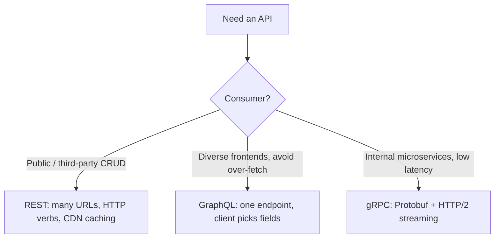

# API Paradigms: REST, GraphQL & gRPC

> Understand the three dominant API styles — their data models, error handling, caching, and the heuristics for choosing between them — with runnable Python for each.

## Mental model

Three paradigms answer the same question — "how do two programs exchange data?" — with different trade-offs. **REST** exposes many resource URLs over HTTP and leans on HTTP semantics. **GraphQL** exposes one endpoint and lets the *client* shape the response. **gRPC** uses binary Protobuf over HTTP/2 for fast, strongly-typed server-to-server calls.



A useful lens is the **Richardson Maturity Model** for REST: Level 0 (one URI, HTTP as tunnel), Level 1 (resources), Level 2 (proper verbs + status codes — where most "REST" APIs live), Level 3 (HATEOAS hypermedia links).

## Core concepts

### REST with FastAPI and validation

FastAPI turns Python type hints + Pydantic into automatic validation, serialisation, and OpenAPI docs. Invalid bodies get a `422` for free.

```python
from fastapi import FastAPI, HTTPException
from pydantic import BaseModel, EmailStr

app = FastAPI()

class UserCreate(BaseModel):
    username: str
    email: EmailStr      # validated as an email automatically
    age: int

@app.post("/users/", status_code=201)
async def create_user(user: UserCreate):
    if user.age < 18:                      # business rule -> 400
        raise HTTPException(400, "User must be an adult.")
    return {"message": "created", "data": user.model_dump()}
# POST a bad email => 422 Unprocessable Entity (Pydantic), no handler code needed
```

### HATEOAS and why it is usually skipped

Level-3 REST embeds links telling the client what it can do next.

```python
def order_response(order_id: int, status: str) -> dict:
    return {
        "orderId": order_id,
        "status": status,
        "links": [
            {"rel": "self",   "href": f"/orders/{order_id}"},
            {"rel": "cancel", "href": f"/orders/{order_id}/cancel"},
        ],
    }
print(order_response(123, "pending")["links"][1]["rel"])  # => cancel
```

Most teams omit it: frontend clients hard-code routes anyway, links bloat every payload, and OpenAPI gives an out-of-band contract that makes in-band discovery redundant.

### GraphQL: one endpoint, three phases

A GraphQL request is **parsed** into an AST, **validated** against the schema, then **executed** by walking the tree and calling a resolver per field.


```python
import graphene

class Query(graphene.ObjectType):
    hello = graphene.String(name=graphene.String(default_value="world"))

    def resolve_hello(root, info, name):   # one resolver per field
        return f"Hello {name}"

schema = graphene.Schema(query=Query)
result = schema.execute('{ hello(name: "Ada") }')
print(result.data)        # => {'hello': 'Hello Ada'}
print(result.errors)      # => None
```

### The N+1 problem and DataLoader

Asking for 100 posts and each post's author triggers 1 + 100 queries. A **DataLoader** batches the per-author lookups into one query per event-loop tick.

```python
from aiodataloader import DataLoader

class UserLoader(DataLoader):
    async def batch_load_fn(self, keys):
        # Runs ONCE per batch: SELECT * FROM users WHERE id IN (keys)
        users = await db.get_users_by_ids(keys)          # pseudo-db
        by_id = {u.id: u for u in users}
        # Must return results in the SAME order as keys
        return [by_id.get(k) for k in keys]

# In a resolver: return await info.context["user_loader"].load(parent.author_id)
```

### Protecting GraphQL from abusive queries

Because the client picks the shape, deeply nested or aliased queries can DoS the server. Defend with depth limiting, query-cost analysis, mandatory pagination, and **persisted queries** (clients send a hash of a pre-approved query).

```python
def query_depth(selection_set, current=1):
    """Reject queries deeper than a threshold before executing them."""
    depths = [current]
    for field in getattr(selection_set, "selections", []):
        if getattr(field, "selection_set", None):
            depths.append(query_depth(field.selection_set, current + 1))
    return max(depths)

MAX_DEPTH = 5  # reject user -> posts -> comments -> author -> posts -> ...
```

### gRPC: Protobuf, HTTP/2, four call types

gRPC serialises with Protobuf (binary, schema-driven) over HTTP/2, whose **multiplexing** runs many concurrent RPCs over one TCP connection. It supports four method shapes:

```python
# Conceptual signatures generated from a .proto file:
def GetUser(request, context): ...                 # 1. Unary  (req -> resp)
def ListUsers(request, context): yield ...          # 2. Server streaming (req -> resp*)
def Upload(request_iterator, context): ...          # 3. Client streaming (req* -> resp)
def Chat(request_iterator, context):                # 4. Bidirectional (req* <-> resp*)
    for msg in request_iterator:
        yield reply(text=f"echo: {msg.text}")
```

Protobuf is faster than JSON because the payload carries numbered tags (not string keys), parses in binary by fixed offset (no character-by-character scanning), and uses pre-compiled accessors instead of runtime reflection.

::: warning Load balancing gRPC
A single persistent HTTP/2 connection multiplexes everything, so an L4 (TCP) load balancer pins all of one client's RPCs to one backend. Use an L7 proxy (Envoy/Nginx) or client-side load balancing to spread requests.
:::

### Error handling, compared

```python
# REST    -> HTTP status code + JSON body:   404 {"error": "not found"}
# GraphQL -> always 200; errors in payload:   {"data": {...}, "errors": [...]}
# gRPC    -> grpc-status trailer code:        StatusCode.NOT_FOUND
```

GraphQL's always-`200` lets it return partial data alongside an `errors` array; gRPC offers 16 canonical codes plus `google.rpc.Status` for rich detail.

## Common pitfalls

- **Auth inside GraphQL resolvers.** Authenticate in middleware *before* execution and inject the `user` into context; delegate authorization to the domain layer.
- **Caching GraphQL like REST.** A single `POST /graphql` endpoint defeats CDN/HTTP caching. Use normalized client caches (Apollo) or persisted queries over `GET` for CDN-cacheable responses.
- **Forgetting Protobuf field order.** DataLoader batches and Protobuf both rely on order; return results aligned to the input keys.
- **gRPC behind a naive L4 balancer.** Load looks "stuck" on one pod — switch to L7 or client-side balancing.
- **GraphQL without query limits.** No depth/cost cap is an open DoS vector.

## Best practices

- Default to **REST** for public CRUD where HTTP caching matters.
- Use **GraphQL** as a Backend-for-Frontend aggregator when clients have wildly different data needs.
- Use **gRPC** for internal, high-throughput, strongly-typed, or streaming service-to-service calls.
- Add gRPC **interceptors** (middleware) for auth, logging, metrics, and retries.
- Batch N+1 access with DataLoader; bound every GraphQL list with pagination.
- Keep error contracts consistent within each paradigm.

## Interview quick-reference

| Topic | Key point |
| --- | --- |
| Richardson model | L0 tunnel, L1 resources, L2 verbs+codes, L3 HATEOAS |
| Idempotency key | Makes retried POSTs safe (payments) |
| HATEOAS skipped | Client complexity, payload bloat, OpenAPI replaces it |
| GraphQL phases | Parse -> Validate -> Execute (resolver per field) |
| N+1 fix | DataLoader batches keys into one query per tick |
| GraphQL defense | Depth limit, cost analysis, pagination, persisted queries |
| Protobuf speed | numbered tags, binary parse, precompiled accessors |
| HTTP/2 multiplexing | many RPC streams over one TCP connection |
| gRPC method types | unary, server-stream, client-stream, bidirectional |
| gRPC load balancing | L7 proxy or client-side (L4 pins to one pod) |
| Error models | REST=status, GraphQL=errors[]+200, gRPC=status code |
| Choose | REST public CRUD, GraphQL BFF, gRPC internal/streaming |
