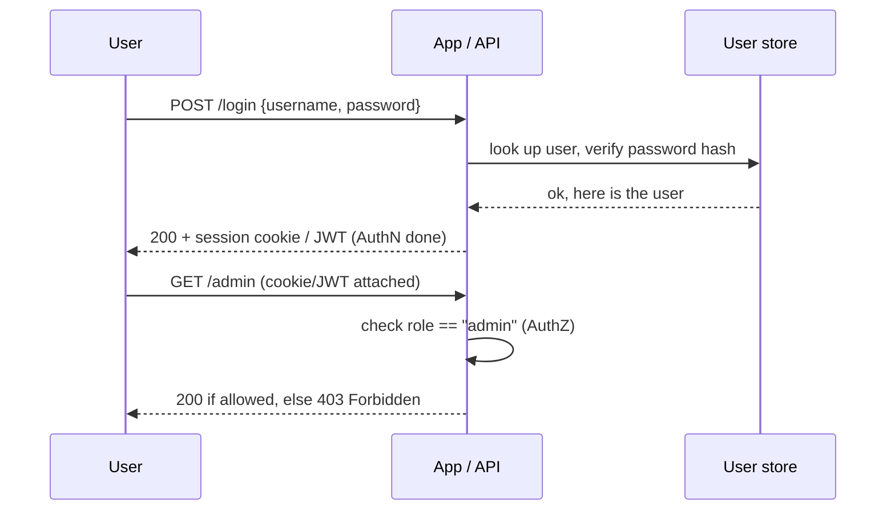
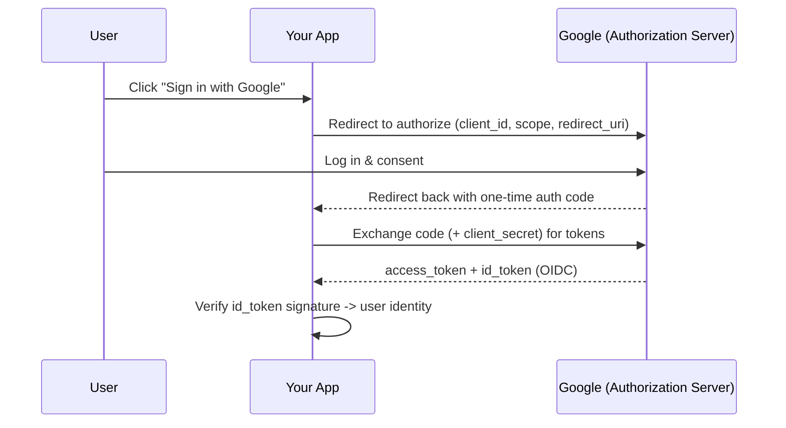

# Authentication & Authorization

> Learn the difference between proving identity and granting access, and how sessions, cookies, JWTs, OAuth 2.0, and OpenID Connect fit together — with runnable Python.

## Mental model

Two words that sound alike but mean different things:

- **Authentication (AuthN)** — *who are you?* Verifying identity with a credential (password, token, biometric).
- **Authorization (AuthZ)** — *what may you do?* Checking permissions for an already-identified user.

AuthN always comes first; AuthZ builds on its result.



## Core concepts

### Storing passwords (never plaintext)

Authentication starts with credentials you must store safely. Hash passwords with a slow, salted algorithm like bcrypt — never store or compare plaintext.

```python
import bcrypt

def hash_password(plain: str) -> bytes:
    # bcrypt generates a random salt and embeds it in the hash
    return bcrypt.hashpw(plain.encode(), bcrypt.gensalt())

def verify(plain: str, hashed: bytes) -> bool:
    return bcrypt.checkpw(plain.encode(), hashed)

stored = hash_password("correct horse battery staple")
print(verify("wrong", stored))                      # => False
print(verify("correct horse battery staple", stored))  # => True
```

::: danger
Never roll your own crypto, never store plaintext, and use a constant-time comparison (bcrypt's `checkpw` already does). Fast hashes like MD5/SHA-256 are *wrong* for passwords — they are too fast to brute-force-resist.
:::

### Sessions and cookies (stateful)

The server stores session state and hands the client a session **ID** in a cookie. The browser returns that cookie automatically on every request, so the server can look you up. Stateful means it is easy to revoke — just delete the server-side session.

```python
import secrets

SESSIONS: dict[str, dict] = {}            # in real apps: Redis/DB

def login(user_id: int) -> str:
    sid = secrets.token_urlsafe(32)       # unguessable session id
    SESSIONS[sid] = {"user_id": user_id}
    return sid                            # sent as a cookie

def whoami(sid: str) -> dict | None:
    return SESSIONS.get(sid)              # server-side lookup

def logout(sid: str) -> None:
    SESSIONS.pop(sid, None)               # instant revocation

sid = login(42)
print(whoami(sid))                        # => {'user_id': 42}
logout(sid)
print(whoami(sid))                        # => None
```

Set cookies with the security flags: `HttpOnly` (JS can't read it, blocks XSS theft), `Secure` (HTTPS only), and `SameSite=Lax/Strict` (mitigates CSRF).

```python
# Flask example of a hardened cookie
response.set_cookie("sid", sid, httponly=True, secure=True, samesite="Lax")
```

### JWT (stateless)

A JSON Web Token is a **signed, self-contained** token carrying claims (user id, expiry, roles). The server verifies the signature with a secret/key — no server-side lookup needed, which scales well across many servers. The trade-off: you cannot easily revoke a JWT before it expires.

```python
import jwt          # PyJWT
import datetime as dt

SECRET = "keep-this-very-secret"

def issue_token(user_id: int) -> str:
    payload = {
        "sub": str(user_id),
        "role": "admin",
        "exp": dt.datetime.now(dt.UTC) + dt.timedelta(minutes=15),  # short-lived
    }
    return jwt.encode(payload, SECRET, algorithm="HS256")

def verify_token(token: str) -> dict | None:
    try:
        # Signature + expiry checked here; tampering or expiry raises
        return jwt.decode(token, SECRET, algorithms=["HS256"])
    except jwt.InvalidTokenError:
        return None

tok = issue_token(42)
print(verify_token(tok)["sub"])     # => 42
print(verify_token("garbage"))      # => None
```

The structure is `header.payload.signature`, base64url-encoded. The payload is **readable by anyone** (it is only signed, not encrypted) — never put secrets in it.

::: tip Stateful vs stateless
Use **sessions** when you need instant revocation and have a central store. Use **JWTs** for stateless, horizontally-scaled APIs — and keep them short-lived, pairing them with a refresh token to limit the revocation gap.
:::

### OAuth 2.0 and OpenID Connect

**OAuth 2.0** is an *authorization* framework: it lets your app access resources on a user's behalf via an **access token**, without ever seeing their password (e.g. "let this app read your Google Calendar"). **OpenID Connect (OIDC)** adds an *authentication* layer on top, returning an **ID token** (a JWT) that proves who the user is — this is what powers "Sign in with Google".



```python
# Sketch of the OAuth "authorization code" token exchange step
import requests

def exchange_code(code: str) -> dict:
    resp = requests.post("https://oauth2.googleapis.com/token", data={
        "code": code,
        "client_id": "YOUR_ID",
        "client_secret": "YOUR_SECRET",   # kept on the server only
        "redirect_uri": "https://app.example/callback",
        "grant_type": "authorization_code",
    }, timeout=10)
    resp.raise_for_status()
    return resp.json()    # {access_token, id_token, expires_in, ...}
```

The **authorization code flow** keeps the secret on the backend; the front channel only ever sees a one-time code, not the tokens.

## Common pitfalls

- **Confusing AuthN and AuthZ.** Logging in proves identity; it does not grant every permission. Check roles/scopes separately.
- **Plaintext or fast-hashed passwords.** Use bcrypt/argon2 with a salt; never MD5/SHA for passwords.
- **Secrets in JWT payloads.** The payload is base64, not encrypted — anyone can decode it.
- **Long-lived JWTs with no revocation plan.** A leaked 30-day token is valid for 30 days. Keep access tokens short and use refresh tokens.
- **Cookies without flags.** Missing `HttpOnly`/`Secure`/`SameSite` opens XSS/CSRF holes.
- **Treating OAuth as authentication.** OAuth grants *access*; for "who is this user?" you need OIDC's ID token.
- **Trusting an unverified token.** Always verify the signature (and `exp`, `iss`, `aud`) before trusting claims.

## Best practices

- Hash passwords with bcrypt/argon2; never store credentials reversibly.
- Prefer short-lived access tokens + refresh tokens; rotate and revoke on logout.
- Set `HttpOnly`, `Secure`, `SameSite` on every auth cookie; serve over HTTPS only.
- Validate JWT signature, expiry, issuer, and audience on every request.
- Use sessions when you need hard revocation; JWTs when you need stateless scale.
- Use a vetted IdP/library for OAuth/OIDC — don't hand-roll the flow.
- Enforce authorization in the domain/service layer, not scattered in controllers.

## Interview quick-reference

| Topic | Key point |
| --- | --- |
| AuthN vs AuthZ | identity ("who?") vs permissions ("allowed?"); AuthN first |
| Password storage | bcrypt/argon2 + salt; never plaintext or fast hashes |
| Sessions | server state + cookie session id; stateful, easy to revoke |
| Cookies | `HttpOnly`, `Secure`, `SameSite` to fight XSS/CSRF |
| JWT | signed self-contained claims; stateless, scalable, hard to revoke |
| JWT structure | header.payload.signature; payload is readable, not secret |
| OAuth 2.0 | authorization framework; access token without sharing password |
| OIDC | authentication layer on OAuth; ID token proves identity |
| Auth code flow | one-time code -> backend exchanges for tokens with secret |
