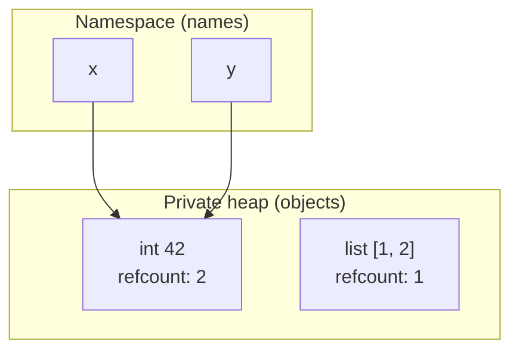
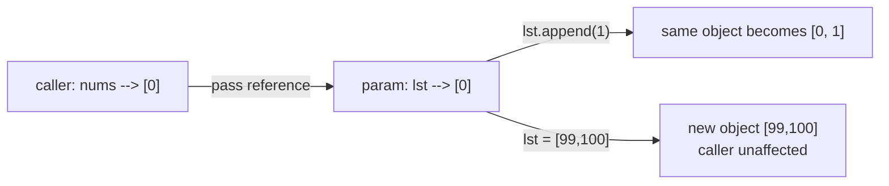

# Python Basics & Internals

> Learn how Python stores values, binds names, passes arguments, and manages memory — the mental machinery behind every line you write.

## Mental model

Python is built on one deceptively simple idea: **a variable is a name, not a box**. Names point at objects that live on a private heap. Assignment never copies a value — it just makes a name refer to an object. Once you internalize this, copying, argument passing, mutation bugs, and `is` vs `==` all stop being surprising.



Above, `x = 42` then `y = x` makes **both names point at the same object**. The object tracks how many names refer to it (its reference count). When that count drops to zero, the object is freed.

## Core concepts

### Variables are references, not containers

You never declare a type. You bind a name to an object, and the type travels with the object — this is **dynamic typing**.

```python
x = 10          # x refers to an int object
x = "hello"     # x is rebound to a str object — perfectly legal
print(type(x))  # => <class 'str'>
```

Rebinding `x` does not mutate the old object; it just points the name somewhere new. The old `int` is garbage-collected once nothing references it.

::: tip
Python is **dynamically typed** (types are checked at runtime) *and* **strongly typed** (no silent coercion between unrelated types). The two are independent properties.
:::

### Strong typing: no surprise coercions

```python
print(3 + 2.0)        # => 5.0   safe numeric widening: int -> float
print("3" + str(5))   # => '35'  explicit conversion required
# "3" + 5             # TypeError: can only concatenate str (not "int") to str
```

Languages like JavaScript would guess what `"3" + 5` means. Python refuses and raises a `TypeError`, which catches bugs early.

### Identity vs equality: `is` vs `==`

`==` asks "do these have the same value?" `is` asks "are these the exact same object in memory?"

```python
a = [1, 2]
b = [1, 2]
print(a == b)   # => True   same contents
print(a is b)   # => False  two distinct list objects

c = a
print(c is a)   # => True   same object, two names
```

Use `is` **only** for singletons like `None`, `True`, `False`:

```python
value = None
if value is None:        # correct
    print("no value")    # => no value
```

::: warning
Never write `if x == None`. Use `if x is None`. A custom class can override `==` to behave oddly, but identity against the one-and-only `None` object is always reliable.
:::

### `id()`, `type()`, and `isinstance()`

```python
x = 256
print(id(x))                 # => unique integer identity (CPython: memory address)
print(type(5))               # => <class 'int'>
print(isinstance(True, int)) # => True   bool is a subclass of int
print(type(True) == int)     # => False  exact-type check, no subclasses
```

Prefer `isinstance()` for type checks — it respects inheritance. Reserve `type(x) == Y` for the rare case where you need an *exact* class match.

### How arguments are passed: call-by-object-reference

Python passes a *reference to the object*, not a copy and not the variable itself. The consequence: **mutating** a mutable argument affects the caller, but **rebinding** the parameter does not.

```python
def append_one(lst):
    lst.append(1)      # mutates the caller's object in place

def reassign(lst):
    lst = [99, 100]    # rebinds the LOCAL name only

nums = [0]
append_one(nums)
print(nums)            # => [0, 1]   caller sees the mutation

nums = [0]
reassign(nums)
print(nums)            # => [0]      caller is untouched
```



### Mutable default arguments — a classic trap

Default argument values are evaluated **once**, when the function is defined, not each call.

```python
def bad(item, bucket=[]):    # the SAME list is reused every call
    bucket.append(item)
    return bucket

print(bad(1))   # => [1]
print(bad(2))   # => [1, 2]   surprise — state leaked across calls!

def good(item, bucket=None):
    if bucket is None:
        bucket = []          # fresh list each call
    bucket.append(item)
    return bucket

print(good(1))  # => [1]
print(good(2))  # => [2]
```

### Memory management: reference counting + cyclic GC

CPython frees an object the instant its reference count hits zero. That handles most cases immediately and deterministically.

```python
import sys
data = [1, 2, 3]
print(sys.getrefcount(data))  # => e.g. 2 (the name + the temporary arg to getrefcount)
data = None                   # old list's refcount drops to 0 -> freed
```

Reference counting alone cannot free **reference cycles** (A points to B, B points to A). For those, a generational **garbage collector** (`gc` module) periodically detects and collects unreachable cycles.

```python
import gc
a = {}
b = {}
a["b"] = b
b["a"] = a     # cycle: refcount never reaches 0 on its own
del a, b
gc.collect()   # the cyclic collector reclaims them
```

### `weakref`: referencing without keeping alive

A weak reference points at an object **without** incrementing its refcount, so it won't keep the object alive. This is ideal for caches that shouldn't cause memory leaks.

```python
import weakref

class Image:
    pass

img = Image()
ref = weakref.ref(img)
print(ref() is img)   # => True   object still alive
del img
print(ref())          # => None   object was collected; weakref doesn't keep it
```

### The GIL in one paragraph

The **Global Interpreter Lock** lets only one thread execute Python bytecode at a time. CPU-bound work therefore does *not* speed up with threads — reach for `multiprocessing` or native extensions. I/O-bound work (network, disk) still benefits from threads or `asyncio`, because threads release the GIL while waiting.

### Shallow vs deep copy

```python
import copy
original = [[1, 2], [3, 4]]

shallow = copy.copy(original)      # new outer list, SHARED inner lists
deep = copy.deepcopy(original)     # fully independent clone

original[0].append(99)
print(shallow)   # => [[1, 2, 99], [3, 4]]   inner list was shared
print(deep)      # => [[1, 2], [3, 4]]       fully isolated
```

### Built-in data types at a glance

```python
type(42)         # int      |  type(3.14)      # float
type("hi")       # str      |  type([1, 2])    # list
type((1, 2))     # tuple    |  type({"a": 1})  # dict
type({1, 2})     # set      |  type(None)      # NoneType
```

Categories: numeric (`int`, `float`, `complex`), sequence (`list`, `tuple`, `range`, `str`), mapping (`dict`), set (`set`, `frozenset`), boolean (`bool`), binary (`bytes`, `bytearray`, `memoryview`), and `NoneType`.

### Keywords, comments, and naming

```python
import keyword
print(keyword.iskeyword("for"))  # => True
# print(keyword.kwlist)          # => the full reserved-word list

x = 5  # inline comment — '#' starts a comment; there is no block-comment syntax
```

Naming conventions (PEP 8): `snake_case` for variables/functions, `UPPER_CASE` for constants, `CamelCase` for classes, a leading `_` for "internal" names. Names start with a letter/underscore and can't be keywords.

## Common pitfalls

- **`== None` instead of `is None`.** Singletons are identity checks. Fix: `if x is None:`.
- **Mutable default arguments.** `def f(x, acc=[])` shares one list. Fix: default to `None` and create inside.
- **Expecting reassignment to affect the caller.** `param = new_value` only rebinds locally. To change the caller's object, mutate it in place (`.append`, `param[:] = ...`).
- **`copy.copy` on nested structures.** Inner objects stay shared. Use `copy.deepcopy` when you need full isolation.
- **Assuming threads speed up CPU work.** The GIL prevents that. Fix: `multiprocessing` for CPU-bound tasks.
- **Treating `0`, `""`, `False`, `None` as interchangeable.** They are distinct objects that happen to be falsy; `None == False` is `False`.

## Best practices

- Default to `is`/`is not` for `None` and other singletons; use `==` for value comparison.
- Prefer `isinstance()` over `type() ==` so subclasses work correctly.
- Never use a mutable object as a default argument value.
- Let reference counting do its job; only reach for `gc`/`weakref` when you have real cycles or cache-eviction needs.
- Pick `multiprocessing` for CPU-bound parallelism, threads/`asyncio` for I/O-bound concurrency.
- Follow PEP 8 naming so code reads consistently.

## Interview quick-reference

| Concept | Key point |
| --- | --- |
| GIL | One thread runs bytecode at a time; hurts CPU-bound threading, not I/O |
| `is` vs `==` | Identity vs value; use `is` only for `None`/singletons |
| Shallow vs deep copy | `copy.copy` shares nested objects; `copy.deepcopy` clones all |
| Variables & memory | Names reference heap objects; refcounting + cyclic GC |
| Argument passing | Call-by-object-reference: mutate affects caller, rebind doesn't |
| Dynamic vs strong typing | Type checked at runtime; no implicit unrelated-type coercion |
| `id`/`type`/`isinstance` | Identity / exact class / class-membership (subclass-aware) |
| Cyclic references | Refcounting can't free cycles; generational `gc` handles them |
| `weakref` | Reference without keeping alive; good for caches |
| `None`/`False`/`0`/`""` | Distinct objects, all falsy; test `None` with `is None` |
