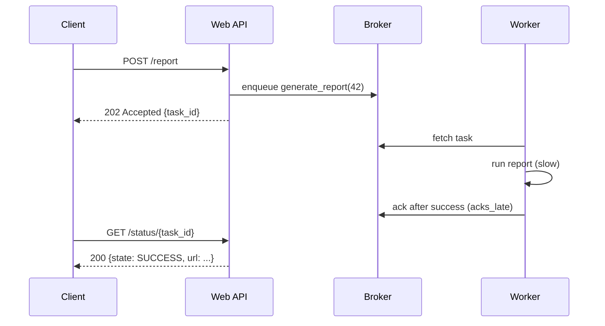

# Celery & Task Queues

> Learn how Celery offloads slow work to background workers, and how to make tasks reliable, idempotent, and well-routed.

## Mental model

Celery moves work *out* of the request/response cycle. Your web app (the **producer**) drops a task message onto a **broker**; one of many **workers** picks it up, runs it, and optionally writes the outcome to a **result backend**. The broker is transport; the result backend is bookkeeping — they are different stores doing different jobs.

```mermaid
flowchart LR
    A[Web app / client] -->|task.delay(id)| B[(Broker<br/>RabbitMQ / Redis)]
    B -->|fetch| W1[Worker 1]
    B -->|fetch| W2[Worker 2]
    W1 -->|store result| R[(Result backend<br/>Redis / DB)]
    W2 --> R
    A -.->|poll status by task id| R
```

The producer returns immediately with a task id and a `202 Accepted`; the client polls `/status/{id}` (or gets a webhook) for the result later.



## Core concepts

### Defining and dispatching tasks

`delay()` is the shortcut; `apply_async()` unlocks options like countdown, eta, queue, and priority.

```python
# tasks.py
from celery import Celery

app = Celery("myapp", broker="redis://localhost:6379/0",
             backend="redis://localhost:6379/1")

@app.task
def add(x, y):
    return x + y

# Dispatch (from the producer process)
add.delay(2, 3)                       # simple
add.apply_async(args=[2, 3],
                countdown=60,         # run 60s from now
                queue="math")         # route to a specific queue
# Both enqueue a message; the worker computes 5 and stores it in the backend.
```

### Pass IDs, never ORM objects

Task arguments are serialized (JSON by default) and may sit queued for a while. Serializing a model object captures *stale* state and bloats the payload. Pass the primary key and re-fetch.

```python
# BAD: serializes the whole object → stale data + large payload
@app.task
def email_user(user_obj): ...

# GOOD: pass the id, load fresh inside the worker
@app.task
def email_user(user_id):
    user = User.objects.get(id=user_id)   # always current state
    send_welcome(user.email)
```

### Reliability: late acks + idempotency

By default Celery acks a message *before* running it (early ack) — a worker crash loses the task. Set `acks_late=True` so the message is acked only after success and gets requeued on crash. Because that means a task can run more than once, tasks **must be idempotent**.

```python
from django.db import transaction

@app.task(acks_late=True, bind=True)
def process_payment(self, order_id):
    with transaction.atomic():
        order = Order.objects.select_for_update().get(id=order_id)
        if order.status == "PAID":          # idempotency guard
            return "already processed"
        charge_card(order.amount)           # external side effect
        order.status = "PAID"
        order.save()
    # If the worker dies before ack, the task reruns — the guard prevents a double charge.
```

### Retries with exponential backoff

For flaky external calls, retry with growing delays plus jitter so a fleet of workers doesn't retry in lockstep (thundering herd).

```python
import requests
from celery import shared_task

@shared_task(
    autoretry_for=(requests.RequestException,),
    retry_kwargs={"max_retries": 5},
    retry_backoff=True,        # 1s, 2s, 4s, 8s ...
    retry_backoff_max=600,     # cap at 10 minutes
    retry_jitter=True,         # randomize to avoid synchronized retries
)
def fetch(url):
    r = requests.get(url, timeout=5)
    r.raise_for_status()
    return r.json()
```

### Routing tasks to dedicated workers

Send CPU-heavy and I/O-light work to different queues, consumed by differently-sized workers. This isolates resources and protects latency-sensitive tasks.

```python
# config
app.conf.task_routes = {
    "myapp.tasks.encode_video": {"queue": "cpu"},
    "myapp.tasks.send_email":   {"queue": "io"},
}
```

```bash
# Start workers per queue (often on different machines)
celery -A myapp worker -Q cpu -c 2     # few processes, heavy tasks
celery -A myapp worker -Q io  -c 50    # many processes, light I/O tasks
```

### Canvas: chains, groups, and chords

Compose workflows from primitives. A **chain** runs sequentially (output → next input); a **group** runs in parallel; a **chord** runs a group then a callback with all results. Chords require a result backend to know when the group finished.

```python
from celery import chain, group, chord

# chain: a → b → c, threading results through
chain(fetch.s("u1"), transform.s(), store.s()).apply_async()

# group: run all in parallel
group(fetch.s(u) for u in ["u1", "u2", "u3"]).apply_async()

# chord: fan out, then aggregate
chord([fetch.s("api1"), fetch.s("api2"), fetch.s("api3")])(aggregate.s())
# aggregate(results) runs only after all three fetches succeed.
```

### Prefetch multiplier and fairness

Each worker reserves `concurrency * worker_prefetch_multiplier` messages up front (default multiplier 4). Great for tiny fast tasks; disastrous for long ones, where one worker hoards tasks while others idle.

```python
# For long-running tasks, force one-at-a-time handoff for perfect balancing.
app.conf.worker_prefetch_multiplier = 1
app.conf.task_acks_late = True
```

### Time limits and graceful shutdown

A **soft** limit raises `SoftTimeLimitExceeded` *inside* the task so you can clean up; the **hard** limit kills the process. On deploy, send `SIGTERM` for a warm shutdown: the worker stops fetching new tasks and lets running ones finish.

```python
from celery.exceptions import SoftTimeLimitExceeded

@app.task(soft_time_limit=50, time_limit=60)
def long_job():
    try:
        do_heavy_work()
    except SoftTimeLimitExceeded:
        rollback_and_save_state()   # graceful cleanup before the hard kill
        return "stopped cleanly"
```

## Common pitfalls

- **Running two Celery Beat instances.** Both dispatch the same schedule → duplicate tasks. Run exactly one, or use RedBeat / leader election for HA.
- **Result backend bloat.** Celery stores every return value by default. Set `ignore_result=True` where you don't need it and `result_expires` to evict old entries — otherwise Redis fills up.
- **Per-worker rate limits mistaken for global.** `rate_limit="10/m"` applies *per worker*; 5 workers = 50/min. For a true global cap use a Redis token bucket or a single-concurrency dedicated worker.
- **Non-idempotent tasks with `acks_late`.** At-least-once delivery means reruns. Guard side effects (DB status checks, `select_for_update`).
- **High prefetch on long tasks.** Causes unfair hoarding; set `worker_prefetch_multiplier=1`.
- **Hard `kill -9` on deploy.** Drops in-flight tasks. Send `SIGTERM` and ensure tasks have socket timeouts so they can finish.

## Best practices

- Pass identifiers, fetch fresh data inside the task.
- `acks_late=True` + idempotent tasks + `task_reject_on_worker_lost=True` for at-least-once safety.
- Separate queues per workload; size worker concurrency to the task profile.
- Cap retries with exponential backoff + jitter; dead-letter permanent failures.
- Keep payloads small; set `result_expires`; `ignore_result` where possible.
- One Beat scheduler (or RedBeat); use `bind=True` for `self.retry()` and `self.update_state()` progress.

## Interview quick-reference

| Concept | Key point |
| --- | --- |
| Broker vs result backend | Transport of tasks vs storage of state/return values |
| `delay` vs `apply_async` | Shortcut vs full options (countdown, eta, queue, priority) |
| Pass IDs not objects | Avoids stale data, serialization issues, large payloads |
| `acks_late` | Ack after success → requeue on crash; demands idempotency |
| Retry/backoff | `autoretry_for` + `retry_backoff` + `retry_jitter` |
| Routing | `task_routes` + per-queue workers for resource isolation |
| Chain/Group/Chord | Sequential / parallel / parallel-then-callback (needs backend) |
| Prefetch multiplier | `concurrency * multiplier`; set 1 for long tasks |
| Soft vs hard time limit | Catchable cleanup signal vs SIGKILL |
| Beat HA | Never run two; use RedBeat / leader election |
| Rate limit caveat | Built-in limit is per worker, not global |
| Idempotency | Required because delivery is at-least-once |
