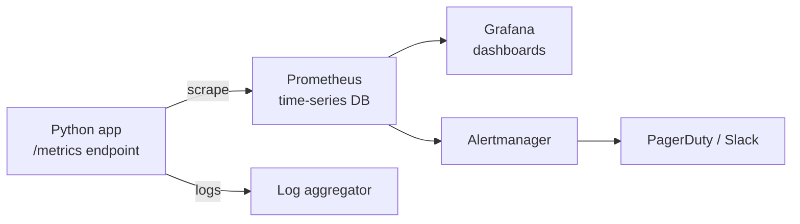
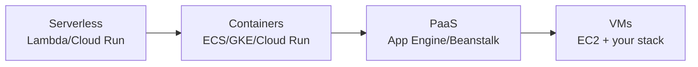
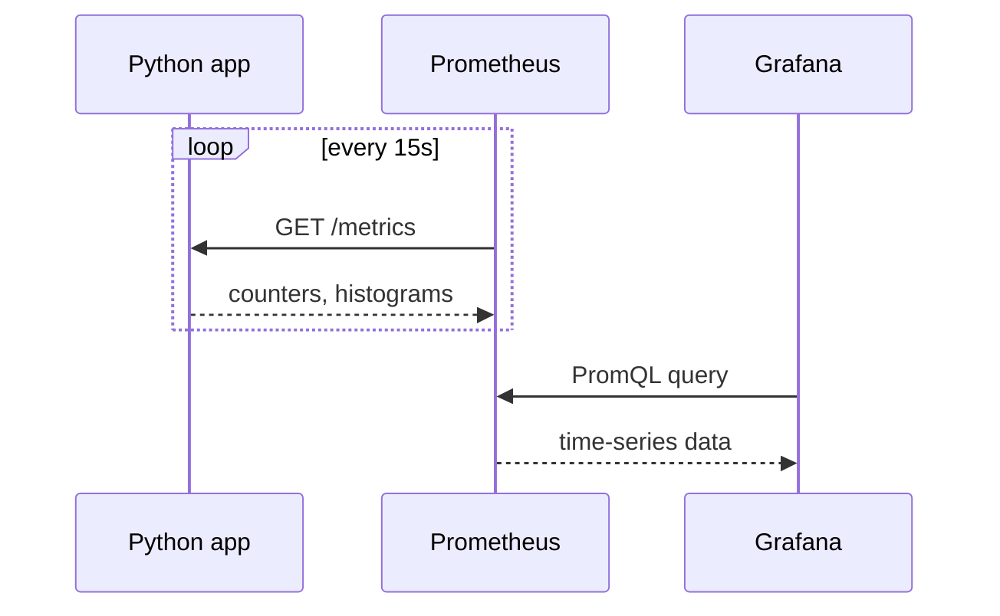

# Cloud & Monitoring

> How to deploy a Python service to the cloud and keep it healthy — deployment models, the metrics that matter, and observability with Prometheus and Grafana.

## Mental model

Shipping to the cloud is only half the job; the other half is **knowing it works**. A
production service emits **telemetry** — metrics, logs, traces — that you collect, store,
and visualize, then alert on when something drifts.



## Cloud services

The big three — **AWS**, **Azure**, **GCP** — offer the same building blocks under different
names. Know the categories, not just brand names:

| Category | AWS | Azure | GCP |
| --- | --- | --- | --- |
| Compute (VMs) | EC2 | Virtual Machines | Compute Engine |
| Containers | ECS / EKS | AKS | GKE |
| Serverless | Lambda | Functions | Cloud Functions |
| Object storage | S3 | Blob Storage | Cloud Storage |
| Managed DB | RDS | SQL Database | Cloud SQL |
| Managed queue | SQS | Service Bus | Pub/Sub |

## Deploying a Python web app

There's a spectrum from most-managed to least-managed; pick by how much control vs
ops-burden you want.



A typical containerized deploy:

```dockerfile
FROM python:3.12-slim
WORKDIR /app
COPY requirements.txt .
RUN pip install --no-cache-dir -r requirements.txt
COPY . .
# Gunicorn = WSGI; use uvicorn workers for ASGI (FastAPI)
CMD ["gunicorn", "-w", "4", "-b", "0.0.0.0:8000", "app:app"]
```

```bash
# Build, push, and run on a managed container platform
docker build -t registry/myapp:1.0 .
docker push registry/myapp:1.0
gcloud run deploy myapp --image registry/myapp:1.0 --region europe-west1
```

::: tip Production checklist
Run multiple workers behind a load balancer, terminate TLS at the edge, externalize config
via **environment variables**, keep secrets in a managed secret store, set health-check and
readiness endpoints, and enable autoscaling on CPU or request rate.
:::

## Why monitoring matters

You cannot fix — or even notice — what you can't see. Monitoring lets you **detect**
incidents before users complain, **diagnose** root cause quickly, **verify** deploys, and
make data-driven capacity decisions. The goal is low **MTTD** (time to detect) and **MTTR**
(time to recover).

## What to monitor: the key signals

The **Four Golden Signals** (Google SRE) cover most API services:

| Signal | Meaning | Example metric |
| --- | --- | --- |
| **Latency** | How long requests take | p50 / p95 / p99 response time |
| **Traffic** | How much demand | requests per second |
| **Errors** | Rate of failures | 5xx ratio, exception count |
| **Saturation** | How full the system is | CPU %, memory, queue depth |

For a Python API specifically, also watch: request rate per endpoint, error rate by status
code, DB connection-pool usage, worker count, and GC/event-loop lag for async apps.

::: warning Track percentiles, not averages
An average latency of 80 ms can hide a p99 of 3 s — the experience of your unluckiest (often
most valuable) users. Always alert on **p95/p99**, not the mean.
:::

## Prometheus and Grafana

**Prometheus** is a pull-based time-series database: it periodically **scrapes** a
`/metrics` HTTP endpoint your app exposes, stores the samples, and lets you query them with
**PromQL**. **Grafana** is the visualization layer — dashboards and alerts built on top of
Prometheus (and other) data sources. Together: Prometheus collects and stores, Grafana
displays and alerts.



Instrument a Python app with the official client:

```python
from prometheus_client import Counter, Histogram, start_http_server
import time, random

REQUESTS = Counter("http_requests_total", "Total requests", ["endpoint"])
LATENCY = Histogram("http_request_seconds", "Request latency", ["endpoint"])

def handle(endpoint: str):
    REQUESTS.labels(endpoint).inc()                 # count it
    with LATENCY.labels(endpoint).time():           # time it
        time.sleep(random.random() * 0.2)           # simulated work

if __name__ == "__main__":
    start_http_server(8000)                          # exposes /metrics
    while True:
        handle("/users")
```

A matching Prometheus scrape config:

```yaml
scrape_configs:
  - job_name: myapp
    scrape_interval: 15s
    static_configs:
      - targets: ["myapp:8000"]
```

Then query in Grafana with PromQL — e.g. the p95 latency over 5 minutes:

```text
histogram_quantile(0.95, rate(http_request_seconds_bucket[5m]))
```

## Common pitfalls

- **Alerting on averages** — masks tail latency; use p95/p99 percentiles.
- **High-cardinality labels** (user IDs, request IDs) — explode Prometheus memory. Keep
  label values bounded.
- **Logging instead of metrics for rates** — grepping logs doesn't scale; use counters.
- **No health/readiness endpoint** — load balancers route traffic to dead pods.
- **Secrets baked into images** — use a secret manager; rotate them.
- **Noisy alerts** — alert fatigue means real pages get ignored; alert on symptoms users
  feel, not every blip.

## Best practices

- Expose `/metrics`, `/healthz`, and `/readyz`; instrument the four golden signals.
- Externalize config via env vars; keep secrets in a vault/secret manager.
- Define SLOs (e.g. "p99 < 300 ms, 99.9% availability") and alert against them.
- Use structured (JSON) logs with a correlation/trace ID for cross-service debugging.
- Add distributed tracing (OpenTelemetry) once you have more than a couple of services.

## Interview quick-reference

| Topic | Key point |
| --- | --- |
| Cloud categories | Compute, containers, serverless, storage, managed DB/queue |
| Deploy spectrum | Serverless → containers → PaaS → VMs |
| Why monitor | Lower MTTD/MTTR; detect before users do |
| Golden signals | Latency, traffic, errors, saturation |
| Latency metric | Percentiles (p95/p99), never the average |
| Prometheus | Pull-based time-series DB, scrapes `/metrics`, PromQL |
| Grafana | Dashboards + alerts on top of Prometheus |
| Client types | `Counter`, `Gauge`, `Histogram`, `Summary` |
