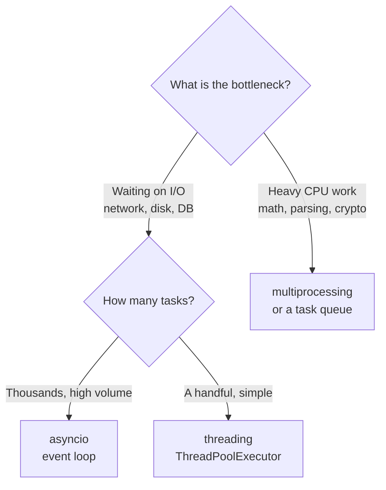

# Concurrency in Python

> Learn when to reach for threads, processes, or `asyncio`, how the GIL shapes those choices, and how to coordinate concurrent work safely.

## Mental model

Concurrency is about *structuring* a program so multiple tasks make progress without blocking each other. Parallelism is about *executing* tasks at the literally same instant on multiple cores. They are related but different goals, and Python gives you three tools that each pick a different trade-off:

- **`threading`** — many tasks, one process, shared memory. The Global Interpreter Lock (GIL) means only one thread runs Python bytecode at a time, so threads help when tasks spend time *waiting* (I/O), not *computing*.
- **`multiprocessing`** — many processes, each with its own interpreter and GIL. True parallelism for CPU-bound work, at the cost of memory and inter-process communication overhead.
- **`asyncio`** — one thread, one event loop, cooperative scheduling. Tasks voluntarily yield at `await` points. Ideal for very high volumes of I/O.



## Core concepts

### The GIL and why it steers everything

CPython's GIL is a mutex that allows only one thread to execute Python bytecode at any moment. It makes single-threaded code fast and individual bytecode operations atomic, but it means CPU-bound threads cannot run in parallel — they take turns.

```python
import time
from concurrent.futures import ThreadPoolExecutor

def cpu_burn(n: int) -> int:
    # Pure CPU work: no I/O, so the GIL is held the whole time.
    total = 0
    for i in range(n):
        total += i * i
    return total

start = time.perf_counter()
with ThreadPoolExecutor(max_workers=4) as pool:
    list(pool.map(cpu_burn, [10_000_000] * 4))
print(f"threads: {time.perf_counter() - start:.2f}s")
# => threads: ~1.9s  (no faster than running them one after another;
#    the GIL serializes the CPU work despite 4 threads)
```

::: warning
Threads do **not** speed up CPU-bound code. If you see four threads pinning one core, the GIL is the reason. Move CPU work to `multiprocessing`.
:::

### Threads shine for I/O-bound work

When a thread is blocked on a socket or file, it releases the GIL, letting another thread run. So overlapping waits is exactly where threads pay off.

```python
import time
from concurrent.futures import ThreadPoolExecutor

def fake_request(url: str) -> str:
    time.sleep(1)          # simulates network latency; GIL released while sleeping
    return f"ok:{url}"

urls = [f"http://x/{i}" for i in range(8)]

start = time.perf_counter()
with ThreadPoolExecutor(max_workers=8) as pool:
    results = list(pool.map(fake_request, urls))
print(len(results), f"in {time.perf_counter() - start:.2f}s")
# => 8 in 1.01s   (8 one-second waits overlapped into ~1 second)
```

### Processes for true parallelism

Each process has its own interpreter and GIL, so CPU work runs on separate cores. The cost: objects must be *pickled* to cross the process boundary.

```python
import time
from concurrent.futures import ProcessPoolExecutor

def cpu_burn(n: int) -> int:
    total = 0
    for i in range(n):
        total += i * i
    return total

if __name__ == "__main__":            # required guard on spawn-based platforms
    start = time.perf_counter()
    with ProcessPoolExecutor(max_workers=4) as pool:
        list(pool.map(cpu_burn, [10_000_000] * 4))
    print(f"processes: {time.perf_counter() - start:.2f}s")
    # => processes: ~0.6s  (work spread across 4 cores, ~4x faster than threads)
```

### How processes talk to each other

Because memory is not shared, you pass data explicitly with a `Queue` (message passing), a `Pipe`, shared `Value`/`Array`, or a `Manager` for higher-level shared objects.

```python
from multiprocessing import Process, Queue

def producer(q: Queue) -> None:
    for i in range(3):
        q.put(i * 10)

if __name__ == "__main__":
    q: Queue = Queue()
    p = Process(target=producer, args=(q,))
    p.start()
    p.join()
    print([q.get() for _ in range(3)])
    # => [0, 10, 20]
```

### asyncio: one thread, an event loop, many coroutines

A coroutine (defined with `async def`) can *suspend* itself at an `await` and hand control back to the event loop, which resumes another ready coroutine. There is no preemption — switching happens only at `await` points, which is why coroutines rarely need locks.

```python
import asyncio

async def fetch(name: str, delay: float) -> str:
    print(f"{name} start")
    await asyncio.sleep(delay)     # yields control; loop runs others meanwhile
    print(f"{name} done")
    return name

async def main() -> None:
    # gather runs the three coroutines concurrently on one thread.
    results = await asyncio.gather(
        fetch("a", 0.3), fetch("b", 0.1), fetch("c", 0.2)
    )
    print(results)

asyncio.run(main())
# => a start / b start / c start / b done / c done / a done / ['a', 'b', 'c']
```

### Threads vs the async event loop, visualized

```mermaid
sequenceDiagram
    participant OS as OS Scheduler (threads)
    participant T1 as Thread 1
    participant T2 as Thread 2
    OS->>T1: run (preempted anytime)
    OS->>T2: run (preempted anytime)
    Note over T1,T2: Need locks for shared state

    participant Loop as Event Loop (asyncio)
    participant C1 as Coroutine A
    participant C2 as Coroutine B
    Loop->>C1: resume until await
    C1-->>Loop: yield at await
    Loop->>C2: resume until await
    C2-->>Loop: yield at await
    Note over C1,C2: Switch only at await — no surprise interleaving
```

### Tasks and TaskGroup (3.11+)

`asyncio.create_task()` schedules a coroutine to run concurrently and returns a `Task` handle. In Python 3.11+, `asyncio.TaskGroup` is the preferred way to launch a group: if any task fails, the rest are cancelled automatically and errors surface as an `ExceptionGroup`.

```python
import asyncio

async def work(n: int) -> int:
    await asyncio.sleep(0.1)
    if n == 2:
        raise ValueError("boom")
    return n

async def main() -> None:
    try:
        async with asyncio.TaskGroup() as tg:    # structured concurrency
            tg.create_task(work(1))
            tg.create_task(work(2))   # this failure cancels the siblings
            tg.create_task(work(3))
    except* ValueError as eg:          # note: except* for ExceptionGroup
        print("caught:", eg.exceptions)

asyncio.run(main())
# => caught: (ValueError('boom'),)
```

### Synchronization primitives

When threads do share mutable state, guard it. The `threading` toolkit:

- `Lock` — basic mutual exclusion; one holder at a time.
- `RLock` — reentrant; the *same* thread can acquire it repeatedly (useful in recursive code).
- `Semaphore` — permits up to N concurrent holders; great for capping a resource pool.
- `Condition` — wait/notify coordination between producers and consumers.
- `Event` — a flag threads `wait()` on until another `set()`s it.

```python
import threading

counter = 0
lock = threading.Lock()

def increment() -> None:
    global counter
    for _ in range(100_000):
        with lock:           # composite read-modify-write must be guarded
            counter += 1

threads = [threading.Thread(target=increment) for _ in range(4)]
for t in threads: t.start()
for t in threads: t.join()
print(counter)
# => 400000   (without the lock you'd get a smaller, non-deterministic number)
```

## Common pitfalls

- **Using threads for CPU-bound work.** The GIL serializes it. Fix: `ProcessPoolExecutor` or a task queue like Celery.
- **Assuming `dict`/`list` ops are fully thread-safe.** A single `append` is atomic, but `if k not in d: d[k] = v` is two operations and can interleave. Fix: wrap composite logic in a `Lock`.
  ```python
  with lock:
      if key not in cache:
          cache[key] = compute()
  ```
- **Blocking the event loop.** Calling `time.sleep()` or a synchronous `requests.get()` inside a coroutine freezes *every* task. Fix: use `await asyncio.sleep()` and async libraries, or offload with `await asyncio.to_thread(blocking_fn)`.
- **Forgetting the `if __name__ == "__main__":` guard** with `multiprocessing` on Windows/macOS spawn — it causes infinite process spawning.
- **Relying on `gather` to clean up on failure.** Plain `gather` leaves siblings running when one fails. Fix: prefer `TaskGroup` for structured cancellation.
- **Fire-and-forget tasks.** A `Task` you never `await` may be garbage-collected mid-flight or swallow exceptions. Keep a reference and await it.

## Best practices

- Classify the workload first: **I/O-bound → async/threads, CPU-bound → processes.**
- Prefer the high-level `concurrent.futures` executors and `asyncio.TaskGroup` over manual thread/loop management.
- Keep shared mutable state minimal; pass messages (queues) instead of sharing memory when you can.
- Offload blocking calls inside async code with `asyncio.to_thread`.
- Always `join()` threads/processes and `await` tasks so errors and cleanup are not lost.
- Use a `Semaphore` (sync or async) to bound concurrency against rate-limited resources.

## Interview quick-reference

| Concept | Key point |
| --- | --- |
| Concurrency vs parallelism | Interleaving progress vs literally simultaneous execution |
| GIL | One thread runs bytecode at a time → threads don't parallelize CPU work |
| Threads | Best for I/O-bound; share memory; need locks for composite ops |
| Processes | True CPU parallelism; isolated memory; communicate via Queue/Pipe/shared_memory |
| Coroutines vs threads | Cooperative, single-thread, switch only at `await`; threads are preempted by the OS |
| Event loop | Single-threaded scheduler running coroutines, pausing at `await` |
| Task vs Event | `create_task` schedules a coroutine; `asyncio.Event` is a wait/set flag |
| `TaskGroup` vs `gather` | TaskGroup auto-cancels siblings on failure, raises `ExceptionGroup` |
| Lock/RLock/Semaphore/Condition/Event | Mutex / reentrant / N-holders / wait-notify / flag |
| Thread-safety of dict/list | Single ops atomic; composite read-modify-write is not |
