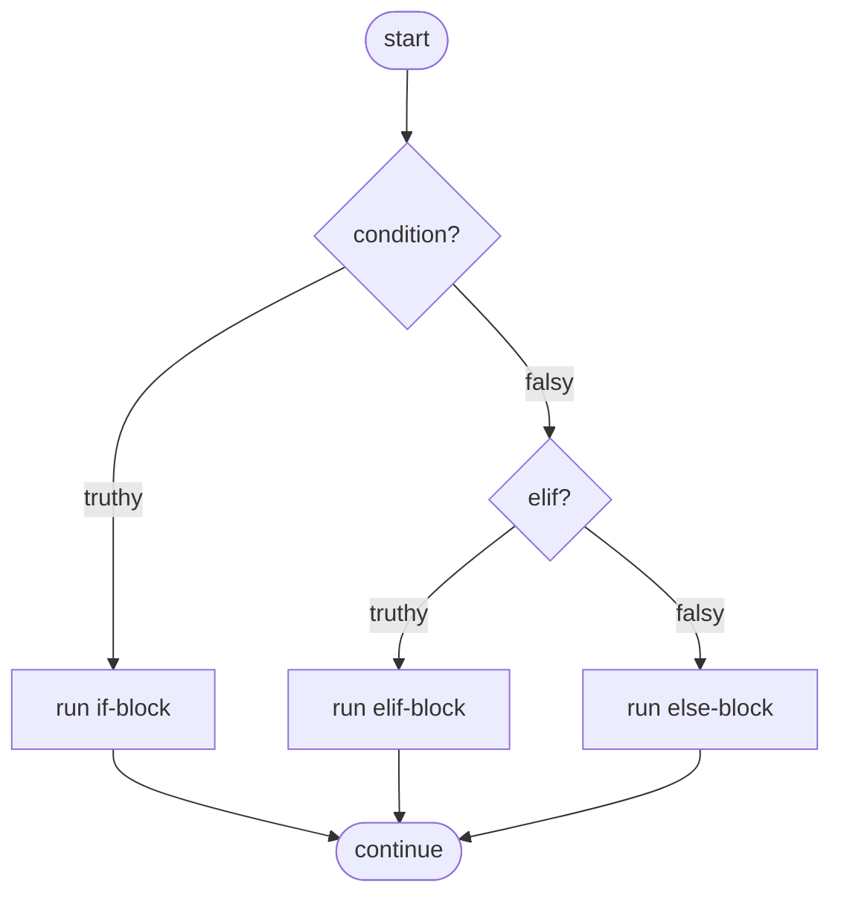
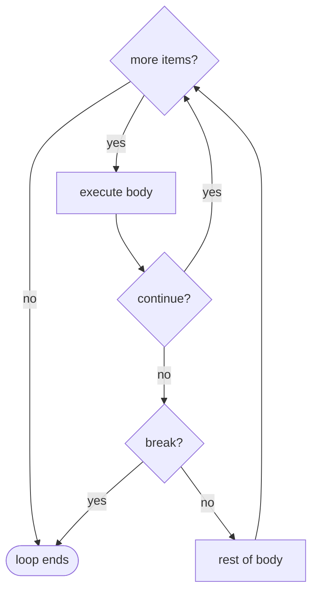

# Control Flow

> Learn how Python decides what runs next: conditionals, loops, the loop `else` clause, the `match` statement, and the dangers of mutating a collection mid-iteration.

## Mental model

Control flow is the set of forks and loops that steer execution through your program. Python keeps it minimal: `if/elif/else` for branching, `for`/`while` for repetition, `break`/`continue`/`pass` for fine control, and an `else` clause on loops that most languages don't have. Picture execution as a single token walking a flowchart — each construct just changes which edge it takes next.



## Core concepts

### `if`, `elif`, `else`

`if` runs its block when the condition is truthy. `elif` adds further conditions, checked in order. `else` runs when none matched. **Only the first matching branch executes.**

```python
score = 85
if score >= 90:
    grade = "A"
elif score >= 80:
    grade = "B"          # first match wins -> stops checking here
else:
    grade = "C"
print(grade)             # => B
```

Remember that *any* object has a truth value: `0`, `0.0`, `""`, `[]`, `{}`, `None` are falsy; almost everything else is truthy.

```python
items = []
if items:                # empty list is falsy
    print("has items")
else:
    print("empty")       # => empty
```

### Conditional expressions (the ternary)

For a simple either/or value, use the inline form `A if cond else B`.

```python
n = 7
parity = "even" if n % 2 == 0 else "odd"
print(parity)            # => odd
```

### `for` and `while` loops

A `for` loop iterates over the items of any iterable. A `while` loop repeats while its condition stays truthy, re-checking before each pass.

```python
for ch in "abc":
    print(ch, end=" ")   # => a b c
print()

n = 3
while n > 0:
    print(n, end=" ")    # => 3 2 1
    n -= 1
print()
```

### `pass`, `continue`, `break`

These three control how a loop body proceeds:

- `pass` does nothing — a placeholder where syntax requires a statement.
- `continue` skips the rest of the current iteration and jumps to the next.
- `break` exits the loop entirely.

```python
for num in range(10):
    if num % 2 == 0:
        continue         # skip even numbers
    if num > 5:
        break            # stop once we pass 5
    print(num, end=" ")  # => 1 3 5
print()
```



### `for...else` and `while...else`

A loop's `else` clause runs **only if the loop finished without `break`**. It's perfect for "search and report not found" logic, removing the need for a found-flag variable.

```python
nums = [2, 4, 6, 8]
target = 5
for n in nums:
    if n == target:
        print("found")
        break
else:
    print("not found")   # => not found  (no break happened)
```

The same applies to `while`:

```python
attempts = 0
while attempts < 3:
    if False:            # pretend login never succeeds
        break
    attempts += 1
else:
    print("locked out")  # => locked out  (condition went false, no break)
```

::: tip
Read loop `else` as "**no-break else**." It runs when the loop ran to completion. If you ever `break`, the `else` is skipped.
:::

### Structural pattern matching: `match`

Python 3.10+ adds `match`/`case` for clear multi-way branching and destructuring. Cases are tried top to bottom; `_` is the wildcard default.

```python
def describe(point):
    match point:
        case (0, 0):
            return "origin"
        case (x, 0):
            return f"on x-axis at {x}"
        case (0, y):
            return f"on y-axis at {y}"
        case (x, y):
            return f"point ({x}, {y})"
        case _:
            return "not a point"

print(describe((0, 0)))    # => origin
print(describe((3, 0)))    # => on x-axis at 3
print(describe((3, 4)))    # => point (3, 4)
```

### Mutating a collection while iterating it

Adding to or removing from a list or dict *during* iteration corrupts the loop — it can skip elements or raise `RuntimeError: dictionary changed size during iteration`. The iterator's internal index gets out of sync with the shrinking/growing container.

```python
# BAD — removing during iteration skips elements
items = [1, 2, 2, 3]
for x in items:
    if x == 2:
        items.remove(x)   # mutates what we're iterating
print(items)              # => [1, 2, 3]   one '2' survived! (index skipped it)
```

The fix: iterate over a **copy**, or build a **new** collection.

```python
# GOOD — build a new list with a comprehension
items = [1, 2, 2, 3]
items = [x for x in items if x != 2]
print(items)              # => [1, 3]

# GOOD — iterate a copy of the keys when editing a dict
d = {"a": 1, "b": 0, "c": 2}
for k in list(d):         # list(d) snapshots the keys
    if d[k] == 0:
        del d[k]
print(d)                  # => {'a': 1, 'c': 2}
```

::: danger
Never delete from a list with `.remove()` or `del` inside a `for` over that same list. Either filter into a new list, or loop over `list(original)` / a slice copy `original[:]`.
:::

## Common pitfalls

- **Mutating while iterating.** Skips items or raises `RuntimeError`. Fix: iterate a copy (`list(d)`, `seq[:]`) or rebuild via comprehension.
- **Misusing loop `else`.** It runs on *no break*, not "if the loop didn't run." An empty loop still triggers `else`.
- **Confusing `pass` and `continue`.** `pass` is a no-op that falls through to the next line; `continue` jumps to the next iteration.
- **Truthiness surprises.** `if value:` treats `0`, `""`, `[]`, `None` as false. Use `if value is not None:` when you specifically mean "not None."
- **Forgetting to advance a `while`.** Omitting `n -= 1` makes an infinite loop. Ensure the condition can become false.
- **Overusing flags.** A `found = False` variable around a search loop is exactly what `for...else` replaces.

## Best practices

- Order `if/elif` from most specific/most likely to least to keep logic clear and fast.
- Prefer `for...else` over manual found-flags for search loops.
- Reach for `match` when branching on the *shape* of data, not just a single value.
- Keep loop bodies small; extract complex conditions into well-named helper functions.
- When editing a collection in a loop, always iterate a copy or build a new one.
- Use the ternary `A if cond else B` only for simple value choices; fall back to a full `if` when logic grows.

## Interview quick-reference

| Construct | Key point |
| --- | --- |
| `if/elif/else` | First truthy branch runs; others skipped |
| Truthiness | `0`, `""`, `[]`, `{}`, `None` are falsy |
| Ternary | `A if cond else B` for simple value choice |
| `for` / `while` | Iterate an iterable / repeat while condition truthy |
| `pass` | No-op placeholder; falls through |
| `continue` | Skip to next iteration |
| `break` | Exit the loop entirely |
| `for...else` / `while...else` | `else` runs only if no `break` occurred |
| `match`/`case` | Structural pattern matching (3.10+); `_` is wildcard |
| Mutate-while-iterate | Skips elements or raises; iterate a copy or rebuild |
