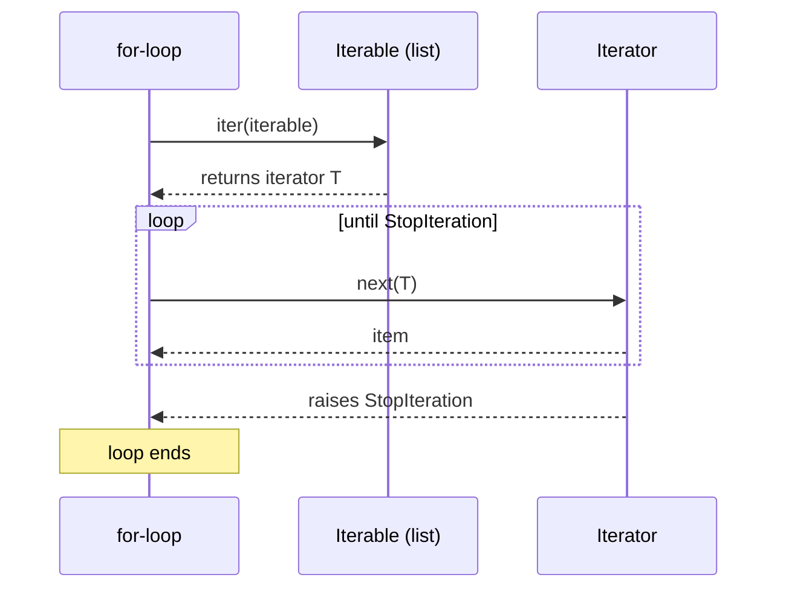
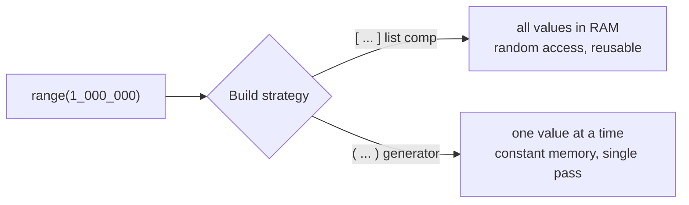

# Data & Iteration

> Master Python's iteration protocol, generators, comprehensions, slicing, and flexible function arguments — the tools that make data processing concise and memory-efficient.

## Mental model

Almost everything you loop over in Python flows through one small contract: the **iterator protocol**. An *iterable* knows how to hand out a fresh *iterator*; an *iterator* knows how to produce the *next* item and when to stop. `for` loops, comprehensions, `sum()`, unpacking — they all speak this protocol. Generators are just the easiest way to *write* an iterator.



## Core concepts

### Iterables vs iterators

An **iterable** implements `__iter__` and can be looped over repeatedly. An **iterator** implements `__next__`, yields one item at a time, and is *exhausted* once consumed.

```python
nums = [1, 2, 3]      # iterable
it = iter(nums)       # turn it into an iterator
print(next(it))       # => 1
print(next(it))       # => 2
print(next(it))       # => 3
# next(it)            # raises StopIteration — the loop's stop signal
```

A list can produce many independent iterators; an iterator, once drained, stays empty. That distinction explains why you can loop over a list twice but a generator only once.

### Generators with `yield`

A function containing `yield` becomes a **generator function**. Calling it returns a generator (an iterator) without running the body. Each `yield` produces a value and **pauses**, preserving all local state until the next `next()`.

```python
def countdown(n):
    while n > 0:
        yield n        # produce a value, then pause here
        n -= 1         # resumes here on the next iteration

print(list(countdown(3)))   # => [3, 2, 1]
```

### `return` vs `yield`

`return` ends a function and hands back one value. `yield` produces a value but suspends the function so it can resume later. A `return` inside a generator just stops iteration (it sets `StopIteration`).

```python
def squares(n):
    for i in range(n):
        yield i * i          # pauses and resumes per item

print(list(squares(4)))      # => [0, 1, 4, 9]
```

### Generators vs lists: laziness saves memory

```python
nums_list = [x * x for x in range(1_000_000)]   # builds a million ints NOW
nums_gen  = (x * x for x in range(1_000_000))    # builds nothing yet — lazy

import sys
print(sys.getsizeof(nums_gen) < sys.getsizeof(nums_list))  # => True
```

The generator computes each square on demand, so it uses constant memory. Use generators for large or streaming data; use lists when you need random access, `len()`, or to iterate more than once.



### `yield from`: delegating to a subgenerator

`yield from` yields every item of an inner iterable without a manual nested loop, and it transparently forwards `.send()`/`.throw()` to the subgenerator.

```python
def chain(*iterables):
    for it in iterables:
        yield from it          # cleaner than: for x in it: yield x

print(list(chain([1, 2], (3, 4), "ab")))  # => [1, 2, 3, 4, 'a', 'b']
```

### Sending data into a generator: coroutines

A generator can *receive* values via `.send(value)`. The `yield` expression evaluates to whatever was sent, turning the generator into a coroutine — the historical foundation of async Python.

```python
def accumulator():
    total = 0
    while True:
        value = yield total    # 'yield total' both emits and receives
        total += value

acc = accumulator()
next(acc)               # prime the generator (run up to first yield)
print(acc.send(10))     # => 10
print(acc.send(5))      # => 15
print(acc.send(100))    # => 115
```

### List comprehensions

A comprehension builds a list in one expression and is usually faster than an explicit append loop.

```python
# explicit loop
squares = []
for x in range(10):
    if x % 2 == 0:
        squares.append(x ** 2)

# equivalent comprehension
squares = [x ** 2 for x in range(10) if x % 2 == 0]
print(squares)   # => [0, 4, 16, 36, 64]
```

::: tip
Keep comprehensions shallow. Two levels of nesting plus filters is the readability limit — beyond that, a named loop is clearer.
:::

```python
# nested comprehension: a 3x3 matrix of i+j
matrix = [[i + j for j in range(3)] for i in range(3)]
print(matrix)    # => [[0, 1, 2], [1, 2, 3], [2, 3, 4]]
```

### Dict and set comprehensions

```python
names = ["Alice", "Bob", "Charlie"]
lengths = {name: len(name) for name in names}
print(lengths)   # => {'Alice': 5, 'Bob': 3, 'Charlie': 7}

unique_evens = {x for x in range(10) if x % 2 == 0}
print(unique_evens)  # => {0, 2, 4, 6, 8}
```

### Slicing: `[start:stop:step]`

Slicing extracts subsequences from any sequence. Each part is optional; a negative `step` walks backward.

```python
items = [0, 1, 2, 3, 4, 5, 6, 7, 8, 9]
print(items[2:5])    # => [2, 3, 4]   start inclusive, stop exclusive
print(items[::3])    # => [0, 3, 6, 9]   every third item
print(items[::-1])   # => [9, 8, 7, 6, 5, 4, 3, 2, 1, 0]   reversed
print(items[-3:])    # => [7, 8, 9]   last three
```

Slicing is more concise and faster than the comprehension equivalent `[x for i, x in enumerate(items) if i % 3 == 0]`.

### `range`: a lazy immutable sequence

`range` generates numbers on demand — it never materializes a list — yet still supports indexing, `in`, slicing, and `len()`.

```python
big = range(1_000_000)   # no million-element list created
print(big[0])            # => 0
print(10 in big)         # => True
print(len(big))          # => 1000000
print(list(range(0, 10, 2)))  # => [0, 2, 4, 6, 8]  materialize on demand
```

Forms: `range(stop)`, `range(start, stop)`, `range(start, stop, step)`.

### Mutable vs immutable types

Mutability decides whether an object can change in place. Immutable types create a *new* object on every "change".

```python
s = "hello"
print(s.upper())   # => 'HELLO'  (new string)
print(s)           # => 'hello'  (original unchanged)

nums = [1, 2, 3]
nums.append(4)     # mutates the same object
print(nums)        # => [1, 2, 3, 4]
```

Immutable: `int`, `float`, `str`, `tuple`, `frozenset`, `bytes`. Mutable: `list`, `dict`, `set`, `bytearray`. Only immutable (hashable) objects can be dict keys or set members, because their hash must stay constant.

```python
d = {(1, 2): "tuple key works"}     # OK — tuple is hashable
# d = {[1, 2]: "fails"}             # TypeError: unhashable type: 'list'
```

### `*args` and `**kwargs`

`*args` collects extra positional arguments into a tuple; `**kwargs` collects extra keyword arguments into a dict. They make functions accept any number of arguments.

```python
def describe(*args, **kwargs):
    print(args)      # tuple of positionals
    print(kwargs)    # dict of keywords

describe(1, 2, 3, mode="fast", retries=2)
# => (1, 2, 3)
# => {'mode': 'fast', 'retries': 2}
```

The same `*`/`**` also *unpack* when calling:

```python
def add(a, b, c):
    return a + b + c

parts = [1, 2, 3]
print(add(*parts))                      # => 6   unpack a list
opts = {"a": 10, "b": 20, "c": 30}
print(add(**opts))                      # => 60  unpack a dict
```

## Common pitfalls

- **Reusing an exhausted generator.** It yields nothing the second time. Fix: rebuild it, or use a list if you need multiple passes.
- **Forgetting to prime a `.send()` generator.** Call `next(gen)` (or `gen.send(None)`) once before sending real values.
- **Over-nesting comprehensions.** `[[... for ...] for ... if ...]` quickly becomes unreadable. Fix: extract a helper or use a loop.
- **`step=0` in a slice.** `items[::0]` raises `ValueError`. Step must be non-zero.
- **Expecting `range` to be a list.** It supports list-like operations but isn't one; wrap it in `list()` when you truly need a list.
- **Using a `list`/`dict`/`set` as a dict key.** Unhashable. Use a `tuple` or `frozenset` instead.

## Best practices

- Reach for a generator when data is large, streamed, or consumed once.
- Use comprehensions for simple map/filter transforms; fall back to loops when logic grows.
- Prefer slicing over index-arithmetic loops — it's shorter and faster.
- Use `*args`/`**kwargs` for genuinely variadic APIs, not as a way to dodge clear signatures.
- Pick the right container: `tuple` for fixed records, `list` for ordered mutable data, `set` for membership, `dict` for lookups.

## Interview quick-reference

| Concept | Key point |
| --- | --- |
| Iterable vs iterator | `__iter__` produces an iterator; `__next__` yields items until `StopIteration` |
| `yield` | Makes a generator; emits a value and pauses, keeping local state |
| `return` vs `yield` | `return` ends and returns once; `yield` pauses and resumes |
| Generators vs lists | Lazy/constant-memory/single-pass vs eager/random-access/reusable |
| `yield from` | Delegates to a subgenerator; forwards `send`/`throw` |
| `.send()` | Feeds a value into a paused `yield`; turns generators into coroutines |
| List/dict comprehensions | Concise, often faster; keep them shallow |
| Slicing `[a:b:c]` | Inclusive start, exclusive stop, optional step; `[::-1]` reverses |
| `range` | Lazy immutable sequence; supports index/`in`/`len`/slice |
| Mutable vs immutable | Immutables copy-on-change; only immutables can be keys/members |
| `*args`/`**kwargs` | Collect extra positionals (tuple) / keywords (dict); also unpack |
