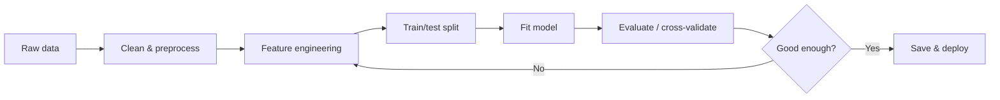
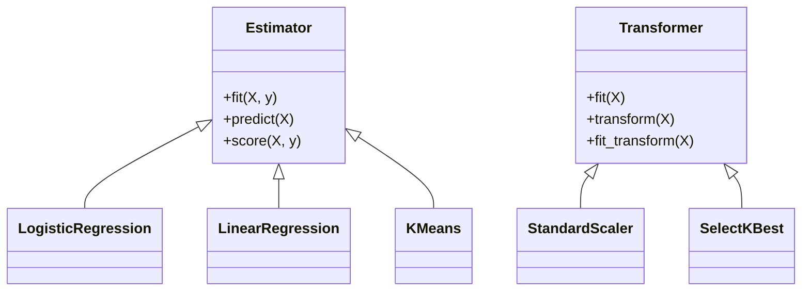

# Data Science & Machine Learning in Python

> Walk the full path from raw data to a trained, evaluated, and saved model using pandas, NumPy, and scikit-learn — the core stack every Python data role expects.

## Mental model

Data science is statistics plus programming plus domain knowledge, glued together by Python's ecosystem. Almost every project follows the same loop: **load → clean → engineer features → split → train → evaluate → tune → save**. pandas and NumPy own the first half (wrangling), scikit-learn owns the second (modelling), and everything shares one habit — fit transformations on training data only, then apply them to unseen data.



scikit-learn unifies every model behind the same tiny interface, which is why you can swap a logistic regression for a random forest in one line.



## Core concepts

### The DataFrame: pandas' workhorse

A `DataFrame` is a 2D labelled table — rows plus named columns, each column a `Series`. It behaves like an in-memory spreadsheet or SQL table that you filter, group, join, and aggregate.

```python
import pandas as pd

df = pd.DataFrame({
    "region": ["N", "S", "N", "S"],
    "sales":  [100, 80, 120, 90],
    "name":   ["A", "B", "C", "D"],
})

# Filter then aggregate: total sales per region for big deals
print(df[df["sales"] > 85].groupby("region")["sales"].sum())
# => region
#    N    220
#    S     90
#    Name: sales, dtype: int64
```

### Cleaning and preprocessing

Real data is messy: missing values, wrong types, duplicates. Detect, then decide a strategy per column — never blindly drop everything.

```python
import pandas as pd
import numpy as np

df = pd.DataFrame({
    "age":   [25, np.nan, 40, 25],
    "price": ["10.5", "20.0", None, "10.5"],
})

print(df.isna().sum())                       # count missing per column
df = df.drop_duplicates()                     # remove exact dup rows
df["age"] = df["age"].fillna(df["age"].median())   # impute with median
df["price"] = df["price"].fillna("0").astype(float)  # fix dtype
print(df)
# =>     age  price
#    0  25.0   10.5
#    1  32.5   20.0
#    2  40.0    0.0
```

::: warning
Filling missing values with the **mean** is sensitive to outliers; the **median** is safer for skewed data. And impute using statistics from the *training* set only, or you leak information from the test set.
:::

### Why NumPy arrays beat nested lists

NumPy arrays are contiguous, fixed-type, and vectorized — operations run in compiled C with no Python loop. This is the foundation pandas and scikit-learn are built on.

```python
import numpy as np

a = np.array([1, 2, 3])
print(a * 2)            # => [2 4 6]   elementwise, no loop
print(a + np.array([10, 20, 30]))   # => [11 22 33]  broadcasting
print(a.mean(), a.std())            # => 2.0 0.816...
```

### Feature engineering and selection

Good features often matter more than the model. Engineering means scaling, encoding categoricals, binning, extracting date parts, and combining columns. Selection then trims irrelevant or redundant features to cut overfitting.

```python
from sklearn.preprocessing import StandardScaler
from sklearn.feature_selection import SelectKBest, f_classif
import numpy as np

X = np.array([[1.0, 200.0], [2.0, 180.0], [3.0, 240.0], [4.0, 210.0]])
y = np.array([0, 0, 1, 1])

# Scale so features share a comparable range (fit on training data!)
X_scaled = StandardScaler().fit_transform(X)

# Keep the single most informative feature
X_best = SelectKBest(f_classif, k=1).fit_transform(X_scaled, y)
print(X_best.shape)   # => (4, 1)
```

Selection methods fall into three families: **filter** (correlation, `SelectKBest`), **wrapper** (RFE), and **embedded** (Lasso coefficients, tree importances).

### Training a model with scikit-learn

Every estimator shares `fit` (learn) and `predict` (apply). Always split first so you evaluate on data the model never saw.

```python
from sklearn.model_selection import train_test_split
from sklearn.linear_model import LogisticRegression
from sklearn.datasets import make_classification

X, y = make_classification(n_samples=200, n_features=5, random_state=0)
X_train, X_test, y_train, y_test = train_test_split(
    X, y, test_size=0.2, random_state=0
)

model = LogisticRegression()
model.fit(X_train, y_train)          # learn coefficients
preds = model.predict(X_test)        # apply to unseen data
print(model.score(X_test, y_test))   # => ~0.95  accuracy on held-out set
```

Linear regression is the same shape for continuous targets, exposing `coef_` and `intercept_`:

```python
from sklearn.linear_model import LinearRegression
import numpy as np

X = np.array([[1], [2], [3], [4]])
y = np.array([2, 4, 6, 8])
reg = LinearRegression().fit(X, y)
print(reg.coef_, reg.intercept_)   # => [2.] 0.0   (y = 2x)
print(reg.predict([[5]]))          # => [10.]
```

### Evaluation and cross-validation

A single train/test split can be lucky or unlucky. **k-fold cross-validation** trains and validates across `k` rotating folds for a sturdier estimate. Match the metric to the task.

```python
from sklearn.model_selection import cross_val_score
from sklearn.linear_model import LogisticRegression
from sklearn.datasets import make_classification

X, y = make_classification(n_samples=300, random_state=0)
scores = cross_val_score(LogisticRegression(), X, y, cv=5)
print(scores.mean().round(3))   # => ~0.89  mean accuracy across 5 folds
```

| Task | Metrics |
| --- | --- |
| Classification | accuracy, precision, recall, F1, ROC-AUC |
| Regression | MAE, MSE / RMSE, R² |

```python
from sklearn.metrics import accuracy_score, mean_squared_error
print(accuracy_score([1, 0, 1], [1, 0, 0]))   # => 0.666...
print(mean_squared_error([3.0, 5.0], [2.5, 5.0]))   # => 0.125
```

### Clustering: unsupervised grouping

When there are no labels, clustering groups similar points — for segmentation, anomaly detection, or exploration. K-Means is the go-to.

```python
from sklearn.cluster import KMeans
import numpy as np

X = np.array([[1, 1], [1.5, 2], [8, 8], [9, 9]])
labels = KMeans(n_clusters=2, n_init=10, random_state=0).fit_predict(X)
print(labels)   # => [1 1 0 0]  (two tight groups)
```

### Saving a trained model

Serialize once, predict forever — no retraining. `joblib` is preferred for NumPy-heavy models; `pickle` also works.

```python
import joblib
from sklearn.linear_model import LogisticRegression
from sklearn.datasets import make_classification

X, y = make_classification(random_state=0)
model = LogisticRegression().fit(X, y)

joblib.dump(model, "model.pkl")     # serialize to disk
reloaded = joblib.load("model.pkl") # reload later
print(reloaded.predict(X[:1]))      # => [0] or [1]
```

### Scaling to big data

When data outgrows RAM: process in chunks (`pd.read_csv(..., chunksize=...)`), reach for out-of-core/parallel engines (Dask, Polars, PySpark), use columnar formats like Parquet, and stream with generators.

```python
import pandas as pd

total = 0
for chunk in pd.read_csv("huge.csv", chunksize=100_000):
    total += chunk["amount"].sum()   # never holds the whole file in memory
```

::: tip
Keras (now part of TensorFlow) covers the deep-learning end with a layer-based API, and SciPy adds scientific routines — optimization, integration, `scipy.stats` — on top of NumPy. Jupyter notebooks tie it all together for interactive exploration.
:::

## Common pitfalls

- **Data leakage:** fitting a scaler or imputer on the full dataset before splitting. Always `fit` on train, `transform` on test.
- **Evaluating on training data** gives optimistic, meaningless scores — hold out a test set.
- **Using accuracy on imbalanced classes** hides failure; prefer precision/recall/F1 or ROC-AUC.
- **Filling NaNs with the mean** when data is skewed — the median resists outliers.
- **Forgetting `random_state`** makes splits and models non-reproducible.
- **Loading an 8 GB CSV with a plain `read_csv`** blows up memory; use `chunksize` or a streaming engine.
- **`SettingWithCopyWarning`:** mutating a slice of a DataFrame. Use `.loc[]` or work on an explicit `.copy()`.

## Best practices

- Follow the pipeline: clean → engineer → split → train → evaluate → tune → save.
- Fit every transformer on training data only; bundle steps in a `sklearn.pipeline.Pipeline` to enforce it.
- Cross-validate instead of trusting a single split.
- Choose metrics that reflect the business goal, not just accuracy.
- Set `random_state` everywhere for reproducibility.
- Persist models with `joblib`; record the library versions alongside them.
- Vectorize with NumPy/pandas instead of Python loops.

## Interview quick-reference

| Topic | Key point |
| --- | --- |
| DataFrame | 2D labelled table; columns are `Series` |
| Missing data | `isna` / `dropna` / `fillna`; median resists outliers |
| Aggregation | `groupby` + agg, `agg()`, `pivot_table` |
| NumPy vs lists | contiguous, typed, vectorized → fast + broadcasting |
| Feature selection | filter / wrapper / embedded methods |
| scikit-learn API | uniform `fit` / `predict` (and `transform`) |
| Train steps | clean→split→preprocess→fit→evaluate→tune→save |
| Cross-validation | k-fold rotation for a robust score estimate |
| Classification metrics | accuracy, precision, recall, F1, ROC-AUC |
| Regression metrics | MAE, MSE/RMSE, R² |
| Clustering | unsupervised grouping (K-Means, DBSCAN) |
| Save model | `joblib.dump` / `load` |
| Big data | chunksize, Dask/Polars/Spark, Parquet, generators |
