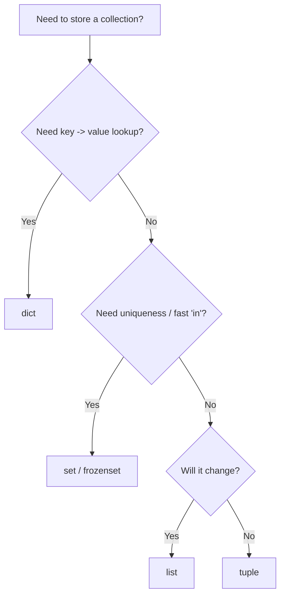
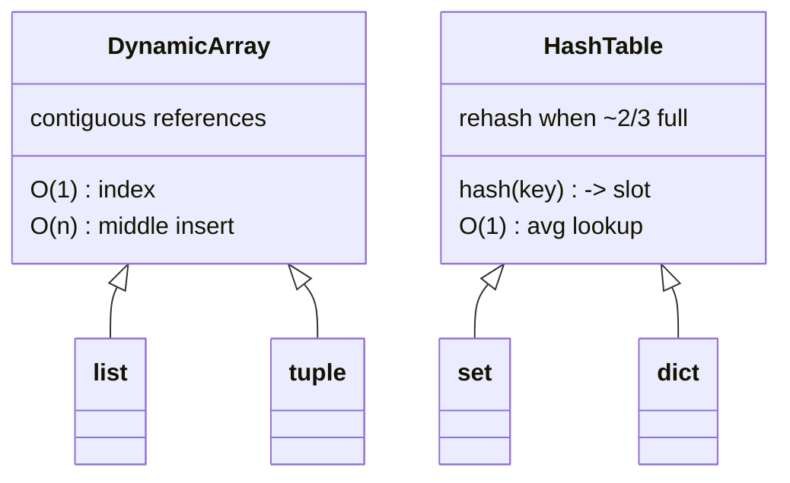

# Python Data Structures

> Learn how Python's built-in containers — list, tuple, set, dict — really work, when to reach for each, and the time complexities that decide your program's speed.

## Mental model

Every container is a trade-off between three questions: *Is it ordered? Can it change? How fast is lookup?* Lists give you order and mutation but slow membership tests. Sets and dicts give you near-instant lookups by sacrificing positional indexing. Tuples lock the data down so it can be hashed and trusted. Picking the right one is half about behaviour and half about Big-O.



The four core types map onto two underlying memory layouts: a **dynamic array** (list, tuple) and a **hash table** (set, dict).



## Core concepts

### Lists are dynamic arrays, not linked lists

A Python `list` is a contiguous block of pointers to objects, with a length and capacity stored in the header. Because it over-allocates room as it grows, `append` is **O(1) amortized**. But inserting or deleting in the middle shifts every following pointer, so those are **O(n)**.

```python
nums = [10, 20, 30]
nums.append(40)        # O(1) amortized -> [10, 20, 30, 40]
nums.insert(0, 5)      # O(n) shifts everything -> [5, 10, 20, 30, 40]
print(nums[2])         # O(1) index by position
nums[2] = 99           # O(1) assignment
print(20 in nums)      # O(n) linear scan
# => False  (we overwrote the 20 at index 2)
```

| Operation | Complexity |
| --- | --- |
| index / `a[i] = x` | O(1) |
| `append` / `pop()` (end) | O(1) amortized |
| `insert(i, x)` / `pop(0)` | O(n) |
| `x in a` / `remove(x)` | O(n) |
| slice `a[i:j]` | O(k) |

::: tip
If you find yourself doing `list.pop(0)` in a loop, you want a `collections.deque` instead — it pops from the left in O(1).
:::

### `append` vs `extend`, and the editing trio

`append(x)` adds `x` as a *single* element; a list argument becomes a nested list. `extend(iterable)` adds each element individually.

```python
a = [1, 2]; a.append([3, 4]); print(a)   # => [1, 2, [3, 4]]
b = [1, 2]; b.extend([3, 4]); print(b)   # => [1, 2, 3, 4]
```

Removal has three tools that beginners constantly mix up:

```python
items = [10, 20, 30, 20]
items.remove(20)   # removes the FIRST matching value -> [10, 30, 20]
x = items.pop(0)   # removes & RETURNS by index -> x=10, list=[30, 20]
del items[0]       # statement, removes by index/slice -> [20]
```

- `remove(value)` raises `ValueError` if the value is absent.
- `pop(index)` returns the item (default last).
- `del` is a statement that can also delete slices or whole variables.

### Tuples: immutable, hashable records

Tuples are fixed-length sequences. Their immutability makes them hashable, so they can be dict keys or set members. Immutability is **shallow**, though — a tuple can hold a mutable object.

```python
point = (34.05, -118.24)   # a fixed record
x, y = point               # unpacking
first, *rest = (1, 2, 3, 4)
print(first, rest)         # => 1 [2, 3, 4]

t = (1, [2, 3])
t[1].append(4)             # OK: mutating the inner list -> (1, [2, 3, 4])
# t[0] = 9                 # TypeError: can't rebind a tuple slot
```

For readable records, `namedtuple` gives fields without the overhead of a class:

```python
from collections import namedtuple
Point = namedtuple("Point", "x y")
p = Point(3, 4)
print(p.x, p[1])           # => 3 4
```

### Sets: uniqueness and O(1) membership

A `set` is a hash table storing unique elements with no defined order. Membership testing is **O(1) average** versus a list's O(n) — the single biggest reason to reach for one.

```python
users = {"alice", "bob"}
print("alice" in users)    # => True  (O(1))

a, b = {1, 2, 3}, {2, 3, 4}
print(a | b)               # union        => {1, 2, 3, 4}
print(a & b)               # intersection => {2, 3}
print(a - b)               # difference   => {1}
print(a ^ b)               # symmetric    => {1, 4}

empty = set()              # NOT {} — that builds an empty dict!
```

`remove` raises `KeyError` if the element is missing; `discard` is the safe variant; `pop` removes an arbitrary element. A `frozenset` is the immutable, hashable cousin that can live inside another set or as a dict key.

### Dicts: hash tables with insertion order

A `dict` maps hashable keys to values with O(1) average lookup. The key's hash chooses a slot; collisions are resolved with open addressing. Since Python 3.7, dicts **guarantee insertion order** via a compact entries array plus a sparse hash index.

```python
scores = {"Alice": 90, "Bob": 75, "Charlie": 95}

# Safe access for possibly-missing keys:
print(scores.get("Dana", 0))   # => 0  (no KeyError)

# Sort by value (highest first):
ranked = sorted(scores.items(), key=lambda kv: kv[1], reverse=True)
print(ranked)   # => [('Charlie', 95), ('Alice', 90), ('Bob', 75)]

# Merge (3.9+): right-hand side wins on clashes
print({"x": 1} | {"x": 9, "y": 2})   # => {'x': 9, 'y': 2}
```

For grouping and counting, `collections` has purpose-built helpers:

```python
from collections import defaultdict, Counter

words = ["apple", "ant", "bear", "ant"]
groups = defaultdict(list)
for w in words:
    groups[w[0]].append(w)     # no KeyError on first touch
print(dict(groups))            # => {'a': ['apple', 'ant', 'ant'], 'b': ['bear']}

print(Counter(words))          # => Counter({'ant': 2, 'apple': 1, 'bear': 1})
```

### Stacks, queues, and heaps

- **Stack (LIFO):** a plain `list` with `append`/`pop`.
- **Queue (FIFO):** `collections.deque` with `append`/`popleft`, both O(1).
- **Priority queue / top-k:** `heapq`, a binary min-heap with O(log n) push/pop.

```python
from collections import deque
import heapq

stack = []
stack.append(1); stack.append(2)
print(stack.pop())             # => 2  (last in, first out)

q = deque([1, 2])
print(q.popleft())             # => 1  (first in, first out, O(1))

h = []
heapq.heappush(h, 3); heapq.heappush(h, 1)
print(heapq.heappop(h))        # => 1  (smallest, O(log n))
print(heapq.nlargest(2, [5, 1, 8, 3]))   # => [8, 5]
```

### Strings: immutable sequences

Strings cannot be mutated in place, so every `+=` in a loop allocates a new object — O(n²) over the whole loop. Use `"".join(...)` instead, which is a single O(n) pass.

```python
# Building a palindrome check with idiomatic, C-backed methods:
def is_palindrome(s: str) -> bool:
    cleaned = "".join(c.lower() for c in s if c.isalnum())
    return cleaned == cleaned[::-1]

print(is_palindrome("A man, a plan, a canal: Panama"))   # => True
```

### Searching: linear vs binary

Linear search is O(n). Binary search is O(log n) but requires sorted data — use the built-in `bisect` module rather than hand-rolling it.

```python
from bisect import bisect_left

def binary_search(items, target):     # items must be sorted
    lo, hi = 0, len(items) - 1
    while lo <= hi:
        mid = (lo + hi) // 2
        if items[mid] == target:
            return mid
        elif items[mid] < target:
            lo = mid + 1
        else:
            hi = mid - 1
    return -1

data = [1, 3, 5, 7, 9]
print(binary_search(data, 7))   # => 3
print(bisect_left(data, 5))     # => 2  (built-in, C speed)
```

Python's own `sorted()` / `.sort()` use **Timsort**, a stable, adaptive hybrid of merge and insertion sort that runs O(n log n) and is especially fast on partially ordered data.

## Common pitfalls

- **`{}` makes a dict, not a set.** Use `set()` for an empty set.
- **`[[0]*3]*2` shares one inner list.** Mutating `grid[0][0]` changes every row. Build with a comprehension instead:
  ```python
  grid = [[0] * 3 for _ in range(2)]   # independent rows
  ```
- **`+=` on strings in a loop is quadratic.** Collect pieces in a list and `"".join` once.
- **Using a list for membership tests.** `x in big_list` is O(n); convert to a `set` first if you test repeatedly.
- **Mutating a list while iterating it** skips elements. Iterate a copy (`for x in items[:]`) or build a new list.
- **Unhashable keys.** A list or a tuple-containing-a-list can't be a dict key; use a tuple of immutables or a `frozenset`.

## Best practices

- Choose the structure by *both* behaviour and Big-O, not habit.
- Prefer `dict.get(k, default)` or `defaultdict` over `try/except KeyError` for missing keys.
- Use `deque` for queues, `heapq` for priority work — never `list.pop(0)` in hot loops.
- Reach for `collections` (`Counter`, `defaultdict`, `namedtuple`) before writing manual bookkeeping.
- Dedupe with `set()` when order is irrelevant, `dict.fromkeys()` when it must be preserved.
- Keep dict keys immutable so their hash never drifts.

## Interview quick-reference

| Topic | Key point |
| --- | --- |
| list vs tuple vs set | mutable-ordered / immutable-ordered / unique-fast-lookup |
| list internals | dynamic array; O(1) index, O(n) middle insert |
| `append` vs `extend` | one element vs each element of an iterable |
| dict internals | hash table, O(1) avg, insertion-ordered since 3.7 |
| missing keys | `.get()`, `defaultdict`, `in`, `try/except` |
| set ops | `|` `&` `-` `^` for union/intersect/diff/symmetric |
| `remove`/`discard`/`pop` | error / safe / arbitrary element |
| stack / queue / heap | `list` / `deque` / `heapq` |
| sorting | Timsort, stable, O(n log n), `key` + `reverse` |
| search | linear O(n); binary O(log n) on sorted via `bisect` |
| strings | immutable — use `"".join`, not `+=` |
| dedupe | `set()` (unordered) or `dict.fromkeys()` (ordered) |
