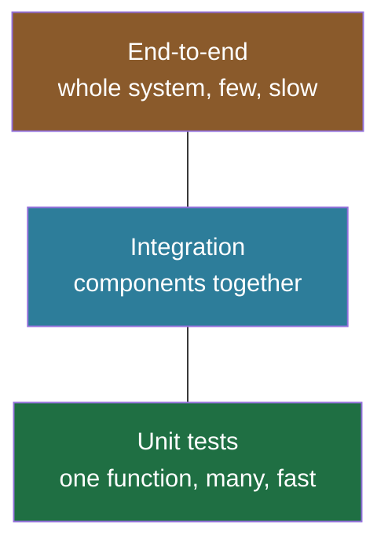

# Debugging & Testing in Python

> A practical tour of reading tracebacks, driving `pdb`, writing tests with `unittest` and `pytest`, mocking side effects, and profiling for speed and memory.

## Mental model

Debugging and testing are two sides of confidence. **Debugging** is reactive — something broke, you investigate state until you find why. **Testing** is proactive — you encode expected behavior so regressions announce themselves. Profiling is a specialized form of debugging for *performance* rather than correctness. A healthy project leans on the **test pyramid**: many fast unit tests at the base, fewer integration tests, and a thin layer of end-to-end tests.



## Core concepts

### Read the traceback first

When an unhandled exception fires, Python prints a traceback: the call stack at the moment of failure. Read it **bottom-up** — the last line is the exception type and message; the frames above show the call chain and exact line numbers.

```python
def divide(a, b):
    return a / b

def run():
    return divide(10, 0)

run()
# => Traceback (most recent call last):
#      File "x.py", line 7, in <module>  -> run()
#      File "x.py", line 5, in run        -> return divide(10, 0)
#      File "x.py", line 2, in divide     -> return a / b
#    ZeroDivisionError: division by zero   <- the actual cause
```

### Breakpoints and `pdb`

Since Python 3.7, calling `breakpoint()` drops you into the interactive debugger `pdb` at that line, where you can inspect and step through state.

```python
def buggy(values):
    total = 0
    for v in values:
        breakpoint()        # execution pauses here, opens pdb
        total += v
    return total

buggy([1, 2, 3])
```

Once inside, the essential commands:

| Command | Action |
| --- | --- |
| `n` | next line (step over) |
| `s` | step into a call |
| `c` | continue until next breakpoint |
| `l` | list source around current line |
| `p expr` | print an expression (e.g. `p total`) |
| `b 12` | set a breakpoint at line 12 |
| `q` | quit |

You can also launch a whole script under the debugger with `python -m pdb script.py`.

### Logging instead of `print`

`logging` beats scattered `print()` calls: it has severity levels, formatting, and can route to files or external systems — all toggleable without editing code.

```python
import logging

logging.basicConfig(
    level=logging.INFO,
    format="%(asctime)s %(levelname)s %(name)s: %(message)s",
)
log = logging.getLogger(__name__)

log.debug("not shown — below the configured INFO level")
log.info("service started")
log.error("payment failed for order 42")
# => 2026-06-28 10:00:00,000 INFO __main__: service started
# => 2026-06-28 10:00:00,001 ERROR __main__: payment failed for order 42
```

The levels in increasing severity are `DEBUG` < `INFO` < `WARNING` < `ERROR` < `CRITICAL`. The configured level filters out anything below it (the default is `WARNING`).

### Assertions for sanity checks

`assert condition, message` raises `AssertionError` when the condition is false. Great for internal invariants and tests — but **not** for production input validation, because `python -O` strips assertions entirely.

```python
def average(nums):
    assert nums, "list must not be empty"   # sanity check, not user validation
    return sum(nums) / len(nums)

average([])
# => AssertionError: list must not be empty
```

### Unit testing with `unittest`

The stdlib framework is class-based: subclass `TestCase`, write `test_*` methods, use `assert*` helpers.

```python
import unittest

def add(a, b):
    return a + b

class TestAdd(unittest.TestCase):
    def test_positive(self):
        self.assertEqual(add(2, 3), 5)

    def test_negative(self):
        self.assertEqual(add(-1, -1), -2)

if __name__ == "__main__":
    unittest.main()
# => Ran 2 tests ... OK
```

### `pytest`: less boilerplate

`pytest` uses plain `assert`, has rich introspection on failures, and supports fixtures and parametrization. It also runs `unittest` tests, making it the common modern choice.

```python
import pytest

def add(a, b):
    return a + b

@pytest.mark.parametrize("a,b,expected", [(2, 3, 5), (0, 0, 0), (-1, 1, 0)])
def test_add(a, b, expected):
    assert add(a, b) == expected      # one test body, three cases
# => 3 passed
```

### Fixtures: reusable setup/teardown

A fixture puts the system into a known state before a test (and can clean up after). In `pytest`, declare a fixture and request it by name as a parameter.

```python
import pytest

@pytest.fixture
def sample_user():
    user = {"id": 1, "name": "Sam"}     # setup
    yield user                          # value injected into the test
    # teardown code could go here after yield

def test_name(sample_user):             # fixture injected by name
    assert sample_user["name"] == "Sam"
# => 1 passed
```

### Mocking side effects

To test code that hits the network, a DB, or the clock, isolate the dependency with `unittest.mock.patch` so the test stays fast and deterministic.

```python
from unittest.mock import patch

def fetch_status(client):
    return client.get("/health").json()["status"]

@patch("requests.get")
def test_fetch(mock_get):
    mock_get.return_value.json.return_value = {"status": "ok"}
    import requests
    assert requests.get("/health").json()["status"] == "ok"
    mock_get.assert_called_once()       # verify the interaction
# => 1 passed
```

### Profiling for speed

Profile before optimizing. `cProfile` gives function-level CPU breakdowns; `timeit` micro-benchmarks small snippets.

```python
import cProfile

def expensive():
    return sum(i * i for i in range(1_000_00))

cProfile.run("expensive()")
# => shows ncalls, tottime, cumtime per function

import timeit
print(timeit.timeit("sum(range(100))", number=10000))
# => ~0.005   (seconds for 10,000 runs)
```

For deeper work: `line_profiler` for per-line timing, and `py-spy` as a sampling profiler that attaches to a running process without code changes.

### Measuring memory

`sys.getsizeof()` sizes a single object; `tracemalloc` (stdlib) snapshots allocations to find leaks and peaks.

```python
import sys, tracemalloc

print(sys.getsizeof([1, 2, 3]))   # => 88  (bytes, approximate)

tracemalloc.start()
data = [b"x" * 1024 for _ in range(1000)]
current, peak = tracemalloc.get_traced_memory()
print(f"current={current} peak={peak}")
# => current=~1050000 peak=~1050000   (bytes)
tracemalloc.stop()
```

### Tracing code flow

`sys.settrace()` installs a hook called on events like function calls — the mechanism behind coverage and tracing tools.

```python
import sys

def tracer(frame, event, arg):
    if event == "call":
        print("call:", frame.f_code.co_name)
    return tracer

sys.settrace(tracer)
def greet(): return "hi"
greet()
sys.settrace(None)              # always disable when done
# => call: greet
```

## Common pitfalls

- **Using `assert` for production validation.** Stripped by `-O`. Fix: raise explicit exceptions (`if not x: raise ValueError(...)`).
- **Tests that hit real services.** Slow and flaky. Fix: mock external calls with `patch`; keep real dependencies for a few integration tests.
- **Patching the wrong path.** `@patch` must target where the name is *looked up*, not where it's defined (`patch("mymodule.requests.get")`, not `patch("requests.get")` if `mymodule` imported it).
- **`print` debugging left in code.** Fix: use `logging` with levels you can silence in production.
- **Optimizing by guess.** Fix: profile with `cProfile`/`py-spy` first; let data point at the hot path.
- **Forgetting `sys.settrace(None)`.** Leaves the tracer slowing everything. Always disable it.

## Best practices

- Read the traceback bottom-up before touching anything.
- Prefer `breakpoint()` over `print`; prefer `logging` over both for anything persistent.
- Default to `pytest` with fixtures and `parametrize`; mock at the boundary, not the core logic.
- Follow the test pyramid: lots of unit tests, fewer integration, fewest E2E; run them in CI.
- Profile before optimizing; measure memory with `tracemalloc`, not intuition.

## Interview quick-reference

| Topic | Key point |
| --- | --- |
| Traceback | Read bottom-up; last line is the exception cause |
| `pdb` | `breakpoint()`; `n` step over, `s` step in, `c` continue, `p` print, `q` quit |
| Logging levels | DEBUG < INFO < WARNING < ERROR < CRITICAL; default filter is WARNING |
| Assertions | Sanity checks only; stripped by `-O` |
| `unittest` vs `pytest` | Class-based stdlib vs plain-assert third-party with fixtures/parametrize |
| Fixtures | Reusable known-state setup/teardown, injected by name |
| Mocking | `unittest.mock.patch` the dependency where it's looked up |
| Profiling | `cProfile`/`timeit`/`line_profiler`/`py-spy`; profile before optimizing |
| Memory | `sys.getsizeof`, `tracemalloc`, `memory_profiler` |
| Test types | Unit → integration → functional → end-to-end (the pyramid) |
