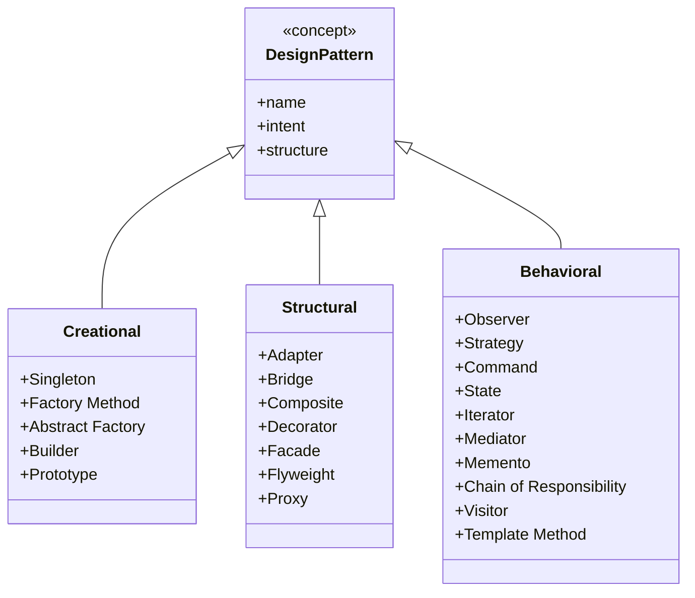
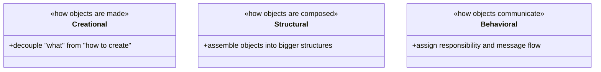

# Design Patterns in Python: The Big Picture

> Learn what design patterns really are, the three classic GoF categories, and how Python's dynamic features often let you reach for a lighter solution.

## Mental model

A design pattern is **a named, reusable solution to a recurring design problem**. It is not a library you import or code you copy-paste — it is a *template* for how to arrange classes and objects so they collaborate cleanly. The real payoff is a shared vocabulary: saying "let's make that a Strategy" communicates an entire structure in one word.

The Gang of Four (GoF) sorted 23 patterns into three buckets based on *what problem they tackle*:



::: tip Read these in order
This page is the overview. Each category has its own deep-dive tutorial: **Creational**, **Structural**, and **Behavioral**. Start here to build the map, then drill in.
:::

## Core concepts

### What problem does each category solve?



- **Creational** — *object creation*. Hide the `new`/constructor call so client code does not hard-wire concrete classes. Examples: `Singleton`, `Factory Method`, `Builder`.
- **Structural** — *composition*. Combine classes and objects into larger structures while keeping them flexible. Examples: `Adapter`, `Decorator`, `Facade`.
- **Behavioral** — *communication*. Define how objects distribute responsibility and talk to each other. Examples: `Strategy`, `Observer`, `Command`.

### A taste of each category

Here is one tiny, runnable example from each bucket so the categories feel concrete before you dive deeper.

```python
from __future__ import annotations
from typing import Callable


# --- Creational: a Factory function picks the concrete class ---
class Dog:
    def speak(self) -> str:
        return "Woof"


class Cat:
    def speak(self) -> str:
        return "Meow"


def make_animal(kind: str) -> Dog | Cat:
    # Callers ask for a "dog", not for the Dog class — easy to extend.
    registry = {"dog": Dog, "cat": Cat}
    return registry[kind]()


# --- Structural: a Facade hides a messy subsystem behind one call ---
class Engine:
    def start(self) -> None:
        print("engine on")


class Lights:
    def on(self) -> None:
        print("lights on")


class CarFacade:
    def __init__(self) -> None:
        self._engine = Engine()
        self._lights = Lights()

    def drive(self) -> None:           # one simple entry point
        self._engine.start()
        self._lights.on()
        print("driving")


# --- Behavioral: Strategy swaps an algorithm at runtime ---
def sort_with(data: list[int], strategy: Callable[[list[int]], list[int]]) -> list[int]:
    return strategy(data)


make_animal("dog").speak()                 # 'Woof'
CarFacade().drive()                        # engine on / lights on / driving
sort_with([3, 1, 2], sorted)               # [1, 2, 3] — a function is a strategy
```

::: tip The Pythonic twist
Notice the Strategy example passed `sorted` directly. Because Python has **first-class functions**, many "pattern as a class hierarchy" recipes collapse into a single function or a `dict`. We will flag this lighter alternative in every pattern that has one.
:::

### The Singleton: the most over-used pattern

`Singleton` guarantees a class has exactly one instance with a global access point — think a config object or a connection pool. It is worth understanding *because you should usually avoid it*: it is global state in disguise.

```python
class Singleton:
    _instance: "Singleton | None" = None

    def __new__(cls) -> "Singleton":
        # __new__ runs before __init__ and controls instance creation.
        if cls._instance is None:
            cls._instance = super().__new__(cls)
        return cls._instance


a = Singleton()
b = Singleton()
print(a is b)   # True — both names point at the same object
```

::: warning A module is already a singleton
In Python, an imported module is created once and cached in `sys.modules`. Putting state in a module (or using a module-level instance) gives you singleton semantics without the testing headaches. Reach for the class-based `Singleton` only when you genuinely need lazy creation behind a class API.
:::

### Patterns are guidelines, not laws

The GoF book described patterns for C++ and Smalltalk in 1994. Many were workarounds for language limitations that Python simply does not have:

- `Iterator` is built into the language (`__iter__`/`__next__`, generators).
- `Strategy`, `Command`, and `Template Method` often reduce to passing functions.
- `Decorator` (structural) overlaps conceptually with the `@decorator` syntax.

So treat patterns as a *diagnosis toolkit*: recognize the problem, then choose the lightest construct that solves it.

## Common pitfalls

- **Pattern-itis (over-engineering).** Adding a `Factory`, `Builder`, and `AbstractFactory` for a two-field class. Fix: apply a pattern only when you feel real pain (duplication, rigid `if/elif` chains, change ripples).
- **Singletons everywhere.** They hide dependencies and wreck unit tests. Fix: pass dependencies in (dependency injection) or use a module-level value.
- **Forcing Java idioms.** Writing abstract base classes and interfaces where a function would do. Fix: ask "could this be a function, a `dict`, or a `dataclass`?" first.
- **Copy-pasting structure without intent.** Memorizing UML but not the *problem* a pattern solves leads to wrong fits. Fix: learn each pattern's intent sentence.

## Best practices

- Learn the **intent** of each pattern, not just its diagram.
- Prefer the simplest tool: function → `dataclass` → small class → full pattern.
- Use patterns to **communicate**: name them in code reviews and docstrings.
- Combine patterns freely (a `Factory` that builds `Strategy` objects is common).
- Keep concrete classes out of client code — depend on abstractions/interfaces.

## Interview quick-reference

| Category | Pattern | Intent (one line) | Tiny example |
| --- | --- | --- | --- |
| Creational | Singleton | One instance, global access | shared config / connection pool |
| Creational | Factory Method | Defer which class to instantiate to subclasses | `make_animal("dog")` |
| Creational | Builder | Build a complex object step by step | fluent SQL query builder |
| Structural | Adapter | Make an incompatible interface fit | wrap an XML logger as a JSON logger |
| Structural | Facade | Simple front door to a complex subsystem | `CarFacade().drive()` |
| Structural | Decorator | Add behavior by wrapping, not subclassing | coffee + milk + vanilla |
| Behavioral | Strategy | Swap interchangeable algorithms at runtime | pass `sorted` as a function |
| Behavioral | Observer | Notify many subscribers on state change | weather station updates displays |
| Behavioral | Command | Encapsulate a request as an object | undo/redo history |

::: tip Next steps
Dive into the category tutorials to see every pattern above (plus Abstract Factory, Prototype, Bridge, Composite, Flyweight, Proxy, State, Iterator, Mediator, Memento, Chain of Responsibility, Visitor, and Template Method) with full runnable implementations.
:::
