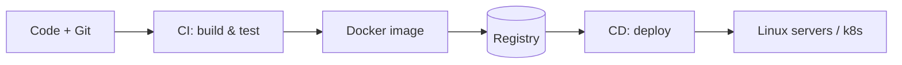
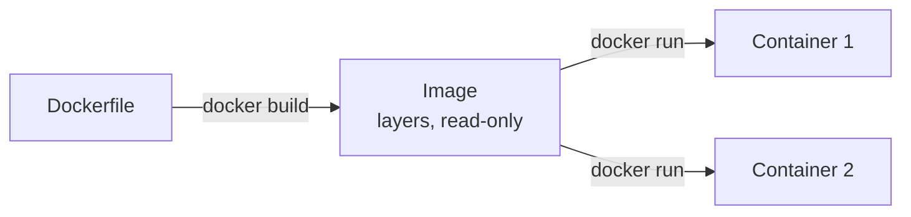
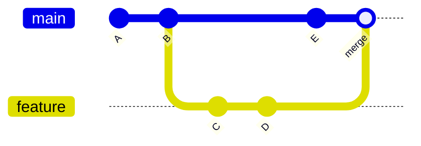
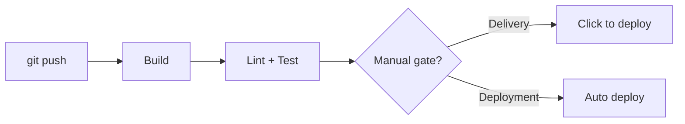

# DevOps, Git & Linux

> The operational toolkit every backend engineer needs: containerizing apps with Docker, collaborating with Git, navigating Linux, and shipping safely through CI/CD.

## Mental model

DevOps is about moving code from your laptop to production **reliably and repeatably**.
Three skills underpin it: **Docker** packages the app so it runs the same everywhere, **Git**
coordinates changes, and **CI/CD** automates the path from commit to deploy — all on top of
**Linux**, where it runs.



## Docker

### Image vs container

An **image** is an immutable, layered template (your app + dependencies + runtime). A
**container** is a running instance of that image — like a class vs an object. One image,
many containers.

```bash
docker build -t myapp:1.0 .      # image from a Dockerfile
docker run -d -p 8000:8000 myapp:1.0   # start a container
docker ps                        # list running containers
```



### Docker Compose

Compose defines **multi-container** apps in one `docker-compose.yml` — your API, database,
and cache started together with one command, sharing a network.

```yaml
services:
  web:
    build: .
    ports: ["8000:8000"]
    depends_on: [db]
  db:
    image: postgres:16
    environment:
      POSTGRES_PASSWORD: secret
```

```bash
docker compose up -d     # start the whole stack
docker compose down      # tear it down
```

### Optimizing an image for production

```dockerfile
# Multi-stage build: heavy build tools stay out of the final image
FROM python:3.12-slim AS build
WORKDIR /app
COPY requirements.txt .
RUN pip install --no-cache-dir -r requirements.txt

FROM python:3.12-slim
WORKDIR /app
COPY --from=build /usr/local/lib/python3.12/site-packages /usr/local/lib/python3.12/site-packages
COPY . .
USER 1000                    # don't run as root
CMD ["gunicorn", "-b", "0.0.0.0:8000", "app:app"]
```

::: tip Image-size wins
Use a **slim/alpine** base, a **multi-stage** build, a `.dockerignore`, and order layers
from least- to most-frequently-changed (copy `requirements.txt` and install **before**
copying source) so the dependency layer stays cached across rebuilds.
:::

## Git

**Git** is a distributed version-control system: every clone is a full repository with its
own history, enabling offline work, branching, and collaboration.

### `merge` vs `rebase`

Both integrate one branch into another, differently:

- **`git merge`** creates a merge commit, preserving the true, branching history.
- **`git rebase`** replays your commits on top of the target, producing a **linear** history
  — cleaner, but it **rewrites commit hashes**.



::: danger Golden rule of rebase
Never rebase commits that have been **pushed and shared** — rewriting public history breaks
everyone else's clones. Rebase only your own local, unpushed work.
:::

### A common branching workflow

**GitHub Flow**: `main` is always deployable; create a short-lived feature branch, open a
pull request, get review + CI, then merge.

```bash
git switch -c feature/login      # branch off main
# ...commit work...
git push -u origin feature/login # open a PR from this
```

### Resolving a complex merge conflict

```bash
git merge main                   # conflict reported
git status                       # see conflicted files
# edit files: keep the right code, remove <<<< ==== >>>> markers
git add resolved_file.py
git commit                       # finalize the merge
```

Use `git mergetool` for a visual diff, and `git merge --abort` to bail out and start over.

## Linux

### Daily commands

```bash
ls -la           # list with details
cd / pwd         # navigate / print working dir
grep -r "TODO" . # recursive search
find . -name "*.log" -mtime +7   # files older than 7 days
ps aux | grep python             # find processes
tail -f app.log                  # follow a live log
```

### File permissions

Permissions are three triads — **owner / group / others** — each granting read(4),
write(2), execute(1). `chmod 754 file` = owner rwx(7), group r-x(5), others r--(4).

```bash
chmod 640 secret.env   # owner rw, group r, others none
chown alice:devs app.py
ls -l app.py           # -rw-r----- 1 alice devs ...
```

### Pipes and redirection

A **pipe** `|` feeds one command's stdout into the next's stdin; **redirection** sends
streams to/from files (`>` overwrite, `>>` append, `2>` stderr, `<` input).

```bash
cat access.log | grep 500 | wc -l        # count 500 errors
python job.py > out.log 2> err.log       # split stdout/stderr
```

### Investigating high CPU/memory

```bash
top            # or htop — live process view, sort by CPU/MEM
ps aux --sort=-%cpu | head     # top CPU consumers
kill -9 <pid>  # last resort; prefer kill -15 (graceful)
```

## CI/CD

- **Continuous Integration (CI)** — every push is automatically built and tested, catching
  breakage early and keeping `main` green.
- **Continuous Delivery** — every passing build is *deployable* with a one-click/manual
  approval to production.
- **Continuous Deployment** — every passing build is **automatically** released to
  production, no human gate.



```yaml
# .github/workflows/ci.yml — minimal GitHub Actions pipeline
name: CI
on: [push]
jobs:
  test:
    runs-on: ubuntu-latest
    steps:
      - uses: actions/checkout@v4
      - uses: actions/setup-python@v5
        with: { python-version: "3.12" }
      - run: pip install -r requirements.txt
      - run: pytest -q
```

## Common pitfalls

- **Running containers as root** — a breakout = host root. Add a non-root `USER`.
- **Rebasing shared branches** — rewrites public history; use merge there.
- **`chmod 777`** — world-writable; almost never correct. Grant least privilege.
- **`COPY . .` before installing deps** — busts the dependency cache on every code change.
- **No tests in CI** — CI becomes a build-only rubber stamp; gate merges on tests.
- **`kill -9` first** — skips graceful shutdown; try `kill -15` (SIGTERM) first.

## Best practices

- Use multi-stage builds, slim bases, and a `.dockerignore` to keep images small.
- Pin base-image and dependency versions for reproducible builds.
- Keep `main` deployable; use short-lived feature branches and PR review.
- Make CI fast and required; fail the build on lint or test failure.
- Store secrets in the CI/CD secret store or a vault, never in the repo.

## Interview quick-reference

| Concept | One-liner |
| --- | --- |
| Image vs container | Template vs running instance (class vs object) |
| Docker Compose | Multi-container apps via one YAML file |
| Slim images | Multi-stage build + slim base + `.dockerignore` |
| `merge` vs `rebase` | Merge commit (true history) vs linear replay (rewrites hashes) |
| Rebase rule | Never rebase shared/pushed commits |
| Permissions | owner/group/other × r(4)/w(2)/x(1) |
| Pipe vs redirect | `|` chains stdout→stdin; `>`,`>>`,`2>`,`<` to/from files |
| High CPU triage | `top`/`htop`, `ps aux --sort=-%cpu` |
| CI vs CD | Auto build+test vs auto/manual deploy |
