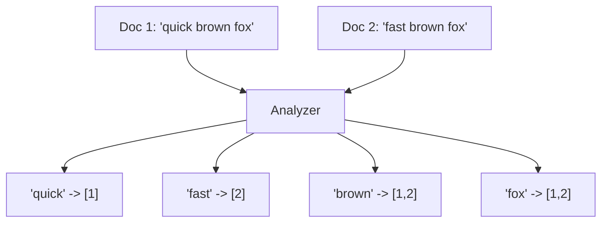
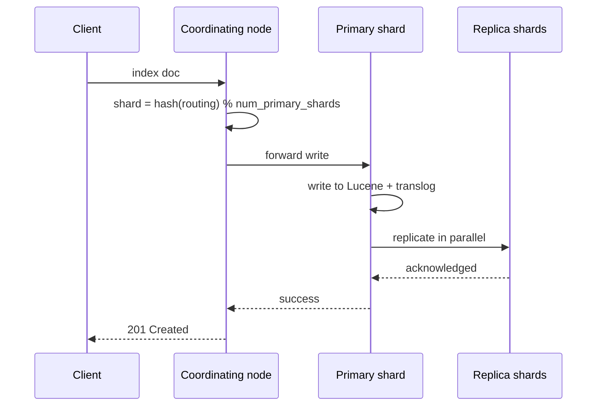

# Elasticsearch & Search Architectures

> Understand how Elasticsearch turns text into a searchable inverted index, scores relevance, shards data across a cluster, and how to model, query, and tune it for real workloads.

## Mental model

Elasticsearch is a distributed search engine built on Apache Lucene. The single most important idea is the **inverted index**: instead of scanning documents for a word, it pre-builds a map from each *term* to the list of documents containing it — like the index at the back of a book. Searching becomes a set intersection, not a linear scan.



Data is divided into **shards** (each a self-contained Lucene index) spread across nodes, with **replicas** for fault tolerance and read scaling. A **master node** owns the cluster state (mappings, routing). Writes flow through a coordinating node to a primary shard and out to replicas.



## Core concepts

### Analyzers — turning text into terms

An analyzer runs a three-stage pipeline at index time (and query time for `match`): **character filters** → **one tokenizer** → **token filters**.

```python
from elasticsearch import Elasticsearch
es = Elasticsearch("http://localhost:9200")

# Test what an analyzer produces, without indexing anything.
resp = es.indices.analyze(body={
    "analyzer": "english",        # standard tokenizer + lowercase + stop + stemmer
    "text": "The Quick Brown Foxes are Jumping"
})
print([t["token"] for t in resp["tokens"]])
# -> ['quick', 'brown', 'fox', 'jump']   (lowercased, stop-words removed, stemmed)
```

Components in order: character filters (e.g. strip HTML, map `&`→`and`), exactly one tokenizer (split on whitespace/punctuation), then token filters (`lowercase`, `stop`, `snowball` stemmer).

### text vs keyword fields

The same string can be indexed two ways — usually you map both via a multi-field.

```python
mapping = {
  "mappings": {"properties": {
    "city": {
      "type": "text",                          # analyzed: "New York" -> ["new","york"]
      "fields": {"raw": {"type": "keyword"}}    # not analyzed: kept as "New York"
    }
  }}
}
es.indices.create(index="places", body=mapping)
# Use city for full-text search; city.raw for exact filters, sorting, aggregations.
```

`text` enables full-text matching but cannot aggregate efficiently (needs fielddata, risks OOM). `keyword` is a single exact token using on-disk **doc values** — ideal for filters, sorting, and aggregations.

### match vs term queries

The difference is whether the search input is analyzed.

```python
# match: analyzed the SAME way as the field -> "Quick Foxes" becomes ["quick","fox"].
es.search(index="places", body={"query": {"match": {"city": "new YORK"}}})

# term: NOT analyzed -> looks for the literal token. Use on keyword/structured fields.
es.search(index="places", body={"query": {"term": {"city.raw": "New York"}}})
# A term query for "New York" on the analyzed `city` field would find NOTHING,
# because the index only holds the tokens "new" and "york".
```

### Relevance scoring: TF-IDF vs BM25

Both score relevance from term frequency and rarity; **BM25** (the modern default) improves on TF-IDF two ways:

- **TF saturation** (`k1`): the 100th occurrence of a word barely beats the 5th, capping keyword stuffing.
- **Length normalization** (`b`): a match in a short tweet outranks the same match buried in a 500-page book.

### Query vs filter context

```python
query = {"query": {"bool": {
    "must":   [{"match": {"title": "architecture"}}],   # query context: scored
    "filter": [{"term":  {"status": "published"}},       # filter context: yes/no, cached
               {"range": {"date": {"gte": "2026-01-01"}}}],
    "should": [{"match": {"body": "scaling"}}],           # boosts score if matched
    "must_not":[{"term": {"category": "deprecated"}}]     # filter context, excluded
}}}
es.search(index="articles", body=query)
```

`bool` has four occurrence types: **must** (AND, scored), **filter** (AND, no score, cached), **should** (OR, boosts score), **must_not** (NOT, filter context). Put structured yes/no conditions in `filter` — Elasticsearch skips scoring and caches the result, so repeats are near-instant.

### Sharding and routing

An index has a fixed number of primary shards chosen at creation. A document's shard is `hash(_routing) % num_primary_shards` (routing defaults to `_id`).

```python
es.indices.create(index="logs", body={
    "settings": {"number_of_shards": 3, "number_of_replicas": 1}
})
```

::: warning Primary shard count is immutable
Because `num_primary_shards` is the modulo divisor, changing it would re-route every existing document and they'd become unfindable. To change it you must **reindex** into a new index. Size shards up front (aim for tens of GB per shard).
:::

### Doc values vs fielddata

For sorting and aggregations, Elasticsearch needs the *opposite* of an inverted index — a doc-to-terms map.

- **Doc values** — columnar, built at index time, stored **on disk** (OS-cached). Default for `keyword`, numbers, dates. Scalable.
- **Fielddata** — built on the fly at query time, held in **JVM heap**. Used for analyzed `text` fields, off by default, and a fast path to OutOfMemory.

**Rule of thumb:** never enable fielddata; aggregate on a `keyword` sub-field instead.

### Updates and segment merging

Lucene segments are immutable, so an "update" is a delete-plus-reinsert.

```python
es.update(index="logs", id=1, body={"doc": {"status": "done"}})
# 1. fetch old doc, 2. apply change in memory,
# 3. mark old doc deleted in a .del file (still on disk, filtered from results),
# 4. index the new version into a fresh segment.
```

Refreshes constantly create tiny segments; searching must hit *every* segment, so **segment merging** runs in the background to combine small segments into larger ones and physically purge deleted docs. Merging is I/O/CPU heavy and can throttle indexing under write-heavy load.

### Pagination for deep result sets

```python
# from/size: simple, but each shard must build `from+size` hits — fails deep.
es.search(index="events", body={"from": 0, "size": 10})  # capped at 10,000

# search_after: efficient deep paging; feed the previous page's sort values.
first = es.search(index="events", body={
    "size": 10, "sort": [{"timestamp": "asc"}, {"_id": "asc"}]  # tie-breaker required
})
last_sort = first["hits"]["hits"][-1]["sort"]
nxt = es.search(index="events", body={
    "size": 10, "sort": [{"timestamp": "asc"}, {"_id": "asc"}],
    "search_after": last_sort
})
```

Use `from`/`size` for shallow UI pages (capped at `index.max_result_window`, default 10,000), `search_after` (ideally with a Point-in-Time) for deep user paging, and the Scroll API only for bulk export/reindex.

### Modeling relationships: nested vs parent-child

Elasticsearch has no SQL joins, so 1-to-N relations are modeled two ways:

- **Nested objects** — an array of sub-objects stored as hidden Lucene docs co-located with the parent. Fast queries, but updating one child reindexes the *whole* parent. Use for small, stable sub-objects.
- **Parent-child (`join` type)** — separate documents routed to the same shard. Children update independently, but query-time joins are far slower. Use for many, frequently-changing children.

### Autocomplete


Options, fastest-to-build vs fastest-to-query: `match_phrase_prefix` (easy, can be slow), **edge n-grams** (index `s,se,sea,...`, trade storage for speed), the **completion suggester** (in-memory FST, blazing but rigid), or `search_as_you_type` fields (modern balanced default).

## Common pitfalls

- **Mapping explosion.** Dynamic keys (UUIDs/user-ids as JSON field names) create thousands of fields, bloating the cluster state that the single master must sync — the cluster can grind to a halt. Use `dynamic: strict`/`false`, the `flattened` type, or restructure `{"u_123":"admin"}` into `[{"id":"123","role":"admin"}]`.
- **`term` on an analyzed field.** Returns nothing because the field holds tokens, not the literal string. Use `match`, or `term` on the `keyword` sub-field.
- **Aggregating/sorting on `text`.** Triggers fielddata and OOM risk; target the `.keyword` sub-field.
- **Deep `from`/`size` paging.** Coordinating node sorts everything up to `from+size`; switch to `search_after`.
- **Too many small shards.** Each shard has fixed overhead; over-sharding wastes heap. Aim for tens of GB per shard.
- **Self-assigned `_id` on logs.** Forces a uniqueness check (a disk read) per write; let ES auto-generate IDs for ingestion throughput.

## Best practices

- Map strings as multi-fields: `text` for search, `keyword` for filters/aggregations.
- Put structured conditions in `filter` context to skip scoring and exploit caching.
- For write-heavy logging: use the Bulk API, raise `refresh_interval` to 30–60s, drop replicas during backfill, and roll indices with ILM.
- Choose primary shard count deliberately at creation; reindex to change it.
- Avoid fielddata entirely; aggregate on keyword fields backed by doc values.
- Rely on ES 7.x+ automatic quorum-based coordination to prevent split-brain.

## Interview quick-reference

| Topic | Key point |
|-------|-----------|
| Inverted index | term → document list; search is set intersection |
| Analyzer | char filters → 1 tokenizer → token filters |
| text vs keyword | analyzed full-text vs exact, sortable, aggregatable |
| match vs term | input analyzed vs literal exact token |
| TF-IDF vs BM25 | BM25 adds TF saturation (`k1`) + length norm (`b`) |
| Query vs filter | scored/uncached vs yes-no/cached |
| bool query | must, filter, should, must_not |
| Routing | `hash(_routing) % num_primary_shards`, shards immutable |
| Doc values vs fielddata | on-disk default vs JVM-heap (OOM risk) |
| Updates | delete + reinsert; segment merging purges deletes |
| Pagination | from/size shallow, search_after deep, scroll for export |
| nested vs parent-child | co-located fast / independent but slow joins |
| Autocomplete | edge n-grams or completion suggester (FST) |
| Mapping explosion | dynamic keys bloat cluster state; use strict/flattened |
| Replicas | boost reads + fault tolerance, cost write throughput |
| Split-brain | ES 7.x+ Raft-like quorum auto-manages voting |
