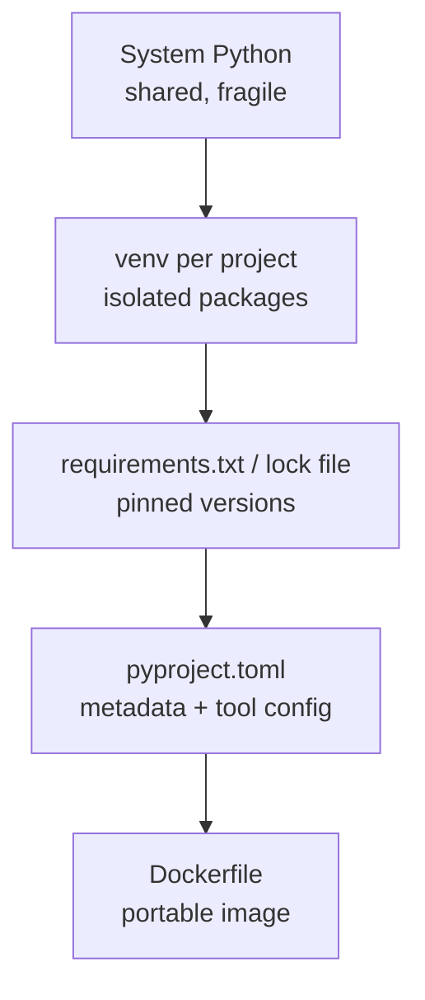

# Environments & Configuration

> Isolate dependencies with virtual environments, pin them for reproducibility, configure projects with `pyproject.toml`, and ship them in Docker — plus the env vars that change how Python itself behaves.

## Mental model

Two projects on one machine will eventually disagree about which version of a library they need. The answer is **isolation**: give every project its own virtual environment so its packages can't collide with the system Python or with each other. Around that core idea sit three more layers — **pinning** (lock the exact versions so installs are reproducible), **declaring** (describe the project in `pyproject.toml`), and **containerizing** (Docker bundles the interpreter, packages, and OS libs into one portable image).



## Core concepts

### Virtual environments with `venv`

A virtual environment is an isolated Python install with its own `site-packages`. `venv` ships with the standard library (3.3+) and is the default choice.

```bash
python -m venv .venv            # create an env in ./.venv
source .venv/bin/activate       # activate on Linux/macOS
# .venv\Scripts\activate        # activate on Windows
python -m pip install requests  # installs into the env, not the system
deactivate                      # leave the env
```

```python
# Verify you're inside an isolated env at runtime:
import sys
print(sys.prefix != sys.base_prefix)
# => True   (prefix differs from base_prefix when a venv is active)
```

::: tip
Create one environment per project and never `pip install` into the system Python. Add `.venv/` to `.gitignore` — you reproduce it from your requirements file, you don't commit it.
:::

### Installing and pinning packages

`pip` installs packages; faster drop-in tools like `uv` do the same. Pinning a version makes builds repeatable.

```bash
pip install requests                 # latest compatible
pip install "django==5.0"            # exact pin
pip list                             # what's installed
```

To reproduce the exact set everywhere, freeze and reinstall:

```bash
pip freeze > requirements.txt        # capture exact versions
pip install -r requirements.txt      # recreate on another machine/CI
```

Commit `requirements.txt` (or a lock file from Poetry/uv/PDM). That file is the contract that makes "works on my machine" reproducible.

### `pyproject.toml` vs `setup.py`

`pyproject.toml` (PEP 517/518) is the modern, **declarative** standard for project configuration. It replaces the old `setup.py`, which executed arbitrary Python to build a package. One file now holds build requirements, project metadata, and tool config.

```toml
[build-system]
requires = ["hatchling"]
build-backend = "hatchling.build"

[project]
name = "myapp"
version = "0.1.0"
requires-python = ">=3.11"
dependencies = ["requests>=2.31", "pydantic>=2"]

[tool.pytest.ini_options]            # tools read their config from here too
addopts = "-q"

[tool.ruff]
line-length = 100
```

Because it's data, not code, it's safe to parse and tools can read it without executing your project.

### The tools compared: `venv`, `virtualenv`, Conda

- **`venv`** — stdlib, lightweight, per-project; the default for most apps.
- **`virtualenv`** — the older third-party tool `venv` was modeled on; a bit faster, more features, supports older Pythons.
- **Conda** — a language-agnostic package *and* environment manager (Anaconda/Miniconda) that can install non-Python binaries like C libraries and CUDA. Popular in data science where native dependencies are common.

### Key Python environment variables

These change the interpreter's behavior without code changes:

| Variable | Effect |
| --- | --- |
| `PYTHONPATH` | Extra directories to search for modules (like the OS `PATH`) |
| `PYTHONSTARTUP` | Script run automatically when the interactive REPL starts |
| `PYTHONHOME` | Alternative location of the standard library |
| `PYTHONDONTWRITEBYTECODE` | If set, don't write `.pyc` files |
| `PYTHONCASEOK` | (Windows) allow case-insensitive module imports |

```python
import os
# Inspect them at runtime:
print(os.environ.get("PYTHONPATH", "<unset>"))
# => <unset>   (unless you exported it)
```

### Checking the Python version

From the shell or at runtime — use `sys.version_info` for comparisons.

```bash
python --version        # or: python -V  ->  Python 3.13.0
```

```python
import sys
print(sys.version_info >= (3, 11))   # easy, robust comparison
# => True
print(sys.version.split()[0])        # full string -> '3.13.0'
```

### Loading configuration and secrets

Keep configuration out of code. Read secrets from the environment, with `python-dotenv` loading a git-ignored `.env` during development. Fail fast when a required value is missing.

```python
import os
# from dotenv import load_dotenv
# load_dotenv()                       # loads .env in dev (not committed)

api_key = os.getenv("API_KEY")
if not api_key:
    raise RuntimeError("API_KEY not set")    # fail fast, don't run half-configured

debug = os.getenv("DEBUG", "false").lower() == "true"   # typed with a default
print(debug)
# => False
```

### Docker for Python

A `Dockerfile` packages the interpreter, your pinned dependencies, and the OS libraries into one image that runs identically anywhere. Copy `requirements.txt` first so Docker caches the dependency layer separately from your code.

```dockerfile
FROM python:3.13-slim
WORKDIR /app

# Copy and install deps first — this layer is cached unless requirements change.
COPY requirements.txt .
RUN pip install --no-cache-dir -r requirements.txt

# Then copy the app code (changes often, so it comes after).
COPY . .

ENV PYTHONDONTWRITEBYTECODE=1 PYTHONUNBUFFERED=1
CMD ["python", "app.py"]
```

```bash
docker build -t myapp .
docker run --env-file .env myapp     # inject secrets at runtime, not build time
```

## Common pitfalls

- **Installing into the system Python.** Pollutes the global install and breaks other projects. Fix: always activate a `venv` first.
- **Committing `.venv/` or `.env`.** The env is reproducible from requirements; `.env` holds secrets. Fix: `.gitignore` both.
- **Unpinned dependencies.** `pip install requests` today and next month can differ. Fix: pin in `requirements.txt` / a lock file and commit it.
- **Baking secrets into the image.** Anyone with the image can read them. Fix: pass secrets at runtime with `--env-file` or an orchestrator's secret store.
- **Copying code before installing deps in Docker.** Invalidates the dependency cache on every code change. Fix: copy `requirements.txt` and install *before* `COPY . .`.
- **Relying on system-installed C libs in data projects.** Fix: Conda when you need native binaries (CUDA, MKL).

## Best practices

- One `venv` per project; activate it before anything else.
- Pin dependencies and commit the lock/requirements file for reproducible installs.
- Describe the project in `pyproject.toml` and put tool config (ruff, pytest) there too.
- Read all configuration from environment variables; fail fast on missing required ones.
- Keep `.env` out of git; use a secrets manager in production.
- In Docker, install dependencies in a cached layer, run as a non-root user, and inject secrets at runtime.

## Interview quick-reference

| Topic | Key point |
| --- | --- |
| Virtual environment | Isolated per-project packages; avoids dependency conflicts |
| `venv` commands | `python -m venv .venv` → `source .venv/bin/activate` → `deactivate` |
| Pinning deps | `pip freeze > requirements.txt`; `pip install -r`; commit the file |
| `pyproject.toml` | PEP 517/518 declarative config; replaces code-executing `setup.py` |
| venv / virtualenv / Conda | stdlib lightweight / older third-party / language-agnostic w/ native libs |
| Env variables | `PYTHONPATH`, `PYTHONSTARTUP`, `PYTHONHOME`, `PYTHONDONTWRITEBYTECODE`, `PYTHONCASEOK` |
| Version check | `python -V`; `sys.version_info` for comparisons |
| Secrets | `os.getenv` + `python-dotenv` in dev; fail fast; secrets manager in prod |
| Docker | `python:slim` base; deps layer before code; inject secrets at runtime |
