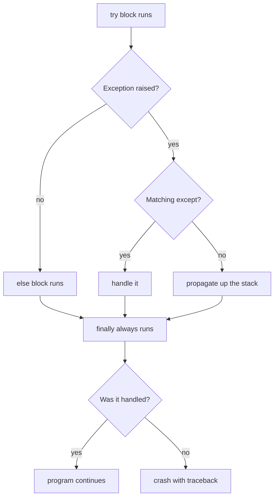
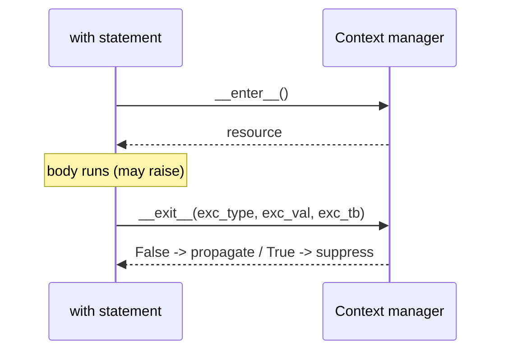

# Errors & Exceptions

> Learn to handle failures the Pythonic way — `try`/`except`/`else`/`finally`, custom exceptions, exception chaining, and context managers for bulletproof resource cleanup.

## Mental model

An **exception** is an event that disrupts normal flow at runtime — a missing key, a bad type, division by zero. Python raises an exception *object* that travels up the call stack until something catches it; if nothing does, the program crashes with a traceback. Exceptions are for *exceptional* conditions, not routine control flow.



## Core concepts

### The full `try` / `except` / `else` / `finally`

Catch **specific** exceptions. `else` runs only when no exception occurred; `finally` always runs — perfect for cleanup.

```python
def divide(a, b):
    try:
        result = a / b
    except ZeroDivisionError:
        print("Can't divide by zero!")
        return None
    except TypeError as e:
        print(f"Type error: {e}")
        return None
    else:
        return result            # only reached when no exception
    finally:
        print("Finishing up...")  # always runs

print(divide(10, 2))   # => Finishing up...  /  5.0
print(divide(10, 0))   # => Can't divide by zero!  /  Finishing up...  /  None
```

::: tip
Keep the `try` block as small as possible — wrap only the line that can fail. Put the "happy path" continuation in `else` so you don't accidentally catch exceptions from unrelated code.
:::

### Syntax errors vs runtime exceptions

A **syntax error** is rejected by the parser before anything runs — you cannot catch it at runtime. A **runtime exception** happens during execution of valid code and *is* catchable.

```python
# if True print("x")     <- SyntaxError: code never runs, can't be caught

try:
    1 / 0                 # runtime exception — catchable
except ZeroDivisionError:
    print("caught it")    # => caught it
```

### The built-in exception hierarchy

Everything derives from `BaseException`; the things you normally catch derive from `Exception`. Common ones: `ValueError`, `TypeError`, `KeyError`, `IndexError`, `AttributeError`, `FileNotFoundError`, `ZeroDivisionError`, `RuntimeError`, `StopIteration`.

```python
print(issubclass(FileNotFoundError, OSError))     # => True
print(issubclass(KeyError, Exception))            # => True
print(issubclass(KeyboardInterrupt, Exception))   # => False (it's BaseException)
```

::: warning
Catch `Exception`, never bare `except:` — bare except also swallows `KeyboardInterrupt` and `SystemExit`, making programs hard to stop and bugs hard to find.
:::

### Handling multiple exceptions

Group types that share handling in a tuple; use separate clauses when handling differs.

```python
def parse(value):
    try:
        return int(value)
    except (ValueError, TypeError) as e:   # same handling for both
        print(f"bad input: {e}")
        return None

print(parse("42"))    # => 42
print(parse("abc"))   # => bad input: invalid literal for int() ... / None
```

### `raise` and exception chaining

Use `raise` to signal an error, re-raise the current one, or *chain* with `from` to preserve the original cause.

```python
def withdraw(amount, balance):
    if amount > balance:
        raise ValueError("insufficient funds")
    return balance - amount

try:
    config = {}["host"]
except KeyError as e:
    raise RuntimeError("config lookup failed") from e   # chained cause
# The traceback shows: "The above exception was the direct cause..."
```

A bare `raise` inside an `except` re-raises the current exception, preserving its traceback:

```python
try:
    risky()
except ValueError:
    log.warning("retrying")
    raise              # re-raise the same exception, full traceback intact
```

### Custom exceptions

Subclass `Exception` (or a more specific built-in). Carry context as attributes so callers can act on it.

```python
class InsufficientFundsError(Exception):
    def __init__(self, needed):
        super().__init__(f"need {needed} more")
        self.needed = needed        # structured context for the caller

try:
    raise InsufficientFundsError(50)
except InsufficientFundsError as e:
    print(e)             # => need 50 more
    print(e.needed)      # => 50
```

::: tip
Define a single base exception per package (e.g. `class AppError(Exception): ...`) and derive the rest from it. Callers can then catch everything from your library with one `except AppError`.
:::

### `try`/`except` vs `try`/`finally`

`except` *handles* an error so the program continues. `finally` *doesn't handle* anything — it guarantees cleanup runs whether or not an exception propagates. They are often combined.

```python
f = open("data.txt", "w")
try:
    f.write("hello")
finally:
    f.close()           # runs even if write() raised
```

### Context managers — the better cleanup

A context manager handles setup and teardown via `with`, calling `__enter__` on entry and `__exit__` on exit (even on error). Cleaner and safer than `try`/`finally`.

```python
with open("data.txt") as f:
    content = f.read()
# file is closed automatically here, even if read() raised
```

Write your own — **class-based** (return `True` from `__exit__` to suppress the exception, `False`/`None` to propagate):

```python
class DatabaseConnection:
    def __init__(self, host): self.host = host
    def __enter__(self):
        print(f"connecting to {self.host}")
        return self
    def __exit__(self, exc_type, exc_val, exc_tb):
        print("closing connection")     # always runs
        return False                    # don't suppress exceptions

with DatabaseConnection("localhost") as db:
    print("doing work")
# => connecting to localhost / doing work / closing connection
```

Or **generator-based** with less boilerplate — everything before `yield` is setup, the `finally` is teardown:

```python
from contextlib import contextmanager

@contextmanager
def open_file(name):
    f = open(name)
    try:
        yield f          # hand the resource to the with-block
    finally:
        f.close()        # always runs

with open_file("data.txt") as f:
    data = f.read()
```



## Common pitfalls

- **Bare `except:` or broad `except Exception: pass`** silently hides bugs. Catch specific types and log or re-raise the rest.
  ```python
  # BAD
  try: risky()
  except Exception: pass
  # GOOD
  try: risky()
  except (ValueError, KeyError) as e:
      log.warning("handled: %s", e)
  ```
- **Catching what you can't handle.** If you can't recover, let it propagate.
- **Losing the original cause.** Use `raise New() from err` so the traceback keeps the chain.
- **Putting too much in `try`.** A wide block may catch errors from code you didn't mean to guard.
- **Using exceptions for control flow** (e.g. looping until `IndexError`) — slower and unclear; check conditions instead.
- **Returning inside `finally`** swallows a propagating exception. Don't `return`/`break`/`continue` in `finally`.

## Best practices

- Catch the most specific exception you can actually handle.
- Use `else` for the success path and `finally` (or a context manager) for cleanup.
- Prefer `with` over manual `try`/`finally` for resources.
- Build a custom exception hierarchy rooted at one base class per package.
- Chain with `raise ... from ...` to preserve diagnostic context.
- Log with `logging.exception(...)` inside an `except` block to capture the traceback.

## Interview quick-reference

| Concept | Key point |
| --- | --- |
| `try/except/else/finally` | try-run / handle / no-error path / always-cleanup |
| Specific over broad | Catch named exceptions; avoid bare `except` |
| Syntax vs runtime | Parser-time (uncatchable) vs run-time (catchable) |
| Hierarchy | `BaseException` → `Exception` → `ValueError`, `KeyError`, ... |
| Multiple types | Tuple in one `except`, or separate clauses |
| `raise` / re-raise | Signal an error; bare `raise` keeps the traceback |
| Chaining | `raise New() from original` preserves the cause |
| Custom exception | Subclass `Exception`, add attributes for context |
| `except` vs `finally` | Handle to continue vs guarantee cleanup |
| Context manager | `with` + `__enter__`/`__exit__`; `@contextmanager` for generators |
| `__exit__` return | `True` suppresses the exception, `False` propagates |
