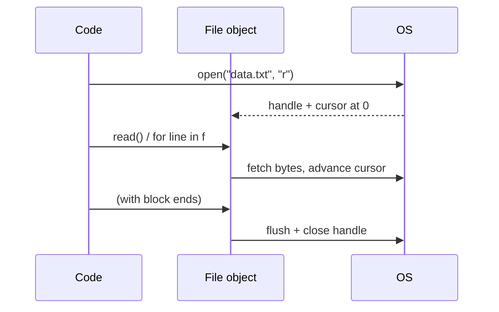
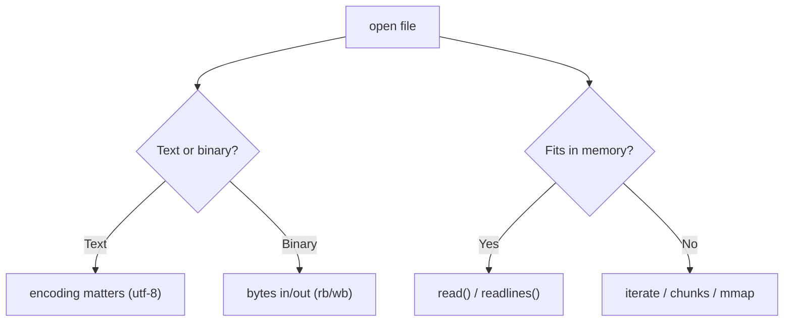

# File Handling & Data Processing

> Master reading and writing files the right way — context managers, modes, encodings, CSV/JSON, binary data, and streaming techniques that handle files far bigger than memory.

## Mental model

A file is a stream of bytes with a movable cursor. `open()` hands you a file object positioned at the start; you read or write through it, the cursor advances, and you must close it to flush buffers and release the OS handle. The golden rule is to never manage that lifecycle by hand — a `with` block opens, gives you the object, and guarantees closure even if your code raises.



Two decisions shape every `open()` call: the **mode** (read/write/append, text/binary) and how much you pull into memory at once.



## Core concepts

### Open with `with`, always

`open()` returns a file object; the `with` statement (a context manager) closes it automatically — even on exceptions. Manually calling `close()` is fragile because an error in between leaks the handle.

```python
with open("data.txt", "w", encoding="utf-8") as f:
    f.write("line 1\n")
    f.write("line 2\n")
# file is flushed and closed here, guaranteed

with open("data.txt", encoding="utf-8") as f:
    print(f.read())
# => line 1
#    line 2
```

### File modes

The mode string combines an access character with an optional type:

| Mode | Meaning |
| --- | --- |
| `r` | read (default), file must exist |
| `w` | write, **truncates** existing content |
| `a` | append to end |
| `x` | create-exclusive, fails if file exists |
| `r+` | read and write |
| `b` / `t` | binary / text (text is default) |

```python
with open("log.txt", "a", encoding="utf-8") as f:
    f.write("appended without erasing\n")   # 'a' keeps existing data
```

::: danger
`open(path, "w")` truncates the file the instant it opens — before you write anything. If you only meant to read, you have just destroyed the file. Double-check the mode.
:::

### Reading: whole, lines, or streamed

`read()` returns the entire file as one string. `readlines()` returns a list of lines (keeping `\n`). For large files, iterate the file object directly — it streams one line at a time and never loads the whole thing.

```python
with open("data.txt", encoding="utf-8") as f:
    text = f.read()          # 'line 1\nline 2\n'  — whole file

with open("data.txt", encoding="utf-8") as f:
    lines = f.readlines()    # ['line 1\n', 'line 2\n']

with open("data.txt", encoding="utf-8") as f:
    for line in f:           # streams, memory-friendly
        print(line.strip())
# => line 1
#    line 2
```

### Moving the cursor: `seek` and `tell`

`tell()` reports the cursor position; `seek(offset, whence)` moves it (`whence` 0=start, 1=current, 2=end).

```python
with open("data.txt", encoding="utf-8") as f:
    print(f.read(4))   # => 'line'   (first 4 chars)
    print(f.tell())    # => 4        (cursor position)
    f.seek(0)          # rewind to start
    print(f.read(1))   # => 'l'
```

### CSV files

Use the `csv` module for row-by-row work — `DictReader` gives each row as a dict keyed by header. Pass `newline=""` to let the module handle line endings correctly. For analysis, `pandas.read_csv` is more convenient.

```python
import csv

with open("people.csv", "w", newline="", encoding="utf-8") as f:
    writer = csv.DictWriter(f, fieldnames=["name", "age"])
    writer.writeheader()
    writer.writerow({"name": "Alice", "age": 30})

with open("people.csv", newline="", encoding="utf-8") as f:
    for row in csv.DictReader(f):
        print(row["name"], row["age"])
# => Alice 30
```

### JSON files

The `json` module bridges JSON text and Python objects: `load`/`dump` for files, `loads`/`dumps` for strings.

```python
import json

data = {"user": "alice", "roles": ["admin", "dev"]}
with open("out.json", "w", encoding="utf-8") as f:
    json.dump(data, f, indent=2)        # dict -> pretty JSON file

with open("out.json", encoding="utf-8") as f:
    loaded = json.load(f)               # JSON -> dict
print(loaded["roles"])                  # => ['admin', 'dev']
```

For **huge** JSON, don't `json.load` it whole. Prefer JSON Lines (one object per line) and process line by line, or incremental parsers like `ijson`.

```python
import json

with open("events.jsonl", encoding="utf-8") as f:
    for line in f:                      # one JSON object per line
        record = json.loads(line)
        ...                             # process and discard
```

### Binary files

Binary mode (`rb`/`wb`) reads and writes `bytes` — for images, audio, or any non-text data. There's no encoding involved.

```python
with open("logo.png", "rb") as src:
    data = src.read()          # bytes
with open("copy.png", "wb") as dst:
    dst.write(data)
print(type(data))              # => <class 'bytes'>
```

### Encodings

Text files need an encoding to map bytes ↔ characters. Modern Python defaults to UTF-8, but specify it explicitly for portability, and use `errors=` to survive bad bytes.

```python
with open("notes.txt", encoding="utf-8") as f:
    text = f.read()

# Tolerate undecodable bytes instead of crashing:
with open("legacy.txt", encoding="latin-1", errors="replace") as f:
    text = f.read()
```

### `os`, `sys`, and `pathlib`

`os` talks to the operating system (paths, env vars, directories); `sys` talks to the interpreter (argv, exit). `pathlib` offers an object-oriented path API that is now the idiomatic choice.

```python
import os
from pathlib import Path

print(os.path.exists("data.txt"))      # => True
if os.path.exists("temp.txt"):
    os.remove("temp.txt")              # delete a file

# '~' is NOT auto-expanded — do it explicitly:
print(os.path.expanduser("~/data.txt"))   # => /home/user/data.txt

p = Path.home() / "data.txt"           # pathlib equivalent
print(p.exists(), p.is_file())
```

### Processing files bigger than memory

Three tiers, from simplest to most powerful:

1. **Iterate lines** — streams text with O(1) memory.
2. **Chunked reads** — pandas `chunksize` for tabular data.
3. **Memory-mapping** — `mmap` exposes a file as a `bytes`-like object for random access without loading it.

```python
# Tier 1: first non-repeating character in a multi-GB text file
from collections import Counter

def first_non_repeating(path):
    counts = Counter()
    with open(path, encoding="utf-8") as f:
        for line in f:                 # streams, never loads whole file
            counts.update(line)
    with open(path, encoding="utf-8") as f:
        for line in f:
            for ch in line:
                if counts[ch] == 1:
                    return ch
    return None

# Tier 3: random access via mmap
import mmap
with open("big.bin", "r+b") as f:
    mm = mmap.mmap(f.fileno(), 0)
    print(mm[0:4])                     # read first 4 bytes like a slice
    mm.close()
```

::: tip
`numpy` arrays beat nested lists for numeric file data — contiguous, typed, and vectorized — so loading numbers with `np.loadtxt` or `pd.read_csv` is far faster than parsing into Python lists by hand.
:::

## Common pitfalls

- **Opening with `"w"` when you meant `"r"`** truncates the file instantly. Read mode is `r`.
- **Skipping `with`** can leak file handles and lose un-flushed writes. Always use a context manager.
- **`json.load` on a multi-GB file** exhausts memory; use JSON Lines or `ijson`.
- **Forgetting `newline=""` with the `csv` module** can produce blank rows on Windows.
- **Assuming an encoding** — a Latin-1 file read as UTF-8 raises `UnicodeDecodeError`. Set `encoding=` (and `errors=` if needed).
- **`os.remove` on a missing file** raises `FileNotFoundError`; guard with `os.path.exists` or catch it.
- **Reading a streamed file twice** — once exhausted, the cursor is at the end; `seek(0)` to rewind.

## Best practices

- Always use `with`; let it manage open/close.
- Pass `encoding="utf-8"` explicitly for text files.
- Iterate the file object for large text instead of `read()`/`readlines()`.
- Prefer `pathlib` for path manipulation; use `os.path.expanduser` for `~`.
- Use `chunksize`, generators, or `mmap` for files larger than memory.
- Use the right parser per format — `csv`, `json`, pandas — not manual string slicing.

## Interview quick-reference

| Topic | Key point |
| --- | --- |
| `with open()` | auto-closes, flushes, exception-safe |
| Modes | `r`/`w`(truncates)/`a`/`x`/`r+`, add `b` for binary |
| read methods | `read()` whole, `readlines()` list, iterate to stream |
| `seek`/`tell` | move/report cursor; `whence` 0/1/2 = start/cur/end |
| CSV | `csv.DictReader`/`DictWriter`, `newline=""`, or pandas |
| JSON | `load`/`dump` files, `loads`/`dumps` strings |
| Big JSON | JSON Lines or `ijson`, never `json.load` whole |
| Binary | `rb`/`wb`, work in `bytes` |
| Encoding | default UTF-8; set `encoding=` + `errors=` |
| `os` vs `sys` | OS (paths/env) vs interpreter (argv/exit) |
| Home dir | `os.path.expanduser("~")` / `Path.home()` |
| Huge files | iterate, `chunksize`, or `mmap` |
| delete / exists | `os.remove` / `Path.unlink`; `os.path.exists` |
