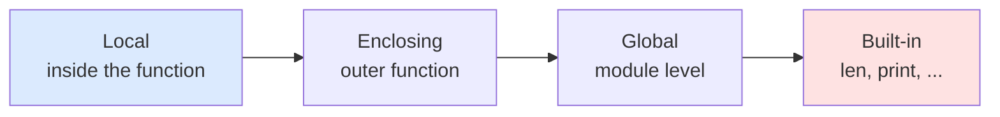
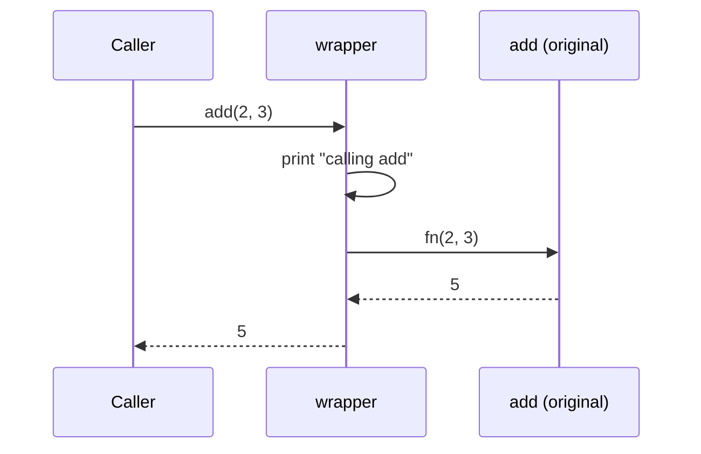

# Functions & Scope

> Learn how Python functions really work — arguments, scope resolution, closures, decorators, and the functional toolkit — so you can write reusable, side-effect-free code with confidence.

## Mental model

A function is a *first-class object*: `def` builds an object and binds it to a name, exactly like `x = 5` binds an integer. Because functions are values, you can store them, pass them as arguments, return them from other functions, and wrap them. The other half of the story is **scope**: how Python decides which `x` a name refers to. Python uses the **LEGB** rule, searching scopes from the inside out.



When you *read* a name, Python walks L → E → G → B and stops at the first match. When you *assign* a name inside a function, Python treats it as local — unless you say otherwise with `global` or `nonlocal`.

## Core concepts

### Defining and calling functions

`def` creates a function object; calling it runs the body in a fresh local namespace. Arguments are passed *by object reference* (often called "pass by assignment"): the parameter name becomes another reference to the same object.

```python
def greet(name, greeting="Hi"):   # greeting has a default
    """Return a friendly greeting."""   # docstring -> __doc__
    return f"{greeting}, {name}!"

print(greet("Sam"))                  # => Hi, Sam!
print(greet("Sam", greeting="Yo"))   # => Yo, Sam!
print(greet.__doc__)                 # => Return a friendly greeting.
```

A function with no `return` (or a bare `return`) yields `None` implicitly:

```python
def log(msg):
    print(msg)          # no return statement

print(log("hi") is None)   # => True (after printing "hi")
```

### Parameters vs arguments, and argument kinds

**Parameters** are the names in the definition; **arguments** are the values you pass. Python supports positional, keyword, default, and keyword-only parameters. A bare `*` marks everything after it as keyword-only.

```python
def connect(host, port=5432, *, timeout=30):
    return f"{host}:{port} (timeout={timeout})"

print(connect("db1"))                       # => db1:5432 (timeout=30)
print(connect("db1", 5433))                 # => db1:5433 (timeout=30)
print(connect("db1", port=5433, timeout=5)) # => db1:5433 (timeout=5)
# connect("db1", 5433, 5) -> TypeError: timeout is keyword-only
```

Use `*args` to collect extra positional arguments and `**kwargs` for extra keyword ones:

```python
def report(*args, **kwargs):
    return f"args={args} kwargs={kwargs}"

print(report(1, 2, mode="fast"))   # => args=(1, 2) kwargs={'mode': 'fast'}
```

### The LEGB rule in action

```python
x = "global"

def outer():
    x = "enclosing"
    def inner():
        print(x)        # reads from the Enclosing scope
    inner()

outer()                 # => enclosing
print(x)                # => global  (outer's x never touched this one)
```

### `global` and `nonlocal`

Assigning to a name makes it local. To rebind an outer name, declare your intent:

```python
count = 0

def bump_global():
    global count        # rebind the module-level name
    count += 1

def make_counter():
    n = 0
    def step():
        nonlocal n      # rebind the enclosing function's name
        n += 1
        return n
    return step

bump_global()
print(count)            # => 1

c = make_counter()
print(c(), c(), c())    # => 1 2 3
```

::: warning
Without `nonlocal`, `n += 1` raises `UnboundLocalError`: the `+=` makes `n` local, but it has no local value yet.
:::

### Closures

A **closure** is a nested function that captures variables from its enclosing scope and keeps them alive after the outer function has returned. `make_counter` above is a closure — each call produces an independent `n`.

```python
def multiplier(factor):
    def multiply(x):
        return x * factor     # `factor` is captured
    return multiply

double = multiplier(2)
triple = multiplier(3)
print(double(10), triple(10)) # => 20 30
```

### Decorators

A **decorator** is a specific use of a closure: it takes a function and returns a replacement, usually a wrapper that adds behavior. Use `functools.wraps` so the wrapper keeps the original's name and docstring.

```python
import functools

def log_calls(fn):
    @functools.wraps(fn)
    def wrapper(*args, **kwargs):
        print(f"calling {fn.__name__}")
        return fn(*args, **kwargs)
    return wrapper

@log_calls
def add(a, b):
    return a + b

print(add(2, 3))        # => calling add  /  5
print(add.__name__)     # => add  (preserved by wraps)
```



**Decorators with arguments** add one more layer — a factory that returns the actual decorator:

```python
import functools

def repeat(times):
    def decorator(fn):
        @functools.wraps(fn)
        def wrapper(*args, **kwargs):
            for _ in range(times):
                result = fn(*args, **kwargs)
            return result
        return wrapper
    return decorator

@repeat(3)
def hi():
    print("hi")

hi()        # prints "hi" three times
```

**Stacking** applies bottom-up but executes top-down — `@a` over `@b` means `a(b(f))`:

```python
@log_calls
@repeat(2)
def task():
    print("work")
# task = log_calls(repeat(2)(task))
```

### Lambdas and higher-order functions

A `lambda` is a single-expression anonymous function — handy as a throwaway `key` or callback. For anything non-trivial, prefer a named `def`.

```python
from functools import reduce

nums = [1, 2, 3, 4]
print(list(map(lambda x: x * 2, nums)))        # => [2, 4, 6, 8]
print(list(filter(lambda x: x % 2 == 0, nums)))# => [2, 4]
print(reduce(lambda a, b: a + b, nums))        # => 10
print(sorted(nums, key=lambda x: -x))          # => [4, 3, 2, 1]
```

Other essentials: `enumerate` pairs items with an index, `zip` combines iterables in parallel, and `any`/`all` aggregate booleans.

```python
for i, fruit in enumerate(["apple", "mango"], start=1):
    print(i, fruit)        # => 1 apple  /  2 mango

names, ages = ["tom", "jane"], [32, 28]
print(dict(zip(names, ages)))   # => {'tom': 32, 'jane': 28}
print(any(a > 30 for a in ages), all(a > 18 for a in ages))  # => True True
```

### `functools` utilities

```python
from functools import lru_cache, partial

@lru_cache              # memoize: each n computed once
def fib(n):
    return n if n < 2 else fib(n - 1) + fib(n - 2)

print(fib(30))          # => 832040 (fast, thanks to caching)

add5 = partial(lambda a, b: a + b, 5)   # pre-fill the first argument
print(add5(10))         # => 15
```

### Recursion

A function that calls itself, with a base case to stop. Mind the recursion-depth limit (~1000) for deep inputs.

```python
def factorial(n):
    if n <= 1:              # base case
        return 1
    return n * factorial(n - 1)

print(factorial(5))         # => 120
```

## Common pitfalls

- **Mutable default arguments.** Defaults are evaluated once at definition time, so a default `[]` is shared across calls.
  ```python
  def bad(items=[]):       # the SAME list every call
      items.append(1)
      return items
  print(bad(), bad())      # => [1] [1, 1]  (surprise!)

  def good(items=None):
      items = items if items is not None else []
      items.append(1)
      return items
  ```
- **Late binding in loop closures.** Closures capture the *variable*, not its value at creation.
  ```python
  fns = [lambda: i for i in range(3)]
  print([f() for f in fns])            # => [2, 2, 2]
  fns = [lambda i=i: i for i in range(3)]   # bind via default
  print([f() for f in fns])            # => [0, 1, 2]
  ```
- **Forgetting `functools.wraps`** in a decorator — the wrapped function loses its `__name__`, `__doc__`, and signature.
- **Assuming `+=` reads the outer name.** Inside a function it triggers `UnboundLocalError` unless declared `global`/`nonlocal`.
- **Overusing `lambda`.** Assigning a lambda to a name (`f = lambda x: ...`) defeats its purpose; use `def`.

## Best practices

- Catch the right scope: only reach for `global`/`nonlocal` when you genuinely need to rebind; prefer returning values.
- Keep functions small and single-purpose; return data instead of mutating arguments.
- Always use `functools.wraps` in decorators.
- Use keyword-only parameters (`*`) for optional flags to make call sites self-documenting.
- Reach for `lru_cache`/`cache` before hand-rolling memoization.
- Write a one-line docstring describing what the function returns.

## Interview quick-reference

| Concept | Key point |
| --- | --- |
| LEGB | Name lookup order: Local → Enclosing → Global → Built-in |
| `global` / `nonlocal` | Rebind a module-level / nearest-enclosing name |
| Closure | Nested function that captures enclosing variables, kept alive after return |
| Decorator | Closure that takes a function and returns a wrapped one; use `functools.wraps` |
| Decorator args | Extra factory layer: `@repeat(3)` = `repeat(3)(func)` |
| Stacking order | Applied bottom-up, runs top-down: `@a @b f` = `a(b(f))` |
| Mutable defaults | Evaluated once; use `None` sentinel + create inside |
| `lambda` vs `def` | Single expression vs full statements/`return` |
| HOFs | `map`/`filter`/`reduce`/`zip`/`any`/`all`/`sorted(key=...)` |
| `functools` | `lru_cache`, `partial`, `reduce`, `wraps`, `cmp_to_key` |
| Implicit return | No `return` → `None` |
