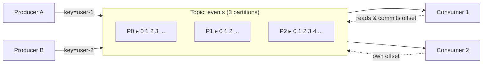
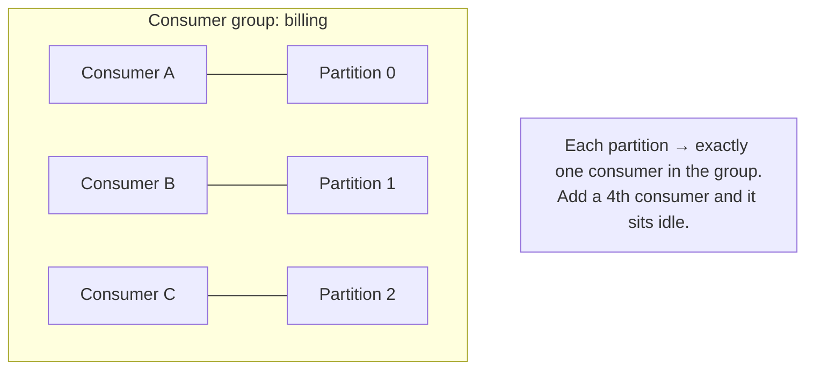

# Apache Kafka

> Learn how Kafka's append-only log, partitions, and consumer groups give you replayable, high-throughput event streaming, and how to drive it from Python.

## Mental model

Kafka is not a queue you drain — it is a **durable, append-only log** you read by position. Producers append records to the *end* of a partition; consumers read forward and remember their own *offset*. The broker stays "dumb" (it just stores ordered bytes), while consumers stay "smart" (they decide what to read and when). Because messages are retained on disk for a configured window, many independent consumers can read the same data — and replay it — without interfering.



A **topic** is a named log split into **partitions** for parallelism. Each record in a partition has a monotonically increasing **offset**. Ordering is guaranteed *within* a partition, never across the whole topic.



## Core concepts

### Topics, partitions, and offsets

Partitions are the unit of parallelism and ordering. The number of partitions caps how many consumers in one group can work in parallel. An offset is just "which message number in this partition" — the consumer is responsible for tracking it.

```python
# producer_basic.py — append a record and inspect where it landed
from confluent_kafka import Producer

producer = Producer({"bootstrap.servers": "localhost:9092"})

def report(err, msg):
    if err:
        print(f"FAILED: {err}")
    else:
        # The broker assigns the partition and offset on append
        print(f"stored topic={msg.topic()} partition={msg.partition()} offset={msg.offset()}")

producer.produce("events", key="user-1", value=b'{"action":"login"}', callback=report)
producer.flush()  # block until delivery reports arrive
# Expected output (offset grows each run):
# stored topic=events partition=1 offset=0
```

### Keys drive ordering

Kafka hashes the record key to pick a partition. Same key → same partition → guaranteed order. No key → round-robin spread, no per-entity ordering.

```python
# All events for "user-1" land in the same partition, preserving their order.
for action in ("login", "add_to_cart", "checkout"):
    producer.produce("events", key="user-1", value=action.encode())
producer.flush()
# Because the key is constant, a single consumer sees: login, add_to_cart, checkout — in order.
```

### Producing with delivery guarantees

`acks` decides durability. `acks=all` waits for every in-sync replica; combined with `enable.idempotence`, retries won't create duplicates.

```python
# producer_durable.py — safe, idempotent, batched producer
from confluent_kafka import Producer

producer = Producer({
    "bootstrap.servers": "localhost:9092",
    "acks": "all",                 # wait for all in-sync replicas
    "enable.idempotence": True,    # dedupe producer retries (PID + sequence number)
    "compression.type": "lz4",     # shrink batches on the wire
    "linger.ms": 10,               # wait up to 10ms to fill a batch
    "batch.size": 64 * 1024,       # bigger batches = better throughput/compression
})

producer.produce("payments", key="order-42", value=b'{"amount": 1999}')
producer.flush()
# With idempotence on, a network retry of this record will NOT be stored twice.
```

### Consumer groups and manual offset commits

A consumer group splits partitions across members. Commit offsets *after* you finish processing so a crash re-delivers the message instead of skipping it (at-least-once).

```python
# consumer_manual.py — at-least-once consumption
from confluent_kafka import Consumer, KafkaError

consumer = Consumer({
    "bootstrap.servers": "localhost:9092",
    "group.id": "billing",
    "auto.offset.reset": "earliest",  # new group starts from the oldest retained record
    "enable.auto.commit": False,      # we commit explicitly
})
consumer.subscribe(["payments"])

try:
    while True:
        msg = consumer.poll(1.0)
        if msg is None:
            continue
        if msg.error():
            if msg.error().code() != KafkaError._PARTITION_EOF:
                print(msg.error())
            continue

        process(msg.value())            # do the real work first
        consumer.commit(msg)            # then mark this offset done
        # If we crash before commit, another consumer reprocesses this record.
except KeyboardInterrupt:
    pass
finally:
    consumer.close()
```

### Handling poison messages

A record that always fails to deserialize will crash-loop forever if you never advance the offset. Catch it, route it to a dead-letter topic, and **commit** so you move on.

```python
import json

def handle(consumer, producer, msg):
    try:
        payload = json.loads(msg.value())
    except json.JSONDecodeError as exc:
        # Park the bad record for humans; do NOT block the partition.
        producer.produce("events.DLQ", key=msg.key(), value=msg.value(),
                         headers={"error": str(exc).encode()})
        producer.flush()
        consumer.commit(msg)  # advance past the poison message
        return
    process(payload)
    consumer.commit(msg)
```

### Replication, ISR, and failover

Each partition has one leader and N-1 followers. The **in-sync replica (ISR)** set is the followers caught up with the leader. If the leader broker dies, the controller promotes a replica from the ISR, so committed data survives. `min.insync.replicas=2` with `acks=all` means a write is only accepted while at least two replicas hold it — trading availability for durability.

```python
# AdminClient: create a durable topic with replication
from confluent_kafka.admin import AdminClient, NewTopic

admin = AdminClient({"bootstrap.servers": "localhost:9092"})
topic = NewTopic("payments", num_partitions=6, replication_factor=3,
                 config={"min.insync.replicas": "2", "cleanup.policy": "delete"})
admin.create_topics([topic])
# 6 partitions → up to 6 parallel consumers; 3 replicas survive 1 broker loss.
```

### Retention and log compaction

Default cleanup deletes old segments by time/size. **Log compaction** (`cleanup.policy=compact`) instead keeps only the *latest* value per key — perfect for "current state" topics like a user profile changelog. A null value is a **tombstone** that deletes the key.

::: tip
Use `compact` for keyed state you want to rebuild from scratch (config, profiles, CDC). Use `delete` for event streams where history matters but old data ages out.
:::

### Monitoring consumer lag

**Lag** = log-end offset − committed offset. Rising lag means consumers can't keep up.

```python
from confluent_kafka.admin import AdminClient
from confluent_kafka import Consumer, TopicPartition

# Compare committed position vs the partition's high watermark (end).
c = Consumer({"bootstrap.servers": "localhost:9092", "group.id": "billing"})
tp = TopicPartition("payments", 0)
committed = c.committed([tp])[0].offset
_, high = c.get_watermark_offsets(tp)
print(f"lag = {high - committed}")   # e.g. lag = 1423
c.close()
```

## Common pitfalls

- **Expecting global ordering.** Ordering is per-partition only. Use a stable key for entities that need ordered events.
- **More consumers than partitions.** Extra consumers sit idle. Size partitions for your max desired parallelism up front (you can add partitions but it breaks key→partition stability).
- **Auto-commit with slow processing.** `enable.auto.commit=True` can commit offsets for records you haven't finished, silently losing them on a crash. Commit manually after processing.
- **Ignoring `min.insync.replicas`.** With `acks=all` but `min.insync.replicas=1`, a single surviving replica still accepts writes — you can lose data on failover. Set it to 2 for 3 replicas.
- **Poison-message crash loops.** Always wrap deserialization in try/except and dead-letter + commit.

## Best practices

- Pick partition count for peak parallelism; favor a meaningful key for ordering and even spread.
- Producers: `acks=all` + `enable.idempotence=True` for correctness; tune `linger.ms`/`batch.size`/`compression.type` for throughput.
- Consumers: disable auto-commit, process then commit, make handlers **idempotent** (at-least-once means duplicates happen).
- Run KRaft mode (no ZooKeeper) for new clusters — simpler ops and faster controller failover.
- Monitor lag continuously (Burrow, Prometheus JMX exporter) and alert on sustained growth, not raw numbers.

## Interview quick-reference

| Concept | Key point |
| --- | --- |
| Topic / Partition / Offset | Logical log split for parallelism; offset = position within a partition |
| Consumer group | Each partition → one consumer in the group; rebalance on join/leave |
| Ordering | Guaranteed per partition only; use a key to pin related events |
| `acks` | `0` fire-and-forget, `1` leader only, `all` all ISRs (durable) |
| Idempotent producer | PID + sequence number dedupes retries |
| Exactly-once (EOS) | Idempotent producer + transactional API (consume-transform-produce) |
| ISR / `min.insync.replicas` | Caught-up replicas; failover promotes from ISR with no data loss |
| KRaft vs ZooKeeper | Raft-based metadata replaces ZK; simpler, scalable, no split-brain |
| Retention vs compaction | Delete by time/size, or keep latest value per key (tombstones delete) |
| Consumer lag | end offset − committed offset; primary health signal |
| Kafka vs RabbitMQ | Dumb broker/smart consumer + replay vs smart broker/routing + delete-on-ack |
