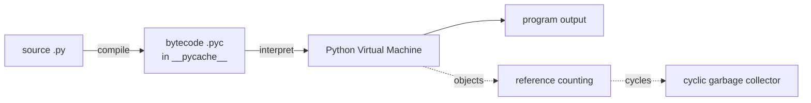

# Python Language Internals & Tooling

> Understand what really happens when you "run" a `.py` file — bytecode, the PVM, reference counting, the cyclic GC — plus the everyday tooling that keeps code fast and clean.

## Mental model

People call Python "interpreted," but that's only half true. CPython first *compiles* your source into platform-independent **bytecode**, then a virtual machine *interprets* that bytecode instruction by instruction. Memory is managed by **reference counting** for the common case, backed by a **cyclic garbage collector** for the cases reference counting can't handle.



## Core concepts

### Compile then interpret: bytecode and the PVM

When you import or run a module, CPython parses it, compiles it to bytecode, and the PVM executes that bytecode. You can inspect the bytecode with `dis`.

```python
import dis

def add(a, b):
    return a + b

dis.dis(add)
# =>  RESUME            0
#     LOAD_FAST         a
#     LOAD_FAST         b
#     BINARY_OP         + (add)
#     RETURN_VALUE
```

This compile step is why Python feels interpreted (no explicit build) yet still has a compilation phase. The trade-off: a fast development cycle and portability, but slower execution than fully compiled languages, and you must ship an interpreter.

### `.py` vs `.pyc`

A `.py` file is the source you write. A `.pyc` is the cached bytecode CPython writes to `__pycache__/` so it can skip recompiling unchanged modules on the next import.

```python
import py_compile, os

py_compile.compile("add.py")          # writes __pycache__/add.cpython-311.pyc
print(os.path.exists("__pycache__"))
# => True
```

`.pyc` files are binary, version-specific (tagged like `cpython-311`), cross-platform, auto-regenerated, and should **not** be committed — add `__pycache__/` to `.gitignore`. Setting `PYTHONDONTWRITEBYTECODE=1` disables their creation.

### Reference counting

Every CPython object carries a count of how many references point to it. When that count hits zero, the object is freed *immediately* — deterministic and prompt.

```python
import sys

a = []
print(sys.getrefcount(a))   # => 2  (one for `a`, one temporary for the call arg)
b = a
print(sys.getrefcount(a))   # => 3  (now `b` also references it)
del b
print(sys.getrefcount(a))   # => 2
```

### Why a garbage collector is still needed

Reference counting cannot reclaim **reference cycles**: objects that point at each other keep each other's count above zero even when nothing else can reach them. The cyclic GC in the `gc` module detects and frees those.

```python
import gc

a, b = {}, {}
a["b"] = b
b["a"] = a          # cycle: a -> b -> a, refcounts never reach 0
del a, b            # unreachable, but still allocated

collected = gc.collect()    # cyclic GC reclaims the cycle
print(collected >= 2)
# => True
```

### Pickling and customizing serialization

`pickle` serializes Python objects to a byte stream so you can persist or transfer them. Customize what gets saved with `__getstate__` and how it's restored with `__setstate__`.

```python
import pickle

class Connection:
    def __init__(self, host: str):
        self.host = host
        self._socket = "OPEN"      # transient — should not be pickled

    def __getstate__(self) -> dict:
        state = self.__dict__.copy()
        state.pop("_socket", None)  # drop the unpicklable/transient field
        return state

    def __setstate__(self, state: dict) -> None:
        self.__dict__.update(state)
        self._socket = "CLOSED"     # re-establish on load

blob = pickle.dumps(Connection("db1"))
restored = pickle.loads(blob)
print(restored.host, restored._socket)
# => db1 CLOSED
```

::: danger
Never unpickle data from an untrusted source — `pickle` can execute arbitrary code during deserialization. Across trust boundaries use JSON or Protocol Buffers.
:::

### `weakref`: referencing without keeping alive

A weak reference lets you point at an object *without* bumping its refcount, so it won't stop the object from being collected. Perfect for caches and observer registries.

```python
import weakref, gc

class Node: ...

n = Node()
ref = weakref.ref(n)
print(ref() is n)   # => True   (object still alive)

del n
gc.collect()
print(ref())        # => None   (object was collected; weakref is now dead)
```

### Monkey patching

Monkey patching replaces or adds attributes on a class/module at runtime. It is handy for stubbing in tests or hotfixing third-party code, but it makes behavior hard to trace.

```python
import math

original_sqrt = math.sqrt
math.sqrt = lambda x: "patched!"   # replace at runtime
print(math.sqrt(9))                # => patched!
math.sqrt = original_sqrt          # always restore when done
```

### Performance and memory tooling

Profile *before* optimizing — guesses are usually wrong. Then apply targeted fixes: caching, better data structures, `__slots__`, generators.

```python
from functools import lru_cache

@lru_cache(maxsize=None)            # memoize: each n computed once
def fib(n: int) -> int:
    return n if n < 2 else fib(n - 1) + fib(n - 2)

print(fib(50))
# => 12586269025   (instant; without the cache this recursion is exponential)
```

```python
class Point:
    __slots__ = ("x", "y")          # no per-instance __dict__ -> less memory
    def __init__(self, x: float, y: float):
        self.x, self.y = x, y

import sys
print(sys.getsizeof(Point.__slots__))  # slots stored once on the class
# A __slots__ instance can use ~40-50% less memory than a __dict__ one.
```

### PEP 8 and formatters

PEP 8 is the official style guide: 4 spaces per indent level (never tabs, never mixed), lines kept reasonably short. Tools enforce it so you don't argue about it.

```python
def function():
    if True:
        do_something()    # exactly 4 spaces per level
```

Use `ruff` or `black` to auto-format, and `ruff`/`flake8`/`pylint` to lint. They run in CI to keep the whole team consistent.

## Common pitfalls

- **Committing `__pycache__/` or `.pyc` files.** They are version-specific build artifacts. Fix: add `__pycache__/` to `.gitignore`.
- **Unpickling untrusted input.** Remote code execution risk. Fix: use JSON across trust boundaries.
- **Optimizing without profiling.** You'll micro-optimize the wrong line. Fix: run `cProfile`/`timeit` first.
- **Forgetting to restore a monkey patch.** Leaks the patched behavior into other tests. Fix: restore in a `finally`, or use `unittest.mock.patch` as a context manager which restores automatically.
- **Expecting cyclic objects to free instantly.** They wait for the cyclic GC. Fix: break cycles yourself or call `gc.collect()` when timing matters; consider `weakref` to avoid cycles entirely.

## Best practices

- Treat Python as "compiled to bytecode, then interpreted" — it explains both the `.pyc` cache and the runtime cost.
- Cache pure functions with `functools.lru_cache`; use generators and `__slots__` to cut memory.
- Reach for `weakref` in caches/observers to avoid keeping objects alive or creating cycles.
- Keep secrets in env vars (`os.getenv`), never hardcoded — fail fast if missing.
- Standardize on `ruff` for linting/formatting and run it in CI alongside type checks.

## Interview quick-reference

| Topic | Key point |
| --- | --- |
| Interpreted? | Source → bytecode (compile) → PVM (interpret); auto, no manual build |
| `.py` vs `.pyc` | Source vs cached bytecode in `__pycache__`; don't commit `.pyc` |
| Bytecode / PVM | Inspect with `dis`; PVM is the interpreter loop |
| Reference counting | Refcount hits 0 → freed immediately |
| Why a GC too | Refcounting can't reclaim cycles; `gc` module handles them |
| Pickling | `dump`/`load`; customize via `__getstate__`/`__setstate__`; never unpickle untrusted data |
| `weakref` | Reference without raising refcount; for caches/observers |
| Monkey patching | Runtime attribute replacement; powerful but obscure — always restore |
| Perf optimization | Profile first, then algorithms, `lru_cache`, NumPy, multiprocessing |
| Memory optimization | Generators, `__slots__`, chunked I/O, `del` large objects |
| PEP 8 | 4 spaces, no tabs; enforced by ruff/black/flake8 |
