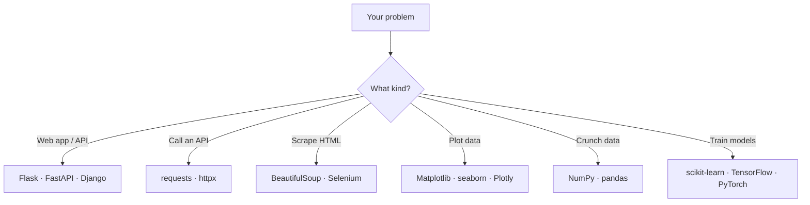
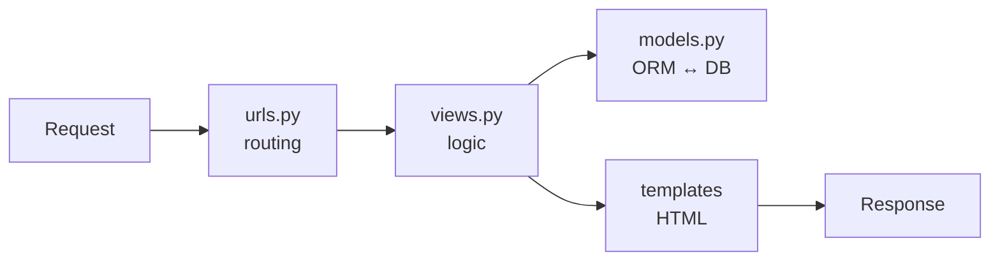
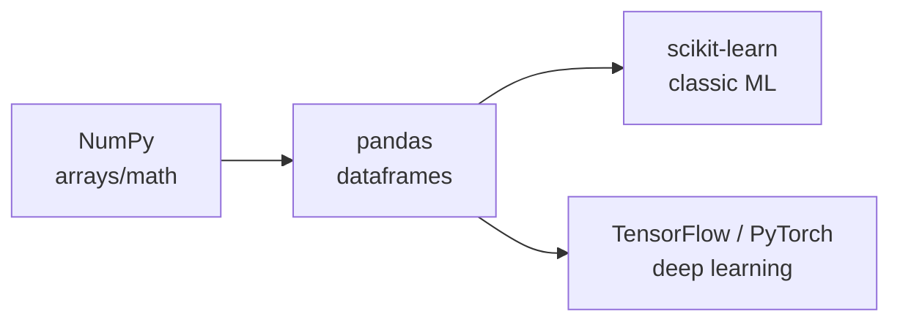

# Libraries & Frameworks

> A tour of the Python ecosystem you're expected to know — web frameworks (Flask, Django), HTTP clients, scraping, data visualization, and the ML stack — and when to reach for each.

## Mental model

Python's strength is its batteries-included **ecosystem**. Most interview questions test
whether you can pick the right tool: a micro-framework or a full one, a sync or async
client, a plotting library, a deep-learning framework. Group them by the job they do.



## Web frameworks

### Flask — the micro-framework

Flask gives you routing, request/response, and templating, and leaves everything else
(ORM, auth, admin) to extensions. You assemble exactly what you need — great for APIs and
small services.

```python
from flask import Flask, jsonify, request

app = Flask(__name__)

@app.route("/health")
def health():
    return jsonify(status="ok")            # => {"status": "ok"}

@app.route("/users", methods=["POST"])
def create_user():
    data = request.get_json()
    return jsonify(id=1, **data), 201      # 201 Created

if __name__ == "__main__":
    app.run(debug=True)
```

Key features: lightweight core, Jinja2 templating, the **blueprint** system for modular
apps, and a rich extension ecosystem (`Flask-SQLAlchemy`, `Flask-Login`, `Flask-Migrate`).

### Building a REST API in Flask

Map HTTP methods to handlers and return JSON with proper status codes. For larger APIs use
`flask-smorest` or `Flask-RESTful` to get serialization and validation.

```python
@app.route("/users/<int:uid>", methods=["GET", "DELETE"])
def user(uid):
    if request.method == "DELETE":
        # ... delete ...
        return "", 204                     # 204 No Content
    return jsonify(id=uid, name="Alice")   # 200 OK
```

### Django — the full-stack framework

Django is **batteries-included**: ORM, migrations, auth, an auto-generated admin, forms,
and templating all ship together. It favors convention and is built for content-heavy,
database-driven sites.

```bash
django-admin startproject mysite     # create project
python manage.py startapp blog       # create an app
python manage.py migrate             # apply DB schema
python manage.py runserver           # dev server
```



### What is an ORM?

An **Object-Relational Mapper** lets you work with database rows as Python objects, writing
queries in Python instead of raw SQL. Django's ORM generates SQL, handles migrations, and
guards against SQL injection via parameterization.

```python
# Django ORM — no SQL written
from blog.models import Post

Post.objects.create(title="Hi", body="...")          # INSERT
recent = Post.objects.filter(published=True)[:5]     # SELECT ... LIMIT 5
recent = recent.order_by("-created")                 # lazy until iterated
```

::: tip Flask vs Django
**Flask** = minimal, flexible, you choose the pieces — ideal for microservices/APIs.
**Django** = opinionated, full-featured, fast for CRUD-heavy apps with an admin.
Reach for **FastAPI** when you want async + automatic OpenAPI docs + type-based validation.
:::

## HTTP clients

### `requests`

The de-facto synchronous HTTP library — clean API for GET/POST, sessions, headers, JSON,
and timeouts.

```python
import requests

resp = requests.get("https://api.github.com/users/torvalds", timeout=5)
resp.raise_for_status()                    # raise on 4xx/5xx
print(resp.json()["public_repos"])         # => 7
```

For async or HTTP/2, use **`httpx`** — a near drop-in replacement with `async`/`await`.

## Web scraping with BeautifulSoup

`BeautifulSoup` parses HTML/XML into a navigable tree so you can pull data by tag, class, or
CSS selector. Pair it with `requests` for static pages.

```python
import requests
from bs4 import BeautifulSoup

html = requests.get("https://example.com").text
soup = BeautifulSoup(html, "html.parser")

print(soup.title.string)                   # => Example Domain
links = [a["href"] for a in soup.select("a[href]")]
```

For JavaScript-rendered pages, BeautifulSoup alone won't see the content — drive a browser
with **Selenium** or **Playwright**, then parse the rendered HTML.

## Data visualization

```python
import matplotlib.pyplot as plt

plt.plot([1, 2, 3], [2, 4, 9], marker="o")
plt.title("Growth")
plt.xlabel("week"); plt.ylabel("users")
plt.savefig("growth.png")                  # write to file for scripts
```

- **Matplotlib** — the foundational, fully-controllable plotting library.
- **seaborn** — statistical charts on top of Matplotlib, fewer lines.
- **Plotly / Bokeh** — interactive, web-ready charts.

## The machine-learning stack



- **scikit-learn** — classic ML (regression, trees, clustering) with a uniform
  `fit`/`predict` API. Your first stop for tabular problems.
- **TensorFlow** — Google's end-to-end deep-learning platform; strong production tooling
  (TF Serving, TFLite) and the high-level **Keras** API.
- **PyTorch** — Meta's deep-learning framework, loved in research for its dynamic graphs
  and Pythonic feel; now also production-ready (TorchScript, `torch.compile`).

```python
from sklearn.linear_model import LinearRegression
import numpy as np

X = np.array([[1], [2], [3]])
y = np.array([2, 4, 6])
model = LinearRegression().fit(X, y)
print(model.predict([[4]]))                # => [8.]
```

## Common pitfalls

- **No `timeout` on `requests`** — a hung server hangs your app forever. Always pass one.
- **Forgetting `raise_for_status()`** — you silently process error-page HTML as data.
- **Scraping JS pages with BeautifulSoup only** — you get the empty shell; use Selenium.
- **Reaching for Django for a tiny API** — overkill; Flask/FastAPI is leaner.
- **Building an ORM query in a loop** — the N+1 problem; use `select_related`/`prefetch_related`.

## Best practices

- Pick the framework by scope: micro (Flask/FastAPI) vs full-stack (Django).
- Use a `requests.Session()` for repeated calls to the same host (connection reuse).
- Prefer `httpx` when you need async; `requests` for simple sync scripts.
- Respect `robots.txt` and rate limits when scraping.
- Pin library versions in `requirements.txt` / `pyproject.toml` for reproducibility.

## Interview quick-reference

| Need | Library |
| --- | --- |
| Micro web framework | Flask (or FastAPI for async) |
| Full-stack web framework | Django (ORM, admin, auth) |
| Object ↔ DB mapping | ORM (Django ORM, SQLAlchemy) |
| Sync HTTP requests | `requests` |
| Async / HTTP-2 client | `httpx` |
| Parse static HTML | `BeautifulSoup` |
| Scrape dynamic pages | Selenium / Playwright |
| Plotting | Matplotlib, seaborn, Plotly |
| Classic ML | scikit-learn |
| Deep learning | TensorFlow (Keras) / PyTorch |
