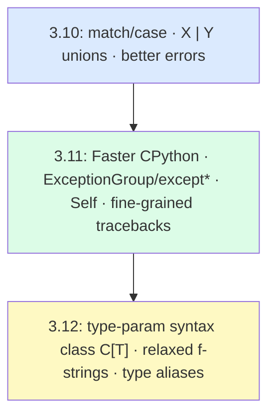

# Modern Python (3.10 / 3.11 / 3.12+)

> Tour the features that define modern Python — structural pattern matching, dataclasses, the new typing syntax, exception groups, and the speed and error-reporting wins of recent releases.

## Mental model

Each release since 3.10 has pushed Python toward being more expressive *and* faster: pattern matching for structured branching, cleaner type hints without `typing` imports, exception groups for concurrency, and the "Faster CPython" project that made 3.11 measurably quicker. Think of these as quality-of-life upgrades that let you write less boilerplate and get better diagnostics.



## Core concepts

### Structural pattern matching (`match`/`case`)

Added in 3.10, `match` compares a value against *structural* patterns — literals, sequences, mappings, and classes — and can bind variables. It is far more powerful than a C-style switch.

```python
def handle(command):
    match command.split():
        case ["go", direction]:          # binds `direction`
            return f"moving {direction}"
        case ["drop", *items]:           # captures the rest
            return f"dropping {items}"
        case ["quit"]:
            return "bye"
        case _:                          # wildcard / default
            return "unknown"

print(handle("go north"))    # => moving north
print(handle("drop a b c"))  # => dropping ['a', 'b', 'c']
print(handle("dance"))       # => unknown
```

Class patterns destructure objects and support guards:

```python
from dataclasses import dataclass

@dataclass
class Point:
    x: int
    y: int

def quadrant(p):
    match p:
        case Point(x=0, y=0):
            return "origin"
        case Point(x=x, y=y) if x > 0 and y > 0:   # guard
            return "Q1"
        case Point():
            return "elsewhere"

print(quadrant(Point(0, 0)))   # => origin
print(quadrant(Point(3, 4)))   # => Q1
```

### Dataclasses

`@dataclass` auto-generates `__init__`, `__repr__`, `__eq__`, and more from annotated fields. Supports defaults, `field(default_factory=...)` for mutable defaults, `frozen=True` for immutability, and `slots=True` (3.10+) for memory savings.

```python
from dataclasses import dataclass, field

@dataclass(slots=True)
class Point:
    x: int
    y: int = 0                       # default value

@dataclass(frozen=True)
class Config:
    name: str
    tags: list[str] = field(default_factory=list)   # safe mutable default

p = Point(1, 2)
print(p)                             # => Point(x=1, y=2)  (free __repr__)
print(Point(1, 2) == Point(1, 2))    # => True            (free __eq__)

c = Config("prod")
# c.name = "dev"  -> FrozenInstanceError (immutable)
```

::: tip
`field(default_factory=list)` is the dataclass cure for the classic mutable-default trap — each instance gets its own fresh list.
:::

### Modern type hints

Built-in generics (3.9+) remove most `typing` imports; the `X | Y` union syntax (3.10) replaces `Optional`/`Union`; `Self` (3.11) types fluent methods.

```python
from typing import Self

def first(items: list[int]) -> int | None:      # built-in generic + union
    return items[0] if items else None

class Builder:
    def __init__(self): self.parts: list[str] = []
    def add(self, part: str) -> Self:           # returns the same type
        self.parts.append(part)
        return self

print(first([10, 20]))                          # => 10
print(first([]))                                # => None
print(Builder().add("a").add("b").parts)        # => ['a', 'b']
```

### Generic classes — `TypeVar` vs the 3.12 syntax

Historically you imported `TypeVar` and inherited from `Generic[T]`. Python 3.12 added native bracket syntax — no imports needed.

```python
# 3.12+ native syntax
class Stack[T]:
    def __init__(self) -> None:
        self._items: list[T] = []
    def push(self, item: T) -> None:
        self._items.append(item)
    def pop(self) -> T:
        return self._items.pop()

# Pre-3.12 equivalent
from typing import TypeVar, Generic
T = TypeVar("T")
class OldStack(Generic[T]):
    ...

s: Stack[int] = Stack()
s.push(1); s.push(2)
print(s.pop())          # => 2
```

### `Protocol` and structural subtyping

`typing.Protocol` (3.8) enables static duck-typing: any class with the required methods is accepted by a type checker, with no explicit inheritance.

```python
from typing import Protocol

class Drawable(Protocol):
    def draw(self) -> str: ...

class Circle:                       # does NOT inherit Drawable
    def draw(self) -> str:
        return "O"

def render(shape: Drawable) -> str: # checkers accept Circle structurally
    return shape.draw()

print(render(Circle()))             # => O
```

### Exception groups (`except*`)

Python 3.11's `ExceptionGroup` raises and handles multiple errors at once — essential for concurrent tasks where several can fail together. Catch selectively with `except*`.

```python
try:
    raise ExceptionGroup("errors", [ValueError("a"), TypeError("b")])
except* ValueError as eg:
    print("value errors:", [str(e) for e in eg.exceptions])
except* TypeError as eg:
    print("type errors:", [str(e) for e in eg.exceptions])
# => value errors: ['a']
# => type errors: ['b']
```

### f-strings and the `=` debug specifier

f-strings are the standard interpolation tool. The 3.8 `=` specifier prints both the expression and its value; 3.12 relaxed the grammar (nested same-quotes, multiline, backslashes).

```python
x = 42
name = "Sam"
print(f"{x=}")                # => x=42
print(f"{name.upper()=}")     # => name.upper()='SAM'
print(f"{x:>6}")              # => '    42' (formatting still works)
```

### Performance and error reporting

The "Faster CPython" effort made 3.11 roughly 10–60% faster than 3.10 (~25% average) via a *specializing adaptive interpreter*, cheaper function calls, and zero-cost exception handling. Tracebacks gained **fine-grained error locations** — the exact sub-expression is underlined:

```
  File "calc.py", line 3, in <module>
    result = a / b + c / d
                     ~~^~~
ZeroDivisionError: division by zero
```

::: tip
The takeaway: upgrade. You get a free speed boost and dramatically clearer tracebacks just by running a newer interpreter — no code changes required.
:::

## Common pitfalls

- **A `case name:` captures instead of comparing.** A bare name is a binding pattern that always matches. Use a dotted constant (`case Color.RED:`) or a guard to compare against a value.
- **Sequence patterns also match `str`-like surprises.** `case [x, y]` won't match a string the way you might expect — strings aren't treated as sequences in patterns, which is usually what you want, but verify.
- **Mutable dataclass defaults.** `tags: list[str] = []` raises `ValueError`; use `field(default_factory=list)`.
- **Mixing `frozen=True` with attribute assignment.** Frozen instances raise `FrozenInstanceError`; build a new one with `dataclasses.replace`.
- **`except*` cannot mix with plain `except`** in the same `try`. Pick one style per block.
- **Assuming `Self` works everywhere** — it requires 3.11+; on older versions use a `TypeVar` bound to the class.

## Best practices

- Use `match` for branching over the *shape* of data; keep a `case _:` fallback.
- Reach for `@dataclass` (or `frozen=True`) instead of hand-writing `__init__`/`__repr__`/`__eq__`.
- Prefer built-in generics (`list[int]`) and `X | Y` unions over `typing.List`/`Optional`.
- Use `Protocol` to type "anything with these methods" instead of forcing inheritance.
- Use `f"{x=}"` for quick debugging instead of `print("x", x)`.
- Run a current interpreter (3.11/3.12+) for the speed and traceback improvements.

## Interview quick-reference

| Feature | Version | Key point |
| --- | --- | --- |
| `match`/`case` | 3.10 | Structural patterns: literals, sequences, mappings, classes; binds vars |
| `X \| Y` unions | 3.10 | Replaces `Optional`/`Union` |
| Better error messages | 3.10/3.11 | Fine-grained tracebacks underline the failing expression |
| Faster CPython | 3.11 | ~10–60% faster: adaptive interpreter, cheap calls, zero-cost exceptions |
| `ExceptionGroup` / `except*` | 3.11 | Raise & handle many exceptions (concurrency) |
| `Self` type | 3.11 | Type for fluent/chained methods returning the instance |
| `@dataclass` | 3.7+ | Auto `__init__`/`__repr__`/`__eq__`; `frozen`, `slots`, `default_factory` |
| `Protocol` | 3.8 | Structural subtyping (static duck typing) |
| `class C[T]` | 3.12 | Native generic syntax — no `TypeVar`/`Generic` imports |
| Relaxed f-strings | 3.12 | Nested quotes, multiline, backslashes; `f"{x=}"` debug |
