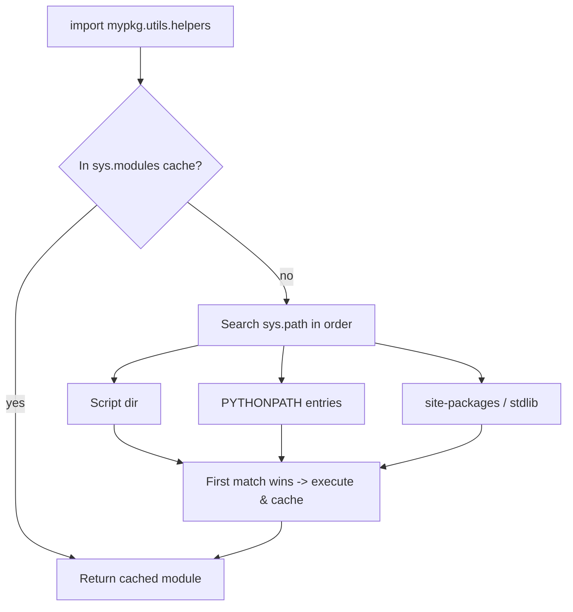

# Modules & Packages

> Learn how Python organizes code into modules and packages, how `import` finds them via `sys.path`, and how to structure projects that scale without name clashes.

## Mental model

A **module** is a single `.py` file. A **package** is a directory of modules (optionally with an `__init__.py`). Importing a module *runs it once*, caches the resulting module object in `sys.modules`, and binds names into your namespace. The crucial questions are: *where does Python look?* (the search path) and *which name am I really referring to?* (namespaces).



## Core concepts

### Creating and importing a module

Any `.py` file is importable. Its top-level functions, classes, and variables become attributes of the module object.

```python
# mymath.py
PI = 3.14159
def add(a, b):
    return a + b

# main.py
import mymath
from mymath import add, PI

print(mymath.add(2, 3))   # => 5
print(add(2, 3), PI)      # => 5 3.14159
```

The forms of `import`:

```python
import math                 # whole module: math.sqrt(9)
from math import sqrt, pi   # specific names: sqrt(9)
import numpy as np          # alias
from math import *          # everything — avoid: pollutes the namespace
```

::: tip
Prefer `import math` then `math.sqrt(...)`. Qualified names make it obvious where a function came from and avoid collisions when two modules export the same name.
:::

### The module search path (`sys.path`)

On import, Python searches `sys.path` in order — the running script's directory first, then `PYTHONPATH` entries, then installation defaults (stdlib + `site-packages`). The first match wins, and the result is cached.

```python
import sys
for entry in sys.path[:3]:
    print(entry)
# '' (or script dir), '/usr/lib/python3.11', '.../site-packages', ...
```

::: warning
Never name your file `random.py`, `json.py`, or `email.py`. The script directory comes first on `sys.path`, so your file *shadows* the standard-library module and imports break in confusing ways.
:::

### Packages and `__init__.py`

A package is a directory Python treats as a namespace. A regular package contains `__init__.py`, which runs on import and can expose a curated public API. Namespace packages (3.3+) can omit it.

```
mypackage/
├── __init__.py        # runs on `import mypackage`
├── core.py
└── utils/
    ├── __init__.py
    └── helpers.py     # import via mypackage.utils.helpers
```

```python
# mypackage/__init__.py
from .core import main_function     # re-export for a clean API
__all__ = ["main_function"]         # controls `from mypackage import *`
```

```python
# consumer code
from mypackage import main_function   # thanks to the re-export above
from mypackage.utils.helpers import clean
```

`__all__` defines what `from pkg import *` pulls in and documents the intended public surface.

### Absolute vs relative imports

Inside a package, prefer **absolute** imports (full path from the project root). **Relative** imports use leading dots and only work inside packages.

```python
# inside mypackage/core.py
from mypackage.utils.helpers import clean   # absolute (clear, refactor-safe)
from .utils.helpers import clean            # relative (. = current package)
from ..config import settings               # .. = parent package
```

### Namespaces and sharing state

A **namespace** maps names to objects. Python keeps separate built-in, global (per module), and local (per function) namespaces, resolved by LEGB. This is what prevents two modules' `helpers` from clashing.

To share *mutable* state across modules, put it in a config module and always reference it through the module object — never copy the reference out with `from config import settings`.

```python
# config.py
settings = {}

# a.py
import config
config.settings["debug"] = True

# b.py
import config
print(config.settings)     # => {'debug': True}  (same object)
```

::: danger
`from config import settings` binds a *new local name* to the current object. If `config` later rebinds `settings = {...}`, your copy still points at the old dict. Use `import config; config.settings` so you always see live updates.
:::

### The `__main__` guard

When a file runs directly, its `__name__` is `"__main__"`; when imported, `__name__` is the module's dotted name. Guard your entry point so import side effects don't fire.

```python
# tool.py
def main():
    print("running directly")

if __name__ == "__main__":   # only on `python tool.py`, not on import
    main()
```

### Useful standard-library modules

```python
import os, sys           # OS + interpreter interaction
import math, random      # numerics and randomness
import datetime          # dates and times
import json, csv         # data formats
import re                # regular expressions
import collections, itertools, functools  # data-structure / functional helpers
import logging           # structured logging
import sqlite3           # embedded database
import subprocess        # run external programs
import traceback         # format / print stack traces

print(json.dumps({"ok": True}))   # => {"ok": true}
```

## Common pitfalls

- **Shadowing stdlib modules** by naming your file after them (`random.py`, `queue.py`). Rename the file.
- **Circular imports** — module A imports B which imports A. Fixes: move the shared piece to a third module, import lazily inside a function, or import the module (`import b`) instead of names.
  ```python
  # break the cycle by importing inside the function
  def handler():
      import b          # imported when called, not at module load
      return b.run()
  ```
- **`from module import *`** hides where names come from and can clobber built-ins. Import explicitly.
- **Assuming imports re-run.** A module's top-level code runs only once per process; later imports return the cached object.
- **Relative imports in a script run directly** raise `ImportError: attempted relative import with no known parent package`. Run as a module: `python -m mypackage.core`.

## Best practices

- Use absolute imports inside packages; relative imports only for tightly coupled siblings.
- Keep `__init__.py` light — re-export a small, intentional public API and set `__all__`.
- Group imports: standard library, third-party, then local — each block alphabetized.
- Always guard executable code with `if __name__ == "__main__":`.
- Share state through a config/module object, not by copying references.
- Let a build tool (`pyproject.toml`) define the package so it installs cleanly rather than relying on `sys.path` hacks.

## Interview quick-reference

| Concept | Key point |
| --- | --- |
| Module | A single `.py` file; importing runs it once and caches it |
| Package | A directory of modules; regular packages have `__init__.py` |
| `sys.path` | Search order: script dir → `PYTHONPATH` → stdlib/`site-packages` |
| `sys.modules` | Cache of already-imported modules (why import runs once) |
| `__init__.py` | Marks a regular package, runs on import, can set `__all__` |
| `__all__` | Controls `from pkg import *` and documents the public API |
| Namespace | Name→object map; built-in / global / local keep modules isolated |
| Sharing state | `import config; config.x` (live) vs `from config import x` (copy) |
| `__name__` | `"__main__"` when run directly; module name when imported |
| Absolute vs relative | `from pkg.mod import x` vs `from .mod import x` (dots = package-relative) |
| `import *` | Avoid — pollutes namespace, hides origins |
