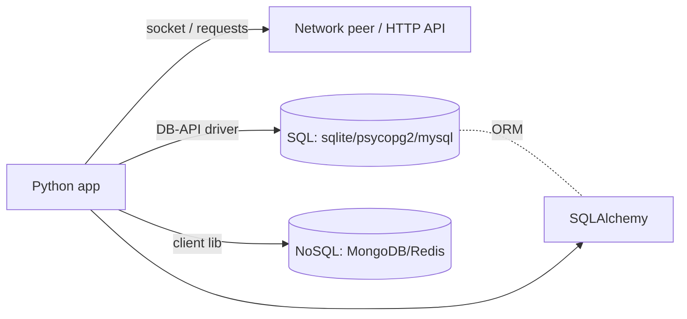
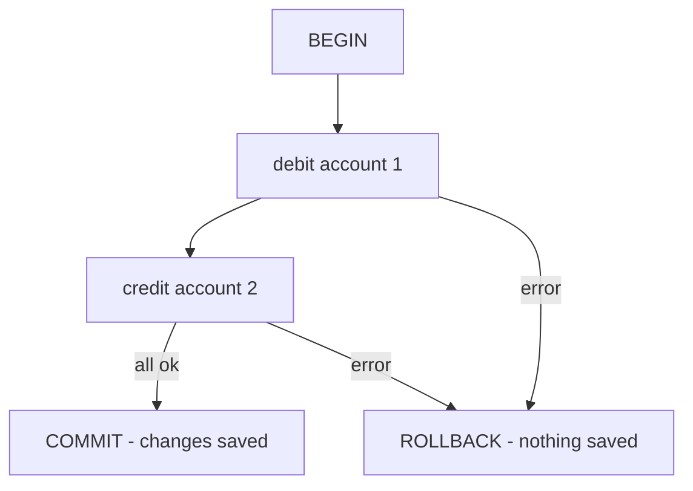

# Networking & Databases

> Learn to move bytes over sockets, make HTTP requests, and talk to SQL and NoSQL databases safely — cursors, transactions, parameterized queries, and SQLAlchemy.

## Mental model

Most backend work is two kinds of I/O: **networking** (bytes across a connection) and **persistence** (rows/documents in a store). Both follow a connect → exchange → close lifecycle. Sockets are the low-level primitive under HTTP; databases are accessed through DB-API drivers (and often an ORM on top).



## Core concepts

### TCP sockets

The `socket` module is the raw primitive. A server **binds** to an address, **listens**, and **accepts** connections; a client **connects**. Then both sides `send`/`recv` bytes.

```python
import socket

# --- Server side ---
server = socket.socket(socket.AF_INET, socket.SOCK_STREAM)  # IPv4, TCP
server.setsockopt(socket.SOL_SOCKET, socket.SO_REUSEADDR, 1)
server.bind(("localhost", 9000))
server.listen()
conn, addr = server.accept()        # blocks until a client connects
data = conn.recv(1024)              # read up to 1024 bytes
print("got:", data.decode())       # => got: hello
conn.sendall(b"ack")               # reply
conn.close()
```

```python
# --- Client side (run separately) ---
client = socket.socket(socket.AF_INET, socket.SOCK_STREAM)
client.connect(("localhost", 9000))
client.sendall(b"hello")
print(client.recv(1024).decode())  # => ack
client.close()
```

Sockets deal in raw bytes — you must encode/decode and handle message framing yourself.

### HTTP requests

For HTTP you use `requests` (or stdlib `urllib.request`). It handles connections, encoding, and parsing.

```python
import requests

r = requests.get("https://httpbin.org/json", timeout=10)
print(r.status_code)        # => 200
print(r.json()["slideshow"]["title"])   # => Sample Slide Show
```

### Connecting to SQL with the DB-API

Every Python SQL driver follows PEP 249 (DB-API 2.0): connect → cursor → execute → fetch → commit → close. SQLite is built in and serverless — perfect for prototypes and tests.

```python
import sqlite3

conn = sqlite3.connect("app.db")
cur = conn.cursor()
cur.execute("CREATE TABLE IF NOT EXISTS users (id INTEGER PRIMARY KEY, name TEXT)")
conn.commit()
```

A **cursor** executes statements and iterates results. `fetchone()` returns one row, `fetchall()` returns the rest.

```python
cur.execute("INSERT INTO users (name) VALUES (?)", ("Alice",))
conn.commit()
cur.execute("SELECT id, name FROM users")
print(cur.fetchall())      # => [(1, 'Alice')]
```

### Parameterized queries (stop SQL injection)

**Never** build SQL with f-strings or `%` from user input. Use placeholders so the driver escapes values safely.

```python
name = "Robert'); DROP TABLE users;--"   # malicious input

# BAD — string formatting lets the input become SQL
# cur.execute(f"SELECT * FROM users WHERE name = '{name}'")

# GOOD — value is bound, never interpreted as SQL
cur.execute("SELECT * FROM users WHERE name = ?", (name,))
print(cur.fetchall())      # => []  (no table dropped, treated as a literal)
```

Different drivers use different placeholder styles: `?` (sqlite), `%s` (psycopg2/mysql) — but the principle is identical.

### Transactions (all-or-nothing)

Group related writes so they either all succeed or all roll back. The classic example is a money transfer.

```python
try:
    cur.execute("UPDATE accounts SET bal = bal - 100 WHERE id = 1")
    cur.execute("UPDATE accounts SET bal = bal + 100 WHERE id = 2")
    conn.commit()          # both changes persist together
except Exception:
    conn.rollback()        # any failure undoes both
    raise
```



### SQLAlchemy: toolkit + ORM

SQLAlchemy gives you database independence, connection pooling, and an ORM that maps classes to tables — plus migrations via Alembic. It also builds parameterized SQL for you.

```python
from sqlalchemy import create_engine, text

engine = create_engine("sqlite:///app.db")     # pooled connections
with engine.connect() as conn:
    # bound parameters via :name — safe by construction
    rows = conn.execute(text("SELECT name FROM users WHERE id = :id"),
                        {"id": 1}).fetchall()
    print(rows)            # => [('Alice',)]
```

### NoSQL with pymongo

NoSQL stores non-relational data: documents (MongoDB), key-value (Redis), wide-column, graph. They are schema-flexible and scale horizontally. MongoDB stores JSON-like documents.

```python
from pymongo import MongoClient

db = MongoClient("mongodb://localhost:27017")["mydb"]
db.users.insert_one({"name": "Alice", "roles": ["admin"]})  # no fixed schema
doc = db.users.find_one({"name": "Alice"})
print(doc["roles"])        # => ['admin']
```

::: tip MySQL / Postgres
For server databases, install a driver (`mysql-connector-python`/`PyMySQL`, or `psycopg2`), connect with host/user/password, and use the same cursor pattern. Pooling and ORMs matter more here than with SQLite.
:::

## Common pitfalls

- **String-formatted SQL.** The #1 injection vector. Always use placeholders/bound params.
- **Forgetting `commit()`.** With manual transactions, uncommitted writes vanish on disconnect.
- **Leaking connections/cursors.** Use context managers or `try/finally` (or a pool) so handles close.
- **Assuming `recv()` returns a whole message.** TCP is a byte stream; one `recv` may return partial data. Loop until you have a full framed message.
- **No `timeout` on sockets/HTTP.** A dead peer hangs your program; set timeouts.
- **One ORM object per row in a hot loop.** ORM overhead and N+1 queries hurt; use bulk operations or `joinedload`.
- **Treating NoSQL as schemaless = structureless.** Flexibility still needs a consistent document shape and indexes.

## Best practices

- Parameterize every query; let the driver/ORM escape values.
- Wrap multi-statement writes in transactions; commit on success, roll back on error.
- Use connection pooling (SQLAlchemy) under load instead of per-request connects.
- Close resources deterministically with `with` blocks.
- Set timeouts on sockets and HTTP calls.
- Index the fields you filter/sort on in both SQL and NoSQL.
- Use migrations (Alembic) to evolve schemas safely.

## Interview quick-reference

| Topic | Key point |
| --- | --- |
| Sockets | bind/listen/accept (server), connect (client), send/recv bytes |
| HTTP | `requests` (or `urllib`); always set `timeout` |
| DB-API flow | connect -> cursor -> execute -> fetch -> commit -> close |
| Cursor | executes SQL, iterates rows (`fetchone`/`fetchall`) |
| SQL injection | prevent with parameterized queries (`?`/`%s`/`:name`) |
| Transactions | commit = persist all; rollback = undo all (atomicity) |
| SQLite | serverless, file-based, built in; great for tests/prototypes |
| SQLAlchemy | toolkit + ORM; pooling, DB independence, Alembic migrations |
| NoSQL | document/key-value/column/graph; schema-flexible, scales out |
