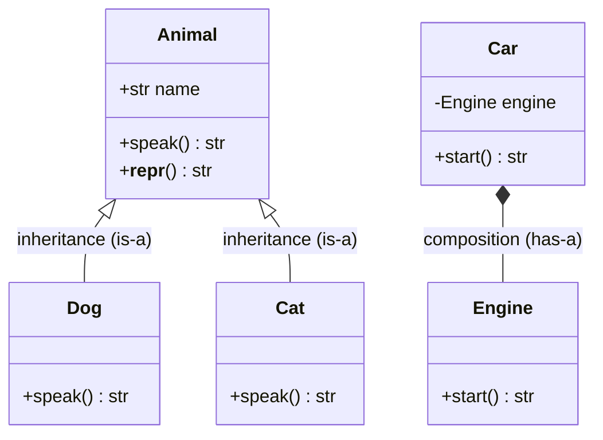
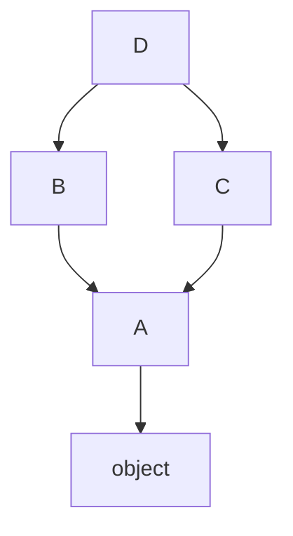

# Object-Oriented Programming

> Master Python's class model — encapsulation, inheritance, polymorphism, and abstraction — plus the dunder methods, MRO, properties, and advanced hooks that power real frameworks.

## Mental model

A **class** is a blueprint that bundles data (attributes) with behavior (methods); an **object** is a concrete instance with its own state. Python leans on four pillars: **encapsulation** (bundle and protect state), **inheritance** (reuse and extend), **polymorphism** (one interface, many types), and **abstraction** (expose essentials, hide details). Crucially, in Python *classes are themselves objects*, created by a metaclass (`type` by default).



## Core concepts

### Classes, instances, and `self`

`__init__` initializes a freshly created instance. `self` is the conventional name for that instance — Python passes it automatically: `dog.bark()` is really `Dog.bark(dog)`.

```python
class Dog:
    species = "Canis"            # class variable: shared by all dogs

    def __init__(self, name):
        self.name = name         # instance variable: per object

    def bark(self):
        return f"{self.name} says woof!"

rex = Dog("Rex")
print(rex.bark())                # => Rex says woof!
print(rex.species, Dog.species)  # => Canis Canis
```

::: warning
Mutable class variables are shared. `tricks = []` on the class then `self.tricks.append(...)` mutates the one shared list. Initialize per-instance mutable state in `__init__`.
:::

### Instance, class, and static methods

```python
from datetime import datetime

class Calendar:
    def __init__(self, day):
        self.day = day                       # instance state

    @classmethod
    def from_string(cls, s):                 # alternative constructor
        return cls(datetime.strptime(s, "%Y-%m-%d"))

    @staticmethod
    def is_weekend(day):                     # no self/cls — just grouped
        return day.weekday() in (5, 6)

    def schedule(self, time):                # uses instance state
        return f"Meeting on {self.day:%Y-%m-%d} at {time}"

cal = Calendar.from_string("2026-06-28")
print(Calendar.is_weekend(cal.day))          # => True
print(cal.schedule("10:00"))                 # => Meeting on 2026-06-28 at 10:00
```

- **Instance method** — takes `self`, reads/writes instance state.
- **Class method** — takes `cls`, ideal for alternative constructors / class-level state.
- **Static method** — takes neither; a plain function living in the class namespace.

### Inheritance, overriding, and `super()`

A subclass reuses a parent and may override methods. `super()` calls the next class in the MRO — typically to *extend* rather than replace.

```python
class Animal:
    def __init__(self, name):
        self.name = name
    def speak(self):
        return "..."
    def __repr__(self):
        return f"{type(self).__name__}({self.name!r})"

class Cat(Animal):
    def speak(self):                # override
        return "meow"

class Puppy(Animal):
    def __init__(self, name, age):
        super().__init__(name)      # extend parent init
        self.age = age

print(Cat("Tom").speak())           # => meow
print(repr(Puppy("Rex", 1)))        # => Puppy('Rex')
```

Python supports **single**, **multiple**, **multilevel**, **hierarchical**, and **hybrid** inheritance.

### MRO and multiple inheritance

With multiple parents, Python resolves methods by the **Method Resolution Order**, computed with **C3 linearization**. Inspect it via `Cls.__mro__`.

```python
class Animal:
    def speak(self): return "sound"
class Flyable:
    def fly(self): return "flying"
class Bird(Animal, Flyable):
    def speak(self): return "tweet"

print(Bird.__mro__)
# => (<class 'Bird'>, <class 'Animal'>, <class 'Flyable'>, <class 'object'>)
print(Bird().speak(), Bird().fly())   # => tweet flying
```



### Polymorphism and duck typing

The same call works on any object that implements the expected method — no shared base class required.

```python
def make_speak(animal):
    return animal.speak()       # works for anything with .speak()

print(make_speak(Cat("Tom")))   # => meow
print(make_speak(Bird()))       # => tweet
```

### Encapsulation, name mangling, and `@property`

Python has no true privacy. Conventions: `_x` means "internal"; `__x` triggers **name mangling** to `_ClassName__x` (avoids subclass clashes). `@property` exposes controlled access with the attribute syntax.

```python
class Account:
    def __init__(self, balance):
        self.__balance = balance         # mangled -> _Account__balance

    @property
    def balance(self):                   # read: acct.balance
        return self.__balance

    @balance.setter
    def balance(self, value):            # write: acct.balance = ...
        if value < 0:
            raise ValueError("balance must be >= 0")
        self.__balance = value

acct = Account(100)
acct.balance = 150
print(acct.balance)                      # => 150
print(acct._Account__balance)            # => 150 (mangled, still reachable)
```

### Dunder (magic) methods

Implement dunders so objects behave like built-ins. `__str__` is the readable form (for `print`); `__repr__` is the unambiguous developer form (for the REPL/debugging).

```python
class Money:
    def __init__(self, cents): self.cents = cents
    def __str__(self):  return f"${self.cents / 100:.2f}"
    def __repr__(self): return f"Money({self.cents})"
    def __eq__(self, other): return self.cents == other.cents
    def __lt__(self, other): return self.cents < other.cents

m = Money(1050)
print(str(m), repr(m))               # => $10.50 Money(1050)
print(Money(500) < Money(900))       # => True
```

Iteration via `__iter__`/`__next__`:

```python
class Countdown:
    def __init__(self, start): self.current = start
    def __iter__(self): return self
    def __next__(self):
        if self.current <= 0:
            raise StopIteration
        self.current -= 1
        return self.current + 1

print(list(Countdown(3)))            # => [3, 2, 1]
```

### Abstraction with `abc`

An abstract base class defines a contract and can't be instantiated until subclasses implement every `@abstractmethod`.

```python
from abc import ABC, abstractmethod

class Repository(ABC):
    @abstractmethod
    def save(self, item): ...

class SqlRepo(Repository):
    def save(self, item):
        return f"saved {item}"

print(SqlRepo().save("user"))        # => saved user
# Repository()  -> TypeError: Can't instantiate abstract class
```

### Composition over inheritance

Composition models "has-a" by holding other objects — more flexible and loosely coupled than deep "is-a" hierarchies.

```python
class Engine:
    def start(self): return "vroom"

class Car:
    def __init__(self):
        self.engine = Engine()       # Car HAS an Engine
    def start(self):
        return self.engine.start()

print(Car().start())                 # => vroom
```

### `isinstance`, `issubclass`, and overloading

```python
print(isinstance(5, int))            # => True
print(isinstance(5, (int, float)))   # => True (any of the tuple)
print(issubclass(bool, int))         # => True
```

Python has no classic overloading (later defs replace earlier ones). Use defaults, `*args`, or `functools.singledispatch` for type-based dispatch:

```python
from functools import singledispatch

@singledispatch
def describe(x): return f"value {x}"

@describe.register
def _(x: list): return f"list of {len(x)}"

print(describe(5))         # => value 5
print(describe([1, 2]))    # => list of 2
```

### Advanced hooks: `__slots__`, `__new__`, descriptors, metaclasses

`__slots__` drops the per-instance `__dict__`, saving memory and speeding attribute access — valuable for millions of objects.

```python
class Point:
    __slots__ = ("x", "y")           # no __dict__
    def __init__(self, x, y):
        self.x, self.y = x, y

p = Point(1, 2)
# p.z = 3  -> AttributeError: no slot 'z'
```

`__new__` allocates the instance (runs before `__init__`) — needed for singletons or subclassing immutables:

```python
class Singleton:
    _instance = None
    def __new__(cls):
        if cls._instance is None:
            cls._instance = super().__new__(cls)
        return cls._instance

print(Singleton() is Singleton())    # => True
```

The **descriptor protocol** (`__get__`/`__set__`/`__delete__`) is the machinery behind `@property`, methods, and ORM fields. A **metaclass** is the "class of a class" (`type` by default) — use it to enforce conventions or auto-register subclasses, though `__init_subclass__` or decorators usually suffice. To block subclassing:

```python
class Sealed:
    def __init_subclass__(cls, **kwargs):
        raise TypeError("Sealed cannot be subclassed")
```

## Common pitfalls

- **Mutable class variables** shared across instances — initialize per-instance state in `__init__`.
- **Forgetting `super().__init__()`** in a subclass leaves parent state unset.
- **`type(obj) == Class`** ignores inheritance; prefer `isinstance(obj, Class)`.
- **Defining only `__eq__`** makes the object unhashable unless you also set `__hash__` (or use `@dataclass(frozen=True)`).
- **Treating `__x` as truly private** — name mangling only obscures; `_ClassName__x` still works.
- **Reaching for a metaclass** when `__init_subclass__`, a decorator, or a property would do.

## Best practices

- Favor composition over deep inheritance; keep hierarchies shallow.
- Always define `__repr__` for debuggable objects.
- Use `@property` instead of Java-style `get_x()`/`set_x()`.
- Define interfaces with `abc.ABC` + `@abstractmethod`.
- Use `@dataclass` (see the Modern Python tutorial) for plain data holders.
- Add `__slots__` to memory-critical, attribute-fixed classes.

## Interview quick-reference

| Concept | Key point |
| --- | --- |
| `self` / `__init__` | Instance reference / initializer run on creation |
| instance/class/static | `self` / `cls` / neither — alt constructors & helpers |
| Inheritance + `super()` | Reuse & extend; `super()` calls the next MRO class |
| MRO | C3 linearization; inspect via `Cls.__mro__` |
| Polymorphism | Duck typing — works if the method exists |
| Encapsulation | `_x` convention, `__x` name-mangled, `@property` for access |
| `__str__` vs `__repr__` | Readable vs unambiguous developer form |
| Dunders | `__len__`, `__iter__`, `__eq__`, `__getitem__`, ... behave like built-ins |
| Abstraction | `abc.ABC` + `@abstractmethod` define a contract |
| Composition | "has-a"; flexible alternative to inheritance |
| `__slots__` | Drops `__dict__` — less memory, faster access |
| `__new__` vs `__init__` | Allocate vs initialize; `__new__` for singletons/immutables |
| Descriptors / metaclass | `__get__`/`__set__` power properties; `type` builds classes |
