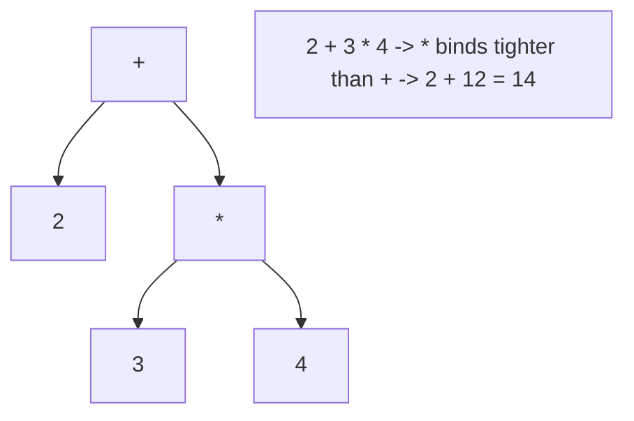
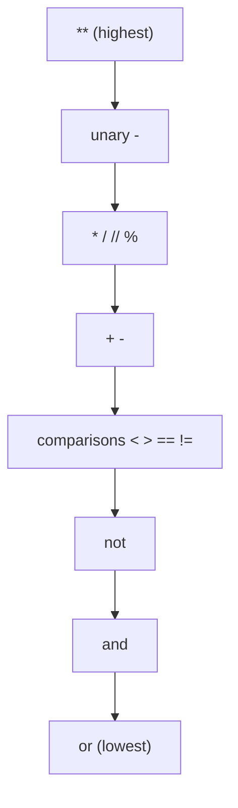

# Operators

> Understand Python's arithmetic operators, the two kinds of division, modulo and exponentiation, and how precedence and associativity decide evaluation order.

## Mental model

An expression is a little tree. Operators are the nodes; precedence decides which node binds tightest, and associativity decides direction when operators tie. Python evaluates the tree from the most tightly-bound leaves up to the root. Get the tree right and every "surprising" result becomes obvious.



## Core concepts

### Arithmetic operators

Seven operators cover everyday math.

```python
print(7 + 2)    # => 9    addition
print(7 - 2)    # => 5    subtraction
print(7 * 2)    # => 14   multiplication
print(7 / 2)    # => 3.5  true division (always float)
print(7 // 2)   # => 3    floor division
print(7 % 2)    # => 1    modulo (remainder)
print(7 ** 2)   # => 49   exponentiation
```

### True division `/` vs floor division `//`

`/` always returns a `float`. `//` performs **floor division**, rounding *down toward negative infinity*, and keeps the operand types.

```python
print(7 / 2)      # => 3.5    true division -> float
print(7 // 2)     # => 3      floor division -> int
print(-7 // 2)    # => -4     rounds toward -infinity, NOT toward zero
print(7.0 // 2)   # => 3.0    float in -> float out
```

::: warning
`-7 // 2` is `-4`, not `-3`. Floor division rounds toward negative infinity, so it differs from truncation. If you want truncation toward zero, use `int(-7 / 2)` which gives `-3`, or `math.trunc()`.
:::

### Modulo `%`

Modulo gives the remainder. It pairs with `//` so that `a == (a // b) * b + (a % b)`. In Python the result takes the **sign of the divisor**, which is handy for wrapping indices.

```python
print(10 % 3)     # => 1    remainder
print(10 % 2)     # => 0    even number check
print(-1 % 5)     # => 4    sign follows divisor -> always lands in [0, 5)
```

A classic use is parity and clock-style wrapping:

```python
for n in range(6):
    kind = "even" if n % 2 == 0 else "odd"
    print(n, kind)
# => 0 even / 1 odd / 2 even / 3 odd / 4 even / 5 odd

hour = (10 + 5) % 12
print(hour)       # => 3    15:00 wraps to 3 on a 12-hour clock
```

### Exponentiation `**`

Raises to a power. It accepts floats and negative or fractional exponents.

```python
print(2 ** 10)    # => 1024
print(9 ** 0.5)   # => 3.0    square root via fractional exponent
print(2 ** -1)    # => 0.5    negative exponent
print(pow(2, 10)) # => 1024   the built-in equivalent
print(pow(2, 10, 1000))  # => 24   (2**10) % 1000 in one efficient step
```

### Operator precedence

When an expression mixes operators, precedence picks who goes first. From tightest to loosest (abridged): `**` -> unary `-` -> `* / // %` -> `+ -` -> comparisons (`< > == !=`) -> `not` -> `and` -> `or`.

```python
print(2 + 3 * 4)        # => 14    '*' before '+', not 20
print((2 + 3) * 4)      # => 20    parentheses override
print(10 - 2 - 3)       # => 5     left-associative: (10-2)-3
print(not True or False)# => False 'not' before 'or': (not True) or False
```



### Associativity: left vs right

Most operators are **left-associative** (evaluated left to right). The notable exception is `**`, which is **right-associative**.

```python
print(2 ** 3 ** 2)      # => 512    right-assoc: 2 ** (3 ** 2) = 2 ** 9
print((2 ** 3) ** 2)    # => 64     forced left grouping
print(100 / 5 / 2)      # => 10.0   left-assoc: (100 / 5) / 2
```

::: tip
When in doubt, add parentheses. They cost nothing at runtime, document intent, and prevent the right-associative `**` surprise.
:::

### Comparison chaining

Python lets you chain comparisons the way math does — each pair is `and`-ed together, and each operand is evaluated once.

```python
x = 5
print(1 < x < 10)       # => True   means (1 < x) and (x < 10)
print(0 <= x <= 4)      # => False
```

### Augmented assignment

Operators combine with `=` to update a variable in place-ish form. For immutables this rebinds; for mutables like lists it may mutate.

```python
n = 10
n += 5;  print(n)   # => 15
n //= 2; print(n)   # => 7
n **= 2; print(n)   # => 49

acc = [1]
acc += [2, 3]       # for lists, += extends in place
print(acc)          # => [1, 2, 3]
```

## Common pitfalls

- **Expecting `/` to return an int.** It always returns a float in Python 3. Use `//` for an integer quotient.
- **Assuming `//` truncates toward zero.** It floors toward negative infinity: `-7 // 2 == -4`. Use `int(a / b)` to truncate.
- **Misreading `2 ** 3 ** 2`.** `**` is right-associative, so it's `512`, not `64`. Parenthesize to be safe.
- **Relying on remembered precedence for mixed `and`/`or`/`not`.** `not` binds tighter than `and`, which binds tighter than `or`. Add parentheses for clarity.
- **Float surprises.** `0.1 + 0.2 != 0.3` due to binary floating point. Use `math.isclose()` or `decimal.Decimal` for exact decimals.
- **Negative modulo confusion.** `-1 % 5 == 4` in Python (sign follows the divisor) — different from C.

## Best practices

- Use parentheses to make non-trivial precedence explicit, even when not strictly required.
- Pick `//` and `%` deliberately for integer math; remember they floor.
- Prefer chained comparisons (`a < b < c`) over `a < b and b < c`.
- Use `math.isclose()` to compare floats rather than `==`.
- Reach for `pow(base, exp, mod)` when you need modular exponentiation efficiently.

## Interview quick-reference

| Topic | Key point |
| --- | --- |
| Arithmetic | `+ - * / // % **` |
| `/` vs `//` | True division (float) vs floor division (rounds to -infinity) |
| `%` | Remainder; sign follows divisor; great for parity/wrapping |
| `**` | Power; supports floats & negative exponents; right-associative |
| Precedence | `**` > unary `-` > `* / // %` > `+ -` > comparisons > `not` > `and` > `or` |
| Associativity | Left for most; `**` is right-associative |
| `2 ** 3 ** 2` | `512` (= `2 ** (3 ** 2)`) |
| `-7 // 2` | `-4` (floors toward negative infinity) |
| Chaining | `1 < x < 10` equals `(1 < x) and (x < 10)` |
| Float equality | Use `math.isclose()`, not `==` |
