# Behavioral Design Patterns in Python

> Master the behavioral GoF patterns — Observer, Strategy, Command, State, Memento, Iterator, Mediator, Chain of Responsibility, Visitor, and Template Method — that define how objects communicate and share responsibility.

## Mental model

Behavioral patterns are about **the flow of control and responsibility between objects**: who tells whom to do what, and when. Where creational patterns make objects and structural patterns connect them, behavioral patterns choreograph their *conversations* so that collaboration stays loosely coupled and easy to change.

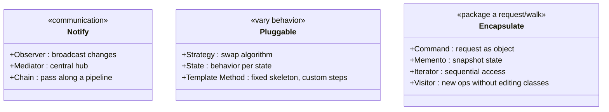

::: tip The recurring Pythonic theme
Many behavioral patterns exist to pass *behavior* around. Python has first-class functions and generators, so Strategy, Command, Iterator, and Template Method frequently collapse into functions or `yield`. We flag the lighter option in each section.
:::

## Core concepts

### Observer — broadcast state changes to many subscribers

**When to use it:** one object's state change must notify an unknown number of dependents — event systems, pub/sub, UI data binding. The Subject keeps a list of Observers and calls `update` on each; subject and observers stay decoupled.

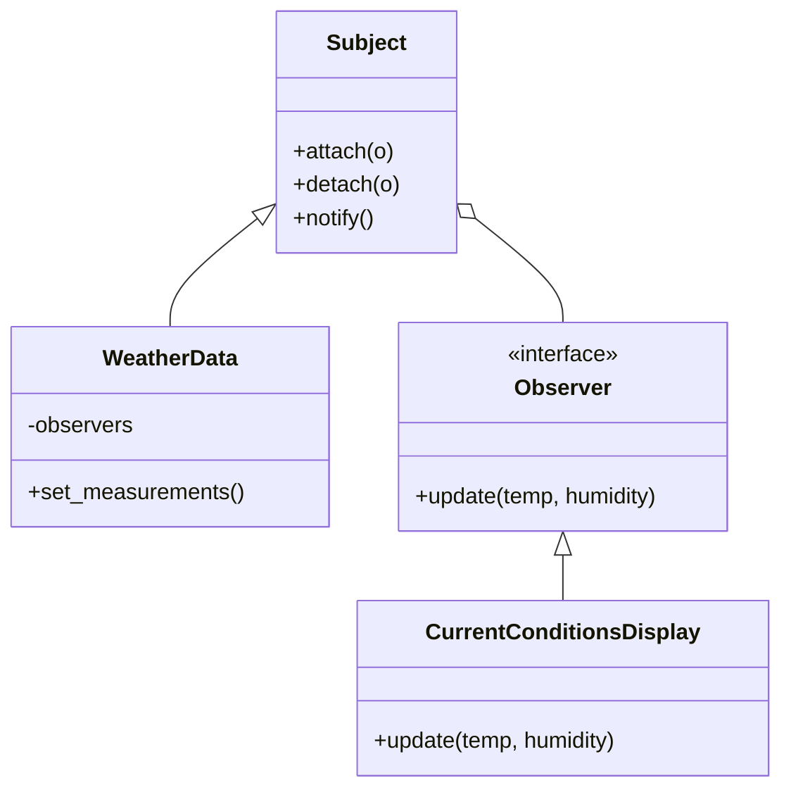

```python
from abc import ABC, abstractmethod


class Observer(ABC):
    @abstractmethod
    def update(self, temperature: float, humidity: float) -> None: ...


class WeatherData:                         # subject
    def __init__(self) -> None:
        self._observers: list[Observer] = []
        self._temperature = 0.0
        self._humidity = 0.0

    def attach(self, observer: Observer) -> None:
        if observer not in self._observers:
            self._observers.append(observer)

    def detach(self, observer: Observer) -> None:
        self._observers.remove(observer)

    def _notify(self) -> None:
        for observer in self._observers:
            observer.update(self._temperature, self._humidity)

    def set_measurements(self, temperature: float, humidity: float) -> None:
        self._temperature, self._humidity = temperature, humidity
        self._notify()                     # push the change to everyone


class CurrentConditionsDisplay(Observer):
    def update(self, temperature: float, humidity: float) -> None:
        print(f"Conditions: {temperature}F, {humidity}% humidity")


weather = WeatherData()
weather.attach(CurrentConditionsDisplay())
weather.set_measurements(80.0, 65.0)   # Conditions: 80.0F, 65.0% humidity
```

::: tip Pythonic alternative
Observers can simply be **callables**. Keep a `list[Callable]` and call each on change — no `Observer` base class needed:

```python
subscribers: list = []
subscribers.append(lambda t, h: print(t, h))
```
:::

### Strategy — swap interchangeable algorithms at runtime

**When to use it:** several algorithms solve the same problem and you want to choose one at runtime without `if/elif` sprawl. Each strategy implements a common interface; the context delegates to whichever it holds.

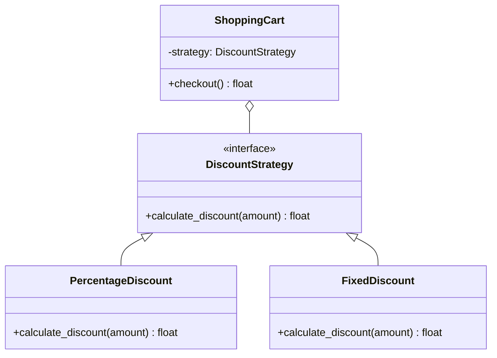

```python
from abc import ABC, abstractmethod


class DiscountStrategy(ABC):
    @abstractmethod
    def calculate_discount(self, amount: float) -> float: ...


class PercentageDiscount(DiscountStrategy):
    def __init__(self, percentage: float) -> None:
        self.percentage = percentage

    def calculate_discount(self, amount: float) -> float:
        return amount * (self.percentage / 100)


class FixedDiscount(DiscountStrategy):
    def __init__(self, discount: float) -> None:
        self.discount = discount

    def calculate_discount(self, amount: float) -> float:
        return min(amount, self.discount)


class ShoppingCart:
    def __init__(self, strategy: DiscountStrategy) -> None:
        self.items: list[float] = []
        self.strategy = strategy

    def checkout(self) -> float:
        total = sum(self.items)
        return total - self.strategy.calculate_discount(total)


cart = ShoppingCart(PercentageDiscount(10))
cart.items = [100.0, 50.0]
print(cart.checkout())   # 135.0
```

::: tip Pythonic alternative
A strategy is just a function. Pass `Callable[[float], float]` instead of a class hierarchy when the strategy is stateless:

```python
def ten_percent(amount: float) -> float:
    return amount * 0.10
```
Use classes only for stateful or configurable strategies.
:::

### Command — package a request as an object

**When to use it:** you need to parameterize, queue, log, or *undo* operations. A Command bundles the receiver, the action, and the arguments into an object with `execute()`/`undo()`. The invoker keeps a history for undo/redo.

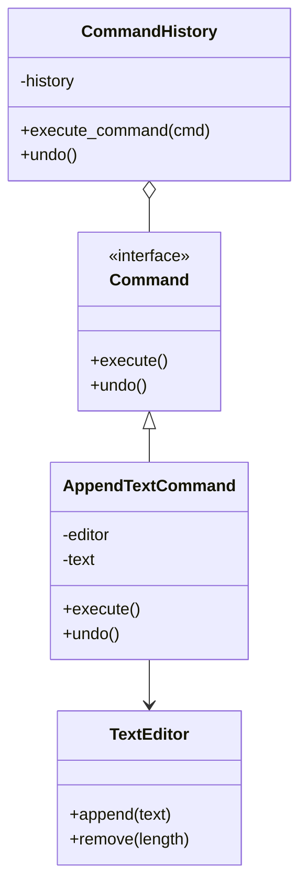

```python
from abc import ABC, abstractmethod


class TextEditor:                          # receiver
    def __init__(self) -> None:
        self.content = ""

    def append(self, text: str) -> None:
        self.content += text

    def remove(self, length: int) -> None:
        self.content = self.content[:-length]


class Command(ABC):
    @abstractmethod
    def execute(self) -> None: ...
    @abstractmethod
    def undo(self) -> None: ...


class AppendTextCommand(Command):
    def __init__(self, editor: TextEditor, text: str) -> None:
        self.editor, self.text = editor, text

    def execute(self) -> None:
        self.editor.append(self.text)

    def undo(self) -> None:
        self.editor.remove(len(self.text))   # knows how to reverse itself


class CommandHistory:                      # invoker
    def __init__(self) -> None:
        self.history: list[Command] = []

    def execute_command(self, command: Command) -> None:
        command.execute()
        self.history.append(command)

    def undo(self) -> None:
        if self.history:
            self.history.pop().undo()


editor, history = TextEditor(), CommandHistory()
history.execute_command(AppendTextCommand(editor, "Hello "))
history.execute_command(AppendTextCommand(editor, "World!"))
print(editor.content)   # Hello World!
history.undo()
print(editor.content)   # Hello
```

### State — behavior that changes with internal state

**When to use it:** an object behaves differently depending on its state, and you want to avoid sprawling `if/elif` blocks. Each state becomes a class; the context delegates to its current state object, which may transition the context to another state.

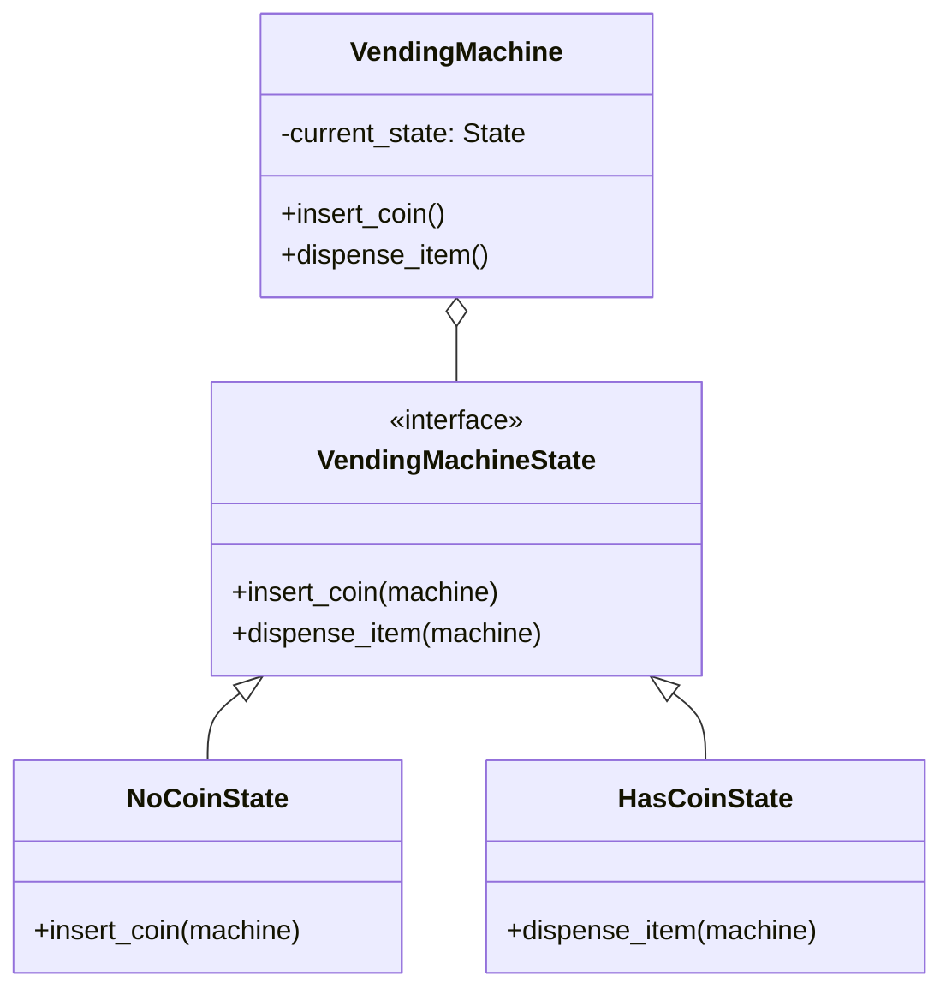

```python
from abc import ABC, abstractmethod


class VendingMachineState(ABC):
    @abstractmethod
    def insert_coin(self, machine: "VendingMachine") -> None: ...
    @abstractmethod
    def dispense_item(self, machine: "VendingMachine") -> None: ...


class NoCoinState(VendingMachineState):
    def insert_coin(self, machine: "VendingMachine") -> None:
        print("Coin inserted.")
        machine.state = machine.has_coin          # transition

    def dispense_item(self, machine: "VendingMachine") -> None:
        print("Insert a coin first.")


class HasCoinState(VendingMachineState):
    def insert_coin(self, machine: "VendingMachine") -> None:
        print("Coin already inserted.")

    def dispense_item(self, machine: "VendingMachine") -> None:
        print("Item dispensed.")
        machine.state = machine.no_coin           # transition back


class VendingMachine:
    def __init__(self) -> None:
        self.no_coin = NoCoinState()
        self.has_coin = HasCoinState()
        self.state: VendingMachineState = self.no_coin

    def insert_coin(self) -> None:
        self.state.insert_coin(self)

    def dispense_item(self) -> None:
        self.state.dispense_item(self)


m = VendingMachine()
m.dispense_item()   # Insert a coin first.
m.insert_coin()     # Coin inserted.
m.dispense_item()   # Item dispensed.
```

::: tip State vs Strategy
Same structure, different intent: Strategy is chosen by the *client* and rarely changes itself; State objects **transition themselves**, encoding a state machine. State replaces conditional logic that depends on *what mode the object is in*.
:::

### Memento — snapshot and restore without breaking encapsulation

**When to use it:** you need undo/checkpoint by saving an object's internal state, but you don't want outsiders poking at its internals. The **Originator** creates a **Memento** (an opaque snapshot); a **Caretaker** stores mementos without inspecting them.

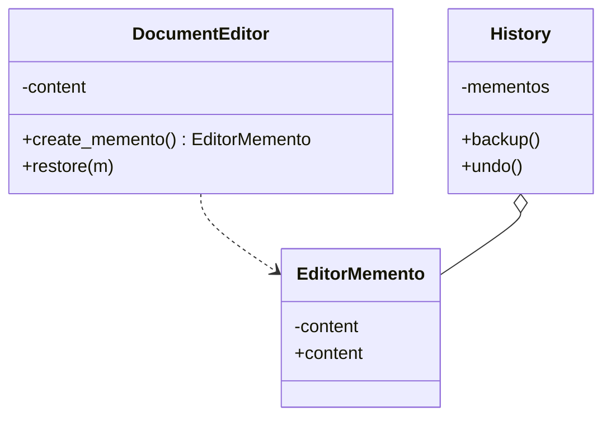

```python
class EditorMemento:                       # immutable snapshot
    def __init__(self, content: str) -> None:
        self._content = content

    @property
    def content(self) -> str:
        return self._content


class DocumentEditor:                       # originator
    def __init__(self) -> None:
        self.content = ""

    def type_words(self, words: str) -> None:
        self.content += words

    def create_memento(self) -> EditorMemento:
        return EditorMemento(self.content)

    def restore(self, memento: EditorMemento) -> None:
        self.content = memento.content


class History:                              # caretaker — never reads the memento
    def __init__(self, editor: DocumentEditor) -> None:
        self.editor = editor
        self._mementos: list[EditorMemento] = []

    def backup(self) -> None:
        self._mementos.append(self.editor.create_memento())

    def undo(self) -> None:
        if self._mementos:
            self.editor.restore(self._mementos.pop())


editor = DocumentEditor()
history = History(editor)
editor.type_words("Hello, ")
history.backup()
editor.type_words("World!")
history.undo()
print(editor.content)   # Hello,
```

### Iterator — sequential access without exposing internals

**When to use it:** you want to walk a collection's elements without revealing its structure. Python builds this in: an iterable defines `__iter__`, an iterator defines `__next__` and raises `StopIteration`. Generators give you both for free.

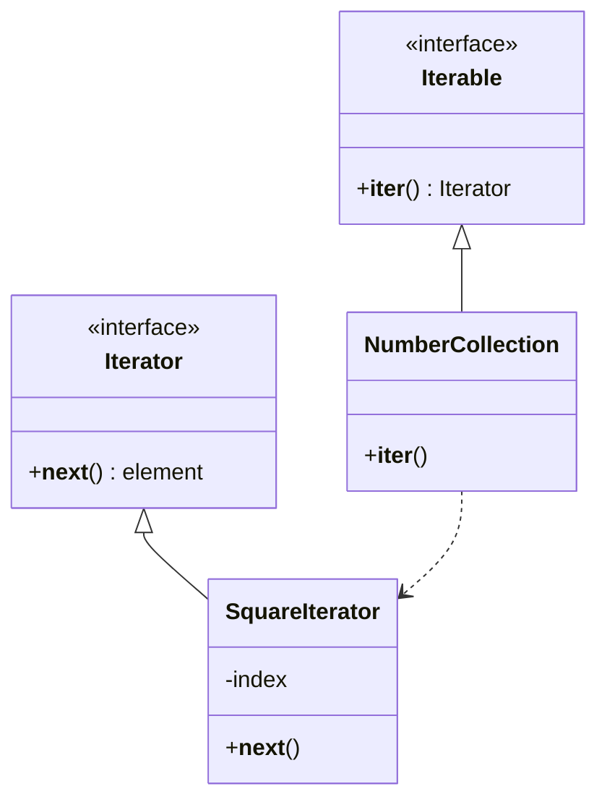

```python
class NumberCollection:
    def __init__(self, data: list[int]) -> None:
        self.data = data

    def __iter__(self) -> "SquareIterator":
        return SquareIterator(self.data)


class SquareIterator:
    def __init__(self, data: list[int]) -> None:
        self.data = data
        self._index = 0

    def __iter__(self) -> "SquareIterator":
        return self

    def __next__(self) -> int:
        if self._index >= len(self.data):
            raise StopIteration            # signals the for-loop to stop
        value = self.data[self._index] ** 2
        self._index += 1
        return value


for n in NumberCollection([1, 2, 3]):
    print(n)            # 1, 4, 9
```

::: tip Pythonic alternative
A **generator** replaces the whole iterator class:

```python
def squares(data: list[int]):
    for n in data:
        yield n ** 2

list(squares([1, 2, 3]))   # [1, 4, 9]
```
:::

### Mediator — a hub that decouples colleagues

**When to use it:** many components interact and direct references create a tangled web. A Mediator centralizes the interaction; each component only knows the mediator, so you can change how they collaborate in one place.

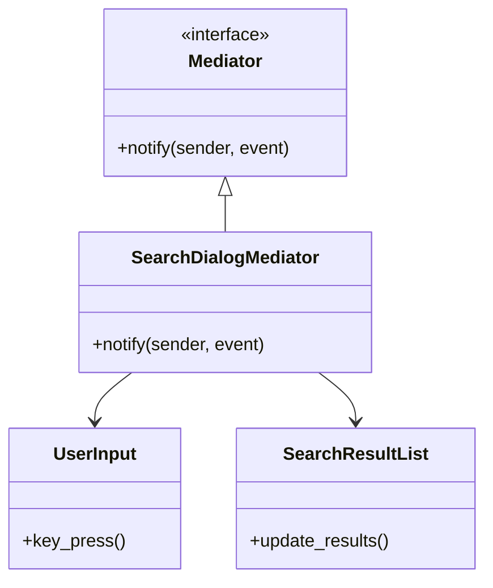

```python
from abc import ABC, abstractmethod


class Mediator(ABC):
    @abstractmethod
    def notify(self, sender: object, event: str) -> None: ...


class UserInput:
    def __init__(self) -> None:
        self.mediator: Mediator | None = None

    def key_press(self) -> None:
        print("UserInput: key pressed")
        if self.mediator:
            self.mediator.notify(self, "keypress")


class SearchResultList:
    def update_results(self) -> None:
        print("Results: refreshing")


class SearchDialogMediator(Mediator):
    def __init__(self, user_input: UserInput, results: SearchResultList) -> None:
        self.user_input = user_input
        self.user_input.mediator = self
        self.results = results

    def notify(self, sender: object, event: str) -> None:
        if event == "keypress":
            self.results.update_results()   # mediator wires the reaction


inp = UserInput()
SearchDialogMediator(inp, SearchResultList())
inp.key_press()   # UserInput: key pressed / Results: refreshing
```

### Chain of Responsibility — pass a request along a pipeline

**When to use it:** a request should be handled by one of several handlers, decided at runtime — classic middleware (auth → validation → cache). Each handler either handles the request or passes it to the next.

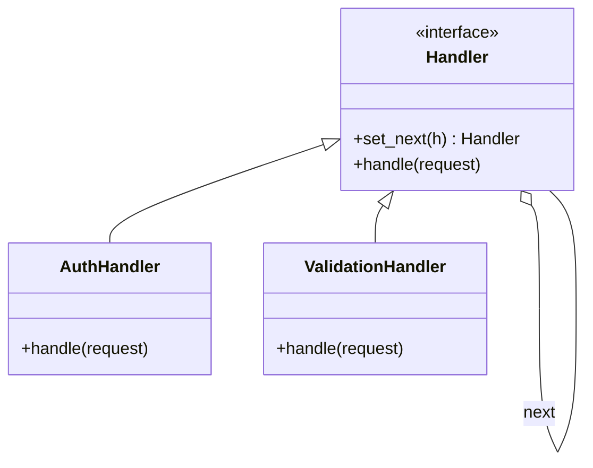

```python
from abc import ABC, abstractmethod


class Handler(ABC):
    def __init__(self) -> None:
        self._next: "Handler | None" = None

    def set_next(self, handler: "Handler") -> "Handler":
        self._next = handler
        return handler                     # return next -> chainable wiring

    @abstractmethod
    def handle(self, request: str) -> str | None:
        if self._next:
            return self._next.handle(request)
        return None


class AuthHandler(Handler):
    def handle(self, request: str) -> str | None:
        if "auth" not in request:
            return "Rejected: not authenticated"
        print("Auth: passed")
        return super().handle(request)


class ValidationHandler(Handler):
    def handle(self, request: str) -> str | None:
        if "invalid" in request:
            return "Rejected: invalid data"
        print("Validation: passed")
        return super().handle(request)


auth = AuthHandler()
auth.set_next(ValidationHandler())
print(auth.handle("auth_valid"))     # Auth: passed / Validation: passed / None
print(auth.handle("auth_invalid"))   # Auth: passed / Rejected: invalid data
```

### Visitor — add operations without editing the classes

**When to use it:** you have a stable set of element classes (a document tree, an AST) and want to add *new operations* over them without modifying each class. The operation moves into a Visitor; each element's `accept` calls back the right `visit_*` method (double dispatch).

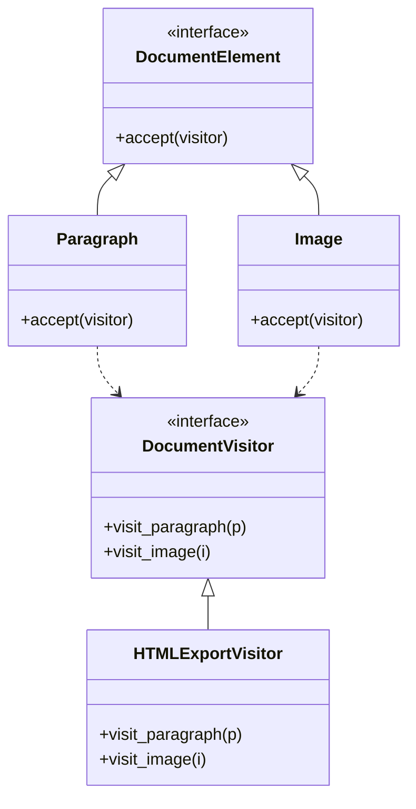

```python
from abc import ABC, abstractmethod


class DocumentVisitor(ABC):
    @abstractmethod
    def visit_paragraph(self, p: "Paragraph") -> None: ...
    @abstractmethod
    def visit_image(self, i: "Image") -> None: ...


class DocumentElement(ABC):
    @abstractmethod
    def accept(self, visitor: DocumentVisitor) -> None: ...


class Paragraph(DocumentElement):
    def __init__(self, text: str) -> None:
        self.text = text

    def accept(self, visitor: DocumentVisitor) -> None:
        visitor.visit_paragraph(self)      # double dispatch


class Image(DocumentElement):
    def __init__(self, src: str) -> None:
        self.src = src

    def accept(self, visitor: DocumentVisitor) -> None:
        visitor.visit_image(self)


class HTMLExportVisitor(DocumentVisitor):
    def visit_paragraph(self, p: Paragraph) -> None:
        print(f"<p>{p.text}</p>")

    def visit_image(self, i: Image) -> None:
        print(f"")


elements: list[DocumentElement] = [Paragraph("Hi"), Image("a.png")]
visitor = HTMLExportVisitor()
for el in elements:
    el.accept(visitor)
```

::: warning Visitor's trade-off
Adding a new *operation* is easy (write a new visitor), but adding a new *element class* forces you to update every visitor. Use it when elements are stable and operations grow.
:::

### Template Method — fixed skeleton, customizable steps

**When to use it:** several algorithms share the same overall structure but differ in a few steps. The base class defines the skeleton (the *template method*) and calls abstract steps; subclasses fill in the steps without touching the order.

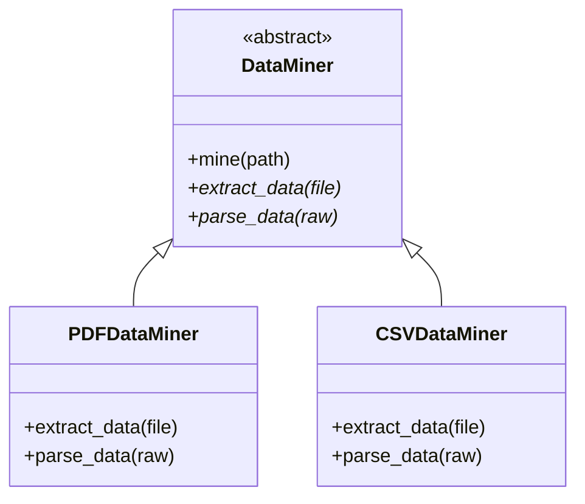

```python
from abc import ABC, abstractmethod


class DataMiner(ABC):
    def mine(self, path: str) -> None:     # the template method = fixed skeleton
        raw = self.extract_data(path)
        data = self.parse_data(raw)
        print(f"Analyzing {data}")

    @abstractmethod
    def extract_data(self, path: str) -> str: ...
    @abstractmethod
    def parse_data(self, raw: str) -> str: ...


class PDFDataMiner(DataMiner):
    def extract_data(self, path: str) -> str:
        return "PDFRaw"

    def parse_data(self, raw: str) -> str:
        return f"parsed:{raw}"


PDFDataMiner().mine("report.pdf")   # Analyzing parsed:PDFRaw
```

::: tip Pythonic alternative
Template Method can become a function that takes the variable steps as callables — composition over inheritance:

```python
def mine(extract, parse, path):
    print(f"Analyzing {parse(extract(path))}")
```
:::

## Common pitfalls

- **Observer memory leaks.** Forgetting to `detach` keeps dead observers alive. Fix: detach on teardown, or use `weakref` for subscribers.
- **Strategy/State confusion.** They look identical; picking the wrong intent muddies the design. Fix: State transitions itself, Strategy is set by the client.
- **God Mediator.** The hub accumulates all logic and becomes the new bottleneck. Fix: keep it to coordination; split if it grows.
- **Reinventing Iterator.** Hand-writing `__next__` when a generator would do. Fix: `yield`.
- **Visitor on unstable element classes.** Every new element breaks all visitors. Fix: only use when elements are stable.
- **Command without undo need.** A full Command hierarchy where a function suffices. Fix: pass a callable unless you need undo/queue/log.

## Best practices

- Prefer callables/generators (Strategy, Command, Observer, Iterator, Template Method) when there's no state to carry.
- Keep mementos opaque to the caretaker to preserve encapsulation.
- Use State to kill large `if/elif` mode-switching; name transitions explicitly.
- Make Chain handlers single-purpose and return early when they fully handle a request.
- Choose Visitor only when operations change more often than the element set.

## Interview quick-reference

| Pattern | Intent | One-line example |
| --- | --- | --- |
| Observer | Notify many subscribers on state change | weather station updates displays |
| Strategy | Swap interchangeable algorithms at runtime | pluggable discount calculation |
| Command | Encapsulate a request as an object | undo/redo text editor history |
| State | Change behavior with internal state | vending machine coin states |
| Memento | Snapshot/restore without breaking encapsulation | editor undo via opaque snapshot |
| Iterator | Sequential access without exposing structure | custom `__iter__`/generator |
| Mediator | Central hub decouples colleagues | search dialog wiring input to results |
| Chain of Responsibility | Pass a request along handlers | auth → validation → cache middleware |
| Visitor | Add operations without editing classes | HTML/Markdown export over a document tree |
| Template Method | Fixed skeleton, subclass steps | PDF vs CSV data miner |
