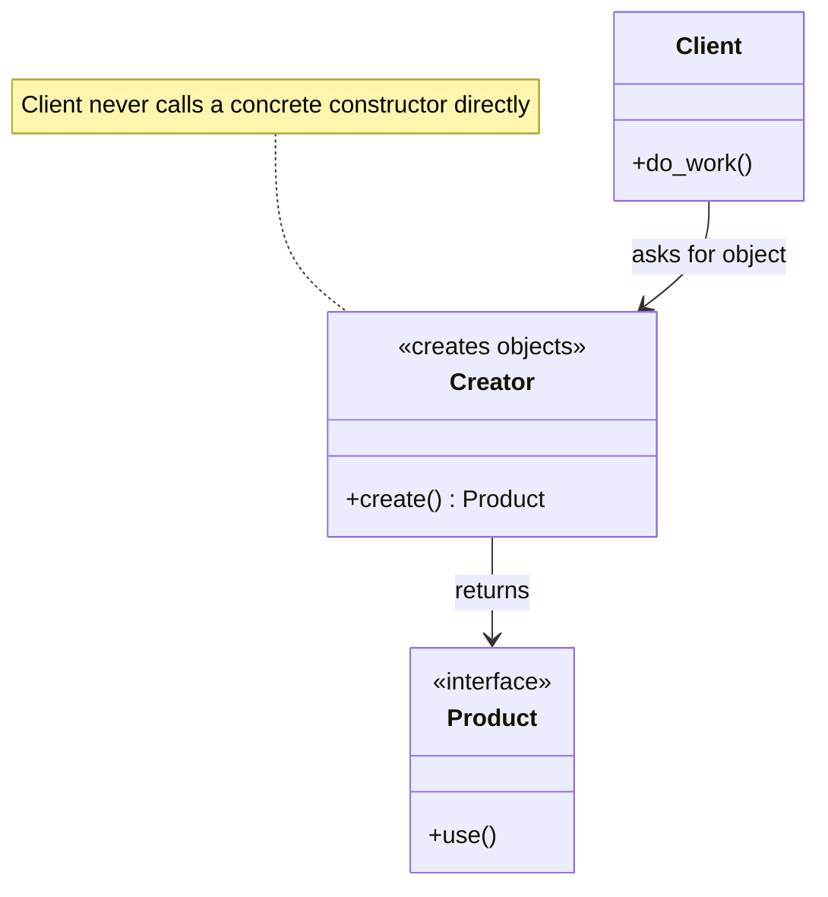
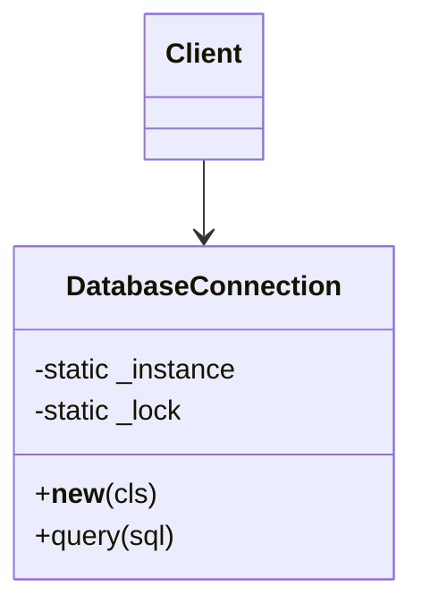
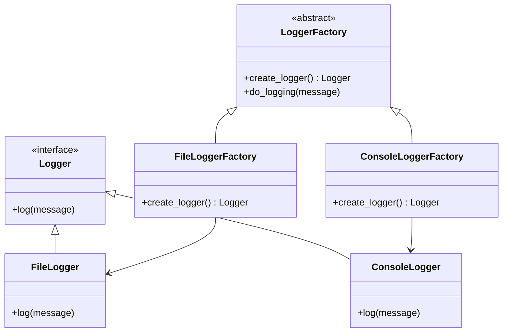
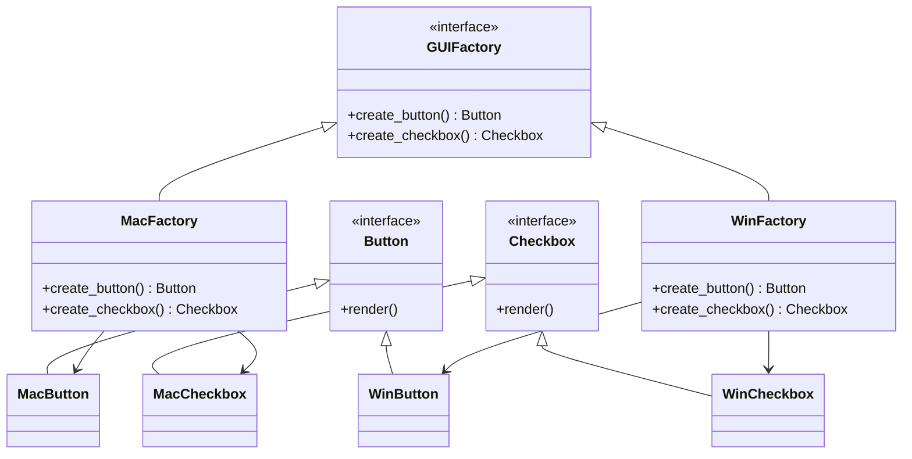
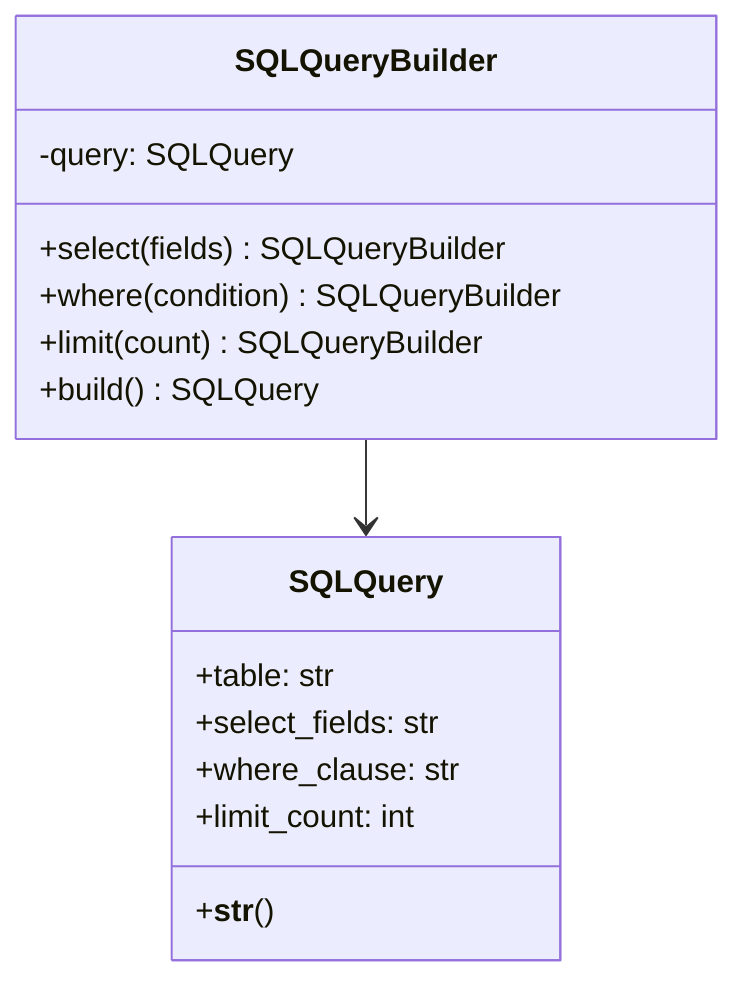
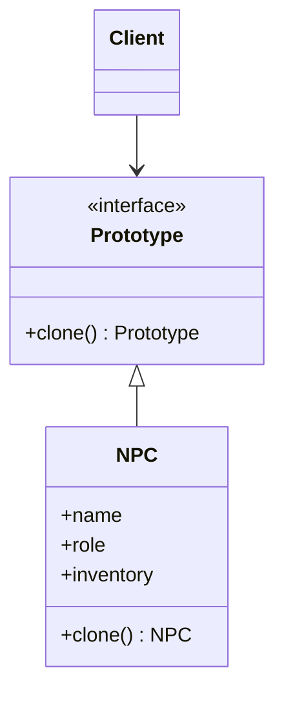

# Creational Design Patterns in Python

> Master the five GoF creational patterns — Singleton, Factory Method, Abstract Factory, Builder, and Prototype — and learn the Pythonic shortcut for each.

## Mental model

Creational patterns are all about **decoupling client code from the concrete classes it instantiates**. The moment you write `obj = ConcreteThing()` in business logic, you have welded that logic to one implementation. Creational patterns move the `ConcreteThing()` call somewhere replaceable, so you can swap implementations, control how many instances exist, or assemble complex objects in stages.



The five patterns answer different "how do I create this?" questions:

- **Singleton** — how do I ensure only *one* instance exists?
- **Factory Method** — how do I let subclasses decide *which class* to build?
- **Abstract Factory** — how do I build a *family* of related objects?
- **Builder** — how do I assemble a *complex* object step by step?
- **Prototype** — how do I create an object by *cloning* an existing one?

## Core concepts

### Singleton — exactly one instance

**When to use it:** a single shared resource must coordinate the whole app — a configuration registry, a logging hub, a database connection pool. In a multi-threaded program you must guard creation so two threads do not each build an instance.



```python
import threading


class DatabaseConnection:
    _instance: "DatabaseConnection | None" = None
    _lock = threading.Lock()

    def __new__(cls) -> "DatabaseConnection":
        # Double-checked locking: the cheap None check avoids taking the
        # lock on every call; the second check inside the lock is the real guard.
        if cls._instance is None:
            with cls._lock:
                if cls._instance is None:
                    instance = super().__new__(cls)
                    instance.connection_string = "db://localhost:5432"
                    cls._instance = instance
        return cls._instance

    def query(self, sql: str) -> str:
        return f"Executing {sql} on {self.connection_string}"


db1 = DatabaseConnection()
db2 = DatabaseConnection()
print(db1 is db2)   # True
```

::: warning Singletons are global state
They make unit tests order-dependent and hide dependencies. They also violate the Single Responsibility Principle by owning both their job *and* their lifecycle.
:::

::: tip Pythonic alternative
A **module** is already a singleton — import it anywhere and you get the same object. Define your config or pool as a module-level value, or expose a `@lru_cache`-decorated factory:

```python
from functools import lru_cache

@lru_cache(maxsize=1)
def get_connection() -> DatabaseConnection:
    return DatabaseConnection()
```
:::

### Factory Method — defer the class choice to subclasses

**When to use it:** a base class defines a workflow but cannot know which concrete product to create. Subclasses override one creation method to plug in their product. This keeps client code talking to an interface, never a concrete class.



```python
from abc import ABC, abstractmethod


class Logger(ABC):
    @abstractmethod
    def log(self, message: str) -> None: ...


class FileLogger(Logger):
    def log(self, message: str) -> None:
        print(f"Writing '{message}' to a file.")


class ConsoleLogger(Logger):
    def log(self, message: str) -> None:
        print(f"Printing '{message}' to console.")


class LoggerFactory(ABC):
    @abstractmethod
    def create_logger(self) -> Logger:        # the "factory method"
        ...

    def do_logging(self, message: str) -> None:
        # The base class owns the workflow; the product is chosen by subclasses.
        self.create_logger().log(message)


class ConsoleLoggerFactory(LoggerFactory):
    def create_logger(self) -> Logger:
        return ConsoleLogger()


def app_logic(factory: LoggerFactory) -> None:
    factory.do_logging("Application started")


app_logic(ConsoleLoggerFactory())   # Printing 'Application started' to console.
```

::: tip Pythonic alternative
For simple cases skip the subclass hierarchy and use a **registry dict** mapping a key to a class or callable:

```python
LOGGERS = {"file": FileLogger, "console": ConsoleLogger}
logger = LOGGERS["console"]()
```
:::

### Abstract Factory — build a family of related objects

**When to use it:** you need to create *groups* of objects that must be used together and stay consistent — e.g. a full set of UI widgets for one operating system. It is "a factory of factories": each concrete factory produces a whole matching family.



```python
from abc import ABC, abstractmethod


class Button(ABC):
    @abstractmethod
    def render(self) -> str: ...


class Checkbox(ABC):
    @abstractmethod
    def render(self) -> str: ...


class MacButton(Button):
    def render(self) -> str: return "Render Mac Button"


class MacCheckbox(Checkbox):
    def render(self) -> str: return "Render Mac Checkbox"


class WinButton(Button):
    def render(self) -> str: return "Render Windows Button"


class WinCheckbox(Checkbox):
    def render(self) -> str: return "Render Windows Checkbox"


class GUIFactory(ABC):
    @abstractmethod
    def create_button(self) -> Button: ...
    @abstractmethod
    def create_checkbox(self) -> Checkbox: ...


class MacFactory(GUIFactory):
    def create_button(self) -> Button: return MacButton()
    def create_checkbox(self) -> Checkbox: return MacCheckbox()


class WinFactory(GUIFactory):
    def create_button(self) -> Button: return WinButton()
    def create_checkbox(self) -> Checkbox: return WinCheckbox()


def render_ui(factory: GUIFactory) -> None:
    print(factory.create_button().render())
    print(factory.create_checkbox().render())


render_ui(MacFactory())   # consistent Mac family — no chance of a Win checkbox slipping in
```

::: tip Factory Method vs Abstract Factory
Factory Method creates **one** product through inheritance; Abstract Factory creates a **family** through composition. The Abstract Factory object usually *contains* several factory methods.
:::

### Builder — assemble a complex object step by step

**When to use it:** an object needs many parameters or a multi-step construction process, and you want readable, optional, order-independent configuration instead of a giant constructor. Returning `self` from each step gives a **fluent interface** (method chaining).



```python
class SQLQuery:
    def __init__(self) -> None:
        self.table = ""
        self.select_fields = "*"
        self.where_clause = ""
        self.limit_count: int | None = None

    def __str__(self) -> str:
        query = f"SELECT {self.select_fields} FROM {self.table}"
        if self.where_clause:
            query += f" WHERE {self.where_clause}"
        if self.limit_count:
            query += f" LIMIT {self.limit_count}"
        return query


class SQLQueryBuilder:
    def __init__(self) -> None:
        self.query = SQLQuery()

    def select(self, fields: str) -> "SQLQueryBuilder":
        self.query.select_fields = fields
        return self                                # return self -> chaining

    def from_(self, table: str) -> "SQLQueryBuilder":   # 'from' is a keyword
        self.query.table = table
        return self

    def where(self, condition: str) -> "SQLQueryBuilder":
        self.query.where_clause = condition
        return self

    def limit(self, count: int) -> "SQLQueryBuilder":
        self.query.limit_count = count
        return self

    def build(self) -> SQLQuery:
        return self.query


final_query = (
    SQLQueryBuilder()
    .select("id, name, email")
    .from_("users")
    .where("age > 18")
    .limit(10)
    .build()
)
print(final_query)   # SELECT id, name, email FROM users WHERE age > 18 LIMIT 10
```

::: tip Pythonic alternative
For pure data objects, a `@dataclass` with keyword arguments and defaults gives most of Builder's readability for free:

```python
from dataclasses import dataclass

@dataclass
class Pizza:
    size: str = "medium"
    cheese: bool = True
    toppings: tuple[str, ...] = ()

Pizza(size="large", toppings=("mushroom", "olive"))
```
Reach for a full Builder only when construction has real *steps* or validation between them.
:::

### Prototype — create by cloning

**When to use it:** building a fresh object is expensive (heavy computation, DB hits) but you already have a configured instance to copy. Python's `copy` module makes this trivial: `copy.copy` for a shallow clone, `copy.deepcopy` to fully duplicate nested mutable state.



```python
import copy


class NPC:
    def __init__(self, name: str, role: str, inventory: list[str]) -> None:
        self.name = name
        self.role = role
        self.inventory = inventory          # mutable — must be deep-copied

    def clone(self) -> "NPC":
        # deepcopy duplicates the list too, so clones don't share inventory.
        return copy.deepcopy(self)

    def __str__(self) -> str:
        return f"{self.name} the {self.role} with {self.inventory}"


prototype_guard = NPC("Guard", "Security", ["Sword", "Shield"])

bob = prototype_guard.clone()
bob.name = "Bob"

alice = prototype_guard.clone()
alice.name = "Alice"
alice.inventory.append("Crossbow")          # does NOT affect bob or the prototype

print(prototype_guard)   # Guard the Security with ['Sword', 'Shield']
print(alice)             # Alice the Security with ['Sword', 'Shield', 'Crossbow']
```

::: warning Shallow vs deep copy
`copy.copy` shares nested mutable objects between clones — a change to one leaks into the others. Use `copy.deepcopy` when the prototype holds lists, dicts, or other mutable attributes you want isolated.
:::

## Common pitfalls

- **Singleton as a crutch.** Reaching for it whenever you need shared access. Fix: inject the dependency or use a module-level value so tests can substitute a fake.
- **Builder for trivial objects.** A builder for a two-field class is pure ceremony. Fix: use a `@dataclass` with keyword defaults.
- **Forgetting thread safety in Singleton.** Two threads can both pass the `is None` check. Fix: double-checked locking with a `threading.Lock`.
- **Shallow-copying a Prototype with mutable fields.** Clones secretly share lists. Fix: `copy.deepcopy`.
- **Deep class hierarchies for Factory Method.** When products map cleanly to keys, a `dict` registry beats five subclasses.

## Best practices

- Default to the lightest tool: function/`dict` registry before a class-based factory.
- Depend on the abstract product type (`Logger`), never the concrete one (`FileLogger`).
- Make Builders return `self` for fluent chaining, and validate in `build()`.
- Prefer module-level singletons or `@lru_cache` over hand-rolled `__new__` guards.
- Use `copy.deepcopy` in `clone()` unless you have measured that shallow is safe.

## Interview quick-reference

| Pattern | Intent | One-line example |
| --- | --- | --- |
| Singleton | Guarantee one instance + global access | thread-safe DB connection pool |
| Factory Method | Subclass decides which product to build | `LoggerFactory.create_logger()` |
| Abstract Factory | Create a consistent family of objects | `GUIFactory` builds matching button + checkbox |
| Builder | Assemble a complex object step by step | fluent `SQLQueryBuilder` |
| Prototype | Create new objects by cloning | `copy.deepcopy(self)` on an NPC |
