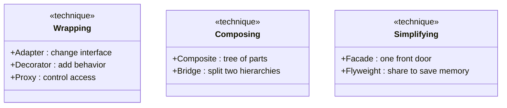
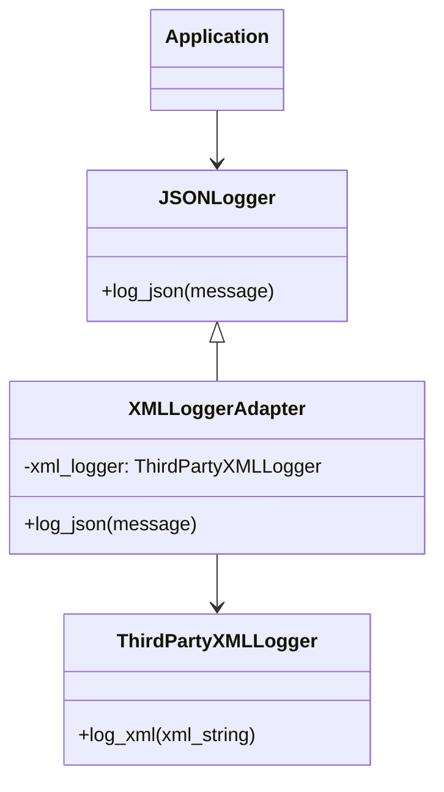
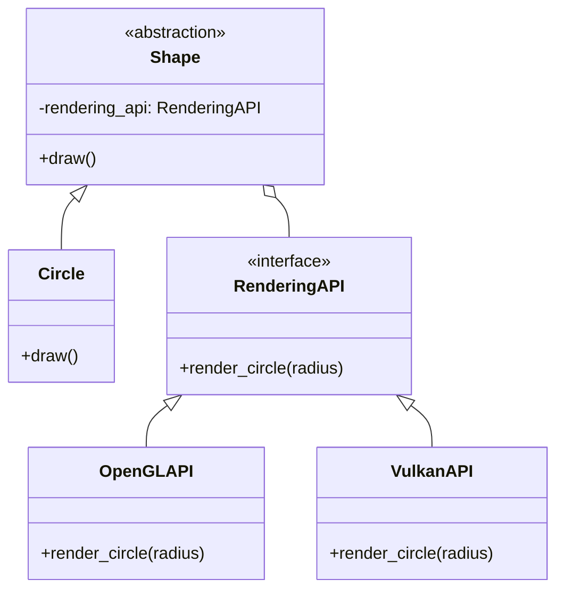
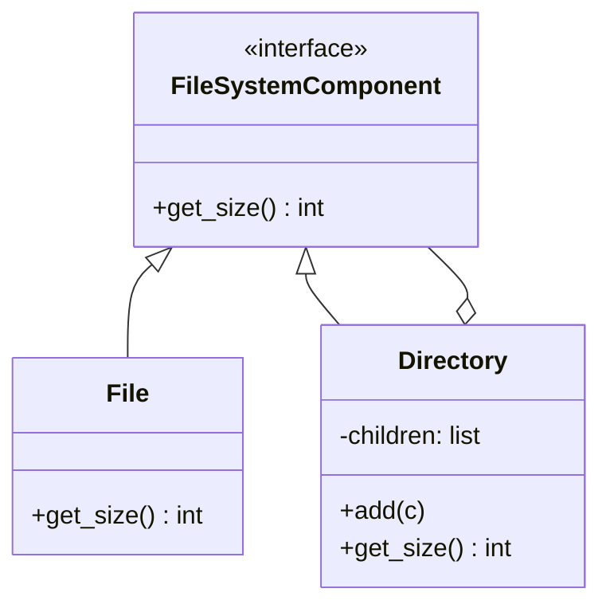
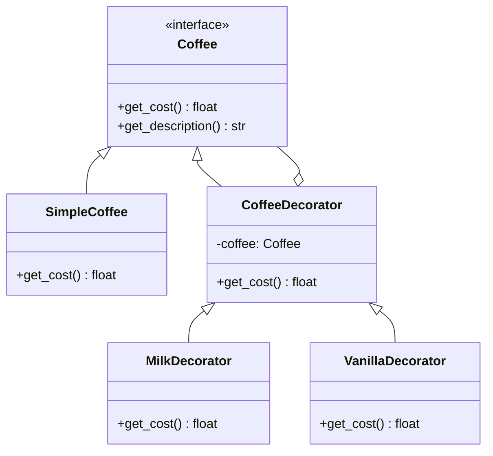
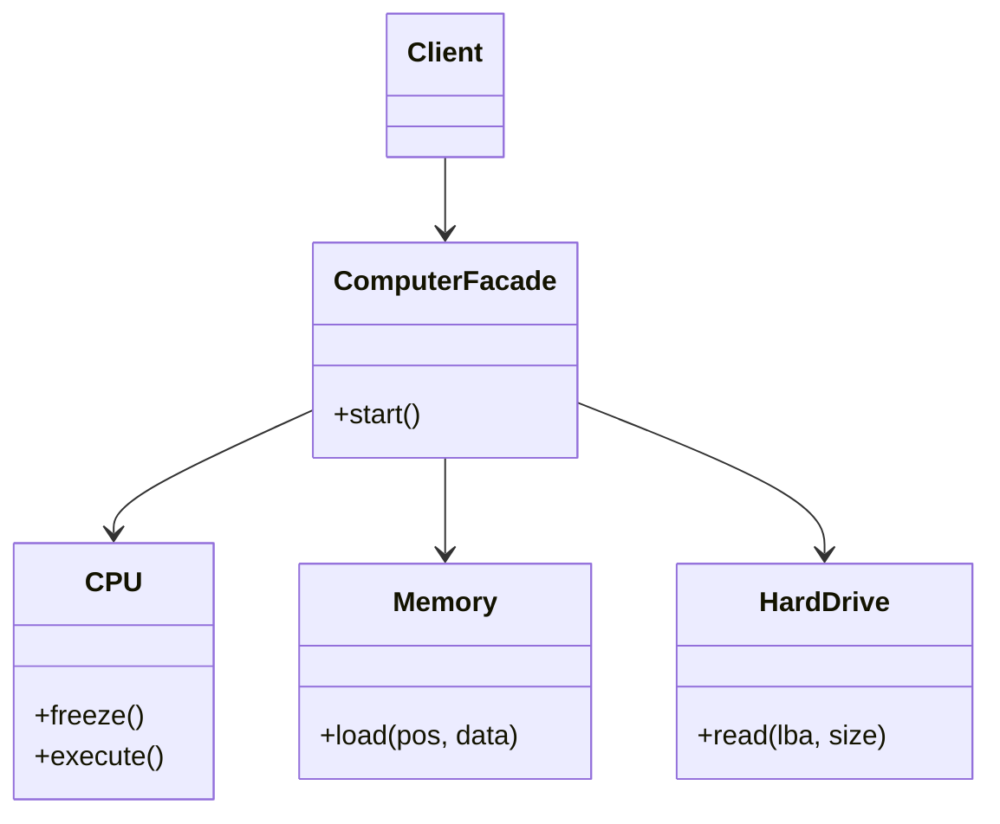
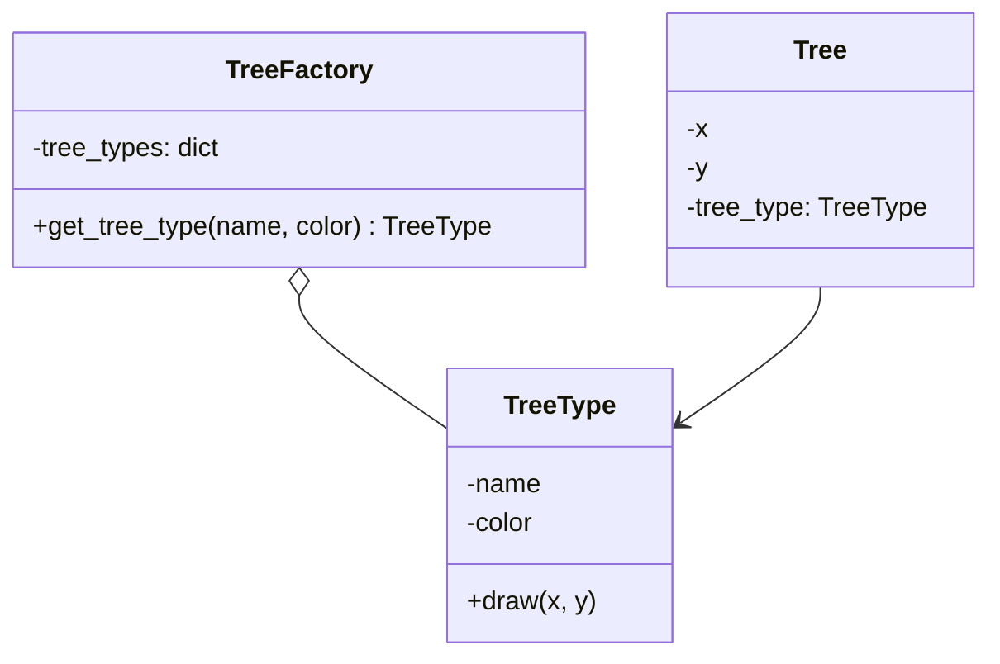
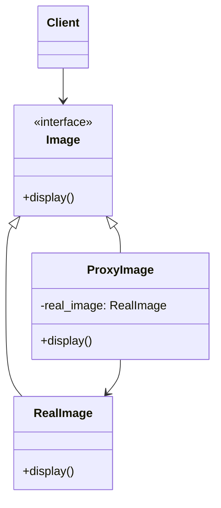

# Structural Design Patterns in Python

> Learn how the seven GoF structural patterns — Adapter, Bridge, Composite, Decorator, Facade, Flyweight, and Proxy — compose classes and objects into flexible, larger structures.

## Mental model

Structural patterns answer one question: **how do we assemble objects into bigger structures without making the design rigid?** Where creational patterns deal with *making* objects, structural patterns deal with *connecting* them — wrapping, bridging, nesting, and fronting one object with another.



A useful split:

- **Wrap one object in another:** Adapter (change its interface), Decorator (add behavior), Proxy (gate access).
- **Compose objects into structures:** Composite (part-whole trees), Bridge (separate two dimensions of change).
- **Simplify or shrink:** Facade (hide complexity), Flyweight (share data to save memory).

## Core concepts

### Adapter — make an incompatible interface fit

**When to use it:** you have a class the client expects (the *Target*) and an existing class with a useful capability but the *wrong* interface (the *Adaptee* — often third-party code you can't change). The Adapter implements the Target interface and translates calls to the Adaptee.



```python
class JSONLogger:
    """Target interface the app expects."""
    def log_json(self, message: dict) -> None: ...


class ThirdPartyXMLLogger:
    """Adaptee with an incompatible interface we cannot edit."""
    def log_xml(self, xml_string: str) -> None:
        print(f"Logging XML: {xml_string}")


class XMLLoggerAdapter(JSONLogger):
    """Adapter: speaks JSONLogger, delegates to the XML logger."""
    def __init__(self, xml_logger: ThirdPartyXMLLogger) -> None:
        self._xml_logger = xml_logger

    def log_json(self, message: dict) -> None:
        xml = f"<log><event>{message.get('event')}</event></log>"
        self._xml_logger.log_xml(xml)


class Application:
    def __init__(self, logger: JSONLogger) -> None:
        self.logger = logger

    def do_work(self) -> None:
        self.logger.log_json({"event": "work_started"})


Application(XMLLoggerAdapter(ThirdPartyXMLLogger())).do_work()
```

::: tip Pythonic alternative
Because of duck typing, an adapter can be a tiny function or a thin object that just exposes the expected method name — you do not need a formal interface to inherit from. Inherit from the Target only when callers do explicit `isinstance` checks.
:::

### Bridge — split abstraction from implementation

**When to use it:** you have two independent dimensions that would otherwise explode into a combinatorial class hierarchy (`WinButton`, `MacButton`, `WinCheckbox`, `MacCheckbox`...). Bridge puts each dimension in its own hierarchy and connects them by composition, so they vary independently.



```python
from abc import ABC, abstractmethod


class RenderingAPI(ABC):                 # implementation hierarchy
    @abstractmethod
    def render_circle(self, radius: float) -> None: ...


class OpenGLAPI(RenderingAPI):
    def render_circle(self, radius: float) -> None:
        print(f"OpenGL circle r={radius}")


class VulkanAPI(RenderingAPI):
    def render_circle(self, radius: float) -> None:
        print(f"Vulkan circle r={radius}")


class Shape(ABC):                        # abstraction hierarchy
    def __init__(self, api: RenderingAPI) -> None:
        self.api = api                   # the "bridge" to implementation

    @abstractmethod
    def draw(self) -> None: ...


class Circle(Shape):
    def __init__(self, radius: float, api: RenderingAPI) -> None:
        super().__init__(api)
        self.radius = radius

    def draw(self) -> None:
        self.api.render_circle(self.radius)   # delegate to implementor


Circle(5, OpenGLAPI()).draw()    # OpenGL circle r=5
Circle(10, VulkanAPI()).draw()   # Vulkan circle r=10 — same shape, different backend
```

::: tip Bridge vs Strategy
Structurally they look identical (an object holding a pluggable collaborator). The *intent* differs: Bridge separates two **stable hierarchies that both grow**, while Strategy swaps **interchangeable algorithms** behind one abstraction.
:::

### Composite — treat parts and wholes uniformly

**When to use it:** you have a tree of part-whole relationships (file systems, UI trees, org charts) and want client code to treat a single leaf and a whole branch the same way. Leaf and Composite share one interface; the Composite forwards operations to its children.



```python
from abc import ABC, abstractmethod


class FileSystemComponent(ABC):
    @abstractmethod
    def get_size(self) -> int: ...


class File(FileSystemComponent):            # leaf
    def __init__(self, name: str, size: int) -> None:
        self.name, self.size = name, size

    def get_size(self) -> int:
        return self.size


class Directory(FileSystemComponent):       # composite
    def __init__(self, name: str) -> None:
        self.name = name
        self.children: list[FileSystemComponent] = []

    def add(self, component: FileSystemComponent) -> None:
        self.children.append(component)

    def get_size(self) -> int:
        # Same call works on files and nested directories alike.
        return sum(child.get_size() for child in self.children)


root = Directory("root")
home = Directory("home")
home.add(File("profile.png", 2048))
home.add(File("notes.txt", 512))
root.add(home)
root.add(File("config.json", 1024))
print(root.get_size())   # 3584 — recurses through the whole tree
```

### Decorator — add behavior by wrapping

**When to use it:** you want to attach responsibilities to *individual objects* at runtime without subclassing every combination. Each decorator implements the same interface as the thing it wraps and adds a little before/after the delegated call. Stack them freely.



```python
from abc import ABC, abstractmethod


class Coffee(ABC):
    @abstractmethod
    def get_cost(self) -> float: ...
    @abstractmethod
    def get_description(self) -> str: ...


class SimpleCoffee(Coffee):
    def get_cost(self) -> float: return 2.0
    def get_description(self) -> str: return "Simple Coffee"


class CoffeeDecorator(Coffee):              # base decorator wraps a Coffee
    def __init__(self, coffee: Coffee) -> None:
        self._coffee = coffee

    def get_cost(self) -> float:
        return self._coffee.get_cost()

    def get_description(self) -> str:
        return self._coffee.get_description()


class MilkDecorator(CoffeeDecorator):
    def get_cost(self) -> float:
        return self._coffee.get_cost() + 0.5

    def get_description(self) -> str:
        return self._coffee.get_description() + ", Milk"


class VanillaDecorator(CoffeeDecorator):
    def get_cost(self) -> float:
        return self._coffee.get_cost() + 0.75

    def get_description(self) -> str:
        return self._coffee.get_description() + ", Vanilla"


coffee = VanillaDecorator(MilkDecorator(SimpleCoffee()))
print(f"{coffee.get_description()} costs ${coffee.get_cost()}")
# Simple Coffee, Milk, Vanilla costs $3.25
```

::: warning Not the same as `@decorator`
The structural **Decorator pattern** wraps *objects*. Python's `@decorator` syntax wraps *functions/methods*. They share a name and a spirit (wrapping to extend) but are different tools.
:::

### Facade — one simple front door

**When to use it:** a subsystem has many moving parts and most clients only need a common, simple workflow. A Facade exposes one convenient method that orchestrates the subsystem, reducing coupling — advanced users can still reach the parts directly.



```python
class CPU:
    def freeze(self) -> None: print("CPU freezing")
    def execute(self) -> None: print("CPU executing")


class Memory:
    def load(self, data: str) -> None: print(f"Memory loading {data}")


class HardDrive:
    def read(self) -> str: return "boot_data"


class ComputerFacade:
    def __init__(self) -> None:
        self._cpu, self._mem, self._hd = CPU(), Memory(), HardDrive()

    def start(self) -> None:            # one call hides the boot dance
        self._cpu.freeze()
        self._mem.load(self._hd.read())
        self._cpu.execute()


ComputerFacade().start()
```

### Flyweight — share data to save memory

**When to use it:** you must create a *huge* number of objects that share repeated data. Split state into **intrinsic** (shared, context-free — e.g. a tree's texture and color) and **extrinsic** (per-instance — e.g. x/y position). A factory caches and reuses the intrinsic flyweights; the context passes extrinsic state in.



```python
class TreeType:                         # flyweight: intrinsic, shared state
    def __init__(self, name: str, color: str) -> None:
        self.name, self.color = name, color

    def draw(self, x: int, y: int) -> None:    # extrinsic state passed in
        print(f"{self.name} ({self.color}) at ({x}, {y})")


class TreeFactory:
    _types: dict[tuple[str, str], TreeType] = {}

    @classmethod
    def get_tree_type(cls, name: str, color: str) -> TreeType:
        key = (name, color)
        if key not in cls._types:
            cls._types[key] = TreeType(name, color)   # create once, reuse forever
        return cls._types[key]


class Tree:                             # context: holds extrinsic state
    def __init__(self, x: int, y: int, tree_type: TreeType) -> None:
        self.x, self.y, self.tree_type = x, y, tree_type

    def draw(self) -> None:
        self.tree_type.draw(self.x, self.y)


forest = [Tree(i, i, TreeFactory.get_tree_type("Oak", "Green")) for i in range(1000)]
# 1000 trees, but only ONE TreeType object in memory.
print(len(TreeFactory._types))   # 1
```

### Proxy — a stand-in that controls access

**When to use it:** you want to interpose logic between the client and the real object while keeping the same interface. Common flavors: **Virtual** (lazy-create an expensive object), **Protection** (permission checks), **Remote** (network stand-in), **Caching** (memoize results).



```python
from abc import ABC, abstractmethod


class Image(ABC):
    @abstractmethod
    def display(self) -> None: ...


class RealImage(Image):
    def __init__(self, filename: str) -> None:
        self.filename = filename
        print(f"Loading {filename} from disk (expensive)...")   # happens on creation

    def display(self) -> None:
        print(f"Displaying {self.filename}")


class ProxyImage(Image):                # virtual proxy: defer the expensive load
    def __init__(self, filename: str) -> None:
        self.filename = filename
        self._real: RealImage | None = None

    def display(self) -> None:
        if self._real is None:
            self._real = RealImage(self.filename)   # lazy init on first use
        self._real.display()


img = ProxyImage("photo.jpg")   # nothing loaded yet
print("App started")
img.display()                   # loads now, then displays
img.display()                   # already loaded — no second disk hit
```

## Common pitfalls

- **Adapter that leaks the Adaptee.** Exposing the wrapped object's quirks defeats the purpose. Fix: translate fully to the Target interface.
- **Deep decorator stacks.** Many wrappers make debugging and stack traces hard. Fix: keep each decorator focused; consider a config object if order matters a lot.
- **Facade that becomes a god object.** When it grows business logic of its own, it stops being a thin front. Fix: keep it orchestration-only.
- **Flyweight where memory isn't the problem.** The intrinsic/extrinsic split adds complexity. Fix: only apply it after profiling shows object count hurts.
- **Confusing Bridge with Adapter.** Adapter fixes an *existing* incompatible interface after the fact; Bridge is designed up front to let two hierarchies vary.

## Best practices

- Program to the shared interface so wrappers (Adapter, Decorator, Proxy) are transparent to clients.
- Use Composite when operations recurse naturally over a tree; give leaf and composite the same interface.
- Prefer composition (Bridge, Decorator) over deep inheritance to avoid class explosions.
- Keep Facades thin: orchestrate, don't own domain logic.
- Reach for Flyweight only when object *count* is the measured bottleneck.

## Interview quick-reference

| Pattern | Intent | One-line example |
| --- | --- | --- |
| Adapter | Make an incompatible interface usable | wrap an XML logger as a JSON logger |
| Bridge | Let abstraction and implementation vary independently | `Shape` + pluggable `RenderingAPI` |
| Composite | Treat individual and grouped objects uniformly | file/directory `get_size()` tree |
| Decorator | Add behavior by wrapping, not subclassing | coffee + milk + vanilla |
| Facade | Simple interface over a complex subsystem | `ComputerFacade().start()` |
| Flyweight | Share intrinsic state to save memory | 1000 trees, one `TreeType` |
| Proxy | Stand-in that controls access to a real object | lazy-loading `ProxyImage` |
