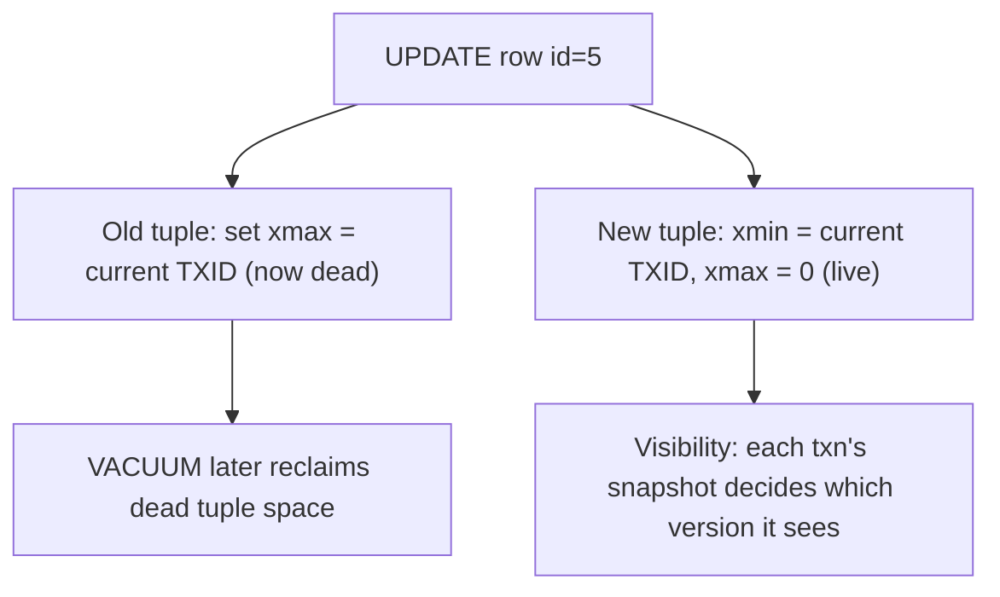
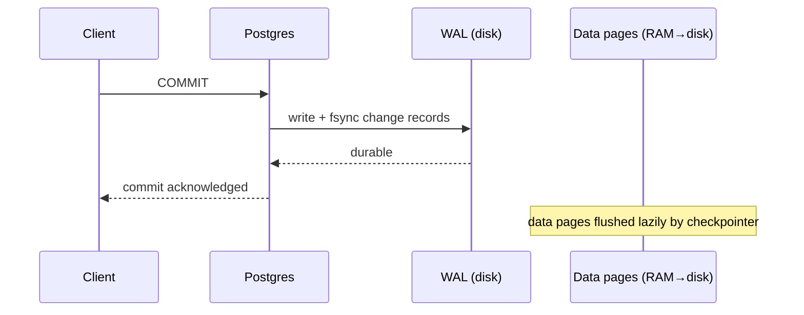
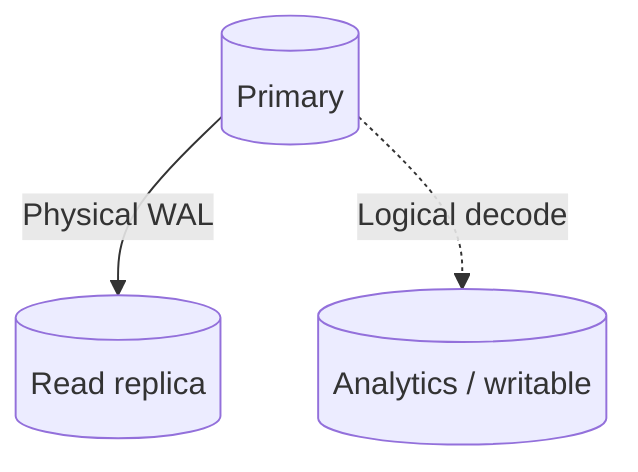

# Advanced PostgreSQL & Internals

> A tour of the machinery underneath PostgreSQL — MVCC, vacuum, WAL, index types, partitioning, replication, and query planning — so you can reason about correctness and performance, not just write SQL.

## Mental model

PostgreSQL never overwrites a row in place. Every `UPDATE` and `DELETE` creates a *new* row version and marks the old one dead. This single design choice — **MVCC** (Multi-Version Concurrency Control) — explains almost everything else: why readers never block writers, why you need `VACUUM`, why transaction IDs can wrap around, and why bloat is a thing.



Every row carries hidden system columns: `xmin` (the TXID that created it) and `xmax` (the TXID that deleted/superseded it, or 0 if still live). A transaction's snapshot compares these against committed TXIDs to decide visibility.



## Core concepts

### MVCC and row visibility

Because old versions linger until vacuumed, you can literally observe `xmin`/`xmax`:

```sql
-- Inspect the hidden version columns of a row.
SELECT xmin, xmax, * FROM accounts WHERE id = 5;
-- xmin = the txid that inserted this visible version; xmax = 0 means live.

UPDATE accounts SET balance = balance + 10 WHERE id = 5;
-- The previous version still exists on disk with xmax set to this txn's id,
-- invisible to new snapshots but kept until VACUUM frees it.
```

### Isolation levels — the PostgreSQL quirks

Postgres implements isolation with snapshots, which leads to two famous differences from the SQL standard:

```sql
BEGIN ISOLATION LEVEL REPEATABLE READ;
  SELECT count(*) FROM events WHERE kind = 'click';  -- snapshot frozen here
  -- Even if another txn commits new 'click' rows, re-running this query
  -- returns the SAME count. Postgres RR prevents phantom reads too.
COMMIT;
```

- **Read Uncommitted behaves exactly like Read Committed** — dirty reads are impossible under MVCC.
- **Repeatable Read also blocks phantom reads**, which the standard permits.
- **Serializable** uses Serializable Snapshot Isolation (SSI), tracking read/write dependencies and aborting transactions (SQLSTATE `40001`) that would violate serial order.

### Row-level locks

Use explicit locks to serialize access to specific rows, e.g. a money transfer.

```python
import asyncpg

async def transfer(pool, from_id, to_id, amount):
    async with pool.acquire() as conn:
        async with conn.transaction():
            # FOR UPDATE locks both rows; ORDER BY id imposes a consistent
            # lock order so concurrent transfers can't deadlock each other.
            await conn.fetch(
                "SELECT id, balance FROM accounts WHERE id = ANY($1) "
                "ORDER BY id FOR UPDATE",
                [from_id, to_id],
            )
            await conn.execute(
                "UPDATE accounts SET balance = balance - $1 WHERE id = $2",
                amount, from_id)
            await conn.execute(
                "UPDATE accounts SET balance = balance + $1 WHERE id = $2",
                amount, to_id)
```

Lock strength, weakest to strongest: `FOR KEY SHARE` < `FOR SHARE` < `FOR NO KEY UPDATE` < `FOR UPDATE`.

### Handling deadlocks

If two transactions wait on each other's locks past `deadlock_timeout` (default 1s), Postgres aborts one with error `40P01`. Catch it and retry with backoff.

```python
import asyncio, asyncpg

async def with_retry(coro_factory, attempts=3):
    for attempt in range(attempts):
        try:
            return await coro_factory()
        except asyncpg.DeadlockDetectedError:   # SQLSTATE 40P01
            if attempt == attempts - 1:
                raise
            await asyncio.sleep(2 ** attempt * 0.1)  # exponential backoff
```

### Index types: B-Tree, GIN, GiST, BRIN

Each index structure suits different data and operators.

```sql
-- B-Tree (default): equality and range on scalars.
CREATE INDEX ON orders (created_at);

-- GIN: composite values where you search individual elements (jsonb, arrays, tsvector).
CREATE INDEX ON docs USING GIN (payload);

-- GiST: geometric / range / proximity — overlap and containment, not strict ordering.
CREATE INDEX ON shapes USING GiST (geom);

-- BRIN: tiny summaries per block range; brilliant when data is physically ordered.
CREATE INDEX ON events USING BRIN (created_at);
```

::: tip BRIN on append-only tables
On a terabyte log table where `created_at` increases with insertion order, a BRIN index can be ~99% smaller than a B-Tree and still prune huge swaths of blocks by min/max range. Use it when the column correlates with physical row order.
:::

### Reading EXPLAIN ANALYZE

`EXPLAIN ANALYZE` runs the query and reports estimates *and* real timings. Three scan types you must recognize:

```sql
EXPLAIN ANALYZE
SELECT id FROM orders WHERE user_id = 42;
-- Index Scan:       walks index, then visits heap for each row (random I/O).
-- Index Only Scan:  all needed columns are IN the index; skips the heap if the
--                   visibility map says the page is all-visible. Fastest.
-- Bitmap Heap Scan: builds an in-memory bitmap of matching blocks, then reads
--                   the heap in physical order — efficient for many matches.
```

To get an Index Only Scan above, you'd need a covering index like `CREATE INDEX ON orders (user_id) INCLUDE (id)`.

### Vacuum, autovacuum, and TXID wraparound

Dead tuples from MVCC must be cleaned. **Autovacuum** runs `VACUUM`/`ANALYZE` automatically to reclaim space, update the visibility map, refresh planner stats, and **freeze** very old tuples.

```sql
-- See dead tuple counts and last autovacuum per table.
SELECT relname, n_dead_tup, last_autovacuum
FROM pg_stat_user_tables
ORDER BY n_dead_tup DESC
LIMIT 5;
```

::: danger TXID wraparound
TXIDs are 32-bit (~4.2B). Postgres uses modulo arithmetic — half the space is "past", half "future". If the oldest unfrozen tuple is never frozen and the counter wraps, old rows appear to be in the future and vanish. Freezing stamps ancient tuples with `FrozenTransactionId` (always in the past). If autovacuum falls behind, you get `WARNING: database must be vacuumed within N transactions`, and eventually Postgres refuses writes to protect data. Never disable autovacuum.
:::

### Write-Ahead Logging and crash recovery

WAL guarantees durability: committed changes hit the sequential WAL (and are `fsync`'d) *before* the commit is acknowledged; the heap pages are flushed later by the checkpointer. After a crash, Postgres finds the last checkpoint and **replays** WAL records forward, restoring the exact committed state.

### Partitioning

Splitting a logical table into physical partitions lets the planner prune irrelevant partitions and makes bulk deletes instant (drop a partition).

```sql
CREATE TABLE events (
  id BIGINT, created_at DATE NOT NULL, payload JSONB
) PARTITION BY RANGE (created_at);

CREATE TABLE events_2026_06 PARTITION OF events
  FOR VALUES FROM ('2026-06-01') TO ('2026-07-01');

-- Queries filtering on created_at scan only the matching partition(s).
-- DROP TABLE events_2026_06;  -- instant retention cleanup, no dead tuples.
```

Caveat: unique constraints must include the partition key, and moving a row across partitions (changing the partition key) is costly.

### jsonb indexing

```sql
-- Default GIN supports ?, ?|, ?&, and @> operators.
CREATE INDEX idx_data ON things USING GIN (data);

-- jsonb_path_ops: smaller & faster, but ONLY the containment operator @>.
CREATE INDEX idx_data_path ON things USING GIN (data jsonb_path_ops);

SELECT * FROM things WHERE data @> '{"user": {"id": 123}}';  -- uses either index
```

### CTEs and the optimization fence

```sql
-- In PG 12+, a single-reference CTE is inlined: the id=1 filter is pushed down.
WITH recent AS (SELECT * FROM orders)
SELECT * FROM recent WHERE id = 1;

-- Force the old "materialize first" behavior (an optimization fence) explicitly:
WITH recent AS MATERIALIZED (SELECT * FROM orders)
SELECT * FROM recent WHERE id = 1;   -- builds the whole CTE, then filters
```

### Replication, materialized views, and more

**Physical (streaming) replication** ships raw WAL for a byte-identical read-only replica; **logical replication** decodes WAL into row-level changes for selective, cross-version, writable subscribers.



**Materialized views** store query results physically; refresh with `REFRESH MATERIALIZED VIEW CONCURRENTLY my_mv;` (needs a `UNIQUE` index) to avoid blocking readers. **TOAST** transparently compresses and out-of-lines values larger than ~2KB. **PgBouncer** multiplexes thousands of app connections onto a handful of real backends (use `transaction` pooling mode). **`pg_stat_statements`** aggregates normalized query stats to find your slowest queries.

```sql
SELECT query, calls, total_exec_time, mean_exec_time
FROM pg_stat_statements
ORDER BY total_exec_time DESC
LIMIT 10;
```

## Common pitfalls

- **Disabling autovacuum to "speed up" writes.** It guarantees a wraparound outage later. Tune its thresholds instead.
- **Expecting `UPDATE` to be cheap.** Each update writes a whole new tuple and bloats indexes; batch updates and `VACUUM`.
- **Connection storms.** 50 pods × pool-of-20 = 1,000 backend processes; Postgres forks a process per connection. Put PgBouncer in front.
- **GIN on jsonb but querying with `?` after choosing `jsonb_path_ops`.** That opclass only supports `@>`; key-existence checks silently won't use the index.
- **`REFRESH MATERIALIZED VIEW` without `CONCURRENTLY`** blocks all reads of the view for the whole refresh.
- **Window functions spilling to disk.** Sorting beyond `work_mem` tanks performance; index the partition/order columns or raise `work_mem`.

## Best practices

- Lock rows in a deterministic order (`ORDER BY id FOR UPDATE`) to avoid deadlocks; retry on `40P01`/`40001`.
- Monitor `n_dead_tup` and autovacuum lag; alert on table age approaching wraparound.
- Use covering indexes (`INCLUDE`) to unlock Index Only Scans for hot read paths.
- Partition large time-series tables by range; drop old partitions instead of `DELETE`.
- Enable `pg_stat_statements` in every environment to find real slow queries.
- Prefer `jsonb` over `json`; index containment queries with `jsonb_path_ops`.

## Interview quick-reference

| Topic | Key point |
|-------|-----------|
| MVCC | new version per update; `xmin`/`xmax` drive visibility |
| Isolation quirks | Read Uncommitted = Read Committed; RR blocks phantoms; Serializable = SSI |
| Row locks | KEY SHARE < SHARE < NO KEY UPDATE < FOR UPDATE |
| Deadlocks | detected after `deadlock_timeout`, SQLSTATE `40P01`, retry w/ backoff |
| Index types | B-Tree scalar, GIN composite/jsonb, GiST geo/range, BRIN ordered huge tables |
| Scan types | Index, Index Only (skips heap), Bitmap Heap (many matches) |
| Vacuum | reclaims dead tuples, freezes old TXIDs, updates stats |
| TXID wraparound | 32-bit ids; freezing prevents data loss; never disable autovacuum |
| WAL | durable before heap flush; replayed from last checkpoint on crash |
| Partitioning | pruning + instant partition drops; unique key must include partition col |
| CTE | inlined PG 12+; `AS MATERIALIZED` forces the old fence |
| Replication | physical = byte copy/read-only; logical = selective/writable |
| PgBouncer | multiplex many clients onto few backends (transaction pooling) |
| pg_stat_statements | aggregated stats to find slow queries |
