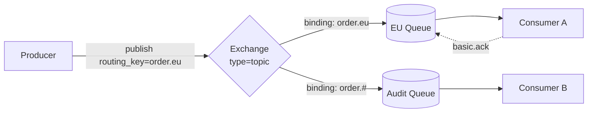
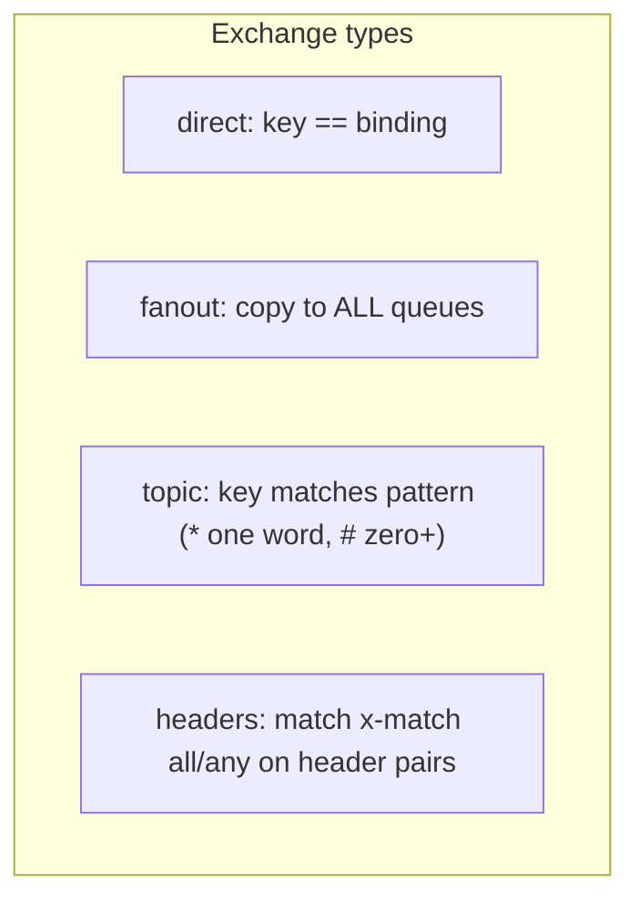
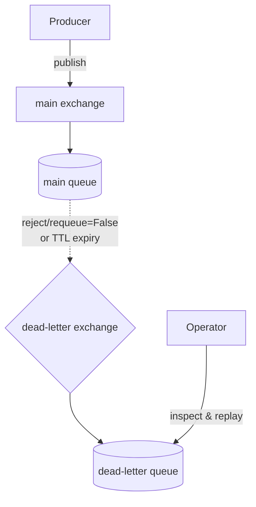

# RabbitMQ

> Learn how RabbitMQ's exchanges, queues, and acknowledgments give you flexible message routing and reliable delivery, with runnable `pika` examples.

## Mental model

RabbitMQ is a **smart broker**: producers never publish to a queue directly. They publish to an **exchange**, and the exchange decides — via **bindings** and **routing keys** — which queues receive a copy. Consumers read from queues and **acknowledge** each message; only then does the broker delete it. This "broker does the routing, broker tracks the work" model is the opposite of Kafka's append-only log.



The exchange *type* defines the routing logic: **direct** (exact key match), **fanout** (broadcast to all), **topic** (wildcard patterns), and **headers** (match on attributes).



## Core concepts

### Direct exchange — exact-match routing

A message goes to queues whose binding key equals the routing key. Ideal for severity-style routing.

```python
# producer_direct.py
import pika

conn = pika.BlockingConnection(pika.ConnectionParameters("localhost"))
ch = conn.channel()
ch.exchange_declare(exchange="logs_direct", exchange_type="direct")

# routing_key 'error' reaches only queues bound with 'error'
ch.basic_publish(exchange="logs_direct", routing_key="error",
                 body=b"disk full on node-3")
print(" [x] sent error log")
conn.close()
```

### Fanout exchange — broadcast pub/sub

Fanout ignores the routing key and copies every message to all bound queues. Perfect for "one event, many independent reactors".

```python
# A 'purchase_completed' event fans out to inventory, email, and analytics queues.
import pika
conn = pika.BlockingConnection(pika.ConnectionParameters("localhost"))
ch = conn.channel()
ch.exchange_declare(exchange="purchases", exchange_type="fanout")

for q in ("inventory", "email", "analytics"):
    ch.queue_declare(queue=q, durable=True)
    ch.queue_bind(queue=q, exchange="purchases")  # no routing key needed

ch.basic_publish(exchange="purchases", routing_key="", body=b'{"order": 42}')
# All three queues now hold an independent copy of the message.
conn.close()
```

### Topic exchange — wildcard routing

Routing keys are dot-delimited words. Binding keys use `*` (exactly one word) and `#` (zero or more words).

```python
# consumer_topic.py — subscribe to all error logs from any subsystem
import pika
conn = pika.BlockingConnection(pika.ConnectionParameters("localhost"))
ch = conn.channel()
ch.exchange_declare(exchange="logs_topic", exchange_type="topic")
q = ch.queue_declare(queue="", exclusive=True).method.queue  # server-named temp queue

# "*.*.error" matches "auth.api.error"; "sys.#" matches "sys" and "sys.disk.full"
ch.queue_bind(exchange="logs_topic", queue=q, routing_key="*.*.error")

def on_msg(ch, method, props, body):
    print(f" [x] {method.routing_key}: {body.decode()}")

ch.basic_consume(queue=q, on_message_callback=on_msg, auto_ack=True)
ch.start_consuming()
# Receives auth.api.error and db.write.error, but not auth.api.info
```

### Acknowledgments — never lose work

In manual-ack mode a message stays "unacked" until you `basic_ack`. If the consumer dies, RabbitMQ requeues it. Use `basic_nack`/`basic_reject` with `requeue=False` to discard or dead-letter a poison message.

```python
# consumer_ack.py — reliable processing with manual ack
import pika, json

conn = pika.BlockingConnection(pika.ConnectionParameters("localhost"))
ch = conn.channel()
ch.queue_declare(queue="tasks", durable=True)
ch.basic_qos(prefetch_count=10)  # at most 10 unacked messages in flight per consumer

def on_msg(ch, method, props, body):
    try:
        work = json.loads(body)
        process(work)
        ch.basic_ack(method.delivery_tag)              # success → delete
    except json.JSONDecodeError:
        ch.basic_reject(method.delivery_tag, requeue=False)  # poison → dead-letter
    except TransientError:
        ch.basic_nack(method.delivery_tag, requeue=True)     # retryable → requeue

ch.basic_consume(queue="tasks", on_message_callback=on_msg)  # auto_ack defaults to False
ch.start_consuming()
```

### Prefetch (`basic.qos`) — fair dispatch

Without prefetch, RabbitMQ shoves all available messages at the first consumer, starving others. `prefetch_count` caps unacked messages so a slow worker holds fewer, letting fast workers grab more.

::: tip
For short uniform tasks a higher prefetch (e.g. 50–100) maximizes throughput. For long, variable tasks set `prefetch_count=1` so work is handed out one at a time and stays balanced.
:::

### Dead Letter Exchanges — capturing failures

A message becomes "dead" when rejected with `requeue=False`, when its TTL expires, or when the queue overflows. The DLX reroutes it instead of dropping it.



```python
# Declare a queue that dead-letters rejected/expired messages.
import pika
conn = pika.BlockingConnection(pika.ConnectionParameters("localhost"))
ch = conn.channel()

ch.exchange_declare(exchange="dlx", exchange_type="direct")
ch.queue_declare(queue="dead_letters")
ch.queue_bind(queue="dead_letters", exchange="dlx", routing_key="dead")

ch.queue_declare(queue="main", arguments={
    "x-dead-letter-exchange": "dlx",
    "x-dead-letter-routing-key": "dead",
    "x-message-ttl": 60000,          # messages older than 60s are dead-lettered
})
conn.close()
```

### Retry with exponential backoff

RabbitMQ has no native backoff. The classic pattern chains TTL queues whose DLX points back at the main queue, so a failed message "sleeps" then retries — increasing the wait each round (5s → 25s → ...) and finally landing in a failure queue after a max retry count tracked in headers.

### Connections vs channels

A **connection** is one TCP socket (expensive — each spins up an Erlang process on the broker). A **channel** is a lightweight virtual session multiplexed over it. Open one long-lived connection and a channel per thread — never one connection per thread. Channels are **not** thread-safe; do not share a channel across threads.

## Common pitfalls

- **Publishing to a queue directly.** You always publish to an exchange. The "default exchange" (`""`) is a hidden direct exchange where the routing key is the queue name — convenient but not magic.
- **`auto_ack=True` for important work.** The message is deleted on delivery; a crash mid-processing loses it. Use manual ack.
- **Infinite requeue loops.** `nack`/`reject` with `requeue=True` on a poison message loops forever. Use `requeue=False` + a DLX, and cap retries with a header counter.
- **One connection per worker thread.** Exhausts broker memory. Multiplex channels over a single connection.
- **Assuming clustered queues are HA.** Classic queues live on one node and aren't replicated by default. Use **quorum queues** (Raft-based) for real high availability.
- **Forgetting durability.** A non-durable queue or non-persistent message vanishes on broker restart. Declare queues `durable=True` and publish with `delivery_mode=2`.

## Best practices

- Choose the exchange type by intent: direct for exact routing, topic for hierarchical patterns, fanout for broadcast.
- Manual acks + sensible `prefetch_count` for fairness and back-pressure.
- Use **quorum queues** for HA; configure `cluster_partition_handling=pause_minority` to favor consistency on split-brain.
- Enable **publisher confirms** so the producer knows the broker accepted (and persisted) each message.
- Route failures to a DLX; never let a poison message block a queue.
- One connection, many channels, one channel per thread.

## Interview quick-reference

| Concept | Key point |
| --- | --- |
| Exchange types | direct (exact), fanout (broadcast), topic (`*`/`#` wildcards), headers (`x-match`) |
| Bindings | Rules linking exchange→queue; E2E bindings allow exchange→exchange |
| Ack semantics | `ack` delete, `reject` one msg, `nack` many; requeue flag controls re-delivery |
| Prefetch (`basic.qos`) | Caps unacked messages → fair dispatch + back-pressure |
| DLX | Captures rejected/expired/overflowed messages; enables delay queues |
| Message vs Queue TTL | `x-message-ttl` expires messages; `x-expires` deletes idle queues |
| Publisher confirms | Broker async-acks the producer → at-least-once producer→broker |
| Quorum vs classic mirrored | Raft consensus, always durable, no split-brain; mirrored queues deprecated |
| Partition handling | `pause_minority` (consistency) vs `autoheal` (availability) |
| Connection vs channel | One TCP connection, a channel per thread (channels not thread-safe) |
| RabbitMQ vs Kafka | Smart broker + routing + delete-on-ack vs append-only replayable log |
