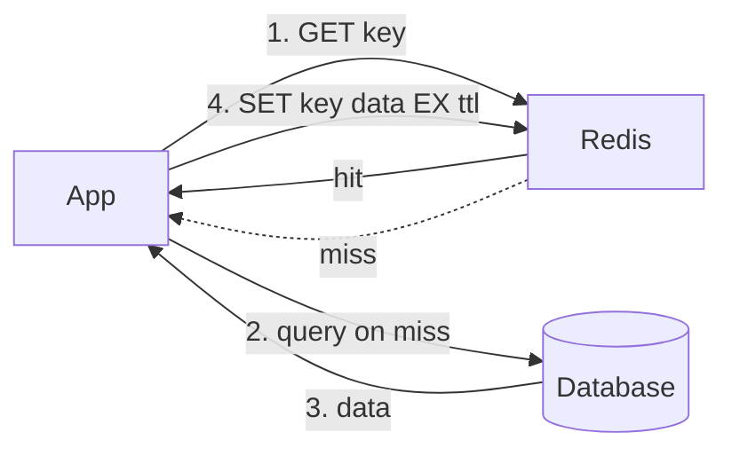
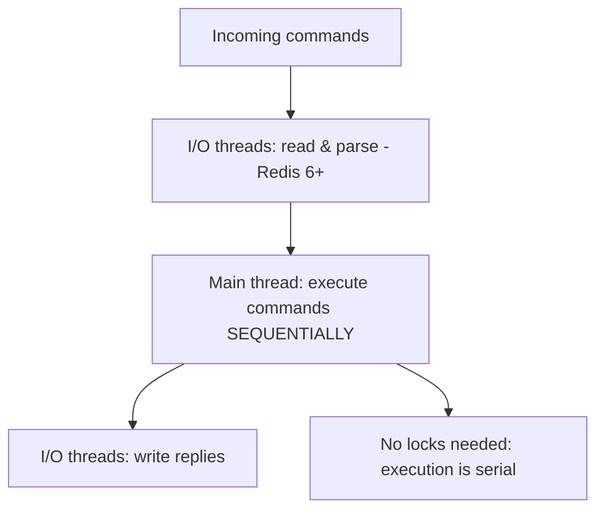
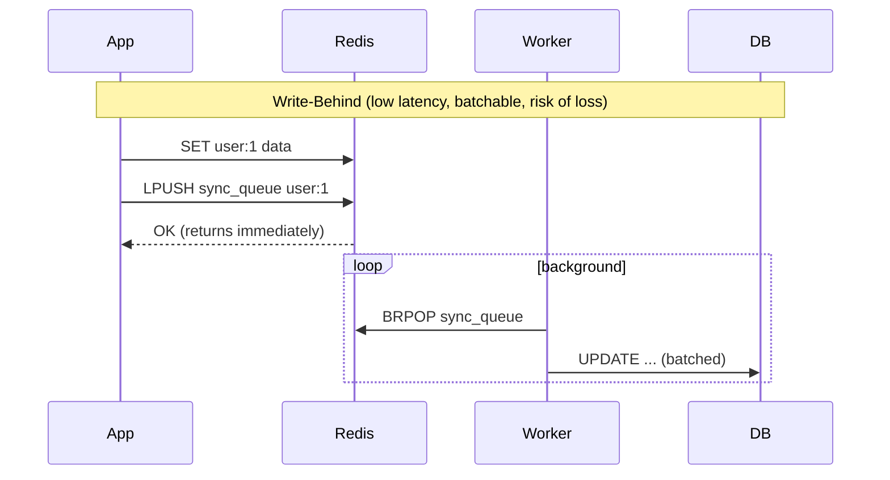

# Redis & Advanced Caching

> Learn how Redis stores, persists, and evicts data, and master the caching patterns — stampede protection, distributed locks, rate limiting, and probabilistic structures — that keep high-traffic systems alive.

## Mental model

Redis is a single-threaded, in-memory data-structure server. "Single-threaded" is the key to its mental model: every command runs to completion with no other command interleaving, so operations on a key are naturally atomic. Around that core sit persistence (RDB/AOF), eviction (when memory fills), and replication (for availability). As a cache, Redis sits *between* your application and the slow source of truth.





## Core concepts

### Persistence: RDB vs AOF

Redis offers two durability mechanisms with opposite trade-offs:

- **RDB** — periodic point-in-time snapshots. Compact, fast to restore, cheap (a forked child does the work), but you can lose minutes of writes on a crash.
- **AOF** — appends every write command to a log. Durable (`fsync` every second by default = ≤1s loss), but larger files and slower restart (replays the log).

```bash
# redis.conf — production setup often enables BOTH.
save 900 1                 # RDB snapshot if >=1 key changed in 900s
appendonly yes             # enable AOF
appendfsync everysec       # fsync the AOF once per second
# On restart Redis prefers AOF (most complete); RDB serves backups & fast replica sync.
```

### Eviction policies

When `maxmemory` is hit, Redis evicts keys per the configured policy.

```bash
maxmemory 4gb
maxmemory-policy allkeys-lru   # evict least-recently-used across all keys
```

- `noeviction` (default) — reject writes with an error.
- `allkeys-lru` / `volatile-lru` — least *recently* used (all keys / only those with a TTL).
- `allkeys-lfu` / `volatile-lfu` — least *frequently* used.
- `volatile-ttl` — shortest remaining TTL first.

**LRU vs LFU:** LRU assumes recent access predicts future access, but a burst of one-time reads can evict your genuinely popular keys. **LFU** tracks access *frequency* over time, protecting hot items from transient spikes — better for caching static hot rows.

### Cache stampede (dogpile) — mutex lock

When one expensive key expires, thousands of concurrent misses can hammer the DB simultaneously. Let only *one* worker rebuild it.

```python
import asyncio
import redis.asyncio as redis

async def get_safe(r, key, fetch):
    cached = await r.get(key)
    if cached:
        return cached

    lock = f"lock:{key}"
    # SET NX EX = acquire lock only if absent, auto-expiring so a crash can't deadlock.
    if await r.set(lock, "1", nx=True, ex=5):
        try:
            data = await fetch()                 # only ONE worker hits the DB
            await r.set(key, data, ex=3600)
            return data
        finally:
            await r.delete(lock)
    # Lost the race: wait briefly, then read the value the winner populated.
    await asyncio.sleep(0.05)
    return await get_safe(r, key, fetch)
```

Alternatives: **probabilistic early expiration** (XFetch) refreshes proactively before expiry; **background refresh** keeps the key alive while a worker updates it.

### Cache avalanche

Avalanche is *many* keys expiring at once (or a node restarting empty), not one. Smear expirations with **TTL jitter**:

```python
import random
ttl = 3600 + random.randint(0, 300)   # 60–65 min, so keys don't all die together
await r.set(key, value, ex=ttl)
```

Also use Sentinel/Cluster for HA and circuit breakers to shed load when the DB is struggling.

### Cache penetration and Bloom filters

Penetration is repeated requests for data that exists *nowhere* (e.g. fake IDs), so nothing ever caches and every request hits the DB.

```python
import redis
r = redis.Redis()

# RedisBloom: "No" is definite, "Maybe" might be a false positive.
r.bf().add("users_bloom", "user:123")

def get_user(user_id):
    if not r.bf().exists("users_bloom", user_id):
        return None          # definitely absent — DB never touched
    # else fall through to cache / DB lookup
```

A simpler module-free trick: cache the null result with a short TTL (`SET user:999 "" EX 60`).

### Write strategies



- **Write-through** — write cache and DB synchronously: always consistent, higher write latency.
- **Write-behind (write-back)** — write cache, return immediately, flush to DB asynchronously: fast and batchable, but data loss if the cache dies before flushing.

### Pipelining vs transactions

```python
# Pipelining: batch commands into ONE round trip. NOT atomic — others can interleave.
pipe = r.pipeline(transaction=False)
for i in range(10000):
    pipe.set(f"key:{i}", i)
pipe.execute()             # one network round trip instead of 10,000

# Transactions: MULTI/EXEC queue commands and run them atomically (no rollback).
tx = r.pipeline(transaction=True)
tx.incr("counter")
tx.expire("counter", 60)
tx.execute()
```

`WATCH` adds optimistic locking: if a watched key changes before `EXEC`, the transaction aborts (returns nil) and you retry.

### Lua scripting for atomic check-and-set

Redis runs an entire Lua script atomically — perfect for "read, decide, write" without races. A rate limiter in one shot:

```python
LUA = """
local current = redis.call('GET', KEYS[1])
if current and tonumber(current) >= tonumber(ARGV[1]) then
  return 0                              -- over the limit
end
redis.call('INCR', KEYS[1])
redis.call('EXPIRE', KEYS[1], ARGV[2])
return 1                                -- allowed
"""
allow = r.eval(LUA, 1, "rl:user:7", 100, 60)  # 100 reqs per 60s, atomic
```

### Sliding-window rate limiting with sorted sets

A `ZSET` keyed by timestamp gives an exact sliding window:

```python
import time, redis
r = redis.Redis()

def limited(user_id, max_requests, window_s):
    now = time.time()
    key = f"rl:{user_id}"
    pipe = r.pipeline()
    pipe.zremrangebyscore(key, 0, now - window_s)  # drop entries outside window
    pipe.zcard(key)                                # count what remains
    pipe.zadd(key, {f"{now}": now})                # record this request
    pipe.expire(key, window_s)                     # auto-clean idle users
    count = pipe.execute()[1]
    return count >= max_requests                   # True => block this request
```

### High availability: Sentinel vs Cluster

```mermaid
graph TD
    subgraph Sentinel - single primary, HA only
        S1[Sentinel] --> P1[(Primary)]
        P1 --> R1[(Replica)]
    end
    subgraph Cluster - sharded by 16384 hash slots
        M1[(Primary A)] --- M2[(Primary B)] --- M3[(Primary C)]
    end
```

- **Sentinel** — monitors a single-primary setup and fails over to a replica. Scales reads + provides HA, but the whole dataset must fit one node.
- **Cluster** — shards data across primaries via 16,384 hash slots (gossip protocol, no separate Sentinel). Scales reads, writes, *and* memory.

::: warning Asynchronous replication can lose writes
A primary acknowledges a write before replicas confirm it. During a split-brain, an isolated old primary keeps accepting writes that get discarded on heal. Set `min-replicas-to-write 1` and `min-replicas-max-lag 10` so an isolated primary stops accepting writes, trading availability for safety.
:::

### Memory-efficient structures

- **Hashes** for objects: one `user:100` hash beats `user:100:name`, `user:100:email` — small hashes use a compact `listpack` encoding.
- **HyperLogLog** counts unique elements in a fixed ~12KB with ~0.81% error: `PFADD daily_visitors user_123`.
- **Bitmaps** track boolean-per-id cheaply (1M users ≈ 122KB): `SETBIT dau:2026-06-28 5400 1`, then `BITOP AND` across days for streaks.
- **Geospatial** (`GEOADD`, `GEOSEARCH`) stores lon/lat in a sorted set via geohashing for "drivers within 5km" queries.

## Common pitfalls

- **Distributed locks as correctness guarantees.** Redlock can break under clock drift or a GC pause that outlives the lock TTL. For real safety you need **fencing tokens**; treat Redis locks as best-effort.
- **Hot keys in a cluster.** One viral key lives on one shard, saturating that node. Mitigate with local in-process caching, key replication (`item:99:1..N` random suffixes), or splitting the structure.
- **Big keys.** Deleting or serializing a huge string/set blocks the single execution thread. Split them; use `UNLINK` for async deletion.
- **Relying on Pub/Sub for delivery.** Pub/Sub is fire-and-forget — offline subscribers lose messages. Use **Streams** (persistent, consumer groups, `XACK`) for reliable queues.
- **Identical TTLs everywhere.** Guarantees avalanches; always jitter.
- **Assuming pipelines are atomic.** They are not; use `MULTI`/`EXEC` or Lua when you need atomicity.

## Best practices

- Enable AOF (`everysec`) plus periodic RDB for durability and fast restores.
- Choose `allkeys-lfu` for hot-data caches; always set a `maxmemory` and policy.
- Protect every expensive key with a stampede mutex and jittered TTLs.
- Make multi-step logic atomic with Lua or `MULTI/WATCH`, not app-side read-modify-write.
- Group object fields into hashes; use HLL/bitmaps for analytics instead of giant sets.
- Use Streams (not Pub/Sub) when messages must not be lost.

## Interview quick-reference

| Topic | Key point |
|-------|-----------|
| RDB vs AOF | snapshot (compact, may lose minutes) vs log (durable, larger) — use both |
| Eviction | LRU = recency; LFU = frequency, resists bursts; `noeviction` default |
| Stampede | one key expires → mutex lock so one worker rebuilds |
| Avalanche | many keys expire at once → TTL jitter + HA |
| Penetration | requests for nonexistent data → Bloom filter or cache null |
| Write-through vs behind | sync consistent / async fast but lossy |
| Pipeline vs transaction | batched non-atomic vs MULTI/EXEC atomic (no rollback) |
| Lua | whole script atomic — solves check-and-set races |
| Rate limiter | ZSET sliding window scored by timestamp |
| Sentinel vs Cluster | single-primary HA vs sharded 16384 hash slots |
| Replication | async — split-brain can lose writes; `min-replicas-to-write` |
| Single-threaded | serial execution = atomicity; Redis 6+ multi-threads I/O only |
| Hot key | local cache, replicate with suffixes, split structure |
| Memory | hashes, HyperLogLog (~12KB), bitmaps, geohash sorted sets |
| Streams vs Pub/Sub | persistent + consumer groups vs fire-and-forget |
