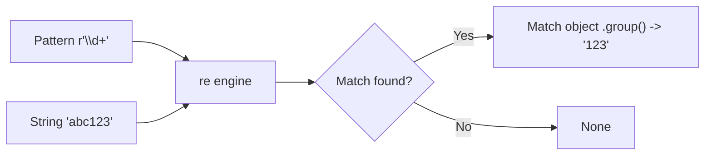
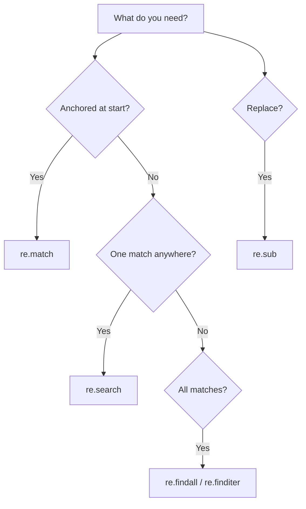

# Regular Expressions in Python

> Learn to match, search, extract, and replace text with the `re` module — the core functions, the most useful patterns, groups and backreferences, and when *not* to use regex at all.

## Mental model

A regular expression is a tiny pattern language that describes the *shape* of text rather than its exact letters. You hand a pattern and a string to the `re` engine; it scans left to right, trying to align the pattern against the characters and reporting where it succeeds. The whole module reduces to a few verbs — does it match at the start, does it appear anywhere, find them all, replace them.



Choosing the right function is the first decision; everything else is pattern syntax.



## Core concepts

### The core functions

Four verbs cover most work. Note that `match` only anchors at the **start** of the string, while `search` scans the whole thing.

```python
import re

print(re.match(r"\d+", "abc123"))          # => None  (no digit at start)
print(re.search(r"\d+", "abc123").group()) # => '123' (found anywhere)
print(re.findall(r"\w+", "a b c"))         # => ['a', 'b', 'c']
print(re.sub(r"\s+", " ", "too   many"))   # => 'too many'
```

A successful `search`/`match` returns a **match object**; call `.group()` for the matched text, or `.span()` for its position. `findall` skips the object and returns the strings directly; `finditer` yields match objects lazily — better for large inputs.

::: tip
Always use **raw strings** (`r"..."`) for patterns. Without the `r`, Python interprets backslashes first, so `"\d"` may misbehave while `r"\d"` reliably reaches the regex engine.
:::

### Compiling for reuse

`re.compile()` builds a pattern object once. When you apply the same pattern many times (in a loop, across a file), compiling avoids re-parsing it each call.

```python
import re

phone = re.compile(r"\d{3}-\d{4}")          # compile once
for text in ["call 555-1234", "fax 999-0000"]:
    print(phone.search(text).group())
# => 555-1234
#    999-0000
```

### The building blocks

Patterns are made of character classes, quantifiers, and anchors:

| Pattern | Matches |
| --- | --- |
| `\d` | a digit; `\D` a non-digit |
| `\w` | word char (letter/digit/`_`); `\W` the opposite |
| `\s` | whitespace; `\S` non-whitespace |
| `.` | any char except newline |
| `+` / `*` / `?` | one+ / zero+ / zero-or-one |
| `{m,n}` | between m and n repeats |
| `[A-Za-z]` | a character set / range |
| `^` / `$` | start / end of string (or line) |
| `\b` | word boundary |
| `(...)` | a capturing group |

```python
import re

print(re.findall(r"\d+", "order 12 of 345"))    # => ['12', '345']
print(re.findall(r"[A-Za-z]+", "abc123def"))     # => ['abc', 'def']
print(bool(re.match(r"^abc", "abcdef")))         # => True   (starts with)
print(bool(re.search(r"abc$", "xyzabc")))        # => True   (ends with)
print(re.findall(r"\b\w+@\w+\.\w+\b", "me@x.com you@y.org"))
# => ['me@x.com', 'you@y.org']   (simple email)
```

### Groups and extraction

Parentheses create capturing groups. With one or more groups, `findall` returns the captured pieces (as tuples when there are several), and a match object exposes them via `.group(n)` or `.groups()`.

```python
import re

m = re.search(r"(\d{4})-(\d{2})-(\d{2})", "date: 2026-06-28")
print(m.group(0))    # => '2026-06-28'  (whole match)
print(m.group(1))    # => '2026'        (first group)
print(m.groups())    # => ('2026', '06', '28')

# Named groups read more clearly:
m = re.search(r"(?P<year>\d{4})-(?P<month>\d{2})", "2026-06")
print(m.group("year"))    # => '2026'
```

### Replacing with backreferences

`re.sub(pattern, replacement, text)` swaps every match. In the replacement, `\1`, `\2`, ... refer back to captured groups, letting you rearrange text.

```python
import re

# Collapse runs of whitespace:
print(re.sub(r"\s+", " ", "too   many    spaces"))   # => 'too many spaces'

# Swap around a delimiter using backreferences:
print(re.sub(r"(\w+)@(\w+)", r"\2.\1", "user@host"))  # => 'host.user'

# A function replacement for dynamic logic:
print(re.sub(r"\d+", lambda m: str(int(m.group()) * 2), "a1 b2"))
# => 'a2 b4'   (each number doubled)
```

### Greedy vs lazy quantifiers

By default quantifiers are **greedy** — they grab as much as possible. Append `?` to make them **lazy** (as little as possible). This matters constantly when matching delimited content.

```python
import re

text = "<a><b>"
print(re.search(r"<.*>", text).group())    # => '<a><b>'  greedy: whole span
print(re.search(r"<.*?>", text).group())    # => '<a>'     lazy: smallest match
```

## When to use regex — and when not to

Regex shines for genuine *pattern* matching: validation, extraction, tokenizing, find-and-replace with structure. It is the wrong tool for two cases:

- **Simple fixed-string work.** Use `str` methods — `"x" in s`, `s.split()`, `s.replace()`, `s.startswith()`. They are clearer and faster.
- **Structured formats** like HTML, XML, or JSON. These are not regular languages; a regex will be brittle and miss edge cases. Use a real parser (`html.parser`/`BeautifulSoup`, `xml.etree`, `json`).

```python
# Don't: regex to pull a fixed prefix
import re
re.sub(r"^Mr\. ", "", "Mr. Smith")     # works, but overkill

# Do: plain string method
"Mr. Smith".removeprefix("Mr. ")        # => 'Smith'  (clearer)
```

## Common pitfalls

- **Forgetting raw strings.** Write `r"\d+"`, not `"\d+"`, so backslashes survive.
- **Confusing `match` and `search`.** `match` only checks the start; use `search` to find anywhere.
- **Greedy `.*` eating too much.** Use a lazy `.*?` or a more specific class like `[^>]*`.
- **`findall` returning tuples unexpectedly** when the pattern has groups. Use a non-capturing group `(?:...)` if you don't need the capture.
- **Calling `.group()` on `None`.** A failed `search` returns `None`; check before accessing it.
- **Parsing HTML/JSON with regex.** Reach for a proper parser instead.
- **Recompiling in a hot loop.** Compile once with `re.compile` and reuse.

## Best practices

- Use `r"..."` raw strings for every pattern.
- `re.compile` patterns you reuse; name them descriptively.
- Prefer named groups `(?P<name>...)` for readable extraction.
- Use `re.VERBOSE` to write multi-line, commented patterns for complex cases.
- Anchor with `^`/`$` and word boundaries `\b` to avoid accidental partial matches.
- Reach for `str` methods on fixed strings and real parsers on structured formats.

## Interview quick-reference

| Topic | Key point |
| --- | --- |
| Core functions | `match` (start), `search` (anywhere), `findall`, `sub` |
| Match object | `.group()`, `.groups()`, `.span()`; `None` on failure |
| `re.compile` | reuse a pattern efficiently across many calls |
| Char classes | `\d` `\w` `\s` (+ uppercase negations), `.` any |
| Quantifiers | `+` `*` `?` `{m,n}`; add `?` for lazy |
| Anchors | `^` start, `$` end, `\b` word boundary |
| Groups | `(...)` capture, `(?P<name>...)`, `(?:...)` non-capture |
| `re.sub` | replace all; `\1` backrefs or a function replacement |
| Raw strings | always `r"..."` so backslashes reach the engine |
| Avoid regex for | fixed strings (`str` methods), HTML/JSON (use a parser) |
