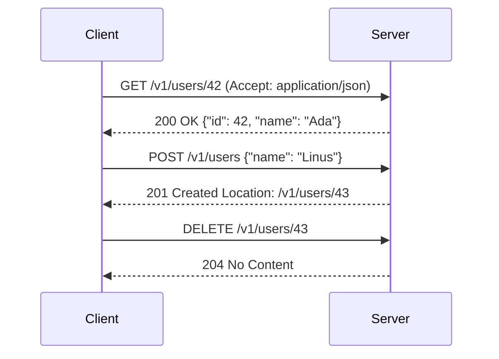

# REST APIs & HTTP

> Learn how HTTP verbs, status codes, idempotency, versioning, and pagination combine into a production-grade REST API you can build and consume in Python.

## Mental model

REST treats your data as **resources** (nouns) addressed by URLs and manipulated with a small, fixed set of **verbs** (HTTP methods). Each request is **stateless**: the server keeps no memory of previous requests, so everything the server needs must travel in the request itself. Think of a REST API as a vending machine — you press a labelled button (verb), it returns a representation (JSON), and the machine forgets you the moment the can drops.



The verb tells the server *what kind* of operation; the status code tells the client *how it went*; the body carries the *representation*.

## Core concepts

### Resources and HTTP methods

A resource is a thing (`/users`, `/users/42`, `/users/42/orders`). The method expresses intent. `GET` reads, `POST` creates, `PUT` replaces, `PATCH` partially updates, `DELETE` removes.

```python
import requests

BASE = "https://jsonplaceholder.typicode.com"

# GET — read a collection
resp = requests.get(f"{BASE}/users", timeout=10)
print(resp.status_code, len(resp.json()))
# => 200 10

# POST — create a resource; the server assigns the id
new = requests.post(f"{BASE}/users", json={"name": "Ada"}, timeout=10)
print(new.status_code, new.json()["id"])
# => 201 11
```

`requests` serialises the `json=` argument and sets `Content-Type: application/json` for you.

### PUT vs PATCH

`PUT` sends the **entire** representation and replaces the resource; omitted fields are wiped. `PATCH` sends only the fields that change.

```python
# PUT replaces the whole record — you must send every field
requests.put(f"{BASE}/users/1", json={"name": "Ada", "email": "ada@x.io"})

# PATCH changes only what you pass — email stays untouched
requests.patch(f"{BASE}/users/1", json={"name": "Ada Lovelace"})
```

::: tip
If a client sends a partial body to a `PUT` endpoint, the missing fields should become null/default — that surprise is exactly why `PATCH` exists.
:::

### Status codes that matter

Group them by first digit: `2xx` success, `3xx` redirect/cache, `4xx` client error, `5xx` server error.

```python
def describe(code: int) -> str:
    return {
        200: "OK",            201: "Created",        204: "No Content",
        304: "Not Modified",  400: "Bad Request",    401: "Unauthorized",
        403: "Forbidden",     404: "Not Found",      409: "Conflict",
        422: "Unprocessable", 429: "Too Many Requests", 500: "Server Error",
    }.get(code, "Unknown")

for c in (200, 201, 404, 429, 500):
    print(c, describe(c))
# => 200 OK
# => 201 Created
# => 404 Not Found
# => 429 Too Many Requests
# => 500 Server Error
```

Use `401` when the caller is *unauthenticated*, `403` when they are authenticated but *not allowed*, `422` when the body is well-formed JSON but fails validation.

### Idempotency and safe retries

An operation is **idempotent** if running it N times leaves the same server state as running it once. `GET`, `PUT`, and `DELETE` are idempotent; `POST` is not. This is what makes retries safe after a flaky network.

```python
import time

def request_with_retry(method, url, *, retries=3, **kw):
    for attempt in range(retries):
        try:
            r = requests.request(method, url, timeout=5, **kw)
            r.raise_for_status()
            return r
        except requests.RequestException:
            if attempt == retries - 1:
                raise
            time.sleep(2 ** attempt)  # exponential backoff: 1s, 2s, 4s

# Safe to retry: re-running DELETE just keeps the resource absent.
request_with_retry("DELETE", f"{BASE}/users/99")
```

For a non-idempotent `POST` (e.g. a payment), pass a client-generated **`Idempotency-Key`** header so the server can deduplicate retries.

```python
import uuid
key = str(uuid.uuid4())
requests.post(f"{BASE}/payments", json={"amount": 50},
              headers={"Idempotency-Key": key})  # retry with same key = no double charge
```

### Versioning

When you must make a breaking change, version the API so existing clients keep working. URL-path versioning is the most common and explicit.

```python
# URL path (most common)            -> GET /v1/users
# Accept header (most "RESTful")    -> Accept: application/vnd.api.v2+json
# Query param (simplest, cache-iffy)-> GET /users?version=2

headers = {"Accept": "application/vnd.api.v2+json"}
requests.get(f"{BASE}/users", headers=headers)
```

### Pagination, filtering, sorting

Never return an unbounded list. Offset pagination is simple; cursor pagination is stable for large, changing datasets.

```python
def fetch_page(base, *, page=1, size=20, status=None, sort="-created_at"):
    params = {"page": page, "size": size, "sort": sort}
    if status:
        params["status"] = status        # filtering
    return requests.get(base, params=params, timeout=10)

# Builds: /posts?page=2&size=20&sort=-created_at&status=active
fetch_page(f"{BASE}/posts", page=2, status="active")
```

Return metadata (total count, `next`/`prev` links) so the client can iterate without guessing.

## Common pitfalls

- **Verbs in the URL.** `POST /createUser` is RPC, not REST. Use `POST /users`. URLs name resources; the method names the action.
- **Returning `200` for everything.** A failed create that returns `200 {"error": "..."}` forces clients to parse bodies to detect failure. Return the right code (`400`, `404`, `422`).
- **No `timeout`.** `requests.get(url)` can hang forever. Always pass `timeout=`.
- **Confusing 401 vs 403.** `401` = "who are you?" (authenticate). `403` = "I know you, but no." Mixing them leaks information and confuses clients.
- **Ignoring idempotency on retries.** Blindly retrying a `POST` can double-charge a customer. Use an idempotency key or make the endpoint idempotent.
- **Unbounded list endpoints.** `GET /events` returning 2M rows will OOM the server. Enforce a default and maximum page size.

## Best practices

- Model resources as nouns; let HTTP methods be the verbs.
- Pick correct status codes and keep a **consistent error envelope** (`{"error": {"code": ..., "message": ...}}`).
- Validate input (Pydantic) and return `422` with field-level detail on failure.
- Always set request `timeout`s and add retry-with-backoff for idempotent calls.
- Version from day one (`/v1`) and deprecate old versions on a published schedule.
- Paginate every collection; include total count and next/prev links.
- Layer the codebase: routing → service → repository, so business logic is testable apart from HTTP.

## Interview quick-reference

| Topic | Key point |
| --- | --- |
| REST defined | Stateless, resource-URLs, standard verbs, JSON representations |
| GET/POST/PUT/PATCH/DELETE | read / create / replace / partial-update / remove |
| PUT vs PATCH | PUT replaces whole resource; PATCH changes some fields |
| Idempotent methods | GET, PUT, DELETE (and HEAD/OPTIONS); POST is not |
| Idempotency key | Client header dedupes retried POSTs (payments) |
| Status codes | 2xx ok, 3xx redirect, 4xx client, 5xx server; 401 vs 403 |
| Versioning | URL path `/v1` (common), Accept header (purist), query param |
| Pagination | offset (`page`/`size`) vs cursor (stable for big/changing data) |
| Production API | layered code, ORM+migrations, auth, validation, logging, CI, Docker |
