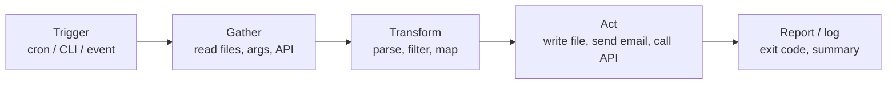
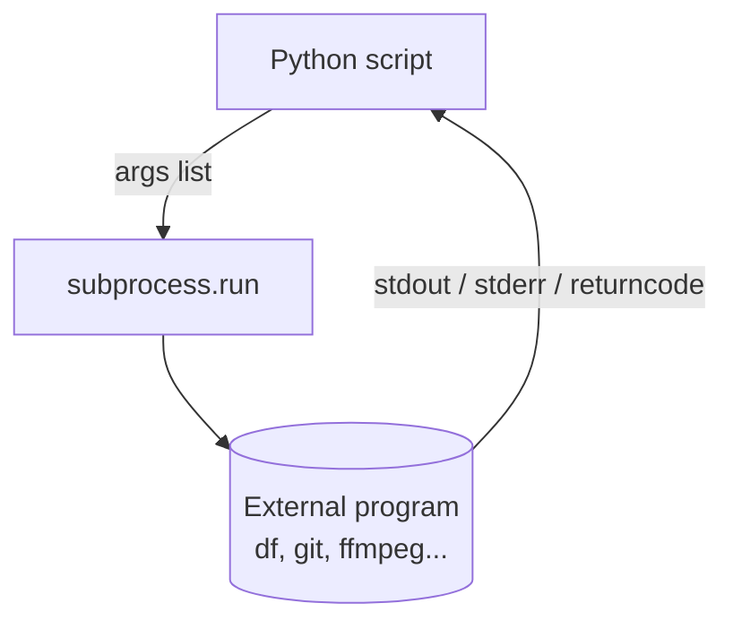

# Scripting & Automation

> Learn to turn repetitive manual chores into reliable Python scripts — file wrangling, text parsing, CSV editing, system tasks, and browser automation.

## Mental model

A good automation script is a small **pipeline**: it gathers input (files, args, an API),
transforms it, and produces an effect (a new file, a report, a side effect on the system).
Keep each stage isolated so you can test and reuse it.



::: tip Rule of thumb
If you've done a task by hand more than three times, it's a script. If a script runs
unattended, it needs **logging** and a **non-zero exit code** on failure.
:::

## Automating a repetitive task

Start from the standard library — it ships with everything for file and OS work. Wrap the
logic in functions and guard execution with `if __name__ == "__main__":` so the module
stays importable and testable.

```python
import sys
from pathlib import Path

def rename_with_prefix(folder: str, prefix: str) -> int:
    """Prefix every file in a folder; returns the count renamed."""
    count = 0
    for path in Path(folder).iterdir():
        if path.is_file():
            path.rename(path.with_name(f"{prefix}{path.name}"))
            count += 1
    return count

if __name__ == "__main__":
    folder, prefix = sys.argv[1], sys.argv[2]
    n = rename_with_prefix(folder, prefix)
    print(f"Renamed {n} files")          # => Renamed 12 files
```

Use `pathlib.Path` over `os.path` string juggling — it's object-oriented and cross-platform.

### Command-line arguments with `argparse`

`sys.argv` is fine for throwaway scripts; for anything reused, `argparse` gives you flags,
defaults, types, and `--help` for free.

```python
import argparse

parser = argparse.ArgumentParser(description="Backup a folder")
parser.add_argument("src")
parser.add_argument("--dest", default="./backup")
parser.add_argument("--dry-run", action="store_true")
args = parser.parse_args()

print(args.src, args.dest, args.dry_run)   # => data ./backup True
```

## System administration tasks

Python replaces brittle shell one-liners. Prefer the `subprocess` module to call external
programs, and `shutil`/`pathlib` for file operations.

```python
import shutil, subprocess
from pathlib import Path

# Disk-friendly copy of a tree
shutil.copytree("project", "project_backup", dirs_exist_ok=True)

# Run a command, capture output, raise on failure
result = subprocess.run(
    ["df", "-h", "/"],
    capture_output=True, text=True, check=True,
)
print(result.stdout.splitlines()[1])      # => /dev/sda1  50G  20G  30G  40% /
```

::: warning Never use `shell=True` with untrusted input
`subprocess.run(f"rm {name}", shell=True)` is a command-injection hole. Pass a **list** of
arguments instead — no shell parsing happens, so `name` can't break out.
:::



### Scheduling

Don't reinvent `cron`. For OS-level scheduling use `cron` (Linux) or Task Scheduler
(Windows). For in-process scheduling, `schedule` or `APScheduler` are clean:

```python
import schedule, time

def job():
    print("backup running...")

schedule.every().day.at("02:00").do(job)

while True:
    schedule.run_pending()
    time.sleep(60)
```

## Parsing text files

Read line-by-line so memory stays flat even on huge logs — the file object is a lazy
iterator. Combine with `re` for structured extraction.

```python
import re
from collections import Counter

ip_re = re.compile(r"^(\d+\.\d+\.\d+\.\d+)")
counts = Counter()

with open("access.log") as f:
    for line in f:                         # streams one line at a time
        if (m := ip_re.match(line)):       # walrus: match + bind in one step
            counts[m.group(1)] += 1

print(counts.most_common(3))               # => [('10.0.0.5', 1182), ...]
```

## Manipulating CSV files

Use the `csv` module — it handles quoting, embedded commas, and newlines that naive
`split(",")` gets wrong. `DictReader`/`DictWriter` map rows to dicts by header.

```python
import csv

# Read, filter, write back
with open("sales.csv", newline="") as src:
    rows = [r for r in csv.DictReader(src) if float(r["amount"]) > 100]

with open("big_sales.csv", "w", newline="") as dst:
    writer = csv.DictWriter(dst, fieldnames=rows[0].keys())
    writer.writeheader()
    writer.writerows(rows)

print(len(rows), "rows kept")              # => 37 rows kept
```

::: tip For tabular analysis, reach for pandas
`pd.read_csv("sales.csv").query("amount > 100").to_csv("out.csv")` does the same in one
line — and gives you grouping, joins, and stats. Use the `csv` module when you want zero
dependencies or true streaming.
:::

## Automating web browsing

For pages rendered server-side, `requests` + `BeautifulSoup` is enough and fast. For
JavaScript-heavy SPAs or flows that need clicks and logins, drive a real browser with
**Selenium** or **Playwright**.

```python
from selenium import webdriver
from selenium.webdriver.common.by import By

driver = webdriver.Chrome()
try:
    driver.get("https://example.com/login")
    driver.find_element(By.NAME, "user").send_keys("alice")
    driver.find_element(By.NAME, "pass").send_keys("secret")
    driver.find_element(By.CSS_SELECTOR, "button[type=submit]").click()
    print(driver.title)                    # => Dashboard
finally:
    driver.quit()                          # always release the browser
```

## Common pitfalls

- **`shell=True` with f-strings** — command injection. Pass an argument list instead.
- **`open()` without `newline=""` for CSV** — produces blank lines on Windows. Always set it.
- **Reading a whole file with `.read()`** for large logs blows up memory — iterate the file.
- **No exit code on failure** — schedulers can't detect errors. `sys.exit(1)` on failure.
- **Hard-coded paths** — breaks on other machines. Use `pathlib` and `argparse` flags.
- **Selenium without `driver.quit()`** — leaks browser processes; wrap in `try/finally`.

## Best practices

- Make scripts **idempotent** — safe to re-run (check before create, use `dirs_exist_ok`).
- Add a `--dry-run` flag for anything destructive; log what *would* happen.
- Use the `logging` module, not `print`, for unattended jobs; log to a file with timestamps.
- Keep secrets in env vars, never in the script.
- Return meaningful exit codes; document the script's usage in `--help`.

## Interview quick-reference

| Task | Tool of choice |
| --- | --- |
| Paths & file ops | `pathlib`, `shutil` |
| Run external commands | `subprocess.run([...], check=True)` |
| CLI arguments | `argparse` |
| Parse logs / text | file iteration + `re`, walrus `:=` |
| CSV editing | `csv.DictReader` / `DictWriter`; pandas for analysis |
| Scheduling | OS `cron`, or `schedule` / `APScheduler` |
| Static scraping | `requests` + `BeautifulSoup` |
| Dynamic / JS pages | Selenium / Playwright |
| Logging for jobs | `logging` to file, exit codes |
