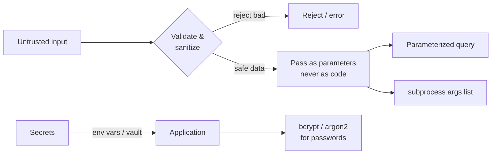

# Security & Best Practices

> Defend Python applications against injection, insecure deserialization, and leaked secrets — and use type checking, linting, and sandboxing to keep code safe and maintainable.

## Mental model

Most application security boils down to one principle: **never let untrusted input become code or trusted instructions.** User input should be treated as inert data — validated, escaped, and passed as *parameters*, never concatenated into SQL, shell commands, or `eval`. Around that core sit supporting practices: secrets live outside the code, passwords are hashed slowly, dependencies are patched, and untrusted code runs in a sandbox. Tooling (type checkers, linters) catches whole classes of mistakes before they ship.



## Core concepts

### Code injection: never `eval`/`exec` on input

Injection happens when untrusted input is executed as code. The fix for code injection is simple — don't evaluate input. Parse it, look it up, or whitelist it instead.

```python
# BAD: user controls what runs
def calc_bad(expr: str):
    return eval(expr)            # eval("__import__('os').system('rm -rf /')") -> disaster

# GOOD: restrict to a known, safe set of operations
import operator
OPS = {"+": operator.add, "-": operator.sub}

def calc_good(a: float, op: str, b: float) -> float:
    if op not in OPS:
        raise ValueError("unsupported operator")   # whitelist
    return OPS[op](a, b)

print(calc_good(2, "+", 3))
# => 5
```

### SQL injection: parameterize queries

Building SQL with string formatting lets input alter the query. Use placeholders so the driver sends data and query separately.

```python
import sqlite3
conn = sqlite3.connect(":memory:")
conn.execute("CREATE TABLE users (id INTEGER, name TEXT)")
conn.execute("INSERT INTO users VALUES (1, 'Sam')")

user_id = "1 OR 1=1"            # an attacker's attempt

# BAD: f-string interpolation -> injection
# conn.execute(f"SELECT * FROM users WHERE id = {user_id}")

# GOOD: parameterized — the driver treats user_id as a value, not SQL
rows = conn.execute("SELECT * FROM users WHERE id = ?", (user_id,)).fetchall()
print(rows)
# => []   (the literal string '1 OR 1=1' matches no id; injection neutralized)
```

### Command injection: pass an args list, not a shell string

`shell=True` with interpolated input lets attackers chain commands. Pass arguments as a list so no shell parses them.

```python
import subprocess

host = "example.com; rm -rf /"     # malicious input

# BAD: subprocess.run(f"ping -c 1 {host}", shell=True)  -> runs the rm too

# GOOD: args list, no shell — host is a single argument, never interpreted
result = subprocess.run(
    ["ping", "-c", "1", host],
    capture_output=True, text=True,
)
print(result.returncode != 0)
# => True   (ping fails on the bogus host; nothing else executes)
```

### Insecure deserialization

`pickle` and `yaml.load` can execute arbitrary code while loading. Across any trust boundary, prefer data-only formats.

```python
import json, yaml

untrusted = '{"name": "Sam", "role": "admin"}'

# GOOD: JSON only produces plain data structures
data = json.loads(untrusted)
print(data["name"])
# => Sam

# If you must use YAML, use the safe loader:
config = yaml.safe_load("name: Sam")   # never yaml.load() on untrusted input
print(config)
# => {'name': 'Sam'}
```

::: danger
Never `pickle.loads()` or `yaml.load()` data you didn't produce yourself. Both can run arbitrary code during deserialization. Use JSON or Protocol Buffers across trust boundaries.
:::

### Hashing passwords properly

Never store plaintext, and never use a fast hash like raw `sha256` for passwords. Use a slow, salted algorithm — `bcrypt` or `argon2`. For general integrity hashing, `hashlib` is fine; for passwords specifically use its `pbkdf2_hmac` if you can't use bcrypt.

```python
import bcrypt

password = b"correct horse battery staple"

hashed = bcrypt.hashpw(password, bcrypt.gensalt())   # salted + slow by design
print(bcrypt.checkpw(password, hashed))              # verify at login
# => True
print(bcrypt.checkpw(b"wrong", hashed))
# => False
```

```python
import hashlib, os
# If bcrypt/argon2 are unavailable, pbkdf2 with many iterations:
salt = os.urandom(16)
derived = hashlib.pbkdf2_hmac("sha256", b"secret", salt, 600_000)
print(len(derived))
# => 32   (bytes; store salt + derived, never the plaintext)
```

### Managing secrets securely

Keep secrets out of source control. Read them from the environment (with `python-dotenv` in dev), keep `.env` git-ignored, and fail fast when a required value is absent.

```python
import os

db_password = os.environ.get("DB_PASSWORD")
if not db_password:
    raise RuntimeError("DB_PASSWORD not set")   # don't start half-configured
# In production prefer a secrets manager (Vault, AWS Secrets Manager).
# Never log secrets — they end up in plaintext log aggregation.
```

### Web vulnerabilities every backend dev should know

- **SQL Injection** — untrusted input in queries → parameterized queries / ORM.
- **XSS** — injected scripts run in a victim's browser → escape/sanitize output, set a Content-Security-Policy.
- **CSRF** — a logged-in user is tricked into an unwanted action → CSRF tokens and `SameSite` cookies.
- Plus broken authentication, insecure direct object references (IDOR), SSRF, and security misconfiguration — see the OWASP Top 10.

### Sandboxing untrusted code

When you must run code you don't control (user submissions, plugins, malware analysis), isolate it so it can't harm the host — via containers (Docker), VMs, or tightly restricted subprocesses with resource limits and no network.

### Type annotations and static checking

Type hints are optional annotations that don't change runtime behavior but let `mypy`/`pyright` catch type bugs before they run, improve IDE help, and document intent.

```python
def total(prices: list[float]) -> float:
    return sum(prices)

# total(["a", "b"])   # mypy flags: List item 0 has incompatible type "str"
print(total([9.99, 5.0]))
# => 14.99
```

**Benefits:** catch bugs early, document intent, better refactoring, scales on large codebases. **Limitations:** not enforced at runtime (Python ignores them unless you run a checker), can be verbose, struggle with very dynamic code, and need stubs for some untyped libraries.

### Linting and formatting

Linters catch bugs, style issues, and smells early and keep a team consistent. Standardize on `ruff` (fast, all-in-one: lint + format), with `mypy` for types. Run them in CI so nothing unformatted or unchecked merges.

```bash
ruff check .        # lint
ruff format .       # auto-format
mypy .              # static type check
```

## Common pitfalls

- **`eval`/`exec` on user input.** Remote code execution. Fix: whitelist operations or parse data; never evaluate input.
- **f-string SQL.** Injection. Fix: parameterized queries (`?` / `%s` placeholders) or an ORM.
- **`subprocess.run(..., shell=True)` with input.** Command injection. Fix: pass an args list, no shell.
- **`pickle.loads`/`yaml.load` on untrusted data.** Code execution. Fix: JSON or `yaml.safe_load`.
- **Plaintext or `sha256` passwords.** Trivially cracked. Fix: `bcrypt`/`argon2` (salted, slow).
- **Hardcoded secrets / committed `.env`.** Leak through git history forever. Fix: env vars + secrets manager + `.gitignore`.
- **Logging secrets.** They land in log storage. Fix: redact before logging.
- **Trusting type hints at runtime.** They aren't enforced. Fix: validate input with Pydantic or explicit checks; run `mypy` in CI.

## Best practices

- Validate and sanitize all input; treat it as data, never code.
- Use parameterized queries, args-list `subprocess`, and safe deserializers everywhere.
- Hash passwords with `bcrypt`/`argon2`; keep secrets in env vars or a manager and fail fast if missing.
- Apply least privilege, enable HTTPS/TLS, and follow the OWASP Top 10.
- Pin and patch dependencies; scan them for known CVEs.
- Run `ruff` and `mypy` in CI; add type hints to document and check intent.
- Sandbox any untrusted code execution.

## Interview quick-reference

| Threat / topic | Defense |
| --- | --- |
| Code injection | Never `eval`/`exec` input; whitelist/parse |
| SQL injection | Parameterized queries / ORM |
| Command injection | `subprocess` args list, avoid `shell=True` |
| Insecure deserialization | JSON / `yaml.safe_load`; never pickle untrusted data |
| Password storage | `bcrypt`/`argon2` (salted, slow); not raw `sha256` |
| Secrets | Env vars / secrets manager; `.env` git-ignored; fail fast; never log |
| Web (OWASP) | SQLi, XSS (escape + CSP), CSRF (tokens + SameSite), SSRF, broken auth |
| Sandboxing | Containers/VMs/restricted subprocess for untrusted code |
| Type checking | `mypy`/`pyright` — catches bugs early, not enforced at runtime |
| Linting | `ruff` (lint+format), `mypy`, run in CI |
