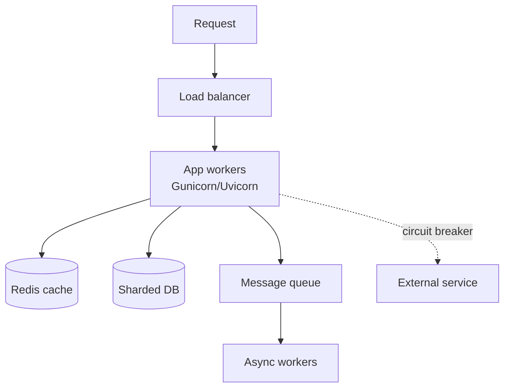
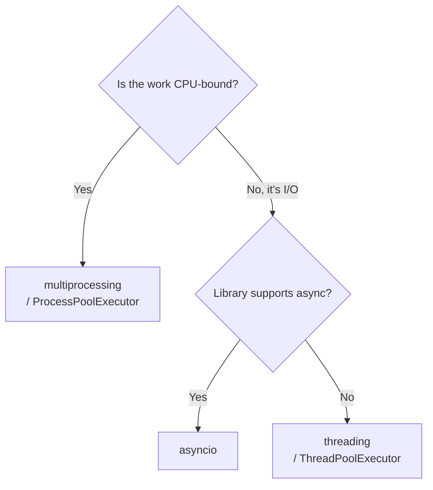
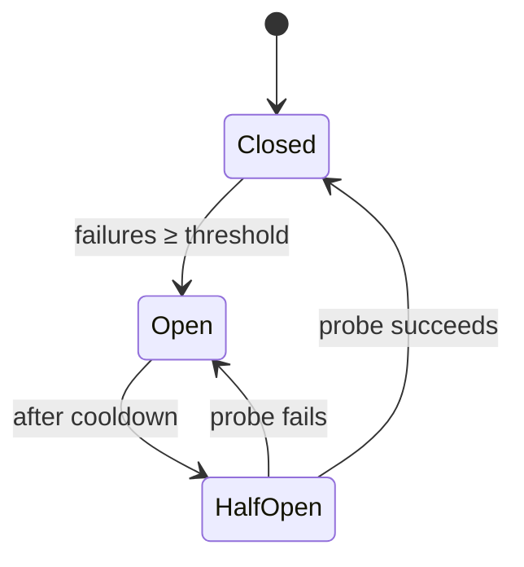
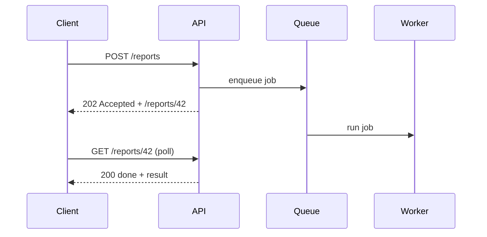
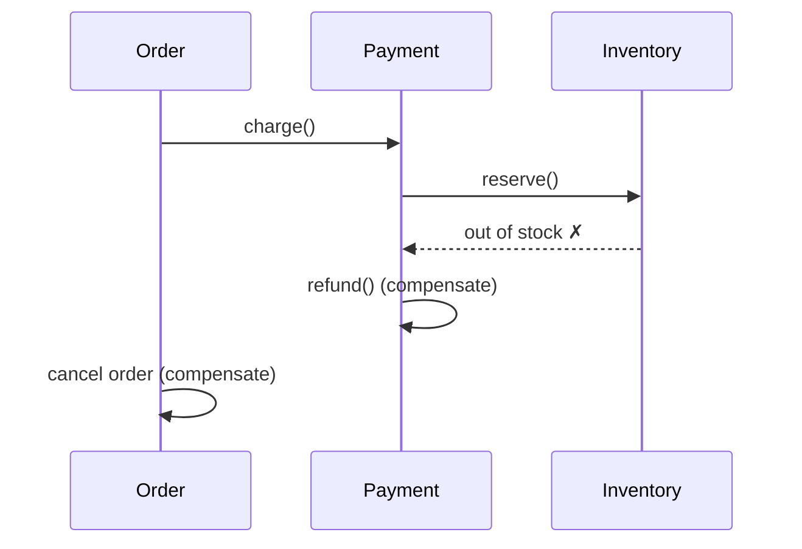

# Senior Backend Architecture

> The systems-level patterns expected of a senior Python engineer — concurrency models, resilient distributed design, idempotency, caching, scaling data, and serving Python at production load.

## Mental model

Senior backend work is less about syntax and more about **trade-offs under failure and
load**. Three questions recur: *Is this work CPU-bound or I/O-bound?* (picks your
concurrency model), *What happens when a dependency is slow or down?* (resilience), and
*How does this behave at 100× the data and traffic?* (scaling).



## Concurrency: pick the right model

The single most common senior question. The choice is driven by **what blocks you**:

| Model | Best for | Why |
| --- | --- | --- |
| `asyncio` | Many I/O-bound tasks | One thread, cooperative; thousands of sockets cheaply |
| `threading` | Blocking I/O in libraries without async | OS threads; GIL released during I/O |
| `multiprocessing` | CPU-bound work | Separate interpreters sidestep the GIL → true parallelism |



### The GIL and CPU-bound work

The **Global Interpreter Lock** lets only one thread execute Python bytecode at a time, so
threads give **no speedup** for CPU-bound work. Strategies to get real parallelism:

```python
from concurrent.futures import ProcessPoolExecutor

def heavy(n: int) -> int:
    return sum(i * i for i in range(n))   # CPU-bound

# Each process has its own GIL → uses all cores
with ProcessPoolExecutor() as pool:
    results = list(pool.map(heavy, [10_000_000] * 8))
```

Other escapes: push hot loops into C extensions / NumPy (which release the GIL), use
`multiprocessing`, or adopt Python 3.13's experimental **free-threaded** build.

### Don't block the event loop

`asyncio` runs everything on **one thread**. A synchronous blocking call (a `requests` call,
`time.sleep`, a heavy CPU loop) freezes *every* coroutine until it returns.

```python
import asyncio

# ❌ blocks the whole loop
def sync_db_call(): ...
# ✅ offload blocking work to a thread pool
result = await asyncio.to_thread(sync_db_call)
# ✅ for CPU work, use a process pool executor
loop = asyncio.get_running_loop()
await loop.run_in_executor(process_pool, heavy, 10_000_000)
```

::: warning Race conditions exist *despite* the GIL
The GIL guarantees one bytecode at a time, not atomicity of multi-step operations.
`counter += 1` is read-modify-write — three bytecodes — so threads can interleave and lose
updates. Protect shared mutable state with a `threading.Lock`.
:::

## Serving Python: WSGI vs ASGI

- **WSGI** (Gunicorn + sync workers) — one request per worker; great for sync Django/Flask.
- **ASGI** (Uvicorn) — async-native; one worker handles many concurrent requests.
- In production, run **Gunicorn as the process manager with Uvicorn workers** to combine
  multi-process robustness with async concurrency.

```bash
gunicorn app:app -k uvicorn.workers.UvicornWorker -w 4
```

## Resilience patterns

### Circuit breaker

When a downstream service starts failing, hammering it makes things worse and ties up your
workers. A **circuit breaker** trips after N failures, fails fast for a cooldown, then
probes for recovery — preventing **cascading failures**.



### Idempotency

An **idempotent** endpoint produces the same result whether called once or many times —
essential when clients retry (timeouts, network blips) so a payment isn't charged twice. The
standard technique: client sends an `Idempotency-Key`; the server records it and returns the
cached result on replays.

```python
def charge(idempotency_key: str, amount: int):
    if (prior := store.get(idempotency_key)):
        return prior                       # replay → same response, no re-charge
    result = payment_gateway.charge(amount)
    store.set(idempotency_key, result)     # record before responding
    return result
```

### Rate limiting

Protect a public API with a limiter — **token bucket** is the common choice (allows bursts,
enforces an average rate). In a distributed deployment, store counters in **Redis** so all
app instances share one limit.

```python
# Sliding-window counter in Redis (atomic via pipeline / Lua in practice)
def allow(user: str, limit: int, window: int) -> bool:
    key = f"rl:{user}:{int(time.time() // window)}"
    count = redis.incr(key)
    if count == 1:
        redis.expire(key, window)
    return count <= limit
```

### Long-running tasks

Never do slow work (report generation, video encoding) inside the request cycle — it ties up
a worker and risks client timeouts. Enqueue it to **Celery/RQ** and return `202 Accepted`
with a status URL the client polls.



## Scaling data

### Sharding vs partitioning

- **Partitioning** splits one table into chunks **within a single database** (e.g. by date
  range) — easier queries, one server.
- **Sharding** spreads data across **multiple database servers** by a shard key —
  horizontal scale, but cross-shard joins and transactions become hard, and rebalancing is
  painful.

### Consistent hashing

Naive `hash(key) % N` remaps almost every key when you add/remove a node. **Consistent
hashing** places nodes and keys on a ring so adding a node only moves `1/N` of the keys —
how Redis Cluster and many caches scale smoothly.


### Caching strategies

| Strategy | Read path | Write path | Use when |
| --- | --- | --- | --- |
| **Cache-aside** | App checks cache, falls back to DB, fills cache | App writes DB, invalidates cache | Read-heavy, general purpose |
| **Read-through** | Cache library loads from DB on miss | — | Want caching transparent to app |
| **Write-through** | — | Write cache + DB synchronously | Need cache always fresh |
| **Write-behind** | — | Write cache now, flush to DB async | Write-heavy, can tolerate slight delay |

Read-heavy → cache-aside or read-through. Write-heavy → write-behind (with durability care).

### Connection pooling

Opening a DB connection per request is expensive (TCP + auth handshake). A **pool** keeps a
set of warm connections and hands them out — critical under high concurrency, and especially
for `asyncio` apps where thousands of coroutines must share a bounded pool (e.g.
`asyncpg.create_pool`).

## Microservices: distributed transactions

You can't use 2-Phase Commit across services (it's blocking and brittle). The **Saga
pattern** models a transaction as a sequence of local steps, each with a **compensating
action** that undoes it if a later step fails.



## API protocols & the N+1 problem

- **REST** — simple, cacheable, ubiquitous; over/under-fetching is common.
- **gRPC** — Protobuf over HTTP/2; **binary**, schema-first, fast — ideal for internal
  service-to-service calls. Protobuf is smaller/faster than JSON because it's a compact
  binary format with a known schema (no field names on the wire, no text parsing).
- **GraphQL** — client picks exactly the fields it needs; great for varied frontends.

GraphQL's nested resolvers can trigger the **N+1 query problem** (one query per item). The
**DataLoader** pattern batches and caches those lookups within a request into a single query.

## Common pitfalls

- **Using threads for CPU work** — the GIL blocks parallelism; use processes.
- **A blocking call in an `async def`** — stalls the whole event loop; use `asyncio.to_thread`.
- **Assuming the GIL makes code thread-safe** — it doesn't; guard shared state with locks.
- **Non-idempotent payment endpoints** — retries double-charge; use idempotency keys.
- **Synchronous heavy work in the request** — exhausts workers; offload to a queue.
- **`hash % N` sharding** — adding a node reshuffles everything; use consistent hashing.
- **No connection pool** — connection storms under load; pool and bound it.

## Best practices

- Match the concurrency model to the workload (I/O → async/threads, CPU → processes).
- Make write endpoints idempotent; design retries as first-class.
- Add timeouts, retries with backoff, and circuit breakers on every remote call.
- Cache deliberately and define an invalidation strategy up front.
- Prefer Saga + events over distributed 2PC; design for eventual consistency.
- Deploy with zero downtime via rolling/blue-green deploys and readiness probes.

## Interview quick-reference

| Topic | Key takeaway |
| --- | --- |
| asyncio vs threads vs processes | I/O-cooperative · blocking-I/O · CPU-parallel |
| GIL | One bytecode at a time; processes/C-ext for CPU parallelism |
| Block the event loop | Offload with `asyncio.to_thread` / executor |
| WSGI vs ASGI | Sync per-worker vs async-native; Gunicorn + Uvicorn workers |
| Circuit breaker | Trip on failures → fail fast → probe; stops cascades |
| Idempotency | Same effect on retry; use idempotency keys for payments |
| Rate limiter | Token bucket in shared Redis |
| Sharding vs partitioning | Across servers vs within one DB |
| Consistent hashing | Adding a node moves only 1/N keys |
| Caching | Cache-aside/read-through (reads) vs write-behind (writes) |
| Saga | Local steps + compensations replace 2PC |
| gRPC/Protobuf | Binary, schema-first, faster than JSON |
| N+1 in GraphQL | Batch with DataLoader |
| Connection pooling | Reuse warm connections; vital for async DB access |
