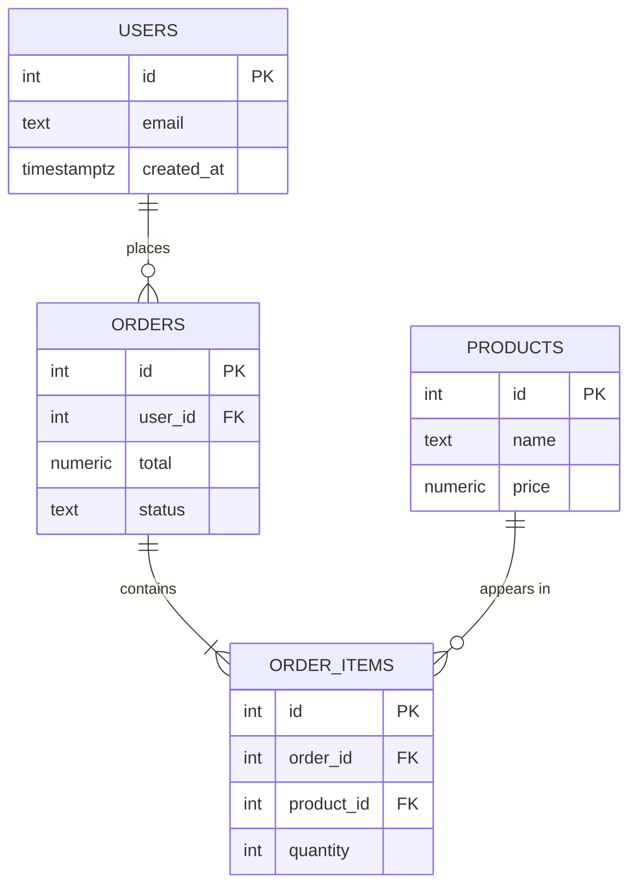

# SQL & Relational Databases

> Learn how relational databases model data, how SQL queries are structured, and how indexes, joins, normalization, and transactions keep your data fast and correct.

## Mental model

A relational database stores data as **tables** (relations) made of rows and columns. The power comes from *relationships*: a row in one table can point at a row in another through keys, and SQL lets you recombine those tables on demand with **joins**. Think of SQL as a declarative language — you describe *what* you want, and the query planner figures out *how* to fetch it.



A query flows through clauses in a fixed logical order, which is *not* the order you write them:


Understanding this order explains, for example, why you cannot use a `SELECT` alias inside `WHERE` (the alias does not exist yet) but you can in `ORDER BY`.

## Core concepts

### Schema definition (DDL)

DDL ("Data Definition Language") creates and alters structure. A **primary key** uniquely identifies each row; a **foreign key** enforces that a referenced row exists (referential integrity).

```sql
-- Create the parent table first; its PK is referenced by children.
CREATE TABLE users (
  id          SERIAL PRIMARY KEY,          -- auto-incrementing unique id
  email       TEXT NOT NULL UNIQUE,         -- no two users share an email
  created_at  TIMESTAMPTZ DEFAULT now()
);

CREATE TABLE orders (
  id        SERIAL PRIMARY KEY,
  user_id   INT NOT NULL REFERENCES users(id) ON DELETE CASCADE,  -- FK
  total     NUMERIC(10,2) NOT NULL CHECK (total >= 0),
  status    TEXT NOT NULL DEFAULT 'pending'
);
-- ON DELETE CASCADE: deleting a user removes their orders automatically.
```

The four SQL command families: **DDL** (`CREATE`/`ALTER`/`DROP`), **DML** (`SELECT`/`INSERT`/`UPDATE`/`DELETE`), **DCL** (`GRANT`/`REVOKE`), and **TCL** (`COMMIT`/`ROLLBACK`/`SAVEPOINT`).

### Removing data: DELETE vs TRUNCATE vs DROP

These look similar but behave very differently:

```sql
DELETE FROM orders WHERE status = 'cancelled';  -- row-by-row, logged, rollback-able, fires triggers
TRUNCATE orders;                                 -- wipes ALL rows fast, resets identity, minimal logging
DROP TABLE orders;                               -- removes the table structure itself
```

`DELETE` can target specific rows and be rolled back inside a transaction. `TRUNCATE` is far faster for emptying a whole table but is all-or-nothing. `DROP` removes the table definition entirely.

### Querying and filtering

```sql
-- Find recent high-value orders for active users.
SELECT u.email, o.id, o.total
FROM orders AS o
JOIN users  AS u ON u.id = o.user_id
WHERE o.total > 100            -- per-row filter, applied BEFORE grouping
  AND o.status = 'paid'
ORDER BY o.total DESC
LIMIT 10;
-- Expected: up to 10 rows, highest total first, e.g. ('a@x.com', 42, 980.00)
```

### Joins

Joins recombine tables. The join *type* controls what happens to rows with no match on the other side.

```sql
-- INNER JOIN: only users who have at least one order.
SELECT u.email, COUNT(o.id) AS order_count
FROM users u
INNER JOIN orders o ON o.user_id = u.id
GROUP BY u.email;

-- LEFT JOIN: ALL users, even those with zero orders (order_count = 0).
SELECT u.email, COUNT(o.id) AS order_count
FROM users u
LEFT JOIN orders o ON o.user_id = u.id
GROUP BY u.email;
-- A user with no orders shows order_count = 0 because COUNT ignores NULLs.
```

| Join | Keeps |
|------|-------|
| `INNER` | rows matching in both tables |
| `LEFT` | all left rows + matches (NULLs where none) |
| `RIGHT` | all right rows + matches |
| `FULL` | every row from both sides |

### Grouping and aggregation: WHERE vs HAVING

`WHERE` filters individual rows *before* grouping; `HAVING` filters whole groups *after* aggregation.

```sql
SELECT u.id, COUNT(*) AS paid_orders, SUM(o.total) AS revenue
FROM orders o
JOIN users u ON u.id = o.user_id
WHERE o.status = 'paid'        -- keep only paid rows first
GROUP BY u.id
HAVING SUM(o.total) > 1000     -- keep only big-spending groups
ORDER BY revenue DESC;
-- Expected: one row per user whose paid revenue exceeds 1000.
```

### Indexes

An index is an auxiliary structure (usually a B-tree) that turns an O(n) full table scan into an O(log n) lookup. Index columns you frequently filter, join, or sort on.

```sql
-- Without this, "WHERE email = ?" scans every row.
CREATE INDEX idx_users_email ON users (email);

-- Composite index: order matters. Great for filtering by user_id
-- then sorting by created_at, but useless for filtering by created_at alone.
CREATE INDEX idx_orders_user_created ON orders (user_id, created_at DESC);
```

::: warning Indexes are not free
Every `INSERT`/`UPDATE`/`DELETE` must also update each index on the table, so over-indexing slows writes and wastes disk. Index deliberately, and drop indexes that the planner never uses.
:::

### Normalization

Normalization organizes columns to eliminate redundancy. Brief ladder:

- **1NF** — atomic values, no repeating groups (no comma-separated lists in a column).
- **2NF** — 1NF + every non-key column depends on the *whole* composite key, not part of it.
- **3NF** — 2NF + no transitive dependencies (non-key columns depend only on the key).

```sql
-- NOT normalized: city/country repeat for every order, region derived from city.
-- Normalized: pull addresses into their own table and reference by id.
CREATE TABLE addresses (
  id      SERIAL PRIMARY KEY,
  city    TEXT,
  country TEXT
);
ALTER TABLE orders ADD COLUMN address_id INT REFERENCES addresses(id);
```

**Denormalization** is the deliberate opposite — duplicating columns or storing precomputed aggregates (like a cached `order_count` on `users`) to avoid expensive joins on read-heavy workloads, trading consistency effort for speed.

### Transactions and ACID

A transaction is an all-or-nothing unit of work guaranteeing **ACID**: Atomicity, Consistency, Isolation, Durability.

```sql
BEGIN;
  UPDATE accounts SET balance = balance - 100 WHERE id = 1;
  UPDATE accounts SET balance = balance + 100 WHERE id = 2;
COMMIT;   -- both succeed together, or ROLLBACK undoes everything
-- If the server crashes between the two UPDATEs, neither is applied.
```

Doing the same from Python with a context manager that commits on success and rolls back on error:

```python
import psycopg

# psycopg's transaction context commits on clean exit, rolls back on exception.
with psycopg.connect("postgresql://localhost/shop") as conn:
    with conn.transaction():
        conn.execute("UPDATE accounts SET balance = balance - 100 WHERE id = 1")
        conn.execute("UPDATE accounts SET balance = balance + 100 WHERE id = 2")
    # leaving the 'with' block COMMITs; an exception inside ROLLBACKs.
```

**Isolation levels** (weak to strong): Read Uncommitted, Read Committed, Repeatable Read, Serializable. Higher levels prevent more anomalies (dirty reads, non-repeatable reads, phantoms) at the cost of concurrency.

### Using an ORM vs raw SQL

```python
from sqlalchemy import select, func
from sqlalchemy.orm import Session

# ORM: expressive and safe (parameterized), but can hide inefficient queries.
def top_spenders(session: Session):
    stmt = (
        select(User.email, func.sum(Order.total).label("revenue"))
        .join(Order)
        .where(Order.status == "paid")
        .group_by(User.email)
        .having(func.sum(Order.total) > 1000)
    )
    return session.execute(stmt).all()
```

ORMs cut boilerplate and protect against SQL injection, but watch for the **N+1 query problem** (lazily loading related rows in a loop). For hot, complex queries, drop to raw SQL.

## Common pitfalls

- **N+1 queries.** Looping over orders and fetching each user separately fires hundreds of queries. Fix with a join or eager loading (`selectinload` / `JOIN`).
- **`WHERE col = NULL`.** `NULL` is never equal to anything; use `WHERE col IS NULL`.
- **String concatenation into SQL.** `f"... WHERE id = {user_input}"` invites SQL injection. Always parameterize: `cur.execute("... WHERE id = %s", (user_input,))`.
- **`SELECT *` in production code.** Pulls unneeded columns, breaks when schema changes, and prevents index-only scans. List the columns you need.
- **Function on an indexed column.** `WHERE lower(email) = ?` can't use a plain index on `email`. Create a functional index `ON users (lower(email))` or store normalized data.
- **Forgetting `GROUP BY` columns.** Every non-aggregated `SELECT` column must appear in `GROUP BY` (standard SQL).

## Best practices

- Put a primary key on every table; add foreign keys to enforce integrity.
- Index columns used in `WHERE`, `JOIN`, and `ORDER BY` — then verify with `EXPLAIN`.
- Keep transactions short; long-running ones hold locks and bloat the database.
- Always parameterize queries; never interpolate user input.
- Normalize to 3NF by default, denormalize only with a measured read-performance reason.
- Use `NUMERIC`/`DECIMAL` for money, never floating point.

## Interview quick-reference

| Topic | Key point |
|-------|-----------|
| Command families | DDL (structure), DML (data), DCL (permissions), TCL (transactions) |
| DELETE vs TRUNCATE vs DROP | rows w/ WHERE & rollback / all rows fast / whole table |
| Primary vs foreign key | unique row identity / reference enforcing integrity |
| Normalization | 1NF atomic, 2NF no partial dep, 3NF no transitive dep |
| WHERE vs HAVING | filter rows before grouping / filter groups after |
| Joins | INNER, LEFT, RIGHT, FULL — controls unmatched-row handling |
| Indexes | B-tree, O(log n) reads, slow writes — index deliberately |
| ACID | Atomicity, Consistency, Isolation, Durability |
| Isolation levels | Read Uncommitted → Read Committed → Repeatable Read → Serializable |
| SQL vs NoSQL | structured/joins/ACID vs flexible schema/horizontal scale |
| ORM trade-off | less boilerplate & safe vs hidden N+1 and complex-query friction |
