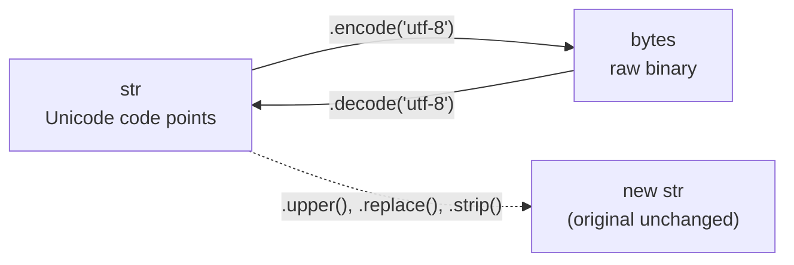

# Strings & Built-ins

> Learn how Python represents text as immutable Unicode, how to format and transform it, and the everyday built-ins for characters, numbers, bases, and randomness.

## Mental model

A Python `str` is an **immutable sequence of Unicode code points**. "Immutable" means every method that looks like it changes a string actually returns a *brand-new* string — the original is never touched. "Unicode" means text in any language, emoji included, just works. Raw bytes are a separate type (`bytes`), and you cross between them with `encode`/`decode`.



## Core concepts

### Strings are immutable

```python
s = "hello"
print(s.upper())   # => 'HELLO'  (a new string)
print(s)           # => 'hello'  (original is unchanged)
# s[0] = "H"       # TypeError: 'str' object does not support item assignment
```

Because strings can't be edited in place, you build new ones. To "change" a character, slice and concatenate, or work with a list:

```python
s = "hello"
fixed = "H" + s[1:]
print(fixed)       # => 'Hello'
```

### Indexing and negative indexing

Indices start at `0`; negative indices count from the end (`-1` is last).

```python
s = "Program"
print(s[0])     # => 'P'
print(s[-1])    # => 'm'
print(s[-2])    # => 'a'
print(s[::-1])  # => 'margorP'   reverse via slicing
```

### Common string methods

These all return new strings (or lists). They're the workhorses of text processing.

```python
print("a,b,c".split(","))        # => ['a', 'b', 'c']
print(" ".join(["a", "b"]))      # => 'a b'
print("  hi  ".strip())          # => 'hi'   (lstrip/rstrip trim one side)
print("hello".replace("l", "L")) # => 'heLLo'
print("lEaRn".title())           # => 'Learn'   capitalize each word
print("abc".upper())             # => 'ABC'
print("Python".isalpha())        # => True   all letters?
print("café".startswith("ca"))   # => True
```

### String formatting: `%`, `.format`, and f-strings

Three historical styles exist; **f-strings are the modern default** — readable and fast.

```python
name, n = "Sam", 3
print("hi %s, %d times" % (name, n))      # => 'hi Sam, 3 times'   (C-style)
print("hi {}, {} times".format(name, n))  # => 'hi Sam, 3 times'   (str.format)
print(f"hi {name}, {n} times")            # => 'hi Sam, 3 times'   (preferred)
```

f-strings also support inline expressions and format specs:

```python
price = 19.5
print(f"{price:.2f}")        # => '19.50'   two decimals
print(f"{price * 2 = }")     # => 'price * 2 = 39.0'   self-documenting debug form
print(f"{255:#x}")           # => '0xff'    hex with prefix
```

### Concatenation: `+` vs `join`

`+` is fine for a few strings. For many pieces (e.g. in a loop), `"".join()` is far more efficient because `+` creates a new intermediate string each time.

```python
print("foo" + "bar")                    # => 'foobar'   fine for a couple

parts = ["a", "b", "c", "d"]
print("-".join(parts))                  # => 'a-b-c-d'  efficient for many

name = "Sam"
print(f"hi {name}")                     # => 'hi Sam'   clean text + values
```

::: warning
Avoid `result += piece` inside a long loop. Each `+=` builds a new string, giving O(n²) behavior. Collect pieces in a list and `"".join()` once at the end.
:::

### `len()`

`len()` returns the number of items in any container — characters in a string, elements in a list.

```python
print(len("techbeamers"))   # => 11
print(len([1, 2, 3]))       # => 3
print(len({"a": 1}))        # => 1
```

### `chr()` and `ord()`: characters and code points

`ord()` maps a character to its Unicode code point; `chr()` reverses it.

```python
print(ord("z"))     # => 122
print(chr(122))     # => 'z'
print(ord("é"))     # => 233
print(chr(0x1F600)) # => '😀'   any Unicode code point
```

A tiny Caesar-cipher shift shows them working together:

```python
def shift(ch, by=1):
    return chr(ord(ch) + by)

print("".join(shift(c) for c in "abc"))   # => 'bcd'
```

### Numbers to strings and other bases

`str()` gives the decimal text; `bin()`, `oct()`, `hex()` give base prefixes.

```python
print(str(255))   # => '255'
print(bin(5))     # => '0b101'
print(oct(8))     # => '0o10'
print(hex(255))   # => '0xff'

# back the other way with int(text, base)
print(int("ff", 16))   # => 255
print(int("101", 2))   # => 5
```

### Whitespace and why it matters

Whitespace characters add spacing: space `" "`, tab `"\t"`, newline `"\n"`. In Python it's *significant* — **indentation defines code blocks**, so leading whitespace is syntax, not decoration.

```python
text = "  line with spaces\tand a tab\n"
print(repr(text.strip()))   # => 'line with spaces\tand a tab'
```

### Unicode and UTF-8

`str` holds Unicode code points; `bytes` holds raw binary. Convert with `encode`/`decode`, almost always using UTF-8.

```python
s = "café"
b = s.encode("utf-8")   # str -> bytes
print(b)                # => b'caf\xc3\xa9'
print(b.decode("utf-8"))# => 'café'
print(len(s), len(b))   # => 4 5   (é is one char but two UTF-8 bytes)
```

::: tip
`len(str)` counts characters; `len(bytes)` counts bytes. They differ for non-ASCII text — a frequent source of off-by-one bugs when slicing encoded data.
:::

### Randomness with the `random` module

```python
import random
random.seed(42)                  # reproducible results (testing)
print(random.random())           # => float in [0.0, 1.0)
print(random.uniform(1, 10))     # => float in [1, 10]
print(random.randint(1, 6))      # => int in [1, 6]  (inclusive) — a dice roll
print(random.choice([1, 2, 3]))  # => a random element
```

Shuffle a list **in place** with `random.shuffle`:

```python
items = [1, 2, 3, 4]
random.shuffle(items)
print(items)   # => some random permutation, e.g. [3, 1, 4, 2]
```

::: danger
`random` is *not* cryptographically secure. For tokens, passwords, or keys use the `secrets` module instead.
:::

## Common pitfalls

- **Trying to mutate a string.** `s[0] = "X"` raises `TypeError`. Build a new string by slicing/joining.
- **Discarding method results.** `s.upper()` returns a new string; `s` is unchanged. Assign it: `s = s.upper()`.
- **`+=` string building in loops.** Quadratic cost. Fix: accumulate in a list and `"".join()`.
- **Confusing `len(str)` with byte length.** For non-ASCII, encode first: `len(s.encode("utf-8"))`.
- **Forgetting `.strip()` on user/file input.** Trailing `\n` breaks comparisons. Fix: `line.strip()`.
- **Using `random` for security.** Use `secrets.token_hex()` / `secrets.choice()` instead.

## Best practices

- Default to f-strings for formatting; they're readable and fast.
- Use `"".join(iterable)` to assemble many strings.
- Be explicit about encodings: `encode("utf-8")` / `decode("utf-8")`.
- Reach for `str` methods (`split`, `strip`, `replace`) before regular expressions for simple tasks.
- Seed `random` in tests for reproducibility; use `secrets` for anything sensitive.

## Interview quick-reference

| Concept | Key point |
| --- | --- |
| String immutability | Methods return new strings; original never changes |
| Formatting | `%`, `.format`, f-strings; prefer f-strings |
| Common methods | `split`, `join`, `strip`, `replace`, `title`, `upper`, `isalpha` |
| `chr` / `ord` | Code point -> char / char -> code point |
| `len()` | Item/character count of any container |
| Negative indexing | `-1` last; `s[::-1]` reverses |
| Bases | `bin`/`oct`/`hex` out, `int(text, base)` back |
| Concatenation | `+` for few, `join` for many; avoid `+=` in loops |
| Unicode/UTF-8 | `str` = code points, `bytes` = binary; `encode`/`decode` |
| Whitespace | Space/tab/newline; indentation is significant syntax |
| `random` | `random`, `uniform`, `randint`, `choice`, `shuffle`; use `secrets` for security |
