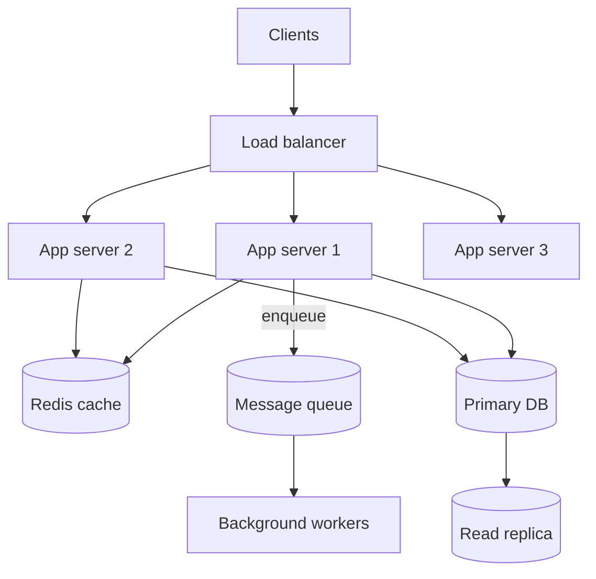

# System Design & Scalability

> Learn the building blocks of scalable backends — scaling, load balancing, caching, consistency, and messaging — with small runnable Python illustrations.

## Mental model

System design is the art of trading one resource for another under constraints. You rarely get scalability, consistency, and low latency all at once, so you decide *per use case* which to favor. The recurring moves are: **scale out** (more cheap machines instead of one big one), **cache** (keep hot data close), **decouple** (queues between producers and consumers), and **distribute state carefully** (because the network will fail).



A request hits a stateless app tier behind a load balancer, reads through a cache to spare the database, and pushes slow work onto a queue so the response stays fast.

## Core concepts

### Horizontal vs vertical scaling

**Vertical** = a bigger box (simple, but capped and a single point of failure). **Horizontal** = more boxes behind a load balancer (near-limitless, fault-tolerant, but requires *statelessness*). Modern systems favor horizontal scaling, which means no per-server session state.

```python
# Statelessness is what makes horizontal scaling work: any server can serve any
# request because session data lives in shared storage, not local memory.
import redis
r = redis.Redis()

def login(session_id: str, user_id: int) -> None:
    r.setex(f"session:{session_id}", 3600, user_id)  # shared, not in-process

def whoami(session_id: str) -> int | None:
    val = r.get(f"session:{session_id}")
    return int(val) if val else None
# Now request 1 can land on server A and request 2 on server B — both see the session.
```

### Load balancing

A load balancer spreads traffic to improve throughput and provide failover. Strategies: round-robin, least-connections, IP-hash (sticky).

```python
# A tiny round-robin balancer to illustrate the idea (real ones: Nginx, HAProxy, ALB).
from itertools import cycle

servers = ["10.0.0.1", "10.0.0.2", "10.0.0.3"]
ring = cycle(servers)

def next_server() -> str:
    return next(ring)

print(next_server(), next_server(), next_server(), next_server())
# => 10.0.0.1 10.0.0.2 10.0.0.3 10.0.0.1  (wraps around)
```

### Caching and eviction

Caching stores frequently accessed data in fast memory to cut latency and DB load. The hard part is invalidation. Common eviction policies: **LRU** (least recently used — the default workhorse), **LFU**, **FIFO**, **TTL**.

```python
# Cache-aside pattern: check cache, fall back to DB, populate cache.
import json, redis
r = redis.Redis()

def get_user(user_id: int) -> dict:
    key = f"user:{user_id}"
    cached = r.get(key)
    if cached:                              # cache hit
        return json.loads(cached)
    user = db_fetch_user(user_id)           # cache miss → hit the DB
    r.setex(key, 300, json.dumps(user))     # populate with a 5-min TTL
    return user
# First call: MISS (DB query). Next calls within 5 min: HIT (no DB query).
```

::: tip
LRU is the most common default (Redis `maxmemory-policy allkeys-lru`). Pair it with TTLs so stale entries expire even if they stay "recently used".
:::

### Strong vs eventual consistency

**Strong**: every read sees the latest write — easy to reason about, but lower availability and higher latency. **Eventual**: replicas converge over time; reads may be briefly stale — higher availability and scalability. Pick per domain: banking balances → strong; a social feed's like-count → eventual.

```python
# A write to the primary is instantly visible there (strong),
# but a read replica may lag a few milliseconds (eventual on the replica).
primary.execute("UPDATE accounts SET balance = balance - 100 WHERE id = 1")
# Reading the replica immediately might still show the OLD balance:
stale = replica.execute("SELECT balance FROM accounts WHERE id = 1")  # possibly stale
# For money, read from the primary; for a dashboard, the replica is fine.
```

### Message queues for decoupling

A queue buffers messages between producers and consumers, enabling async processing, load leveling (smoothing spikes), and resilience (work survives consumer downtime).

```python
# Decouple a slow side-effect from the request path.
import redis
r = redis.Redis()

# Producer: web request just enqueues and returns fast
def signup(email: str):
    create_account(email)
    r.lpush("emails", email)   # hand off the slow email send
    return {"status": "accepted"}

# Consumer: a worker drains the queue at its own pace
def email_worker():
    while True:
        _, email = r.brpop("emails")     # blocks until work arrives
        send_welcome_email(email.decode())
# A traffic spike fills the queue instead of overloading the SMTP server.
```

### Choosing the right broker

- **RabbitMQ** — flexible routing, task queues, RPC. Reach for it when routing logic matters.
- **Kafka** — high-throughput, durable, **replayable** log. Reach for it for event sourcing, analytics, pipelines.
- **Redis Streams** — lightweight streaming when you already run Redis and don't need Kafka's heft.

### Worked example: a URL shortener

Reads vastly outnumber writes, so optimize for read scaling and caching.

```python
import string, redis
r = redis.Redis()
ALPHABET = string.digits + string.ascii_letters  # base62

def base62(n: int) -> str:
    if n == 0:
        return ALPHABET[0]
    out = []
    while n:
        n, rem = divmod(n, 62)
        out.append(ALPHABET[rem])
    return "".join(reversed(out))

def shorten(long_url: str) -> str:
    new_id = r.incr("url:counter")          # atomic auto-increment id
    code = base62(new_id)                   # compact, collision-free key
    r.set(f"url:{code}", long_url)
    return code                             # e.g. "2Bd"

def resolve(code: str) -> str | None:
    val = r.get(f"url:{code}")              # hot links are an in-memory lookup
    return val.decode() if val else None
# Pair with a 301/302 redirect, rate limiting, and analytics for the full design.
```

## Common pitfalls

- **Keeping session/state in app memory** then scaling horizontally — requests break when they hit a different server. Externalize state to Redis/DB.
- **Caching without invalidation or TTLs** — serving stale data forever. Always set a TTL and invalidate on write.
- **Cache stampede** — many requests miss simultaneously and hammer the DB. Use locks/single-flight or stale-while-revalidate.
- **Demanding strong consistency everywhere** — needlessly tanks availability and latency. Reserve it for data that truly needs it.
- **Picking Kafka when you needed routing (or RabbitMQ when you needed replay).** Match the broker to the access pattern.
- **Ignoring distributed-systems failure modes** — retries without idempotency cause duplicates; no timeouts cause cascading hangs.

## Best practices

- Clarify requirements and expected load *first*; design to fit, not to impress.
- Make app servers stateless so the load balancer can route freely and you can autoscale.
- Layer caching (CDN → app → DB) and always pair caches with TTLs + an invalidation strategy.
- Decouple slow work behind a queue; choose the broker by access pattern (route vs replay vs lightweight).
- Design for failure: timeouts, retries with backoff, idempotency, circuit breakers.
- Choose consistency per use case; document the trade-off you made.

## Interview quick-reference

| Topic | Key point |
| --- | --- |
| Vertical vs horizontal | Bigger box (capped) vs more boxes (needs statelessness) |
| Load balancing | Round-robin / least-conn / IP-hash; Nginx, HAProxy, cloud LB |
| Caching layers | Client → CDN → app → DB; biggest win, hardest invalidation |
| Eviction | LRU (default), LFU, FIFO, TTL |
| Redis use cases | Cache, sessions, rate limiting, leaderboards, pub/sub, queues |
| Strong vs eventual | Latest read vs converge-over-time; choose per domain |
| Message queue | Decouple, async, load-level, survive downtime |
| RabbitMQ/Kafka/Redis Streams | Routing / replayable log / lightweight streaming |
| Distributed challenges | Partitions, partial failure, CAP, ordering, duplication |
| URL shortener | base62 of an id, KV store, cache hot links, optimize reads |
