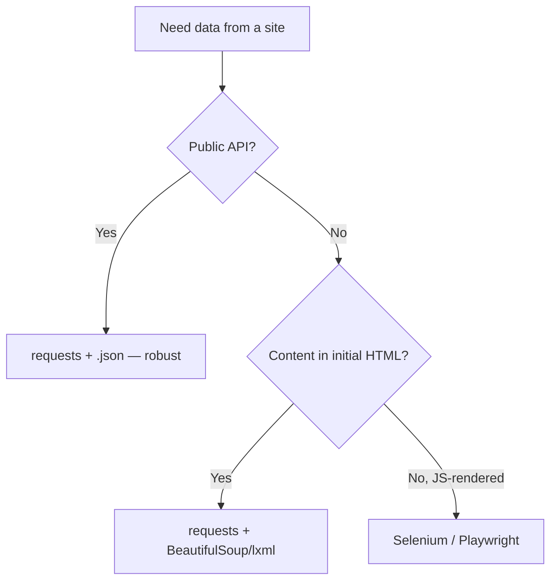

# Web Scraping & APIs

> Learn to fetch and parse the web — HTML with BeautifulSoup/lxml, JS-heavy pages with Selenium, structured data via JSON/XML APIs — while respecting rate limits and robots.txt.

## Mental model

Scraping and API consumption sit on a spectrum. APIs hand you clean, structured data (usually JSON) through a documented contract — always prefer them. Scraping extracts data from HTML *designed for humans*, which is brittle and should be a last resort. Static pages can be fetched with `requests`; pages that build their content with JavaScript need a real browser engine.



## Core concepts

### Calling a JSON API

An API is a contract: send params/headers, get JSON back. Always check the status before trusting the body.

```python
import requests

r = requests.get(
    "https://api.github.com/users/torvalds",
    headers={"Accept": "application/vnd.github+json"},
    timeout=10,
)
r.raise_for_status()             # raises on 4xx/5xx
data = r.json()                  # parsed dict
print(data["login"], data["public_repos"])
# => torvalds 8
```

### Working with JSON

The `json` module converts between Python objects and JSON text. `requests` does the parsing for you via `.json()`, but you need `json` for files and strings.

```python
import json

obj = json.loads('{"a": 1, "b": [2, 3]}')   # str -> dict
print(obj["b"][0])                            # => 2

text = json.dumps(obj, indent=2)             # dict -> pretty str
with open("out.json", "w") as f:
    json.dump(obj, f)                         # write to file
```

### Parsing static HTML with BeautifulSoup

Fetch the page, parse it into a navigable tree, then select with tags or CSS selectors.

```python
import requests
from bs4 import BeautifulSoup

html = requests.get("https://example.com", timeout=10).text
soup = BeautifulSoup(html, "html.parser")

print(soup.find("h1").get_text(strip=True))   # => Example Domain
links = [a["href"] for a in soup.select("a[href]")]
print(links)                                   # => ['https://www.iana.org/domains/example']
```

`select` takes CSS selectors (`h2.title`, `div#main a`); `find`/`find_all` take tag + attribute filters.

### XPath with lxml

XPath is a path language for XML/HTML trees — powerful for position- and attribute-based queries.

```python
from lxml import html

page = "<div><span class='price'>$9</span><span class='price'>$12</span></div>"
tree = html.fromstring(page)

prices = tree.xpath('//span[@class="price"]/text()')
print(prices)                  # => ['$9', '$12']
print(tree.xpath('//span[1]/text()'))   # first span => ['$9']
```

### Parsing XML

For real XML (RSS feeds, SOAP, sitemaps) use stdlib `ElementTree`, or `lxml` for speed and XPath.

```python
import xml.etree.ElementTree as ET

root = ET.fromstring("<users><user>Alice</user><user>Bob</user></users>")
for u in root.findall("user"):
    print(u.text)
# => Alice
# => Bob
```

::: warning REST vs SOAP
REST is a lightweight architectural style, usually JSON over HTTP, stateless and flexible. SOAP is a stricter XML-envelope protocol with formal WSDL contracts and built-in standards — you mostly meet it in enterprise/legacy systems.
:::

### Dynamic pages with Selenium

When content is rendered by JavaScript, `requests` only sees an empty shell. Drive a real browser, and **wait for elements** rather than sleeping blindly.

```python
from selenium import webdriver
from selenium.webdriver.common.by import By
from selenium.webdriver.support.ui import WebDriverWait
from selenium.webdriver.support import expected_conditions as EC

driver = webdriver.Chrome()
try:
    driver.get("https://example.com")
    driver.find_element(By.CSS_SELECTOR, "button#load").click()
    # Wait up to 10s for the JS-rendered result to appear
    el = WebDriverWait(driver, 10).until(
        EC.presence_of_element_located((By.CSS_SELECTOR, ".result"))
    )
    print(el.text)
finally:
    driver.quit()              # always release the browser
```

### Respecting rate limits

Hammering a server gets you blocked and is rude. Throttle, honour `Retry-After`, and back off exponentially on `429`.

```python
import time
import requests

def polite_get(url, *, max_retries=4):
    for attempt in range(max_retries):
        r = requests.get(url, timeout=10)
        if r.status_code == 429:                      # too many requests
            wait = int(r.headers.get("Retry-After", 2 ** attempt))
            time.sleep(wait)
            continue
        r.raise_for_status()
        return r
    raise RuntimeError("rate limited after retries")

# Be polite between successful calls too
for url in ["https://httpbin.org/get"] * 3:
    polite_get(url)
    time.sleep(1)
```

## Common pitfalls

- **Scraping when an API exists.** Check for a JSON API first — it is faster, stabler, and usually allowed.
- **No `timeout`.** A hung socket freezes your script forever. Always pass `timeout=`.
- **`time.sleep()` in Selenium instead of explicit waits.** Fixed sleeps are slow *and* flaky; use `WebDriverWait` for the condition you actually need.
- **Forgetting `driver.quit()`.** Leaked browser processes pile up and exhaust memory. Use `try/finally`.
- **Brittle selectors.** `div > div > span:nth-child(3)` breaks on any layout tweak. Prefer stable ids, `data-*` attributes, or semantic classes.
- **Ignoring `robots.txt` and ToS.** Check `robots.txt` and the site's terms before scraping; identify yourself with a `User-Agent`.
- **Assuming `.text` is JSON.** Call `.json()` only after confirming the content type / status.

## Best practices

- Prefer documented APIs; scrape only when there is no API.
- Set a descriptive `User-Agent`, honour `robots.txt` and rate limits.
- Reuse a `requests.Session()` for connection pooling and shared headers.
- Use explicit waits in Selenium; close drivers in `finally`.
- Cache responses during development to avoid re-hitting the server.
- Validate and store extracted data; expect missing fields and handle `None`.

## Interview quick-reference

| Topic | Key point |
| --- | --- |
| Scraping pipeline | fetch (`requests`) -> parse (`bs4`/`lxml`) -> extract |
| BeautifulSoup | tree parser; `find`/`select` (CSS) for extraction |
| XPath / lxml | path queries by attribute/position over HTML/XML |
| JSON handling | `loads`/`dumps` strings, `load`/`dump` files, `.json()` on responses |
| XML parsing | stdlib `ElementTree`, or `lxml` for XPath/speed |
| REST vs SOAP | REST=JSON/HTTP/flexible; SOAP=XML/WSDL/strict/legacy |
| Selenium | drives a real browser for JS-rendered pages; explicit waits |
| Rate limits | throttle, honour `Retry-After`, exponential backoff on 429 |
| Etiquette | robots.txt, User-Agent, sessions, caching |
