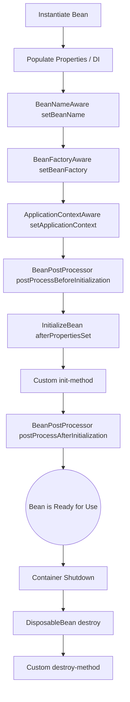

# IoC Container and Dependency Injection

## What is Inversion of Control (IoC) and how does Spring implement it? <Badge type="tip" text="easy" />

::: details View Answer
Inversion of Control (IoC) is a design principle in which the control of object creation, configuration, and lifecycle is transferred from the application code to a framework or container. Instead of objects creating their dependencies using the `new` keyword, the control is "inverted," and an external entity manages these dependencies.

Spring implements IoC through its **IoC Container**. The container is responsible for instantiating, configuring, and assembling beans (the objects managed by Spring). It reads configuration metadata (XML, Java annotations, or Java code) to understand how objects relate to each other and provides them ready for use.
:::

## What is Dependency Injection (DI) and what are its advantages? <Badge type="tip" text="easy" />

::: details View Answer
Dependency Injection (DI) is a specific pattern used to implement Inversion of Control. In DI, an object receives its dependencies from an external source rather than creating them itself.

**Advantages of DI:**
- **Decoupling**: Classes are loosely coupled because they don't depend on concrete implementations but rather on abstractions or interfaces.
- **Testability**: It becomes easier to write unit tests since dependencies can be easily mocked or stubbed.
- **Maintainability**: Code is cleaner and easier to manage, as the configuration of dependencies is centralized.
- **Reusability**: Components are highly reusable in different contexts.
:::

## What is the Spring IoC Container and what are its main responsibilities? <Badge type="warning" text="medium" />

::: details View Answer
The Spring IoC Container is the core of the Spring Framework. It manages the lifecycle and dependencies of objects (called "beans") in a Spring application.

**Main Responsibilities:**
1. **Instantiation**: Creating bean instances based on the configuration.
2. **Configuration**: Injecting the required dependencies and setting properties.
3. **Assembly**: Wiring beans together according to their relationships.
4. **Lifecycle Management**: Managing the initialization and destruction phases of the beans (e.g., invoking `init-method` and `destroy-method`).

The two main interfaces for the container are `BeanFactory` and `ApplicationContext`.
:::

## What are the differences between BeanFactory and ApplicationContext? <Badge type="warning" text="medium" />

::: details View Answer
Both `BeanFactory` and `ApplicationContext` represent the Spring IoC container, but `ApplicationContext` is a sub-interface of `BeanFactory` with additional enterprise-specific features.

- **BeanFactory**: Provides basic IoC and DI features. It uses **lazy initialization**, meaning beans are created only when they are requested. It's suitable for lightweight applications where memory consumption is a critical concern.
- **ApplicationContext**: Extends `BeanFactory` and provides advanced features like **eager initialization** for singleton beans, event publishing (`ApplicationEventPublisher`), internationalization (i18n), and integration with Spring AOP. It is the recommended container for most enterprise applications.
:::

## How does Spring perform Constructor Injection? <Badge type="tip" text="easy" />

::: details View Answer
Constructor Injection is a DI method where dependencies are provided to a class through its constructor. When the Spring container instantiates the bean, it passes the required dependencies as constructor arguments.

**Code Example:**
```java
@Service
public class UserService {
    private final UserRepository userRepository;

    // Spring automatically injects the dependency here.
    // @Autowired is optional if there's only one constructor.
    public UserService(UserRepository userRepository) {
        this.userRepository = userRepository;
    }
}
```
:::

## How does Spring perform Setter Injection? <Badge type="tip" text="easy" />

::: details View Answer
Setter Injection is a DI method where dependencies are provided to a class through setter methods after the bean has been instantiated.

**Code Example:**
```java
@Service
public class EmailService {
    private SmtpClient smtpClient;

    // Spring calls this setter to inject the dependency
    @Autowired
    public void setSmtpClient(SmtpClient smtpClient) {
        this.smtpClient = smtpClient;
    }
}
```
:::

## Constructor Injection vs Setter Injection: Which one should you prefer and why? <Badge type="warning" text="medium" />

::: details View Answer
**Constructor Injection** is generally preferred and recommended by the Spring team.

**Why prefer Constructor Injection:**
1. **Immutability**: Dependencies can be declared as `final`, ensuring they are not changed after initialization.
2. **Null Safety**: Ensures that all required dependencies are present at the time of creation, preventing `NullPointerException`s at runtime.
3. **Testability**: Makes it clear what dependencies are required when writing unit tests without needing reflection or a Spring context.
4. **Code Smell Detection**: If a constructor has too many parameters, it clearly indicates a violation of the Single Responsibility Principle.

Setter Injection can be used for **optional dependencies** or when dealing with circular dependencies (though circular dependencies represent a design flaw).
:::

## What is Field Injection and why is it generally discouraged? <Badge type="warning" text="medium" />

::: details View Answer
Field Injection is a DI method where the `@Autowired` annotation is applied directly to a class field. Spring uses reflection to inject the dependency.

**Code Example:**
```java
@Service
public class OrderService {
    @Autowired
    private PaymentService paymentService;
}
```

**Why it is discouraged:**
1. **Immutability Issue**: You cannot declare injected fields as `final`.
2. **Testing Difficulty**: You cannot instantiate the class and set its dependencies manually without using reflection (or tools like Mockito's `@InjectMocks`).
3. **Hidden Dependencies**: The class hides its dependencies from the outside world, unlike constructor injection which clearly declares its requirements.
4. **Coupling to Spring**: It heavily couples the class to the Spring container, as the class cannot function standalone outside a DI framework without reflection.
:::

## How does the @Autowired annotation work in Spring? <Badge type="warning" text="medium" />

::: details View Answer
The `@Autowired` annotation tells Spring's IoC container to automatically inject a dependency into a bean. It can be used on constructors, fields, and setter methods.

By default, `@Autowired` resolves dependencies **by type**. If it finds exactly one bean of the required type in the application context, it injects it. If the dependency is not found, Spring throws a `NoSuchBeanDefinitionException` (unless configured with `required = false`). If multiple beans of the same type are found, it throws a `NoUniqueBeanDefinitionException` unless further qualified.
:::

## What happens if multiple beans of the same type exist and you try to @Autowired one of them? <Badge type="warning" text="medium" />

::: details View Answer
If multiple beans of the same type exist in the context and you use `@Autowired`, Spring will not know which one to inject and will throw a `NoUniqueBeanDefinitionException`.

However, Spring attempts a fallback: it tries to match the **bean name** with the **variable name**. If the variable name exactly matches one of the bean names, it will inject that specific bean. If not, the exception is thrown.
:::

## How do you resolve ambiguity when multiple beans of the same type are present? <Badge type="warning" text="medium" />

::: details View Answer
There are two primary ways to resolve this ambiguity:

1. **Using `@Qualifier`**: You can explicitly specify the name of the bean you want to inject alongside `@Autowired`.
   ```java
   @Autowired
   @Qualifier("creditCardPayment")
   private PaymentStrategy paymentStrategy;
   ```
2. **Using `@Primary`**: You can mark one of the bean definitions as the primary choice. If multiple beans are found, Spring will prioritize the one annotated with `@Primary`.
   ```java
   @Component
   @Primary
   public class CreditCardPayment implements PaymentStrategy { ... }
   ```
:::

## What is the role of the @Configuration and @Bean annotations? <Badge type="warning" text="medium" />

::: details View Answer
They are used for Java-based Spring configuration.

- **`@Configuration`**: Indicates that a class declares one or more `@Bean` methods and may be processed by the Spring container to generate bean definitions and service requests for those beans at runtime.
- **`@Bean`**: Applied to a method to indicate that the method returns an object that should be registered as a bean in the Spring application context.

**Code Example:**
```java
@Configuration
public class AppConfig {
    @Bean
    public RestTemplate restTemplate() {
        return new RestTemplate();
    }
}
```
:::

## What is Component Scanning and how does it relate to IoC? <Badge type="warning" text="medium" />

::: details View Answer
Component Scanning is a mechanism Spring uses to automatically discover and register beans within the application context, rather than requiring explicit configuration for every single bean (e.g., via `@Bean` methods or XML).

By using the `@ComponentScan` annotation (which is included by default in `@SpringBootApplication`), Spring scans specified packages (and their sub-packages) for classes annotated with stereotype annotations like `@Component`, `@Service`, `@Repository`, and `@Controller`. When found, the IoC container automatically creates and manages instances of these classes as beans.
:::

## Explain the Spring Bean Lifecycle. <Badge type="danger" text="hard" />

::: details View Answer
The lifecycle of a Spring Bean consists of several distinct phases from creation to destruction. The IoC container manages this entire process.



**Key Phases:**
1. **Instantiation**: The container creates the bean instance.
2. **Populate Properties**: Dependencies are injected.
3. **Aware Interfaces**: Spring passes references to the container (e.g., `setBeanName`, `setApplicationContext`).
4. **Pre-Initialization**: `BeanPostProcessor`'s `postProcessBeforeInitialization` is called.
5. **Initialization**: Custom initialization (like `@PostConstruct` or `InitializingBean.afterPropertiesSet()`).
6. **Post-Initialization**: `BeanPostProcessor`'s `postProcessAfterInitialization` is called (proxies are typically created here).
7. **Destruction**: When the container closes, destruction callbacks (`@PreDestroy`, `DisposableBean.destroy()`) are invoked.
:::

## What are Bean Scopes in Spring and what are the default scopes? <Badge type="warning" text="medium" />

::: details View Answer
A bean scope defines the lifecycle and visibility of a bean instance created by the Spring container. 

The most common scopes are:
1. **Singleton (Default)**: Only one instance of the bean is created per Spring IoC container. The same instance is returned every time it is requested.
2. **Prototype**: A new instance of the bean is created every time it is requested from the container.

Web-aware scopes (only available in web applications):
3. **Request**: A new instance is created per HTTP request.
4. **Session**: A new instance is created per HTTP session.
5. **Application**: Scoped to the lifecycle of a `ServletContext`.
:::

## How does Spring handle circular dependencies? <Badge type="danger" text="hard" />

::: details View Answer
A circular dependency occurs when Bean A depends on Bean B, and Bean B depends on Bean A. 

- **Constructor Injection**: If circular dependencies happen via constructor injection, Spring cannot resolve it and will throw a `BeanCurrentlyInCreationException` on startup. This is because neither bean can be fully constructed to be injected into the other.
- **Setter/Field Injection**: Spring handles circular dependencies gracefully here. It uses a **three-level cache** (singleton objects, early singleton objects, singleton factories) to expose a partially constructed bean reference to resolve the cycle before the bean is fully initialized.

To fix circular dependencies, you should preferably redesign your code. Alternatively, you can use `@Lazy` on one of the dependencies to delay its initialization.
:::

## What is the difference between @Component, @Service, @Repository, and @Controller? <Badge type="tip" text="easy" />

::: details View Answer
These are all stereotype annotations derived from `@Component`, used for component scanning. They serve as markers for specific architectural layers:

- **`@Component`**: A generic stereotype for any Spring-managed component.
- **`@Service`**: Used at the service layer to hold business logic. Currently, it behaves exactly like `@Component` but adds semantic meaning to the class.
- **`@Repository`**: Used at the persistence layer (DAOs). Besides acting as a component, it automatically translates database-specific exceptions (like `SQLException`) into Spring's unified `DataAccessException` hierarchy.
- **`@Controller`**: Used at the presentation layer for Spring MVC web controllers. It indicates that the class handles HTTP requests.
:::

## Can you inject a prototype-scoped bean into a singleton-scoped bean? What is the problem and how to solve it? <Badge type="danger" text="hard" />

::: details View Answer
Yes, you can, but it leads to a common problem.

**The Problem:**
Since the singleton bean is created only once, its dependencies are injected only once. If you inject a prototype bean into a singleton bean, the singleton bean receives exactly one instance of the prototype bean during creation. Every time you use the prototype bean inside the singleton, you are interacting with the *same* instance, breaking the prototype contract.

**How to solve it:**
1. **`@Lookup` Method Injection**: You can annotate a method with `@Lookup` which tells Spring to override the method and return a new instance of the prototype bean every time it's called.
2. **`ObjectFactory<T>` or `ObjectProvider<T>`**: Inject an `ObjectProvider<PrototypeBean>` instead of the bean itself, and call `.getObject()` when you need a new instance.
3. **ApplicationContext**: Inject the context and call `getBean()` directly (not recommended as it ties you to the Spring framework).
:::

## What is @Lazy initialization and when should you use it? <Badge type="warning" text="medium" />

::: details View Answer
By default, Spring instantiates all singleton beans eagerly during application startup. 

The `@Lazy` annotation tells the IoC container to delay the creation of a bean until it is first requested (either directly or as a dependency of another bean).

**When to use it:**
- To speed up the startup time of a large application by only initializing beans when needed.
- To resolve circular dependencies (as mentioned earlier).
- When a bean is resource-intensive to create but might not be used in every execution path of the application.
:::

## How does Spring's IoC container manage the proxying of beans? <Badge type="danger" text="hard" />

::: details View Answer
Spring often wraps beans in proxies to add runtime behavior, primarily for Aspect-Oriented Programming (AOP), Transactions (`@Transactional`), or asynchronous execution (`@Async`).

This is managed by **BeanPostProcessors** during the post-initialization phase of the bean lifecycle. Spring inspects the bean to see if it requires any AOP advice or transactional behavior. If it does, Spring creates a proxy object that wraps the actual target bean.

Spring uses two types of proxies:
1. **JDK Dynamic Proxies**: Used when the target bean implements at least one interface. The proxy will implement the same interfaces.
2. **CGLIB Proxies**: Used when the target class does not implement any interfaces. Spring uses CGLIB to generate a subclass of the target class at runtime (which is why classes and methods needing CGLIB proxying cannot be `final`).
:::